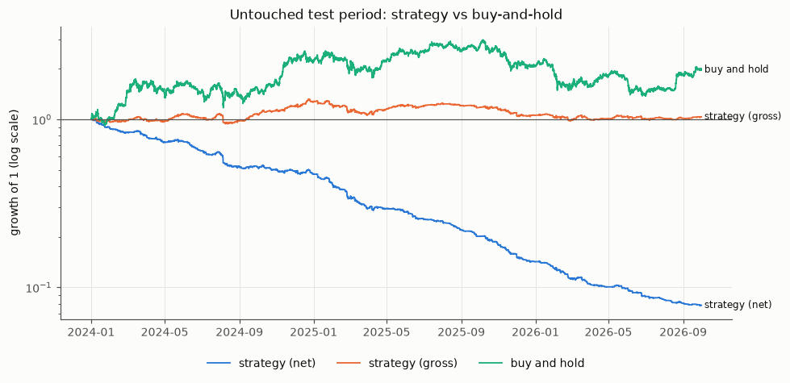

# Credit Risk Modelling & Quantitative Market Signal Research

**Kudrati Khoda**, M.Tech Quality, Reliability & Operations Research, Indian Statistical Institute, Kolkata

Two connected modules share one quantitative framework: *predict, validate out of time, quantify the tail, stress, and distrust the result until it survives.*

| Module | Question | Answer |
|---|---|---|
| **A. Credit risk** (existing project, unchanged) | Who defaults, and how much could the loan portfolio lose under stress? | 2017 out-of-time AUC 0.70; PD under-predicted in all deciles; ECL ≈ $494.7M; VaR99 $30M → $108M as default correlation goes from 0 to 0.5. See [`credit_module/`](credit_module/README.md) |
| **B. Market signal research** (extension) | Does information at time *t* predict the next-hour BTCUSDT return well enough to survive costs out of sample? | **The signal is real but not tradable.** Test AUC 0.545 (CI 0.538–0.552), but net Sharpe −5.8 because the edge is 0.19 bp vs 7 bp cost per side. Pre-registered verdict: **WEAK / INCONCLUSIVE** |

Full write-up: **[`reports/final_report.md`](reports/final_report.md)**.

---

## 1. Problem

Can information available at time *t* predict the **direction of the BTCUSDT return over the next 60 minutes** well enough to be (a) statistically distinguishable from no skill out of sample, and (b) profitable after realistic trading costs?

## 2. Motivation

Module A showed that a model can rank risk yet be mis-calibrated out of time, and that tail risk depends on assumptions. Module B applies the same discipline to a fast, adversarial, 24/7 market, where the main danger is a backtest that looks good only because of leakage, overfitting or ignored costs.

## 3. Data

* **Source:** Binance Vision, spot BTCUSDT 1-minute klines, 2017-08 → 2026-09.
* **Size:** 110 files, **all SHA-256 verified**, giving **4,789,279 candles**.
* **Also used:** USD-M funding history (for costs) and ETHUSDT (second asset).
* **Licence:** CC BY-NC-SA 4.0, used for non-commercial research; raw data is not committed. See [`data/README.md`](data/README.md); dataset choice in [`reports/phase1_dataset_selection.md`](reports/phase1_dataset_selection.md).

## 4. Data health

* **Clean:** 0 duplicates, 0 conflicting rows, 0 impossible candles.
* **Coverage:** 0.629% of grid minutes are missing, in 33 gaps, and **0% from 2022 onward**.
* **Archive quirk:** **21,602 phase-shifted candles**. In Dec 2017 and Feb 2018 Binance's archive put candles 20.8 s or 14.8 s off the minute grid, in both BTC and ETH. They are treated as missing, because snapping them onto the grid would leak future data.
* **Timestamp units:** milliseconds switch to microseconds in 2025; detected per file.
* **Extreme moves:** 408 moves above 3%, all matching known market events, and kept.

## 5. Methodology (pre-registered)

The design was committed to git **before any data was downloaded** ([`reports/research_design_preregistration.md`](reports/research_design_preregistration.md), [`src/config.py`](src/config.py)). Every later change is in its deviation log.

* **Timing:** decide at *t* using candles closed by *t*; execute at the open of *t*+1 min; exit at *t*+61 min. Labels do not overlap.
* **Features:** 16 scale-free features (returns, momentum, volatility, volume/order flow, candle shape).
* **Leakage audit:** a timing table, and a perturbation test on the real data (0 of 16 features changed when the future was randomised).

## 6. Models

* **Baselines:** buy-and-hold and past-return sign rules.
* **Models:** logistic regression and LightGBM.
* **Simplicity rule:** LightGBM was chosen only because it passed exactly at the threshold, 7 of 10 folds.

## 7. Validation

* Purged, expanding-window walk-forward: 10 six-month blocks (2019–2023) for every choice.
* An **untouched test period**, 2024-01 → 2026-09, run **once**. The experiment log has exactly 1 TEST row among 44 logged experiments.

## 8. Backtesting

An event-level backtest with explicit decision, execution and exit times. Costs are charged on every position change. Benchmarks: buy-and-hold and 1 h momentum.

## 9. Costs

| Component | Per side | Status |
|---|---|---|
| Taker fee | 5 bp | sourced |
| Half-spread | 1 bp | assumed |
| Slippage | 1 bp | assumed |
| Funding | from actual history | observed |

Stress scenarios: ×2 and ×3 costs, and +2 / +5 bp of extra slippage.

## 10. Risk

* **VaR / ES:** 1-day, at 95% and 99%; historical, normal and Student-t.
* **Kupiec VaR backtest:** p = 0.42 and 0.60, so the VaR model is not rejected.
* **Block-bootstrap Monte Carlo:** one-year outcomes and drawdowns.
* **Also reported:** maximum drawdown, Sharpe, Sortino, Probabilistic and Deflated Sharpe.

## 11. Robustness

23 post-hoc kill tests: thresholds, feature removal, model swap, execution lag 0/5 min, hour offsets, 15/30-minute horizons. Plus a 200-run label permutation and ETHUSDT with the frozen design.

## 12. Results (test period, 2024-01 → 2026-09)

| | Frozen strategy | Buy and hold |
|---|---|---|
| AUC (95% CI) | **0.545 (0.538–0.552)** | — |
| Log-loss vs base rate (HAC) | better, p = 0.004 | — |
| Net Sharpe (95% CI) | **−5.84 (−6.94, −4.77)** | 0.76 |
| Gross Sharpe | 0.16 | 0.76 |
| Cumulative net return | **−92.2%** | +97.6% |
| Max drawdown | −92.3% | −53.7% |
| Break-even cost per side | **0.19 bp** (vs 7 bp assumed) | — |

* **Predictive signal survived everything:** permutation p = 0.005; AUC > 0.53 in all 23 variants and in every half-year; ETHUSDT AUC 0.546.
* **Economic signal failed everything:** 23 of 23 variants have negative net Sharpe; ETH net Sharpe −3.70.



## 13. Limitations

* No historical order book, so spread and slippage are assumed. This doesn't change the verdict, since break-even is below the fee alone.
* Spot prices stand in for perpetual execution.
* One venue and one main horizon.
* Raw volatility features drift (PSI up to 3.5) as regimes change.

## 14. Conclusion

BTCUSDT shows a **real, robust, short-term reversal**: the next hour is slightly more likely to go down after a rise, and vice versa. But the conditional expected returns are only about 1–2 bp, an order of magnitude below realistic taker costs. **There is no tradable edge for a Binance taker.**

The pre-registered classification is **WEAK / INCONCLUSIVE**: statistical evidence on test, without positive net performance. A binary contract pays on direction rather than size, which motivates a forward test with real prediction-market prices (final report §26, explicitly exploratory).

---

## Reproduce

```bash
pip install -r requirements.txt
python -m pytest -q                                   # 25 tests incl. synthetic pipeline controls
python -m src.data download --funding && python -m src.data build
python scripts/run_pipeline.py --stage all            # about 10 min; --stage second_asset adds about 4 min
```

The notebooks `02`–`10` display the saved outputs (`RUN_STAGE = False`). Do not casually re-run the validation or test stages: validation resets the experiment log, and each test run adds a TEST row.

## Key documents

| Document | Content |
|---|---|
| [`reports/final_report.md`](reports/final_report.md) | Full research report (27 sections) |
| [`reports/teaching/`](reports/teaching/Project_Walkthrough_Raw_Data_to_Verdict.md) | **From Raw Data to Final Verdict**: full teaching and interview-defence guide traced to the code (Markdown, Word, PDF), with a reproducibility check |
| [`reports/project_walkthrough.md`](reports/project_walkthrough.md) | Step-by-step walkthrough in simple English: raw data, cleaning, features, models, results (what, why, how) |
| [`reports/research_design_preregistration.md`](reports/research_design_preregistration.md) | Frozen design and deviation log |
| [`reports/pipeline_validation.md`](reports/pipeline_validation.md) | Synthetic negative and positive controls (about the method) |
| [`reports/module_connection.md`](reports/module_connection.md) | How the credit and market modules map onto each other |
| [`reports/gravia_mapping_and_cv.md`](reports/gravia_mapping_and_cv.md) | JD mapping, title, CV bullets |
| [`reports/interview_prep_concepts.md`](reports/interview_prep_concepts.md), [`reports/interview_prep_project.md`](reports/interview_prep_project.md) | Interview preparation |
| `reports/tables/`, `figures/` | Every number and chart in the report |

## Repository layout

```
├── credit_module/      Module A: original report + provenance notes
├── data/README.md      how to obtain the data (data itself not committed)
├── notebooks/          01 credit (original) | 02 data health … 10 robustness (executed)
├── src/                config, data, quality, eda, features, validation, models,
│                       backtest, risk, stress_test, stats, pipeline, plots
├── scripts/            run_pipeline.py, download_data.sh, smoke_test_synthetic.py,
│                       pipeline_controls.py, make_notebooks.py, check_data_access.py (in src/)
├── tests/              unit tests + synthetic negative/positive pipeline controls
├── reports/            phase reports, pre-registration, final report, tables/
└── figures/
```
