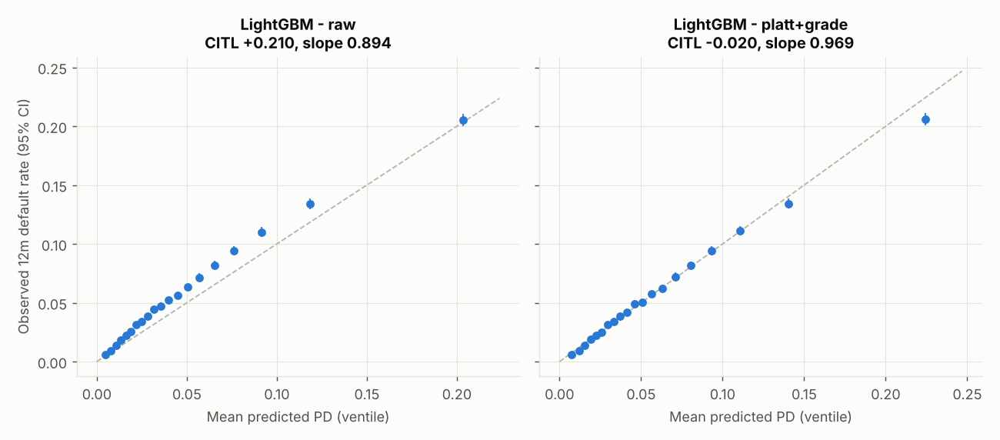
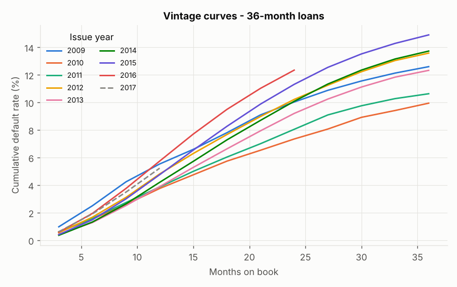
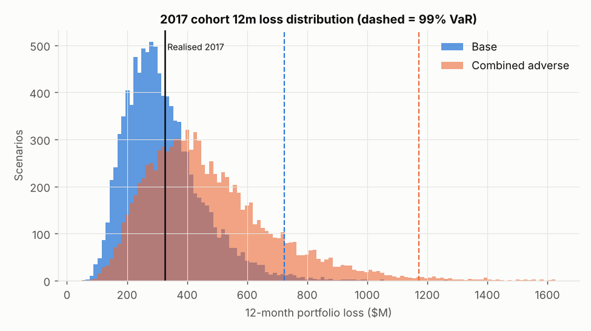

# Credit Risk Modelling & Portfolio Stress Testing — LendingClub 2007–2018

This is an end-to-end, reproducible credit-risk pipeline built on 2.26M LendingClub loans. It covers:

- PD scorecard and machine-learning challengers
- out-of-time validation and formal statistical tests
- recalibration and backtesting
- PSI/CSI stability and vintage analysis
- LGD and EAD models
- 12-month and lifetime ECL
- a loan-level one-factor Gaussian Monte Carlo with stress and reverse-stress tests

Every modelling choice is decided by a statistical test on data that comes before the 2017 validation cohort. 2017 is scored only once, at the end.

```
run_all.sh                 one-command pipeline (tests first)
src/crm/                   library: data, woe, models, metrics, calibration, lgd_ead, portfolio
scripts/01..07_*.py        pipeline steps (outputs -> reports/tables, reports/figures)
tests/                     19 unit tests of the statistical machinery
```
Data: Kaggle `wordsforthewise/lending-club`, `accepted_2007_to_2018Q4.csv.gz`. The data snapshot is 2019-03.

---

## 0. Why the original design had to change

The original project trained on **terminal loans only** (Fully Paid / Charged Off at the snapshot), with a lifetime-default target, and validated on 2017. Script `07_replication_original.py` reproduces it closely:

| Original design, 2017 terminal loans | AUC | KS | Gini | ECL |
|---|---|---|---|---|
| Original claim | 0.700 | 0.291 | 0.400 | $497.3M on $2.42B |
| This replication, LogReg WOE | 0.693 [0.691, 0.696] | 0.280 | 0.387 | $454.2M on $2.42B |
| This replication, LightGBM | 0.721 [0.719, 0.724] | 0.321 | 0.443 | – |

The sample is **survivorship-biased**:

- Only **38%** of 2017 loans (37% of dollars) had ended by the snapshot (`07_terminal_bias_by_year.csv`).
- Those that had ended are dominated by **early charge-offs** and **early prepayments**.
- The 12-month default rate of that subset is **15.1%, against 5.8% for the whole 2017 cohort** (χ² p ≈ 0).
- Its "23% lifetime default rate" is therefore not a property of the 2017 cohort.

**The fix:** a **12-month PD** (the Basel / IFRS 9 stage-1 horizon), defined for *every* loan with a full 12-month window, whatever its current status. Default means charge-off, default or 31–120 days late, with the first missed instalment within 12 months on book. The month of default comes from the last payment date when no recovery cash was received. Otherwise it comes from the count of paid instalments, a rule validated at 98% agreement on 104k clean charge-offs (`src/crm/data.py`). The 12-month horizon also matches the 1-year horizon of the Vasicek loss model.

---

## 1. Sample design

| Set | Issue years | Loans | 12m default rate | Used for |
|---|---|---|---|---|
| Development | 2007–2015 | 884,691 | 5.09% | fitting; hyper-parameters tuned on 2007–14 → 2015 |
| OOT test | 2016 | 434,407 | 6.28% | champion choice, recalibration, stacking |
| OOT validation | 2017 | 443,579 | 5.80% | final, single evaluation |

**Training window:** dropping the pre-2012 vintages, where bureau fields are structurally missing, does not change OOT AUC (DeLong p = 0.10–0.52, `02a_train_window.csv`). The full window is kept.

---

## 2. PD models

- **Logistic WOE scorecard**
  - Binning: monotone WOE bins (≥5% each).
  - Screening: IV ≥ 0.02, then |r| ≤ 0.7.
  - Selection: forward stepwise. A variable enters only if it raises time-holdout AUC, has Wald p < 0.001 and a positive WOE sign, and keeps VIF < 5.
  - Size: v1 (gain ≥ 5e-4) has 5 variables. v2 (gain ≥ 1e-4) has 12. v2 beats v1 on a nested likelihood-ratio test (χ² = 793, df = 7, p ≈ 1e-167), on AIC and BIC, and on a 2016 DeLong test (p = 0.0007).
  - Points table: `02_scorecard_points.csv` (PDO 20, 600 points at 50:1 odds).
- **LightGBM / XGBoost:** random search with time-based early stopping (20 and 12 configurations).
- **Random Forest:** 6-configuration grid, median imputation plus missing-value flags.
- **Stacking:** a logistic stack fitted on 2016.

### Discrimination — 2017 OOT validation (DeLong 95% CI)

| Model | AUC | Gini | KS |
|---|---|---|---|
| LogReg WOE v1 | 0.702 [0.699, 0.705] | 0.404 | 0.292 |
| LogReg WOE v2 | 0.704 [0.700, 0.707] | 0.407 | 0.296 |
| Random Forest | 0.714 [0.711, 0.718] | 0.429 | 0.309 |
| XGBoost | 0.724 [0.721, 0.727] | 0.448 | 0.323 |
| **LightGBM (champion)** | **0.725 [0.722, 0.728]** | **0.450** | **0.325** |
| Stacked (LR + LGBM + XGB) | 0.726 [0.723, 0.729] | 0.452 | 0.327 |

**Pairwise tests:** paired DeLong tests with Holm adjustment are in `03_delong_pairwise_2017.csv`.

- LightGBM beats the LR by **+0.023 AUC** (z = 23.3, p ≈ 0), Random Forest by +0.011, and XGBoost by +0.0013 (p = 0.0003).
- Stacking adds only **+0.0009 AUC**. That is significant but immaterial, so the single LightGBM stays champion.
- The champion was chosen on 2016 AUC (0.733), before 2017 was touched.

**Why the LR stalls near 0.70:** LendingClub's own sub-grade already prices FICO and the bureau data. Given sub-grade, FICO's Wald p is about 0.3. The remaining lift is non-linear and comes from interactions, which the GBMs capture. Top gain features are sub-grade, interest rate, state, accounts opened in 24m and DTI.

### Calibration and recalibration

Every raw model under-predicts 2017: mean PD 4.8% against an observed 5.8%, with calibration-in-the-large (CITL) of +0.21 (p ≈ 0). The development years were more benign than 2016–17.

**Recalibration rule:** pre-specified, using 2016 evidence only.

1. The 2016 calibration slope is 0.924 (p vs 1 = 3e-26), so **Platt** recalibration is chosen over an intercept shift.
2. A likelihood-ratio test shows significant residual miscalibration by grade (χ² = 101, df = 6, p = 1e-19), so grade intercepts are added (**Platt + grade**).

| Champion on 2017 | Mean PD | Observed DR | CITL [p] | Slope [p vs 1] | Spiegelhalter p | ECE | Brier |
|---|---|---|---|---|---|---|---|
| Raw | 4.80% | 5.80% | +0.210 [≈0] | 0.894 [≈0] | ≈0 | 1.00 pp | 0.0524 |
| Platt only | 5.91% | 5.80% | −0.022 [0.001] | 0.968 | 0.049 | 0.20 pp | 0.0523 |
| **Platt + grade (final)** | **5.90%** | **5.80%** | **−0.020** [0.003] | **0.969** | **0.076** | **0.24 pp** | **0.0523** |

- **Residual CITL:** the −0.02 that remains is slightly *conservative*.
- **Hosmer–Lemeshow still rejects.** At n = 443k it detects deviations of a few basis points, so it is reported together with effect sizes (ECE, decile errors).

**Jeffreys backtest (ECB/TRIM), 2017, final PD:**

- **By grade:** 5 green, 2 conservative, **no red**. Grade D was red under Platt alone (PD 9.76% vs observed 10.27%). After the grade recalibration it is 10.27% vs 10.27%.
- **By PD decile:** 7 green, 2 conservative, 1 amber (decile 4: 3.13% vs 3.30%).



### Stability and vintages

- **Score PSI vs development:** 0.002–0.019 for every year 2012–2017. 2017 is 0.009, which is stable.
- **CSI against the full development window** flags `mo_sin_old_rev_tl_op` (0.92) and `acc_open_past_24mths` (0.59). That is an artifact: the fields are missing for 5–8% of development loans (pre-2012). Against a fully populated 2013–15 reference, both are below 0.06. `bc_util` (0.10) and `int_rate` (0.15) show genuine moderate drift, so they are on a watch list (`03_csi_top_features.csv`).
- **Vintages (36-month loans):** cumulative default curves rise with each vintage from 2013 to 2016. The 2016 vintage reaches 12.3% by month 24, against 10.1% for 2014. This is consistent with the higher 2016 default rate and the recalibration above.



---

## 3. LGD and EAD (`04_lgd_ead.py`)

**Sample:** recoveries flatten about 18 months after default. Charged-off loans whose default is at least 18 months old are therefore treated as mature. The validation is out-of-time by default date: train before 2015-07, test from 2015-07 to 2017-09 (n = 136,882).

| LGD model, OOT | RMSE | R² | Spearman | Test of MSE gain vs mean |
|---|---|---|---|---|
| Pooled mean | 0.1169 | 0 | – | – |
| Grade × term mean | 0.1170 | −0.002 | 0.05 | worse |
| Fractional-logit GLM | 0.1168 | 0.0015 | 0.11 | p = 0.052, not significant |
| LightGBM (cross-entropy) | 0.1173 | −0.007 | 0.10 | worse |

- **LGD choice:** no borrower-level LGD model beats the mean out of time. LendingClub recoveries come mostly from bulk debt sales, which do not depend on the borrower. **LGD = pooled long-run mean 0.895.**
- **Downturn LGD:** **0.936**, the worst default year with at least 1,000 defaults (2012).

| EAD ratio for 12m defaulters, OOT 2016 | RMSE | R² | Test of MSE gain vs mean |
|---|---|---|---|
| Mean | 0.0762 | 0 | – |
| Term mean | 0.0662 | 0.245 | t = 50, p ≈ 0 |
| **Fractional-logit GLM** | **0.0642** | **0.291** | t = 54, p ≈ 0 |

---

## 4. Expected Credit Loss — full 2017 cohort (`05_ecl.py`)

**Portfolio:** 443,579 loans, $6.585B funded.

**Formula:** ECL = PD × LGD × EAD.

| | Mean PD | ECL | % of funded |
|---|---|---|---|
| 12-month ECL (IFRS 9 stage 1) | 5.90% | **$321.5M** | 4.88% |
| Lifetime ECL | 19.98% | **$800.4M** | 12.15% |

- **Lifetime PD:** PD_L = 1 − (1 − PD₁₂)^k. The factor k is the cumulative-hazard ratio estimated on fully matured vintages, by grade and term (`05_pd_term_structure.csv`).

**Backtest:**

- The 12-month realized loss (actual EAD of 12m defaulters × LGD) is **$326.1M, against $321.5M predicted** (ratio 1.014).
- Realized EAD of defaulters is $364.2M, against $359.1M predicted.
- An independence-only z-test gives p = 0.04, but it ignores default correlation. Under the correlated loss distribution (section 5), the realized loss sits at the **59th percentile (p = 0.82)**.

---

## 5. Portfolio loss model and stress testing (`06_portfolio_mc.py`)

### Model and validation

**Model:** one-factor Gaussian (Vasicek), simulated loan by loan on **all 443,579 loans**.

- **Scenarios:** 10,000, with common random numbers across stress scenarios. Stress deltas are therefore not Monte Carlo noise.
- **VaR CIs:** distribution-free, from order statistics.

**Asset correlation, estimated by MLE:**

- Data: 36 quarterly cohorts (2009Q1–2017Q4) of observed 12m default rate against model PD.
- A **free through-the-cycle level** is estimated jointly. Without it, the level bias of 2016-calibrated PDs (mean implied Z = −0.75) is mistaken for systematic risk. A unit test shows this.
- Result: **ρ = 0.0037**, moving-block bootstrap 95% CI [0.0016, 0.0048].
- 2009–2017 contains **no recession**, so this is a benign-period lower bound. The **base case uses the Basel IRB "other retail" ρ(PD) per loan**, which averages 0.065. The data estimate is run as a sensitivity.

**Model validity checks:**

- Simulated EL matches the analytic EL: z = −0.77, p = 0.44.
- Simulated VaR is within 1.0% (99%) and 0.7% (99.9%) of the analytic ASRF quantiles.
- VaR has converged by 5,000 scenarios. The original set-up (10k loans × 2k scenarios) gives a 99% VaR CI that is **16% wide**.

### Base case ($6.585B portfolio)

| Metric | Value [95% CI] |
|---|---|
| Expected loss | $320.5M |
| 99% VaR | **$723.7M** [703.3, 747.3] |
| 99% ES | **$820.6M** [802.6, 838.5] |
| 99.9% VaR | $939.8M [916.0, 994.0] |
| 99.9% ES | $1,020.0M |
| Unexpected-loss capital (99.9% VaR − EL) | $618.3M (9.4% of funded) |

### Stress tests (same random draws; $M)

| Scenario | EL | 99% VaR | 99% ES | 99.9% VaR | 99.9% ES |
|---|---|---|---|---|---|
| Base | 320.5 | 723.7 | 820.6 | 939.8 | 1,020.0 |
| PD odds ×1.5 | 455.4 | 966.7 | 1,082.5 | 1,226.4 | 1,317.0 |
| PD odds ×2.0 | 578.2 | 1,174.4 | 1,303.1 | 1,462.3 | 1,560.8 |
| Historical worst quarter 2016Q2 (odds ×1.25, empirical) | 389.4 | 850.9 | 957.3 | 1,090.7 | 1,175.5 |
| Downturn LGD 0.936 | 335.2 | 756.8 | 858.1 | 982.8 | 1,066.6 |
| LGD +5pp | 338.4 | 764.1 | 866.4 | 992.3 | 1,076.9 |
| Correlation ×1.5 | 320.4 | 850.8 | 988.7 | 1,160.4 | 1,276.2 |
| Data-estimated ρ = 0.0037 (benign 2009–17) | 321.2 | 411.2 | 426.2 | 446.3 | 456.2 |
| **Combined adverse (PD ×1.5 + downturn LGD + ρ ×1.5)** | **476.0** | **1,172.3** | **1,343.1** | **1,550.8** | **1,687.6** |

**Reverse stress test:** PD odds must rise **×3.74** before *expected* loss equals the base 99.9% VaR.

**Reading the table:**

- Tail risk is driven mainly by default correlation and PD level.
- LGD stresses move tail losses by only about 5%, because LGD is already close to 0.9.



---

## 6. Summary of improvements over the original project

| Issue in the original | Statistical evidence | Remedy |
|---|---|---|
| Terminal-only sample (survivorship bias) | 2017 subset 12m DR 15.1% vs 5.8% for the whole cohort, χ² p ≈ 0 | 12-month PD on every loan |
| AUC 0.70 (LR) | DeLong: LightGBM +0.023, p ≈ 0 | LightGBM champion, AUC 0.725; LR v2 kept as interpretable benchmark |
| PDs under-predict OOT | CITL +0.21 (p ≈ 0); slope 0.89 | Platt + grade recalibration chosen on 2016 (LR test p = 1e-19). 2017: CITL −0.02, ECE 0.24 pp, Spiegelhalter p = 0.08, no red grade |
| Assumed LGD | OOT: no model beats the mean | Empirical LGD 0.895, downturn 0.936 |
| ECL not backtested | Realized/predicted = 1.014, 59th percentile of loss distribution | 12m ECL $321.5M; lifetime $800.4M |
| Assumed ρ; 10k loans × 2k scenarios | VaR CI ±8% at 2k scenarios; ρ MLE CI | Full portfolio, 10k scenarios with CIs; ASRF cross-check within 1% |
| Ad-hoc stresses | – | Data-driven historical, downturn-LGD and correlation stresses, combined adverse, reverse stress |

### Updated résumé bullets (all numbers reproducible from `reports/tables`)

- Built an end-to-end credit-risk pipeline on 2.26M LendingClub loans.
  - Found that the terminal-loans-only design was survivorship-biased: the 2017 subset's 12m default rate was 15.1% against 5.8% for the full cohort.
  - Re-specified the target as a censoring-free 12-month PD.
- Benchmarked a WOE logistic scorecard (stepwise selection with Wald, VIF and sign gates; LR test) against LightGBM, XGBoost and Random Forest.
  - The LightGBM champion reached **AUC 0.725, Gini 0.450, KS 0.325** on the 2017 out-of-time cohort.
  - That is +0.023 AUC over logistic regression (DeLong p < 1e-100, Holm-adjusted).
- Recalibrated PDs with Platt + grade-segment recalibration, selected by likelihood-ratio test on 2016.
  - 2017 calibration error fell from 1.0 pp to 0.24 pp (CITL +0.21 → −0.02; Spiegelhalter p = 0.08).
  - Jeffreys backtest showed no red grades. Score PSI was 0.009.
- Estimated empirical LGD (0.895; downturn 0.936) and a fractional-logit EAD model (OOT R² 0.29).
  - **12-month ECL of $321.5M on $6.58B of 2017 exposure**, backtested at a realized/predicted ratio of 1.01; lifetime ECL $800M.
- Built a loan-level one-factor Gaussian Monte Carlo (443k loans × 10k scenarios), validated against the analytic ASRF (within 1%).
  - **99% VaR $724M and 99% ES $821M.**
  - The combined adverse stress raises 99% VaR to $1.17B and ES to $1.34B.
  - Reverse stress: PD odds ×3.7 exhaust 99.9% capital.

---

### Caveats

- **Public data only:** no macro covariates, no collections data. The LGD reflects LendingClub's debt-sale recoveries.
- **Lifetime PD is extrapolated:** it scales 12m PD with hazard ratios from 2012–15 vintages. The 2017 lifetime outcome cannot be observed yet in this data.
- **Correlation:** the base-case ρ is a supervisory calibration. The data-driven ρ comes from a benign window and is reported as a sensitivity, not used for capital.
