# Explainable Demand Forecasting & Inventory Optimization - Final Report

*Every number below is read from `outputs/tables/` (produced by `python run_project.py`); costs are **hypothetical** assumptions, not observed business costs.*

## 1. Executive Summary

**Question.** Can accurate and explainable retail demand forecasts be converted into better inventory decisions by balancing stockout risk against holding cost?

**Data and design.** M5 Walmart unit sales (30,490 item-store series, 1,941 days) - a reproducible, TRAIN-information-only sample of **18 item-store series** (3 stores x 3 demand tiers x 2 items; 14 of 18 are intermittent/lumpy). Chronological split: train 2011-01-29-2014-10-17, validation 2014-10-18-2015-08-04, test 2015-08-05-2016-05-22. Nine forecasting models (naive, seasonal naive, moving average, Croston-SBA, SES, Holt, Holt-Winters, SARIMA, XGBoost) are scored on the sum of demand over the next 7/14/28 days from daily rolling origins; forecasts then drive a reorder-point + EOQ inventory policy simulated day by day over the 292 test days.

**Main findings**

1. **Forecast accuracy (test, pooled WAPE).** Best model per horizon: 7-day Holt (37.6% WAPE), 14-day XGBoost (32.8% WAPE), 28-day XGBoost (29.8% WAPE). Differences between the leading models are small. In Holm-adjusted Diebold-Mariano tests (equal-weighted scaled loss) XGBoost is significantly better than another non-naive model in 0 of 18 comparisons and significantly worse in 3 (H=7: SES, Holt, HoltWinters); at 14 and 28 days the smallest Holm p-value against ETS, SARIMA or the 28-day moving average is 0.42. XGBoost and SARIMA are significantly better than naive and seasonal-naive at every primary horizon.
2. **Validation vs test.** The model chosen on validation was the test winner at 0 of 3 primary horizons; every model's test RMSE is 1.17-2.23x its validation RMSE (the test year is harder, and selection on validation is optimistic).
3. **Explainability.** SHAP shows that XGBoost is essentially an adaptive recent-demand model: the 7/14/28-day rolling means carry 74% of the attribution at 7 days and 73% at 28 days; SNAP-day counts, price and the calendar add the rest.
4. **Inventory (hypothetical costs, MEDIUM stockout penalty, 95% target, pooled over 18 series).** The forecast-driven policy B (validation-selected model per lead time) changes total cost vs the historical baseline A by -2.5% (L=3, XGBoost), -8.5% (L=7, SARIMA) and -13.9% (L=14, SARIMA). B is cheaper in 21 of 27 scenario x lead-time x service-level configurations, but the bootstrap 95% interval over the 18 series excludes zero in none of them (L=7: CI -21% to +5%) - **suggestive, not conclusive**.
5. **Where the gain comes from.** Using the *same* point forecast as A (a 28-day moving average) but a safety stock based on validation forecast errors instead of sqrt(L) x trailing std changes cost by -7.3% at L=7 (headline -8.5%). For orientation, the pooled cost of the non-naive forecasting models spans a median of 10% (up to 21%) from the cheapest to the dearest model at the MEDIUM penalty. Point forecast and uncertainty estimate cannot be separated cleanly, because every model brings its own validation sigma.
6. **Accuracy is not business value.** The lowest-WAPE model is not the lowest-cost model (e.g. L=7, MEDIUM, 95%: lowest test WAPE Holt, lowest cost SES). The mean Spearman correlation between forecast-error rank and cost rank (excluding the degenerate Naive model) is +0.47 (LOW penalty), -0.08 (MEDIUM) and -0.26 (HIGH): the more asymmetric the cost, the less a symmetric accuracy metric tells about cost.
7. **Service levels are not delivered as designed.** At a 95% target and L=7 the realised cycle service level is 75% for A and 85% for B (the SARIMA forecast errors in the test year are 1.65x larger (RMSE) than the validation errors used to set sigma).

**Recommendation (details in section 22).** Use a simple exponential-smoothing forecast (SES / Holt) as the default - its test WAPE is within 2.9 points of the best model at every primary horizon and XGBoost is never significantly better than it in the Diebold-Mariano tests, estimate sigma from out-of-sample lead-time errors rather than sqrt(L) scaling, re-estimate it on a rolling basis, and choose the service level from the cost asymmetry (cost-minimising target on the simulated 90/95/98% grid: LOW 90%, MEDIUM 98% (the grid edge), HIGH 98% (the grid edge)). XGBoost was not shown to be worth its extra complexity here; its best use is high-volume items at horizons >= 14 days (the lowest WAPE in the high-volume tier at 28 days was XGBoost).

## 2. Business Problem

A retailer must decide *how much to hold* of each item in each store. Too little stock loses sales (and customers); too much ties up capital and shelf space. Demand forecasts are only useful if they improve this decision, so the project follows **FORECAST -> DECISION -> BUSINESS IMPACT** rather than treating forecasting as a competition.

## 3. Research Question

> *Can accurate and explainable retail demand forecasts be converted into better inventory decisions by balancing stockout risk against inventory holding cost?*

Sub-questions: (a) which forecasting approach is most accurate at 7/14/28 days and is the difference real? (b) what drives the ML forecasts? (c) how uncertain are forecasts? (d) does a forecast-driven reorder-point policy beat a historical-demand baseline on service, inventory and total cost? (e) does the most accurate model give the lowest cost? (f) how robust is this to costs, service level, lead time and demand type?

## 4. Dataset

**M5 Forecasting - Accuracy** (Walmart item-store daily unit sales 2011-01-29 to 2016-05-22, calendar with events/SNAP, weekly sell prices). The official Kaggle download requires credentials (HTTP 401; no credentials in this environment), so the four files were taken from two independent public Hugging Face mirrors (`kashif/M5`, `denephew/M5_Forecasting`); all files match the SHA-256 hashes published by both mirrors (`reports/data_source.md`; Kaggle's own checksums are not accessible, which is stated as a limitation of the integrity evidence).

Structure checks: 30,490 series x 1941 days, no missing/negative sales, 6,841,121 price rows, the validation file is a strict prefix of the evaluation file (True), overall zero share 68.0%.

**Selected sample (TRAIN information only; algorithm in `reports/subset_selection.md`).** One store per state with the largest TRAIN volume (CA_3, TX_2, WI_3); eligible = listed every TRAIN day from d_1 (3,590 series); demand tiers by TRAIN-mean percentile bands; 2 random draws (seed 42) per store x tier, preferring different categories and distinct items.

| series_id            | tier   | cat_id    |   mean/day |   zero share |   ADI |   CV^2 | class        |
|:---------------------|:-------|:----------|-----------:|-------------:|------:|-------:|:-------------|
| FOODS_3_449_CA_3     | high   | FOODS     |       8.30 |         0.08 |  1.09 |   0.33 | smooth       |
| HOUSEHOLD_1_114_CA_3 | high   | HOUSEHOLD |       9.00 |         0.08 |  1.09 |   0.28 | smooth       |
| FOODS_3_784_CA_3     | medium | FOODS     |       1.35 |         0.50 |  2.01 |   0.46 | intermittent |
| HOUSEHOLD_2_270_CA_3 | medium | HOUSEHOLD |       0.87 |         0.55 |  2.23 |   0.39 | intermittent |
| HOBBIES_1_377_CA_3   | low    | HOBBIES   |       0.30 |         0.74 |  3.87 |   0.13 | intermittent |
| HOUSEHOLD_2_228_CA_3 | low    | HOUSEHOLD |       0.51 |         0.65 |  2.82 |   0.31 | intermittent |
| FOODS_2_347_TX_2     | high   | FOODS     |       4.00 |         0.12 |  1.14 |   0.34 | smooth       |
| HOUSEHOLD_1_247_TX_2 | high   | HOUSEHOLD |       3.45 |         0.10 |  1.11 |   0.35 | smooth       |
| FOODS_3_729_TX_2     | medium | FOODS     |       1.38 |         0.48 |  1.91 |   0.61 | lumpy        |
| HOBBIES_1_034_TX_2   | medium | HOBBIES   |       0.87 |         0.49 |  1.96 |   0.37 | intermittent |
| FOODS_2_196_TX_2     | low    | FOODS     |       0.53 |         0.62 |  2.65 |   0.39 | intermittent |
| HOUSEHOLD_2_315_TX_2 | low    | HOUSEHOLD |       0.44 |         0.68 |  3.12 |   0.37 | intermittent |
| FOODS_2_056_WI_3     | high   | FOODS     |       4.14 |         0.46 |  1.84 |   0.44 | intermittent |
| HOBBIES_1_312_WI_3   | high   | HOBBIES   |       3.71 |         0.36 |  1.55 |   1.42 | lumpy        |
| FOODS_3_128_WI_3     | medium | FOODS     |       1.38 |         0.37 |  1.59 |   0.41 | intermittent |
| HOBBIES_1_036_WI_3   | medium | HOBBIES   |       0.89 |         0.56 |  2.30 |   0.49 | lumpy        |
| FOODS_3_520_WI_3     | low    | FOODS     |       0.58 |         0.62 |  2.61 |   0.36 | intermittent |
| HOUSEHOLD_1_464_WI_3 | low    | HOUSEHOLD |       0.29 |         0.77 |  4.42 |   0.20 | intermittent |

**Chronological split**

| period     |   first_day_index |   last_day_index |   n_days | first_date   | last_date   |   share_of_days |
|:-----------|------------------:|-----------------:|---------:|:-------------|:------------|----------------:|
| train      |                 0 |             1357 |     1358 | 2011-01-29   | 2014-10-17  |            0.70 |
| validation |              1358 |             1648 |      291 | 2014-10-18   | 2015-08-04  |            0.15 |
| test       |              1649 |             1940 |      292 | 2015-08-05   | 2016-05-22  |            0.15 |

## 5. Data Preparation

Full PROBLEM -> DIAGNOSIS -> ACTION -> REASON log: `reports/data_cleaning.md`. Highlights:

* Wide-to-long conversion for the selected series, merged with calendar (events, state-specific SNAP) and weekly price; sorted by item, store, date. No duplicates, no missing dates/sales, no negative sales.
* **Zero sales** are 68% of all cells. Dataset-wide, 30.6% of zeros are *structural* (item not listed that week - identifiable because sales never occur without a price row), 0.32% are store closures/outages (Dec 25 in every store and year plus two unexplained outages: WI_1 2011-02-02, TX_2 2015-03-24) and 69.1% are *ambiguous* (true zero demand or a stockout). Nothing is deleted or imputed.
* 7 of the 18 selected series contain zero spells of >= 90 consecutive store-open days in TRAIN while the item stays listed - evidence that the price table does not reveal every unavailability.
* Outliers (Tukey far-out fence) are flagged but kept: they are real demand peaks that inventory must cover.

> **Limitation that applies to every result below: observed sales may underestimate true demand during stockout periods.** The data contain no inventory or lost-sales records, so zero demand and stockouts cannot be separated; forecasts and simulated service levels are conditional on *observed* (possibly censored) sales.

## 6. EDA

(`reports/eda.md`, figures `outputs/figures/eda_*.png`; TRAIN data only.) Daily means range 0.29-9.00 units, zero-day share 8%-77% (median 50%), CV 0.62-2.08. Weekly seasonality is **weak** (robust-STL seasonal strength median 0.09, max 0.24; lag-7 autocorrelation above the noise bound in 15 of 18 series). 12 of 18 series show a significantly negative trend (median -14.3% of the mean per year) - the sample consists of items listed since 2011. ADF/KPSS: conflict: ADF stationary / KPSS non-stationary = 14, stationary (both tests agree) = 3, unit root (both tests agree) = 1.

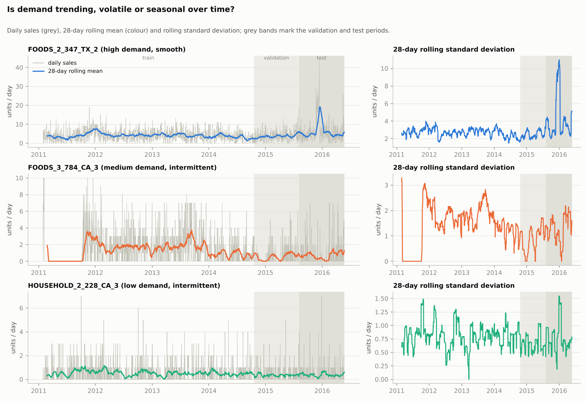
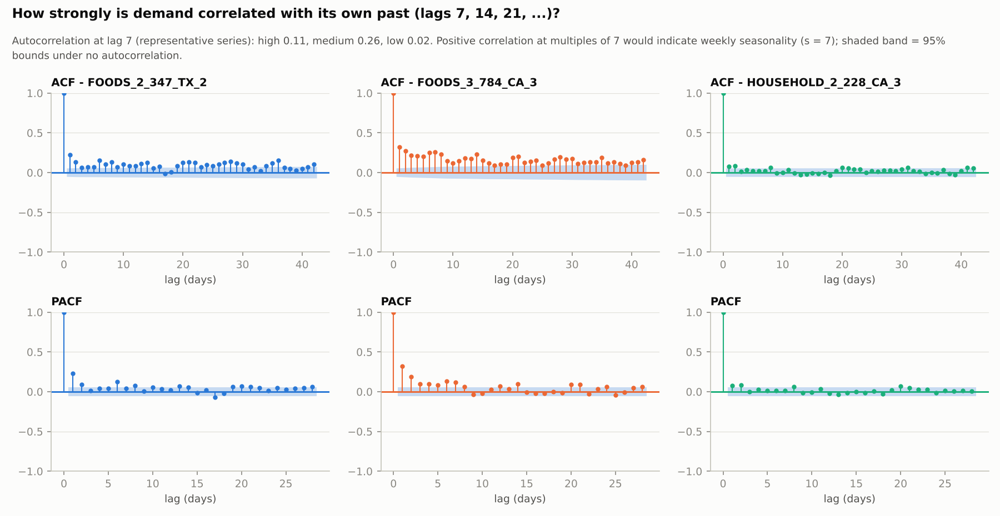
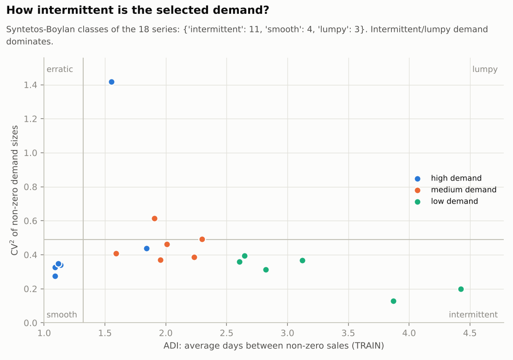

## 7. Forecasting Formulation

* `y_t` = observed daily unit sales of one item in one store. At forecast origin `t` (end of day t) only information up to `t` (plus the *published* calendar) is used.
* **Target** (identical for every model): `Target_H(t) = sum(y[t+1], ..., y[t+H])`, H = 7, 14, 28 (primary). H = 3 is trained/evaluated as a *supplementary* horizon only because the inventory layer needs the 3-day lead-time demand.
* **Direct strategy** for XGBoost (one model per H, no recursion); statistical models forecast the daily path and are summed (negative daily forecasts clipped at 0).
* Metrics (on the H-day sums, pooled over series and origins): MAE, RMSE, sMAPE (0/0 := 0), WAPE = sum|e|/sum|y|. MAPE is not used (undefined at zero, asymmetric).

## 8. Validation Strategy

Chronological two-phase protocol with daily rolling origins (`reports/validation_strategy.md`): choices on validation, one-time evaluation on test after refitting on train + validation. Automated leakage audit: **40/40 checks pass** (`reports/leakage_audit.md`) - including perturbation tests that replace all post-cut-off data by random values and verify that features, ETS/SARIMA/XGBoost forecasts, sigma_L and the inventory policy are unchanged, and a negative-control unit test showing that a deliberately leaky feature *is* detected.

## 9. Baselines

Naive (last day), seasonal naive (same weekday last week), moving average (7/14/28 days; **window chosen on validation: 28 days at every horizon**) and Croston-SBA (alpha = 0.1; added because intermittent demand dominates).

> **Why SeasonalNaive and MA7 have identical scores at 7, 14 and 28 days:** the sum of a seasonal-naive path over complete weeks equals H x (mean of the last 7 days) = the MA7 forecast of the sum. They differ only for H = 3 (a unit test proves the identity).

Test WAPE of the validation-selected moving average: 39.4% / 34.5% / 32.1% at 7/14/28 days, versus seasonal naive 40.9% / 39.9% / 40.3% and the best model 37.6% / 32.8% / 29.8%.

## 10. Exponential Smoothing

SES (level), Holt (additive **damped** trend - an undamped trend extrapolated up to 28 daily steps is unstable on noisy retail data) and Holt-Winters (additive weekly seasonality s = 7; multiplicative is impossible with zero sales; without / with damped trend, chosen by AICc: 15 / 3 series). Fallback hierarchy Holt-Winters -> Holt -> SES was implemented; **0 fallback events** occurred. Weekly seasonality is statistically supported in-sample (AICc of Holt-Winters < SES for 15 of 18 series), but because additive seasonal indices cancel over complete weeks the gain is small for 7/14/28-day sums (test WAPE SES 37.6% vs Holt-Winters 37.7% at 7 days). Smoothing parameters are small (median alpha 0.05): the level adapts slowly.

## 11. SARIMA

Stationarity (TRAIN): conflict: ADF stationary / KPSS non-stationary: 14 series, stationary (both tests agree): 3 series, unit root (both tests agree): 1 series. The ADF/KPSS conflict (mean moves slowly) and the ACF/PACF of the seasonally differenced series (median lag-7 autocorrelation -0.48, range -0.52 to -0.41; the PACF at the seasonal lags 7/14/21/28 is -0.48/-0.33/-0.24/-0.18; `eda_09_acf_pacf_seasonally_differenced.png`) motivate five small candidates with s = 7: `(1,0,1)(1,0,1)7+c`, `(1,0,0)(1,0,0)7+c`, `(1,0,1)(0,1,1)7`, `(0,1,1)(0,1,1)7`, `(1,1,1)(0,1,1)7`. Selection per series by validation error (AIC/BIC logged; AIC is not comparable across differencing orders). Chosen: (0,1,1)(0,1,1)7 x5; (1,0,1)(0,1,1)7 x4; (1,0,1)(1,0,1)7+c x4; (1,0,0)(1,0,0)7+c x3; (1,1,1)(0,1,1)7 x2. Share of candidate fits that converged: (1,0,1)(1,0,1)7+c 0.94; (1,0,0)(1,0,0)7+c 1.0; (1,0,1)(0,1,1)7 1.0; (0,1,1)(0,1,1)7 0.94; (1,1,1)(0,1,1)7 1.0; fallbacks to Holt-Winters: 0 (validation) / 0 (test).

Residuals (TRAIN, one-step): mean ~ 0 (SARIMA -0.018, Holt-Winters -0.021); Ljung-Box (lag 14) rejects white noise for 50% (SARIMA) / 39% (Holt-Winters) of series; Jarque-Bera rejects normality for 100% of series (median skew 1.7, excess kurtosis 4.6): daily residuals of count data are right-skewed and heavy-tailed, so some autocorrelation and non-Gaussianity remain (`resid_01_statistical_models.png`).

## 12. XGBoost

One *global* (pooled over the 18 series) squared-error model per horizon H in {3, 7, 14, 28}, raw units, direct target `sum(y[t+1..t+H])`. 25 features in three groups - **history** (lag_1/7/14/21/28 measured from the first forecast day, rolling mean 7/14/28 and std 7/28 ending at the origin, price, week-over-week price change, price relative to its 91-day mean), **calendar_origin** (day of week/month, ISO week, month, quarter, year, weekend, event and SNAP flag of the origin day) and **known_ahead** (counts of SNAP days, event days and Christmas inside the forecast window - deterministic functions of the published calendar, tested to be independent of sales).

Tuning (modest, validation only): default + 23 random draws from a 5-parameter space (max_depth, learning_rate, subsample, colsample_bytree, min_child_weight; n_estimators by early stopping on validation MAE) per horizon. Validation MAE improvement of the best vs the default configuration: H=3: 1.1%, H=7: 1.3%, H=14: 4.9%, H=28: 5.5%. Chosen settings:

|   H |   max_depth |   learning_rate |   subsample |   colsample_bytree |   min_child_weight |   n_estimators |   train_rows |   final_fit_rows |
|----:|------------:|----------------:|------------:|-------------------:|-------------------:|---------------:|-------------:|-----------------:|
|   3 |           6 |            0.02 |         0.8 |                1   |                 40 |            412 |     2.39e+04 |         2.91e+04 |
|   7 |           3 |            0.05 |         0.8 |                1   |                  5 |            371 |     2.38e+04 |         2.91e+04 |
|  14 |           6 |            0.1  |         1   |                0.7 |                 40 |             70 |     2.37e+04 |         2.89e+04 |
|  28 |           5 |            0.05 |         0.8 |                0.5 |                 20 |             94 |     2.35e+04 |         2.87e+04 |

## 13. Model Comparison

**Test period, pooled over 18 series (lower is better)** - horizons 7/14/28 are primary, 3 is supplementary:

*WAPE*

| Model         |   3-day |   7-day |   14-day |   28-day |
|:--------------|--------:|--------:|---------:|---------:|
| XGBoost       |   47.61 |   38.46 |    32.79 |    29.85 |
| SARIMA        |   48.29 |   38.01 |    33.71 |    31.56 |
| MovingAverage |   50.07 |   39.42 |    34.48 |    32.15 |
| Holt          |   47.97 |   37.57 |    34.22 |    32.73 |
| HoltWinters   |   47.83 |   37.70 |    34.35 |    32.85 |
| SES           |   48.01 |   37.60 |    34.31 |    32.86 |
| Croston       |   51.61 |   40.66 |    36.04 |    33.63 |
| SeasonalNaive |   58.14 |   40.91 |    39.90 |    40.33 |
| Naive         |   74.65 |   70.42 |    70.88 |    72.82 |

*MAE*

| Model         |   3-day |   7-day |   14-day |   28-day |
|:--------------|--------:|--------:|---------:|---------:|
| XGBoost       |    2.57 |    4.84 |     8.22 |    14.94 |
| SARIMA        |    2.61 |    4.78 |     8.45 |    15.80 |
| MovingAverage |    2.70 |    4.96 |     8.64 |    16.10 |
| Holt          |    2.59 |    4.72 |     8.58 |    16.39 |
| HoltWinters   |    2.58 |    4.74 |     8.61 |    16.45 |
| SES           |    2.59 |    4.73 |     8.60 |    16.46 |
| Croston       |    2.79 |    5.11 |     9.03 |    16.84 |
| SeasonalNaive |    3.14 |    5.14 |    10.00 |    20.19 |
| Naive         |    4.03 |    8.86 |    17.77 |    36.46 |

*RMSE*

| Model         |   3-day |   7-day |   14-day |   28-day |
|:--------------|--------:|--------:|---------:|---------:|
| XGBoost       |    5.00 |   10.43 |    18.81 |    34.53 |
| SARIMA        |    5.15 |   10.14 |    18.91 |    35.36 |
| Holt          |    4.91 |    9.77 |    19.08 |    38.15 |
| HoltWinters   |    4.84 |    9.70 |    19.01 |    38.18 |
| SES           |    4.90 |    9.76 |    19.08 |    38.20 |
| Croston       |    4.90 |    9.73 |    18.94 |    38.63 |
| MovingAverage |    5.27 |   10.71 |    20.59 |    40.37 |
| SeasonalNaive |    5.84 |    9.82 |    20.02 |    43.64 |
| Naive         |    7.24 |   15.91 |    32.00 |    67.30 |

*sMAPE*

| Model         |   3-day |   7-day |   14-day |   28-day |
|:--------------|--------:|--------:|---------:|---------:|
| MovingAverage |   76.91 |   52.75 |    41.72 |    37.95 |
| XGBoost       |   86.67 |   64.13 |    51.08 |    44.65 |
| HoltWinters   |   83.57 |   63.26 |    51.68 |    45.25 |
| Croston       |   89.39 |   64.31 |    52.02 |    45.38 |
| Holt          |   88.36 |   63.59 |    52.27 |    46.23 |
| SES           |   88.56 |   63.78 |    52.67 |    46.59 |
| SARIMA        |   83.34 |   64.66 |    53.15 |    46.70 |
| SeasonalNaive |   79.78 |   58.46 |    54.16 |    53.31 |
| Naive         |   95.65 |  108.82 |   115.04 |   118.44 |

**Best model per horizon**

|   H | primary_horizon   | best_by_validation_WAPE   |   val_WAPE | best_by_test_WAPE   |   test_WAPE | runner_up_test_WAPE   |   runner_up_WAPE | best_by_test_RMSE   | validation_choice_equals_test_best   |
|----:|:------------------|:--------------------------|-----------:|:--------------------|------------:|:----------------------|-----------------:|:--------------------|:-------------------------------------|
|   3 | False             | XGBoost                   |      43.49 | XGBoost             |       47.61 | HoltWinters           |            47.83 | HoltWinters         | True                                 |
|   7 | True              | SARIMA                    |      32.42 | Holt                |       37.57 | SES                   |            37.60 | HoltWinters         | False                                |
|  14 | True              | SARIMA                    |      26.02 | XGBoost             |       32.79 | SARIMA                |            33.71 | XGBoost             | False                                |
|  28 | True              | SARIMA                    |      21.47 | XGBoost             |       29.85 | SARIMA                |            31.56 | XGBoost             | False                                |

* **Short horizon (7 days):** Holt (37.6%), runner-up SES (37.6%); XGBoost 38.5%, SARIMA 38.0%.
* **Medium (14 days):** XGBoost (32.8%), runner-up SARIMA (33.7%).
* **Long (28 days):** XGBoost (29.8%), runner-up SARIMA (31.6%); best simple benchmark (moving average) 32.1%.
* No single overall winner is declared. By RMSE the ranking differs (in the test year RMSE is dominated by a small set of large misses: at 7 days the worst 5% of windows produce 65-80% of the squared error): H=7: HoltWinters, H=14: XGBoost, H=28: XGBoost. sMAPE is shown only for completeness: it scores a zero forecast of a zero actual as perfect, and the best 28-day sMAPE (38.0%) belongs to MovingAverage, which ranks 3 of 9 on WAPE and forecasts exactly zero in 7.5% of the 28-day windows (the actual is zero in 6.9%), whereas Croston, Holt, HoltWinters, SARIMA, SES, XGBoost never forecast exactly zero.

**Is a difference real? Diebold-Mariano (test, panel, absolute scaled loss, HAC lag H-1, Harvey-Leybourne-Newbold correction, Holm-adjusted within each horizon)** - XGBoost versus each model:

|   horizon | MovingAverage       | Croston             | SES                  | Holt                 | HoltWinters          | SARIMA              | SeasonalNaive         | Naive                 |
|----------:|:--------------------|:--------------------|:---------------------|:---------------------|:---------------------|:--------------------|:----------------------|:----------------------|
|         7 | n.s. (p_Holm=0.313) | n.s. (p_Holm=0.489) | WORSE (p_Holm=0.001) | WORSE (p_Holm=0.000) | WORSE (p_Holm=0.001) | n.s. (p_Holm=0.068) | better (p_Holm=0.001) | better (p_Holm=0.000) |
|        14 | n.s. (p_Holm=1.000) | n.s. (p_Holm=1.000) | n.s. (p_Holm=1.000)  | n.s. (p_Holm=1.000)  | n.s. (p_Holm=1.000)  | n.s. (p_Holm=1.000) | better (p_Holm=0.000) | better (p_Holm=0.000) |
|        28 | n.s. (p_Holm=1.000) | n.s. (p_Holm=1.000) | n.s. (p_Holm=0.511)  | n.s. (p_Holm=0.423)  | n.s. (p_Holm=0.454)  | n.s. (p_Holm=0.689) | better (p_Holm=0.000) | better (p_Holm=0.000) |

Reading: XGBoost is significantly better than another non-naive model in 0 of 18 comparisons and significantly worse in 3 (H=7: SES, Holt, HoltWinters). With daily origins the effective number of independent windows is about n/H (about 9 at H = 28), so power is limited and non-significance is not proof of equality. Per-series DM tests (unadjusted p < 0.05, XGBoost vs moving average / Holt-Winters / SARIMA, 3 horizons x 18 series = 162 tests): XGBoost significantly better in 18, significantly worse in 25 (`dm_tests_per_series.csv`).

**Volume-weighted vs equal-weighted view.** Pooled WAPE/MAE are dominated by high-volume series; the DM panel test averages *scaled* losses over series with equal weight, so low-volume series count as much as busy ones. The best 28-day model by group is XGBoost for the high-volume tier, Holt for the medium tier and Holt for the low-volume tier (`robustness_best_model_by_group.csv`), so a model that does well on busy series can lead on pooled WAPE while not leading on the equal-weighted test.

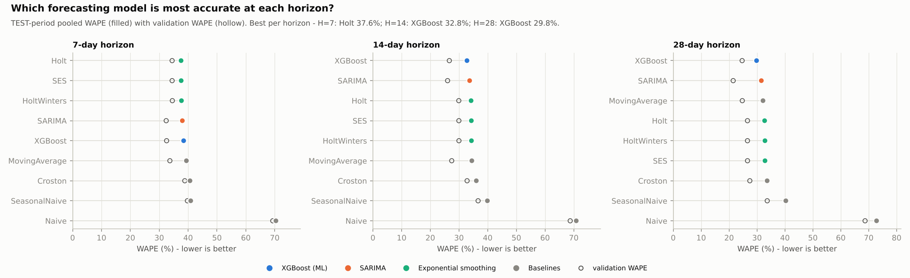
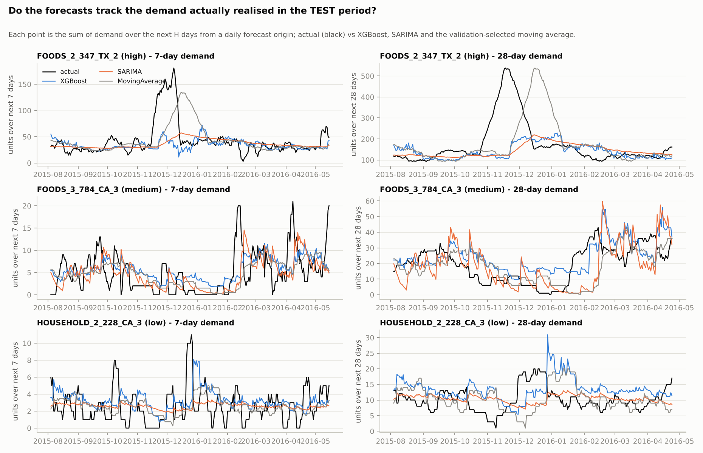
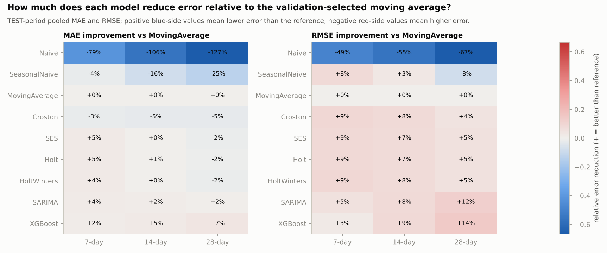

**Residual analysis of XGBoost (test).** Mean error (forecast - actual) -0.63 / -1.06 / -1.70 units (-5.0% / -4.2% / -3.4% of mean demand) at 7/14/28 days: a systematic **under-forecast** (all 36 model-horizon cells under-forecast on average in the test year; see `resid_02_xgboost_H7.png` for bias by demand level, tier, month and weekday).

## 14. SHAP

SHAP `TreeExplainer` on the final (train + validation) models, 4,000 of 5,274 test-period origins (seeded random sample); additivity `sum(SHAP) + base = prediction` verified (max error 1.4e-04). A **positive** SHAP value pushes that prediction *above* the average prediction (base value), a **negative** one pushes it *below*; SHAP describes the fitted model, **not** causal effects in the world.

Global importance (mean |SHAP|, % of total):

*7-day model*

| feature          | group           |   mean_abs_shap |   share_of_total |   corr(value, SHAP) |
|:-----------------|:----------------|----------------:|-----------------:|--------------------:|
| rolling_mean_28  | history         |           8.322 |            0.535 |               0.970 |
| rolling_mean_7   | history         |           1.818 |            0.117 |               0.936 |
| rolling_mean_14  | history         |           1.324 |            0.085 |               0.280 |
| rolling_std_28   | history         |           0.719 |            0.046 |               0.068 |
| snap_days_window | known_ahead     |           0.705 |            0.045 |               0.844 |
| lag_1            | history         |           0.615 |            0.040 |               0.793 |
| price            | history         |           0.577 |            0.037 |              -0.809 |
| year             | calendar_origin |           0.318 |            0.020 |              -0.008 |

*28-day model*

| feature         | group           |   mean_abs_shap |   share_of_total |   corr(value, SHAP) |
|:----------------|:----------------|----------------:|-----------------:|--------------------:|
| rolling_mean_28 | history         |          22.035 |            0.400 |               0.970 |
| rolling_mean_14 | history         |          13.500 |            0.245 |               0.927 |
| rolling_mean_7  | history         |           4.793 |            0.087 |               0.918 |
| rolling_std_28  | history         |           3.499 |            0.064 |               0.768 |
| price           | history         |           2.937 |            0.053 |              -0.502 |
| year            | calendar_origin |           1.853 |            0.034 |               0.012 |
| lag_1           | history         |           1.612 |            0.029 |               0.868 |
| rolling_std_7   | history         |           1.202 |            0.022 |               0.412 |

By group: history features 90% (7-day) / 92% (28-day), calendar-of-origin 5% / 6%, known-ahead window counts 5% / 1%.

Interpretation (descriptive): higher recent average demand (`rolling_mean_*`) pushes the forecast up (correlation of value and SHAP 0.97); more SNAP days in the forecast window raise it (corr +0.84). `price` has a negative relation (corr -0.81), but because weekly prices of a given item rarely change (median 2 changes in TRAIN) this most likely reflects *between-item* differences (across the 18 series the Spearman correlation between mean price and mean sales is -0.69: cheaper items sell more) rather than a price elasticity - a hypothesis consistent with the data, not a causal finding. `year` is a minor step-function feature (2.0% / 3.4% of the attribution at 7 / 28 days; trees cannot extrapolate beyond the training years).

Three individual explanations (selected by rule, not by outcome) are in `shap_individual_H7_1..3.png` (largest prediction, median prediction, Christmas in the forecast window); case table:

| case                         | series_id        | origin_date   |   prediction |   actual |
|:-----------------------------|:-----------------|:--------------|-------------:|---------:|
| largest prediction           | FOODS_2_347_TX_2 | 2016-01-06    |        71.75 |    42.00 |
| median prediction            | FOODS_3_784_CA_3 | 2015-10-14    |         5.39 |     7.00 |
| Christmas in forecast window | FOODS_3_449_CA_3 | 2015-12-18    |        23.59 |    24.00 |

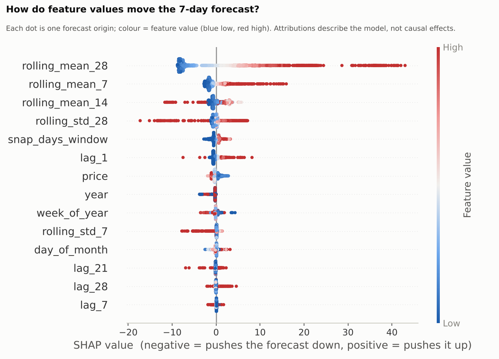
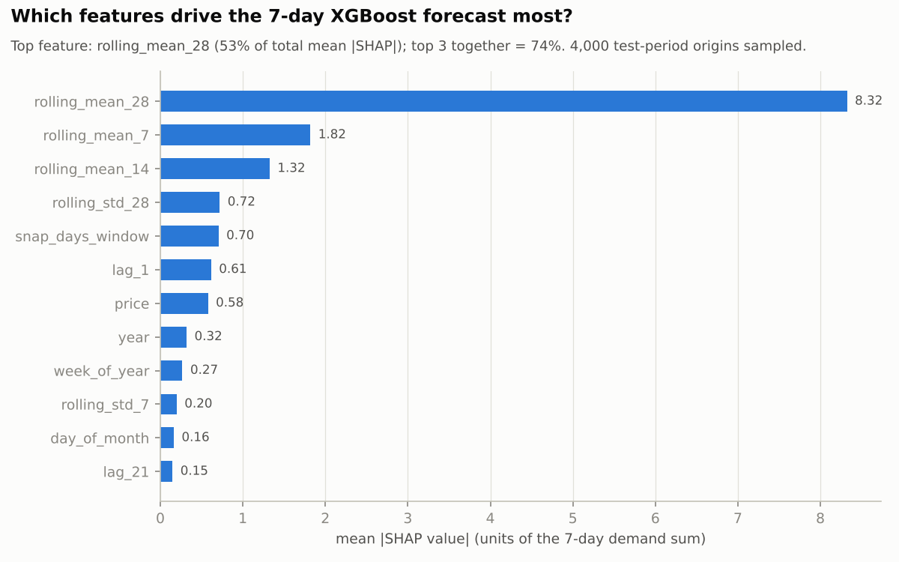
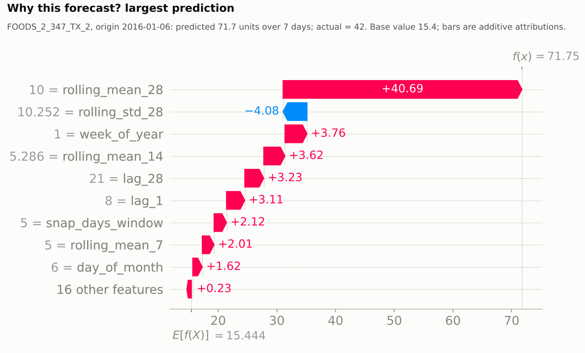

## 15. Forecast Uncertainty

Uncertainty comes from **validation residuals** of the H-day sums (models trained on TRAIN). sigma_L = RMSE of those errors per series, model and horizon (RMSE so that bias inflates the safety stock). Normality is *not* assumed - pooled standardised validation residuals of the XGBoost/SARIMA/MA sums have skewness -0.08 to 0.45 and excess kurtosis 0.04 to 0.80 (mild; the *daily* one-step residuals of the statistical models have median excess kurtosis 4.6, so summing over H days moves the errors much closer to normal), although Shapiro-Wilk rejects exact normality; consecutive-origin residuals are strongly autocorrelated (lag-1 0.81-0.96) because windows overlap.

**Interval method chosen on validation** by a split-half calibration (quantiles/sigma from the first half of validation origins, coverage measured on the second half): mean absolute coverage error Gaussian 0.060 vs empirical 0.103 -> **gaussian**.

Honest **test** coverage of the gaussian intervals (nominal 80% / 90%):

| model         |   H |   80% interval coverage |   90% interval coverage |
|:--------------|----:|------------------------:|------------------------:|
| MovingAverage |   7 |                   0.812 |                   0.882 |
| MovingAverage |  28 |                   0.802 |                   0.870 |
| SARIMA        |   7 |                   0.800 |                   0.884 |
| SARIMA        |  28 |                   0.696 |                   0.799 |
| XGBoost       |   7 |                   0.788 |                   0.872 |
| XGBoost       |  28 |                   0.793 |                   0.881 |

**The key warning:** test-period RMSE is 1.17-2.23x the validation RMSE across models and horizons (XGBoost 1.75x at 7 days, SARIMA 2.15x at 28 days). A sigma estimated on validation therefore *understates* test-period error, a likely reason why the realised service level of the validation-based safety stocks falls short of the nominal target (section 17).

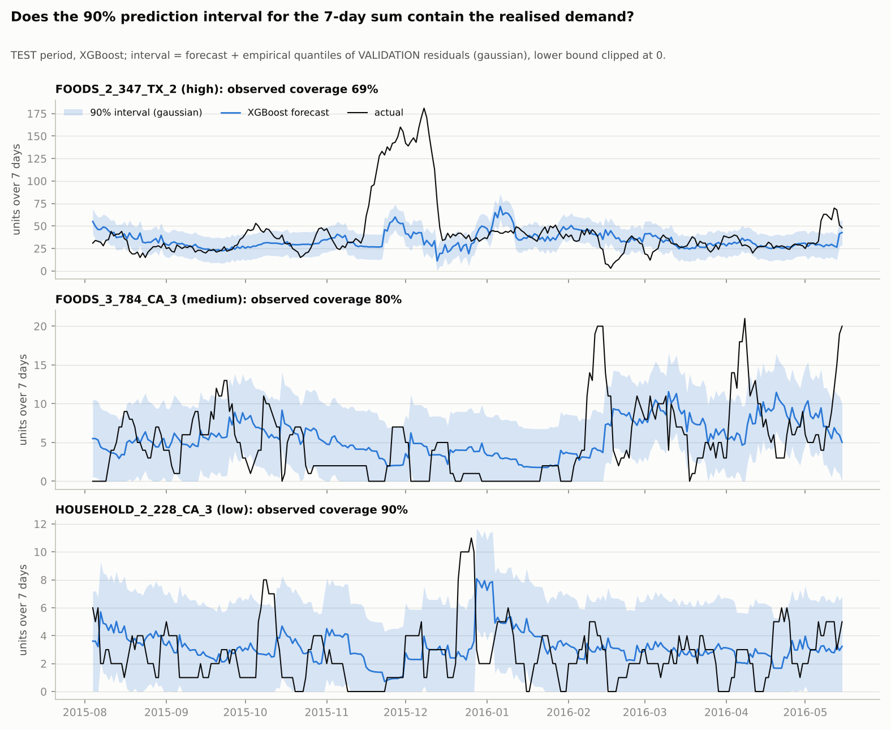
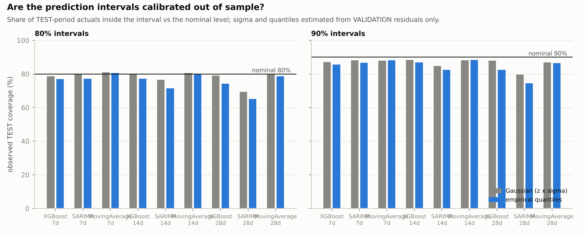

## 16. Inventory Optimization

**Policy: reorder point + order-up-to level (s, S) with EOQ.** At the end of each day t (after observing that day's demand), with `IP_t = on-hand + on-order`:

```
mu_L(t)  = forecast of demand over days t+1 ... t+L          sigma_L = std of the L-day forecast error
SS       = z * sigma_L          (z = 1.282 / 1.645 / 2.054 for 90 / 95 / 98 % target service)
ROP_t    = mu_L(t) + SS
Q_t      = ceil( sqrt(2 * D * S_o / H) ),  D = 365 * (28-day forecast)/28,  S_o = order cost,  H = annual holding cost per unit
if IP_t <= ROP_t:  order  ceil(ROP_t + Q_t - IP_t)  units   (order-up-to level S_t = ROP_t + Q_t)
```

Timing: an order placed at the end of day t arrives at the **start of day t+L+1**, so the protection interval is exactly the L days t+1..t+L that mu_L and sigma_L describe. Unmet demand is lost (retail). Lead times 3/7/14 days are **hypothetical** (no supplier data exist). Assumptions: constant lead time, no minimum order sizes, no perishability, one product at a time.

**Hypothetical cost assumptions (not observed business costs):**

* unit cost = 70% of the last selling price before the test period; annual holding cost = 25% of unit cost; order cost = $1.00 per replenishment order (EOQ cycle length on TRAIN data: 12-65 days, median 23 / 32 / 39 days for high / medium / low tiers - sanity-checked on TRAIN data only, before any validation or test result existed; `eoq_cycle_sanity_train.csv`);
* stockout penalty per lost unit = multiplier x unit margin: LOW = 0.25x (part of the sale is recovered), MEDIUM = 1.0x (lost margin), HIGH = 3.0x (lost margin plus goodwill). A newsvendor critical-ratio argument on TRAIN data (not any simulation result) was used to choose them: the median per-cycle critical ratio is 82% (LOW), 95% (MEDIUM) and 98% (HIGH), so the 90/95/98% grid does not bracket all three: at least one critical ratio lies outside the simulated service-level range (see section 19).

**Policy A - historical baseline (no forecasting model):** mu_L = L x mean of the last 28 days; sigma_L = sqrt(L) x std of the last 28 days; D = 365 x trailing mean.
**Policy B - forecast-driven:** mu_L and D from a forecasting model, sigma_L from that model's VALIDATION residuals of the L-day sum. Headline B model per lead time = lowest validation WAPE at H = L: L=3: XGBoost, L=7: SARIMA, L=14: SARIMA. A and B share lead time, costs, simulation period (the TEST period), initial inventory (cover of L + 14 days at the pre-test 28-day mean) and decision timing.

## 17. Simulation

Daily ledger (`outputs/tables/inventory_ledger_headline_L7_SL95.csv`): receive arrivals -> begin inventory -> observe demand -> fulfil -> record stockout -> update inventory -> inventory position -> check ROP -> order -> schedule arrival -> costs. Unit tests verify inventory balance, order timing, stockouts, costs, conservation of units and independence of decisions from future demand.

**Metric definitions.** *Fill rate* = fulfilled units / demanded units. *Cycle service level* = share of replenishment cycles (order placed -> arrival) without any stockout in the protection interval - the quantity the z-based safety stock targets. *In-stock day rate* = share of days without a stockout. *Stockouts* = number of series-days with unmet demand; *stockout units* = lost units. *Average inventory* = mean ending inventory (units, summed over series). *Turnover* = annualised fulfilled units / average inventory. *Holding cost* = h_day x ending inventory; *ordering cost* = S_o x orders; *stockout cost* = penalty x lost units; *total* = sum.

**Headline results (MEDIUM penalty; pooled over 18 series; TEST period).** `final_inventory_results.csv` holds all three penalty scenarios.

| Policy            | Forecast_Model   |   Lead_Time_days |   Service_Level |   Stockouts |   Stockout_Units |   Fill_Rate |   Cycle_Service_Level |   Average_Inventory |   Holding_Cost |   Ordering_Cost |   Stockout_Cost |   Total_Cost |
|:------------------|:-----------------|-----------------:|----------------:|------------:|-----------------:|------------:|----------------------:|--------------------:|---------------:|----------------:|----------------:|-------------:|
| A_historical      | none (trailing)  |                3 |           0.900 |          60 |          271.000 |       0.971 |                 0.714 |             576.360 |        188.064 |         143.000 |         225.102 |      556.166 |
| B_forecast_driven | XGBoost          |                3 |           0.900 |          35 |          261.000 |       0.972 |                 0.833 |             590.271 |        206.334 |         140.000 |         167.259 |      513.593 |
| A_historical      | none (trailing)  |                3 |           0.950 |          43 |          184.000 |       0.981 |                 0.794 |             594.387 |        195.243 |         145.000 |         170.718 |      510.961 |
| B_forecast_driven | XGBoost          |                3 |           0.950 |          29 |          235.000 |       0.975 |                 0.879 |             607.904 |        212.396 |         141.000 |         145.035 |      498.431 |
| A_historical      | none (trailing)  |                3 |           0.980 |          34 |          139.000 |       0.985 |                 0.829 |             614.397 |        202.173 |         146.000 |         114.336 |      462.509 |
| B_forecast_driven | XGBoost          |                3 |           0.980 |          23 |          222.000 |       0.977 |                 0.899 |             632.682 |        220.248 |         139.000 |         124.695 |      483.943 |
| A_historical      | none (trailing)  |                7 |           0.900 |          84 |          402.000 |       0.958 |                 0.672 |             636.014 |        208.005 |         139.000 |         332.712 |      679.717 |
| B_forecast_driven | SARIMA           |                7 |           0.900 |          54 |          386.000 |       0.959 |                 0.785 |             636.486 |        228.318 |         138.000 |         244.449 |      610.767 |
| A_historical      | none (trailing)  |                7 |           0.950 |          65 |          375.000 |       0.960 |                 0.746 |             675.990 |        223.417 |         141.000 |         283.443 |      647.860 |
| B_forecast_driven | SARIMA           |                7 |           0.950 |          45 |          351.000 |       0.963 |                 0.848 |             661.123 |        237.717 |         140.000 |         215.067 |      592.784 |
| A_historical      | none (trailing)  |                7 |           0.980 |          51 |          348.000 |       0.963 |                 0.835 |             721.459 |        237.105 |         143.000 |         242.754 |      622.859 |
| B_forecast_driven | SARIMA           |                7 |           0.980 |          31 |          301.000 |       0.968 |                 0.892 |             706.373 |        255.878 |         141.000 |         173.418 |      570.296 |
| A_historical      | none (trailing)  |               14 |           0.900 |         104 |          650.000 |       0.931 |                 0.763 |             728.661 |        240.914 |         138.000 |         507.414 |      886.328 |
| B_forecast_driven | SARIMA           |               14 |           0.900 |          63 |          555.000 |       0.941 |                 0.871 |             743.229 |        268.085 |         139.000 |         318.234 |      725.319 |
| A_historical      | none (trailing)  |               14 |           0.950 |          96 |          607.000 |       0.936 |                 0.752 |             750.175 |        252.691 |         141.000 |         447.021 |      840.712 |
| B_forecast_driven | SARIMA           |               14 |           0.950 |          55 |          524.000 |       0.945 |                 0.887 |             787.284 |        287.777 |         143.000 |         293.415 |      724.192 |
| A_historical      | none (trailing)  |               14 |           0.980 |          76 |          536.000 |       0.943 |                 0.815 |             797.788 |        271.076 |         142.000 |         362.256 |      775.332 |
| B_forecast_driven | SARIMA           |               14 |           0.980 |          40 |          444.000 |       0.953 |                 0.881 |             828.219 |        311.048 |         145.000 |         245.430 |      701.478 |

At the 95% target and L = 7, B (SARIMA) has 45 stockout series-days / 351 lost units vs 65 / 375 for A, with average inventory 661 vs 676 units: B serves more demand with *less* stock. The **realised cycle service level is far below the 95% design target** (85% for B, 75% for A) while the in-stock day rate is 99.1% / 98.8%. Evidence in the data: (i) test-year forecast errors are larger than the validation errors used to set sigma (RMSE ratio 1.18-1.75x at 7 days) and RMSE grows much faster than MAE (MAE ratio 1.07-1.25x), the error distribution became heavier-tailed: the worst 5% of windows produce 65-80% of the squared error in the test period versus 47-55% in validation (RMSE/MAE 1.80-2.16 vs 1.53-1.63; `error_concentration.csv`), so a small set of large misses dominates, although mean demand barely changed (+6%); (ii) forecasts under-predict on average (XGBoost bias -0.63 units at 7 days). A nominal service level is therefore a *design input*, not a guarantee.

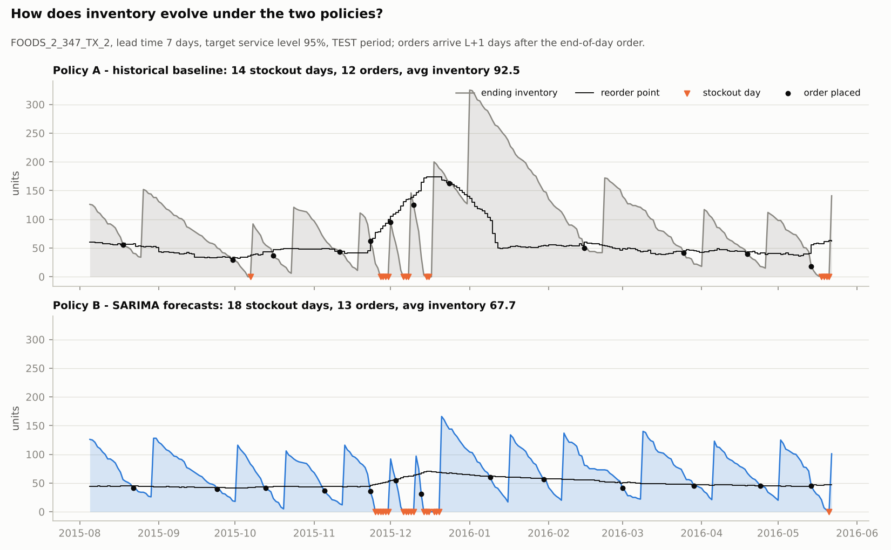
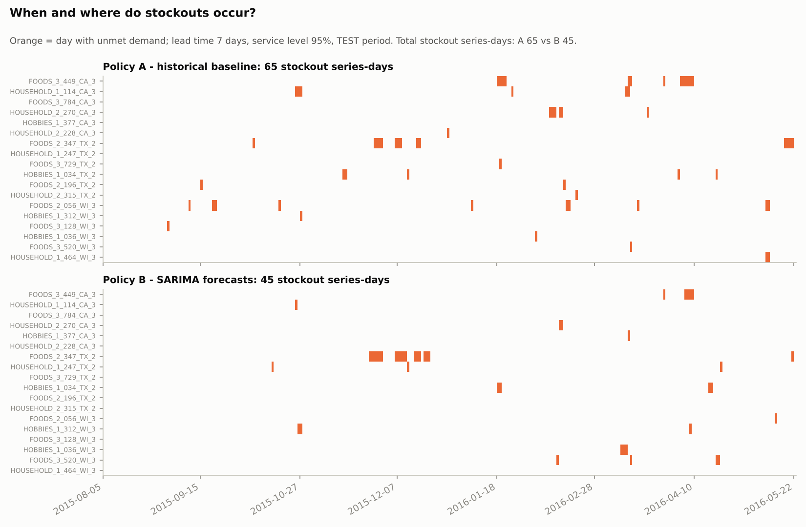

## 18. Cost Analysis

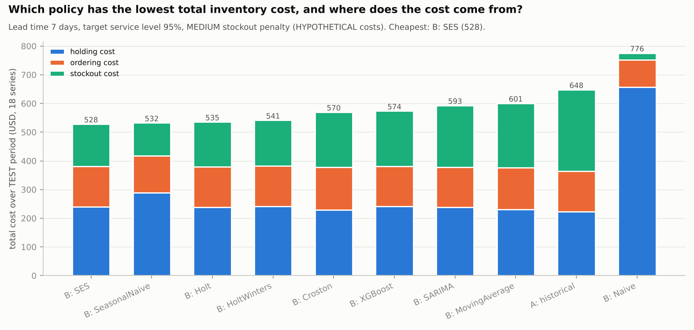

**Paired comparison B vs A (bootstrap over the 18 series, 5,000 resamples; relative change of pooled total cost, negative = B cheaper), MEDIUM penalty:**

|   L |   SL | B model   |   sum_A |   sum_B |   change % |   CI low % |   CI high % |   series B cheaper (of 18) |   sign_test_p |
|----:|-----:|:----------|--------:|--------:|-----------:|-----------:|------------:|---------------------------:|--------------:|
|   3 | 0.90 | XGBoost   |  556.17 |  513.59 |      -7.65 |     -26.00 |       14.58 |                         10 |          0.81 |
|   3 | 0.95 | XGBoost   |  510.96 |  498.43 |      -2.45 |     -23.67 |       24.46 |                         10 |          0.81 |
|   3 | 0.98 | XGBoost   |  462.51 |  483.94 |       4.63 |     -15.14 |       27.73 |                         12 |          0.24 |
|   7 | 0.90 | SARIMA    |  679.72 |  610.77 |     -10.14 |     -26.08 |        6.96 |                         11 |          0.48 |
|   7 | 0.95 | SARIMA    |  647.86 |  592.78 |      -8.50 |     -20.75 |        5.22 |                         10 |          0.81 |
|   7 | 0.98 | SARIMA    |  622.86 |  570.30 |      -8.44 |     -19.63 |        4.24 |                          8 |          0.81 |
|  14 | 0.90 | SARIMA    |  886.33 |  725.32 |     -18.17 |     -36.23 |        3.70 |                         13 |          0.10 |
|  14 | 0.95 | SARIMA    |  840.71 |  724.19 |     -13.86 |     -32.10 |        6.94 |                         13 |          0.10 |
|  14 | 0.98 | SARIMA    |  775.33 |  701.48 |      -9.53 |     -20.77 |        2.11 |                         11 |          0.48 |

B is cheaper in 21 of 27 configurations (3 penalty scenarios x 3 lead times x 3 service levels); the cells where it is not: LOW L=3 90% (+0.2%); LOW L=3 95% (+1.8%); LOW L=3 98% (+3.6%); LOW L=14 98% (+2.7%); MEDIUM L=3 98% (+4.6%); HIGH L=3 98% (+6.1%). The 95% bootstrap interval excludes zero in 0 of 27 cells; series are not independent (shared calendar shocks, 3 stores), so even these intervals are optimistic.

**Decomposition of the gain (L = 7, 95%, MEDIUM; same cost model, pooled total cost):**

| policy                                                                   |   total cost |   vs A % |   fill rate |   cycle service level |   avg inventory |
|:-------------------------------------------------------------------------|-------------:|---------:|------------:|----------------------:|----------------:|
| A: historical (trailing mean, sqrt(L) x trailing std)                    |      647.860 |    0.000 |       0.960 |                 0.746 |         675.990 |
| B with the SAME point forecast (28-day MA) but validation-residual sigma |      600.666 |   -7.285 |       0.965 |                 0.838 |         664.548 |
| B headline (SARIMA, chosen by validation WAPE)                           |      592.784 |   -8.501 |       0.963 |                 0.848 |         661.123 |
| B XGBoost                                                                |      573.522 |  -11.474 |       0.965 |                 0.873 |         672.846 |
| B SeasonalNaive                                                          |      532.039 |  -17.877 |       0.978 |                 0.896 |         798.277 |
| B Holt                                                                   |      535.320 |  -17.371 |       0.974 |                 0.891 |         679.589 |
| B SES (lowest cost ex post)                                              |      528.126 |  -18.481 |       0.975 |                 0.897 |         678.164 |

Lessons: (i) 86% of the headline A -> B cost change at L = 7 (-7.3% of -8.5%) appears even with an unchanged point forecast, i.e. it comes from *measuring the lead-time error distribution* instead of assuming i.i.d. daily demand; (ii) the model that wins on cost (a simple exponential smoother, SES, found *ex post* on the test data) was not the one that validation accuracy selected, so it is not an achievable benchmark; (iii) forecast **bias** goes with stockouts: across the 8 non-naive models the Spearman correlation between test bias at H = L and lost units is -0.60 (L=3), -0.81 (L=7, p = 0.014) and -0.73 (L=14, p = 0.040): the more a model under-forecasts, the more sales it loses (an association across few models, not proof).

## 19. Sensitivity Analysis

Grid: 3 stockout-penalty scenarios x 3 target service levels x 3 lead times, for A and the validation-selected B (`sensitivity_headline_policies.csv`; all models in `inventory_all_policies_aggregated.csv`).

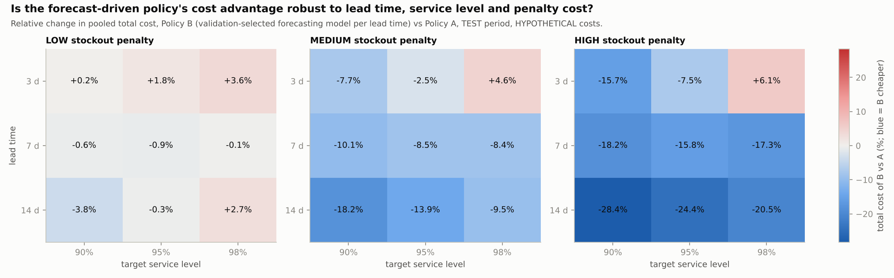
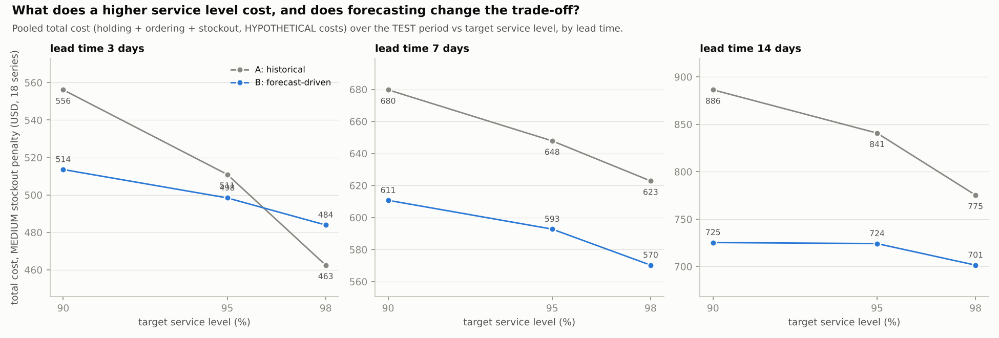

**Cost-minimising target service level among {90, 95, 98}%** (policy B / policy A):

|      | LOW       | MEDIUM    | HIGH      |
|:-----|:----------|:----------|:----------|
| L=3  | 90% / 98% | 98% / 98% | 98% / 98% |
| L=7  | 90% / 90% | 98% / 98% | 98% / 98% |
| L=14 | 90% / 98% | 98% / 98% | 98% / 98% |

For MEDIUM and HIGH the optimum sits on the upper edge of the grid (98%), so the true cost-optimal level may be even higher. For LOW it sits on the lower edge (90%), so the true cost-optimal level may be lower. The critical-ratio logic computed from the cost parameters alone suggests about 82% / 95% / 98% per cycle for LOW / MEDIUM / HIGH (at least one value lies outside the simulated grid); the simulated optimum and the critical ratio need not coincide because the simulation includes lead-time demand uncertainty that is under-estimated out of sample (section 17).

**Which assumption matters most?** Relative range of the mean total cost when one factor moves over its range (others averaged):

| policy_group      | factor                                      |   relative_range_of_mean_total_cost | levels                             |
|:------------------|:--------------------------------------------|------------------------------------:|:-----------------------------------|
| A_historical      | lead time (3/7/14 d)                        |                               0.553 | 3: 581, 7: 769, 14: 1,017          |
| A_historical      | service level (90/95/98 %)                  |                               0.171 | 0.9: 855, 0.95: 792, 0.98: 720     |
| A_historical      | stockout-penalty scenario (LOW/MEDIUM/HIGH) |                               1.040 | HIGH: 1,262, LOW: 441, MEDIUM: 665 |
| B_forecast_driven | lead time (3/7/14 d)                        |                               0.400 | 3: 559, 7: 679, 14: 836            |
| B_forecast_driven | service level (90/95/98 %)                  |                               0.083 | 0.9: 718, 0.95: 696, 0.98: 661     |
| B_forecast_driven | stockout-penalty scenario (LOW/MEDIUM/HIGH) |                               0.851 | HIGH: 1,031, LOW: 442, MEDIUM: 602 |

Ranking for B by the range of mean total cost: stockout-penalty scenario (85%), then lead time (40%), then service level (8%). Among the factors a planner can control, **shortening lead time is worth far more than raising the service level** (range 40% versus 8%).

*Safety-stock rule:* replacing the Gaussian z x sigma by the empirical quantile of validation residuals changes pooled total cost by 2.0% (median absolute change over 12 cells; range -3.3% to +4.9%), compared with the 9% headline A -> B difference at L = 7. Over all 81 model x lead time x service-level cells it changes the realised cycle service level by a mean of +0.3 points (range -5.4 to +5.1) and the fill rate by at most 0.8 points, whereas the shortfall of the realised cycle service level against the 95% target for B at L = 7 is 10 points: the rule does not repair the shortfall.

## 20. Robustness

Groups use TRAIN information only (selection tiers; ADI >= 1.32 = intermittent). With 4-14 series per group these are descriptive.

| group        |   H |   n_series | best_model    |   WAPE |   SeasonalNaive_WAPE |   MovingAverage_WAPE |   SARIMA_WAPE |   XGBoost_WAPE |
|:-------------|----:|-----------:|:--------------|-------:|---------------------:|---------------------:|--------------:|---------------:|
| intermittent |   7 |         14 | Holt          |  44.27 |                54.75 |                45.13 |         45.78 |          46.10 |
| intermittent |  14 |         14 | XGBoost       |  35.55 |                51.32 |                35.63 |         37.61 |          35.55 |
| intermittent |  28 |         14 | MovingAverage |  29.58 |                45.91 |                29.58 |         31.77 |          31.00 |
| regular      |   7 |          4 | SeasonalNaive |  31.50 |                31.50 |                35.54 |         32.73 |          33.26 |
| regular      |  14 |          4 | XGBoost       |  30.92 |                32.15 |                33.70 |         31.07 |          30.92 |
| regular      |  28 |          4 | XGBoost       |  29.07 |                36.57 |                33.87 |         31.41 |          29.07 |
| tier=high    |   7 |          6 | SARIMA        |  33.36 |                34.91 |                35.94 |         33.36 |          33.81 |
| tier=high    |  14 |          6 | XGBoost       |  30.16 |                35.46 |                32.59 |         30.50 |          30.16 |
| tier=high    |  28 |          6 | XGBoost       |  27.29 |                37.00 |                30.74 |         29.16 |          27.29 |
| tier=low     |   7 |          6 | Holt          |  48.28 |                64.83 |                52.22 |         49.10 |          54.95 |
| tier=low     |  14 |          6 | Holt          |  35.69 |                56.37 |                40.88 |         36.67 |          39.96 |
| tier=low     |  28 |          6 | Holt          |  27.13 |                52.64 |                35.16 |         28.58 |          34.32 |
| tier=medium  |   7 |          6 | Holt          |  52.49 |                63.13 |                52.96 |         59.74 |          56.89 |
| tier=medium  |  14 |          6 | MovingAverage |  42.15 |                57.04 |                42.15 |         51.52 |          44.52 |
| tier=medium  |  28 |          6 | Holt          |  38.54 |                53.35 |                39.02 |         48.21 |          42.92 |

Inventory, B vs A at L = 7, 95%, MEDIUM:

| group_type   | group        |   n_series | B_model   |   A_total_cost |   B_total_cost |   B_vs_A_total_cost_pct |   A_fill_rate |   B_fill_rate |
|:-------------|:-------------|-----------:|:----------|---------------:|---------------:|------------------------:|--------------:|--------------:|
| tier         | high         |          6 | SARIMA    |         397.57 |         362.15 |                   -8.91 |          0.95 |          0.96 |
| tier         | low          |          6 | SARIMA    |         126.18 |         110.90 |                  -12.11 |          0.99 |          0.99 |
| tier         | medium       |          6 | SARIMA    |         124.10 |         119.73 |                   -3.52 |          0.98 |          0.99 |
| regularity   | intermittent |         14 | SARIMA    |         381.37 |         325.23 |                  -14.72 |          0.98 |          0.99 |
| regularity   | regular      |          4 | SARIMA    |         266.49 |         267.55 |                    0.40 |          0.95 |          0.94 |

* **Stable vs intermittent.** For the 14 intermittent/lumpy series B changes cost by -14.7% (fill rate 0.982 -> 0.990); for the 4 regular series by +0.4% (fill rate 0.945 -> 0.945). The gain is concentrated in the intermittent series, which is consistent with (though no proof of) classical i.i.d. sigma assumptions being worst for intermittent demand; no general conclusion is drawn from the 4 regular series.
* **Forecast error by group.** XGBoost has the lowest WAPE in: intermittent@14, regular@14, regular@28, tier=high@14, tier=high@28; exponential smoothing or the moving average win in 8 of 9 (group x horizon) cells of the low-demand, medium-demand and intermittent groups - consistent with a pooled model dominated by high-volume series.

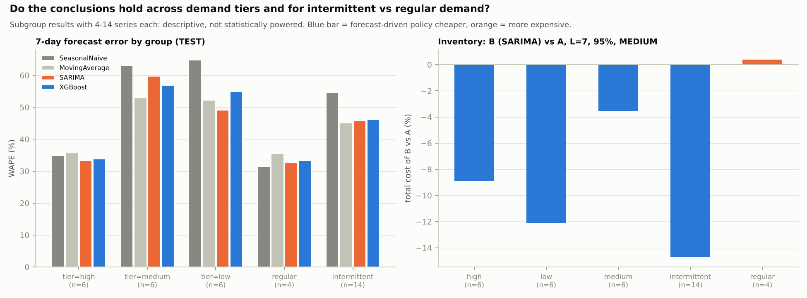

## 21. Results

### 21.1 Final tables

`outputs/tables/final_forecasting_results.csv` (test, pooled; primary horizons):

| Model         |   Horizon |   MAE |   RMSE |   sMAPE |   WAPE | Family                |
|:--------------|----------:|------:|-------:|--------:|-------:|:----------------------|
| Holt          |         7 |  4.72 |   9.77 |   63.59 |  37.57 | exponential smoothing |
| SES           |         7 |  4.73 |   9.76 |   63.78 |  37.60 | exponential smoothing |
| HoltWinters   |         7 |  4.74 |   9.70 |   63.26 |  37.70 | exponential smoothing |
| SARIMA        |         7 |  4.78 |  10.14 |   64.66 |  38.01 | SARIMA                |
| XGBoost       |         7 |  4.84 |  10.43 |   64.13 |  38.46 | machine learning      |
| MovingAverage |         7 |  4.96 |  10.71 |   52.75 |  39.42 | baseline              |
| Croston       |         7 |  5.11 |   9.73 |   64.31 |  40.66 | baseline              |
| SeasonalNaive |         7 |  5.14 |   9.82 |   58.46 |  40.91 | baseline              |
| Naive         |         7 |  8.86 |  15.91 |  108.82 |  70.42 | baseline              |
| XGBoost       |        14 |  8.22 |  18.81 |   51.08 |  32.79 | machine learning      |
| SARIMA        |        14 |  8.45 |  18.91 |   53.15 |  33.71 | SARIMA                |
| Holt          |        14 |  8.58 |  19.08 |   52.27 |  34.22 | exponential smoothing |
| SES           |        14 |  8.60 |  19.08 |   52.67 |  34.31 | exponential smoothing |
| HoltWinters   |        14 |  8.61 |  19.01 |   51.68 |  34.35 | exponential smoothing |
| MovingAverage |        14 |  8.64 |  20.59 |   41.72 |  34.48 | baseline              |
| Croston       |        14 |  9.03 |  18.94 |   52.02 |  36.04 | baseline              |
| SeasonalNaive |        14 | 10.00 |  20.02 |   54.16 |  39.90 | baseline              |
| Naive         |        14 | 17.77 |  32.00 |  115.04 |  70.88 | baseline              |
| XGBoost       |        28 | 14.94 |  34.53 |   44.65 |  29.85 | machine learning      |
| SARIMA        |        28 | 15.80 |  35.36 |   46.70 |  31.56 | SARIMA                |
| MovingAverage |        28 | 16.10 |  40.37 |   37.95 |  32.15 | baseline              |
| Holt          |        28 | 16.39 |  38.15 |   46.23 |  32.73 | exponential smoothing |
| HoltWinters   |        28 | 16.45 |  38.18 |   45.25 |  32.85 | exponential smoothing |
| SES           |        28 | 16.46 |  38.20 |   46.59 |  32.86 | exponential smoothing |
| Croston       |        28 | 16.84 |  38.63 |   45.38 |  33.63 | baseline              |
| SeasonalNaive |        28 | 20.19 |  43.64 |   53.31 |  40.33 | baseline              |
| Naive         |        28 | 36.46 |  67.30 |  118.44 |  72.82 | baseline              |

`outputs/tables/final_inventory_results.csv` - see section 17 (MEDIUM) and the file for LOW / HIGH.

### 21.2 Does the lowest forecasting error give the lowest inventory cost? (Phase 30)

| scenario   |   L | best_by_val_WAPE   | best_by_test_WAPE   | best_by_total_cost   |   spearman_testWAPE_vs_cost |   spearman_testWAPE_vs_cost_excl_Naive |   regret_of_val_choice_pct |
|:-----------|----:|:-------------------|:--------------------|:---------------------|----------------------------:|---------------------------------------:|---------------------------:|
| LOW        |   3 | XGBoost            | XGBoost             | SES                  |                        0.38 |                                   0.12 |                       3.50 |
| LOW        |   7 | SARIMA             | Holt                | SES                  |                        0.87 |                                   0.81 |                       3.28 |
| LOW        |  14 | SARIMA             | XGBoost             | XGBoost              |                        0.57 |                                   0.38 |                       1.95 |
| MEDIUM     |   3 | XGBoost            | XGBoost             | SeasonalNaive        |                       -0.13 |                                  -0.62 |                       9.94 |
| MEDIUM     |   7 | SARIMA             | Holt                | SES                  |                        0.50 |                                   0.29 |                      12.24 |
| MEDIUM     |  14 | SARIMA             | XGBoost             | SES                  |                        0.32 |                                   0.02 |                       7.61 |
| HIGH       |   3 | XGBoost            | XGBoost             | Naive                |                       -0.77 |                                  -0.67 |                      47.28 |
| HIGH       |   7 | SARIMA             | Holt                | SeasonalNaive        |                       -0.07 |                                   0.14 |                      34.30 |
| HIGH       |  14 | SARIMA             | XGBoost             | SeasonalNaive        |                       -0.03 |                                  -0.48 |                      23.29 |

**Answer: usually no.** The model with the lowest test WAPE is also the cheapest in 2 of 27 (scenario x L x service level) cells. Mean Spearman rho between error rank and cost rank (excluding Naive, n = 8 models): LOW +0.47, MEDIUM -0.08, HIGH -0.26. `regret_of_val_choice_pct` is the cost excess of the validation-accuracy choice over the (ex post) cheapest model.

**Why accuracy and cost differ**

1. *Asymmetric loss and honest uncertainty.* WAPE/RMSE penalise over- and under-forecasts equally; inventory cost does not (a lost unit costs penalty x margin, an unneeded unit only a small holding cost per day), and the best forecast for a newsvendor-type cost is a *quantile*, not the mean. A noisy forecaster also gets a large validation sigma and therefore a large safety stock: at L = 7 the mean sigma is 6.2 (seasonal naive) and 11.4 (naive) versus 5.0-5.3 for the leading models, and the average inventory is 798 units (seasonal naive) versus 661-680. The extra stock buys protection (207 lost units for seasonal naive vs 351 for SARIMA at L = 7 / 95%), and with the lost-sale penalties assumed here this can pay: seasonal naive is the cheapest model in 11 of 27 cells although its 7-day WAPE is 40.9% against 37.6% for the best model - an *inaccurate but honest* forecaster can win on cost.
2. *Bias versus scatter.* Safety stock is designed to absorb random scatter, whereas a systematic under-forecast shifts the whole lead-time demand distribution. Every model under-forecasts in the test year (most at 7 days: XGBoost -0.63, SARIMA -0.50), and across models the Spearman correlation between bias and lost units is -0.81 at L = 7.
3. *Sigma estimated on validation is optimistic for the models that were selected or tuned on validation.* The models with the smallest validation sigma (XGBoost, SARIMA, MovingAverage) are also the three with the largest test/validation RMSE ratio at 7 days (XGBoost 1.75x, MovingAverage 1.70x, SARIMA 1.65x vs exponential smoothing 1.48x, seasonal naive 1.30x) - a winner's-curse pattern that is consistent with, though not proven to cause, their under-protection.
4. *Timing and aggregation.* Lost units concentrate in the holiday season: November-December hold 66% of the lost units of B (SARIMA) and 39% of A's while being 21% of the test days, whereas WAPE averages over all windows; and the 6 high-demand series account for 61% of the pooled total cost of B (MEDIUM, L = 7, 95%).
5. *The cost structure decides what matters.* For B at L = 7 / 95%, holding + ordering make up 88% of total cost with the LOW penalty but 64% (MEDIUM) and only 37% (HIGH); where holding dominates (LOW, mean rho = +0.47) a symmetric accuracy metric is a reasonable proxy for cost, where lost sales dominate it is not (MEDIUM -0.08, HIGH -0.26).

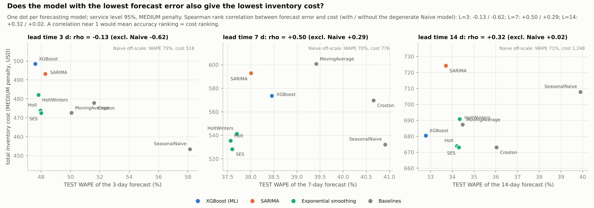

## 22. Business Recommendations

**Which model, for which horizon?**

* **Default - all items at 7 days, and low-volume / intermittent items:** exponential smoothing (SES / Holt). Holt had the lowest 7-day test WAPE (37.6%); the best ETS-family model is within 2.9 points of the best model at every primary horizon, and exponential smoothing or the moving average has the lowest WAPE in 5 of 6 (low-volume tier or intermittent group) x horizon cells. Neither XGBoost (significantly better in 0 of 18 DM comparisons) nor SARIMA (significantly better in 0 of 18) significantly beat the ETS family / moving average at any primary horizon. These models are cheap, transparent and easy to monitor.
* **High-volume items at 14 and 28 days:** XGBoost had the lowest WAPE in the high-volume tier (30.2% at 14 days and 27.3% at 28 days, vs SARIMA 30.5% / 29.2%) and the lowest pooled WAPE at 14, 28 days, but the pooled DM tests show no significant advantage, so adopt it only where its explanations (SHAP) or extra covariates (promotions, richer prices) add value.
* **Statistical vs ML:** prefer statistical forecasting as the production default and use ML where it earns its complexity. Naive and seasonal-naive forecasts are clearly less accurate (28-day test WAPE 40.3% vs 29.8% for the best model; significantly worse in the DM tests) but seasonal naive was the cheapest policy in 11 of 27 cost cells, because its large validation sigma builds a large safety stock - a cost benchmark that rewards insurance rather than forecasting skill, so cost alone is not a reason to choose a forecaster.

**What service level under each cost scenario?** Cost-minimising target on the simulated {90, 95, 98}% grid (section 19): LOW: 90%; MEDIUM: 98%; HIGH: 98%. Where the optimum is the top of the grid (98%) plan for 98% or more. Because the realised cycle service level falls short of the nominal target, monitor the *realised* service level and raise the nominal level or inflate sigma until the realised level meets the business target.

**Which lead-time assumption matters most?** Mean total cost of policy B (averaged over the other factors) is 559 / 679 / 836 for L = 3 / 7 / 14 days, but only 718 / 696 / 661 for 90 / 95 / 98% service: going from 14 to 7 days of lead time saves 19%, going from 90% to 98% service saves 8%, and the stockout-penalty assumption moves cost by more than either. The first practical step is therefore to measure the real cost of a lost sale and the real supplier lead-time distribution.

**Does advanced forecasting justify its complexity?** On this evidence **not by itself**: (1) the leading forecasting families are statistically hard to separate (neither XGBoost nor SARIMA is significantly better than the simple models in any DM comparison); (2) a large part of the cost change comes from out-of-sample uncertainty estimation, which adds no model complexity (-7.3% at L=7 with the same point forecast and a validation-based sigma versus -8.5% for the headline model); (3) the accuracy ranking did not identify the cheapest inventory policy (the lowest-WAPE model was the cheapest in 2 of 27 cells; section 21.2). A complex forecaster is worth deploying only if it improves the *decision* (e.g. through quantile / cost-aware training or richer drivers) rather than WAPE.

**Major risks:** hypothetical costs (no absolute savings can be claimed); censored demand; test-year errors 1.2-2.2x validation errors (sigma under-estimation: re-estimate on a rolling basis); only 18 series from 3 stores and one 292-day test period; validation-based model selection is optimistic; assortment survivorship (items listed since 2011; 12 of 18 series have a significantly negative trend); weak price/promotion information; unmodelled supply constraints (pack sizes, shelf life, variable lead times).

## 23. Limitations

* **Censored demand.** Observed sales may underestimate true demand during stockout periods; zero demand and stockouts are indistinguishable in M5 (3 of the 18 series have TRAIN zero spells of >= 240 store-open days while the item stays listed).
* **Hypothetical economics.** Lead times, unit costs, holding rate, order cost and stockout penalties are assumptions, not data; the *direction* of findings was checked across three penalty scenarios, absolute dollar figures carry no business meaning.
* **Small, specific sample.** 18 item-store series from 3 stores, all listed continuously since 2011 (eligibility rule); results do not generalise automatically to new items, other categories or other retailers. High-volume extremes (> P97) are not represented.
* **One test period.** 292 days (2015-08-05 to 2016-05-22) that proved harder than validation for every model (RMSE ratio 1.17-2.23x); overlapping windows give far fewer independent observations than origins; bootstrap/DM intervals are wide and the series are cross-sectionally dependent.
* **Model selection optimism.** Validation-selected quantities (SARIMA structure per series, MA window, XGBoost hyper-parameters) look better on validation than on test; the test table is the unbiased one. The headline Policy-B model was chosen by validation accuracy and was the cost-cheapest model on test in 0 of 27 cells.
* **Features.** Only history, calendar, SNAP and price at the origin are used; no promotions, weather or competitor data. The known-ahead calendar features are legitimate only because the calendar is published in advance.
* **Statistical models are univariate** and cannot use the Christmas closure / SNAP calendar that XGBoost sees (a potential advantage of the ML model on those days that this study did not isolate).
* **Supply side.** Constant lead time, no minimum order quantity or case packs, no perishability, no budget/space constraints, independent items; sigma_L is constant over the test period (no rolling re-estimation).
* **Service-level definitions.** Nominal z-based targets are *cycle* service levels under normality and a stationary sigma; the realised cycle service level at the 95% target and L = 7 was 85% (B) / 75% (A) (section 17).
* **Integrity evidence.** The official Kaggle checksums could not be accessed; integrity rests on agreement between two independent mirrors and structural checks.

## 24. Conclusion

Forecasts *can* be turned into better inventory decisions in this sample: a forecast-driven reorder-point policy lowered pooled total cost versus a historical-demand baseline in 21 of 27 cells (-8.5% at L=7 / 95% / MEDIUM with the validation-selected model), with the benefit concentrated in intermittent items and in the way uncertainty is estimated, but the evidence is suggestive rather than conclusive (bootstrap intervals include zero in 27 of 27 cells, hypothetical costs, one test year). The *most accurate* model was usually not the *cheapest* one (2 of 27 cells agree), the leading forecasting families were statistically hard to separate, and nominal service levels were not realised out of sample (cycle service level 85% against a 95% target at L=7). The practical message is to optimise the decision (calibrated lead-time uncertainty, bias control, cost-aware service level, shorter lead times) before optimising model complexity. Everything is reproducible with `python run_project.py`.

---
*Appendix: file map in `README.md`; figures in `outputs/figures`; all tables in `outputs/tables`; tests in `tests/` (see `reports/test_results.txt`).*
