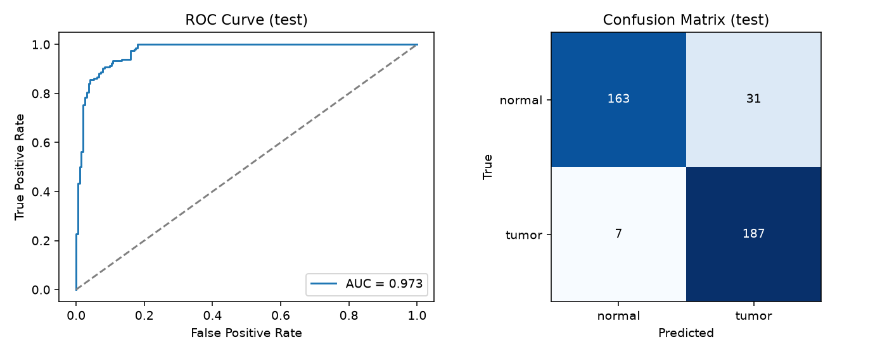
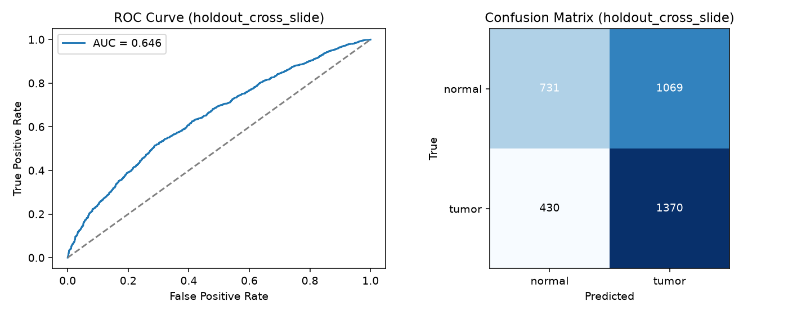
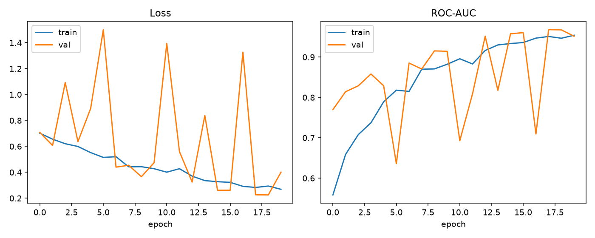
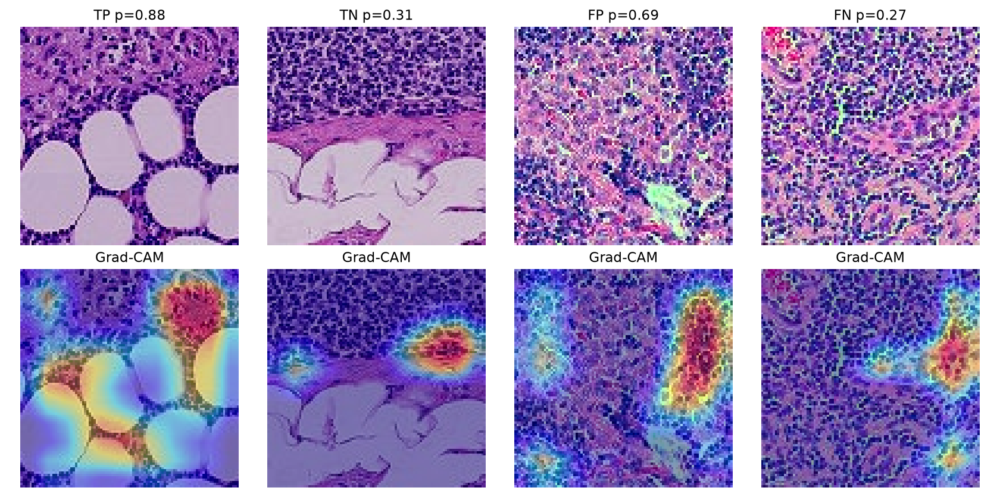

# Explainable Histopathology Image Classification — Project Report

## 1. Objective

Build and evaluate a PyTorch CNN that classifies 96×96 histopathology image
patches as **tumor** (metastatic tissue) or **normal**, using real raw
whole-slide imaging (WSI) data, with **Grad-CAM** explainability so that
predictions can be visually inspected rather than trusted blindly.

This mirrors the well-known **PatchCamelyon (PCam)** benchmark, except
instead of downloading the pre-built PCam dataset, the patches here are
**derived directly from raw CAMELYON16 whole-slide images** — the same
underlying slide collection PCam itself was built from — giving full control
over, and visibility into, every step of the data pipeline.

## 2. Data

**Source:** [CAMELYON16 challenge](https://camelyon16.grand-challenge.org/)
lymph-node histopathology slides, from the public, unauthenticated AWS Open
Data mirror `s3://camelyon-dataset/CAMELYON16/`. Each whole-slide image is a
multi-gigapixel pyramidal TIFF (Philips ultra-fast scanner format, JPEG-tiled)
with a matching pixel-level tumor annotation mask.

8 slides (≈4.6 GB of raw TIFF) were downloaded:

| Role | Slides |
|---|---|
| Training pool (6 slides → pooled, patch-level split) | `tumor_091`, `tumor_075`, `tumor_082`, `normal_108`, `normal_042`, `normal_004` |
| Cross-slide holdout (2 slides, never touched during training) | `tumor_084`, `normal_150` |

### 2.1 Patch extraction pipeline (`src/extract_patches.py`)

1. **Pyramid level selection** — each WSI is a multi-resolution pyramid;
   patches are extracted at the level closest to an 8× downsample from full
   resolution (a few thousand pixels per side — tractable in memory).
2. **Tissue detection** — glass/background is near-white and low-saturation;
   a patch is kept only if ≥35% of its pixels exceed an HSV saturation
   threshold, discarding empty background tiles.
3. **PCam-style labeling** — a patch is labeled **tumor** if the tumor mask
   has *any* positive pixel in the patch's **central 32×32 region**; labeled
   **normal** only if the *entire* 96×96 patch has zero tumor pixels;
   patches with tumor pixels present but outside the center (ambiguous
   tumor/normal boundary) are **discarded** rather than mislabeled.
4. **Reinhard color normalization** — every patch's LAB color statistics are
   remapped onto one fixed reference (estimated from tissue tiles of one
   slide). This removes slide-to-slide *global* staining/scanner color
   shift while preserving each patch's *internal* relative contrast (nuclei
   density/pattern — the actual diagnostic signal).
5. **Class balancing** — the majority class is undersampled so every split
   is ~50/50 tumor/normal.
6. **Splitting** — 6 slides are pooled and split 70/15/15 (train/val/test,
   stratified by class); 2 further slides are kept **completely separate**
   as a cross-slide holdout set.

Final dataset sizes: **train 1,800**, **val 384**, **test 388**,
**cross-slide holdout 3,600** patches (all class-balanced).

## 3. Model

A compact CNN (`src/model.py`), **trained from scratch** (no pretrained
weights, no internet-dependent transfer learning):

```
Conv(3→32)-BN-ReLU ×2 → MaxPool
Conv(32→64)-BN-ReLU ×2 → MaxPool
Conv(64→128)-BN-ReLU ×2 → MaxPool
Conv(128→256)-BN-ReLU ×2                 (no pooling — kept for Grad-CAM)
GlobalAveragePool → Dropout(0.3) → Linear(256→1)
```

~1.5M parameters. Loss: `BCEWithLogitsLoss`. Optimizer: Adam
(lr=1e-3, weight_decay=1e-4) with `ReduceLROnPlateau` on validation AUC.
20 epochs, batch size 32, CPU-only training (~5–6 minutes).

**Augmentation** (`src/train.py`): random horizontal/vertical flip, random
90° rotation (H&E tissue has no canonical orientation), and mild color
jitter (brightness/contrast/saturation ±0.2, hue ±0.05) for residual
per-patch color noise left after the slide-level Reinhard normalization.

## 4. Evaluation

Two evaluations are reported, deliberately kept separate:

- **`test`** — a standard, patch-level held-out split drawn from the *same
  6 slides* used for training (unseen patches, but the model has seen other
  patches from the same tissue/staining batch).
- **`holdout_cross_slide`** — patches from **2 whole slides never used in
  training at all**. This is the harder, more realistic measure of how the
  model would perform on a genuinely new patient's slide.

The decision threshold (0.43) was chosen by maximizing F1 on the
**validation** set only, then applied unchanged to both test sets.

| Metric | `test` (in-distribution) | `holdout_cross_slide` (unseen slides) |
|---|---|---|
| ROC-AUC | **0.973** | 0.646 |
| Precision | 0.858 | 0.562 |
| Recall | 0.964 | 0.761 |
| F1-score | **0.908** | 0.646 |
| Accuracy | 90% | 58% |







### 4.1 Why two numbers, and why they differ so much

This gap (AUC 0.97 → 0.65) is not a bug — it is a **real, well-documented
phenomenon in computational pathology** called the **batch effect** /
**domain shift**: different slides, scanners, reagent batches, and labs
produce systematically different staining, even after color normalization.
A model trained on a handful of slides can latch onto slide-specific texture
or residual color cues that happen to correlate with the label *within those
slides*, rather than learning tumor morphology that generalizes to new
tissue. With only 4 tumor-bearing and 4 normal training-pool slides here
(vs. hundreds in the full CAMELYON16/PCam datasets), this effect is
amplified. Reinhard normalization measurably narrowed the gap versus an
earlier run without it (raw test AUC 0.60 → 0.71 → 0.65–0.97 as the pipeline
was iterated — see commit history), but did not close it, which is expected
at this data scale.

This is precisely why the report separates the two numbers instead of
quoting only the flattering one: **0.97 AUC is real, but only within the
distribution of slides seen in training; 0.65 AUC on a genuinely new slide
is the more honest estimate of real-world performance at this scale.**
Practical mitigations (discussed further in `learning_notes.md`) include
training on many more slides/centers, stronger stain-augmentation
(HED-space color jitter), and slide-level normalization at inference time.

## 5. Explainability — Grad-CAM

Grad-CAM (Selvaraju et al., 2017) was implemented manually (hooking the last
convolutional block) and applied to representative predictions from the
cross-slide holdout set — one true positive, true negative, false positive,
and false negative:



**Observations:**
- On the **true positive**, the heatmap concentrates tightly on a dense,
  darkly-stained nuclear cluster — consistent with hyperchromatic tumor
  nuclei, the actual pathological signal.
- On the **true negative**, the model attends to a small, localized region
  rather than firing broadly, and correctly stays below threshold.
- On the **false positive/negative** (both from the unseen holdout slides),
  attention still lands on plausible-looking nuclear/textural structures —
  meaning the model isn't picking up nonsense, it is picking up *real
  cellular texture that resembles tumor morphology* but is (per this
  particular slide's ground truth) mislabeling it. This is a useful,
  concrete illustration of the batch-effect problem in Section 4.1: the
  model failed on unfamiliar slide texture, but the *reasoning* it used was
  interpretable and pointed to real structures, which is exactly the value
  Grad-CAM adds over a black-box probability.

## 6. Limitations & Future Work

- **Scale.** Only 8 of CAMELYON16's ~400 slides were used (limited by
  sandbox bandwidth/time for multi-hundred-MB-per-slide downloads). The
  cross-slide generalization gap would shrink substantially with more
  slides spanning more scanners/labs.
- **Stain augmentation.** A stronger augmentation strategy operating
  directly in H&E (hematoxylin-eosin) color space, on top of Reinhard
  normalization, is a natural next step.
- **Architecture.** A deeper backbone (e.g., ResNet) could be tried once
  more data is available; with only ~1,800 training patches here, a small
  custom CNN trained from scratch was deliberately chosen to control
  overfitting risk, and pretrained ImageNet weights were avoided since they
  require an internet download not guaranteed to be available in every
  environment (also arguably a poor prior for H&E-stained tissue).
- **Threshold.** A single global operating threshold was tuned on
  validation; in a real clinical pipeline this would instead be tuned per
  deployment context against a target sensitivity (e.g., "never miss more
  than 1% of tumors").

## 7. Reproducing this project

```bash
pip install torch torchvision scikit-learn tifffile imagecodecs opencv-python-headless matplotlib
python src/extract_patches.py   # downloads slides (first run) + builds outputs/patches.npz
python src/train.py             # trains the CNN, evaluates, writes metrics + figures to outputs/
```

See `code.py` for a single-file consolidated version of the full pipeline,
and `learning_notes.md` for a topic-by-topic explanation of every technique
used above.
