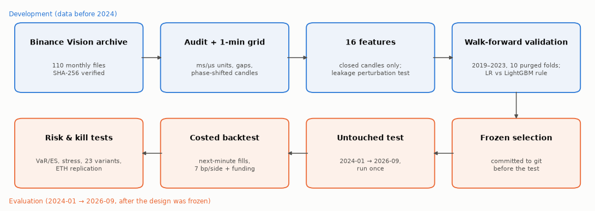
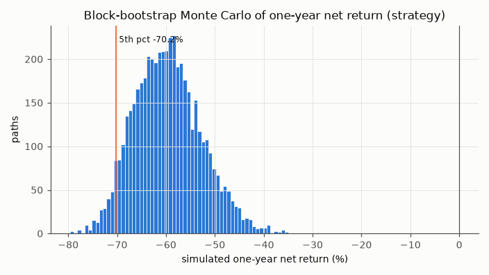
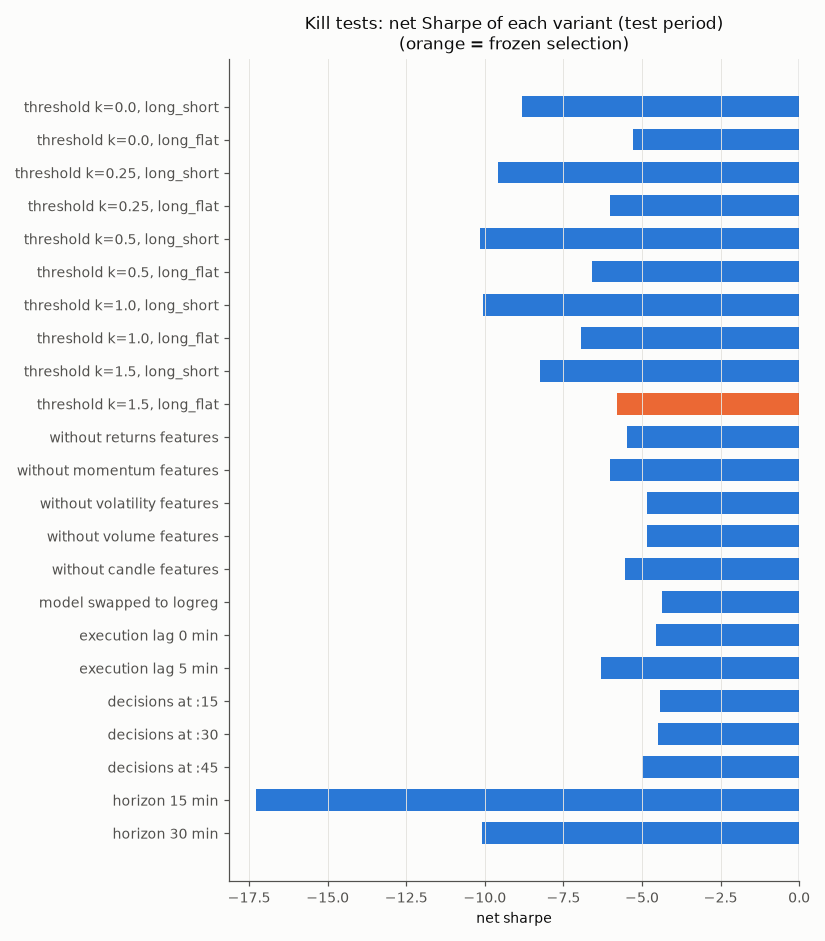
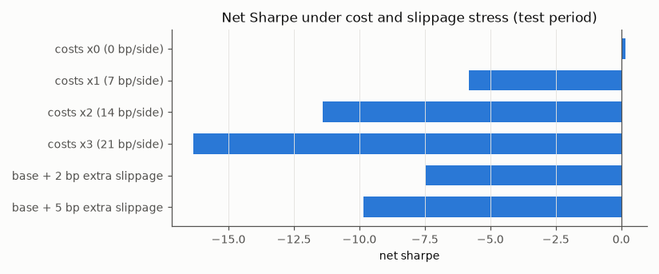

# Quantitative Market Signal Research & Portfolio Risk Analysis

**Out-of-Sample BTCUSDT Directional Prediction, Trading-Cost Analysis, Robustness Testing and Risk Evaluation**

Kudrati Khoda · M.Tech Quality, Reliability & Operations Research · Indian Statistical Institute, Kolkata · October 2026

# 1. Executive Summary

This project asks a narrow question: can information available at a given hour predict whether the BTCUSDT price will be higher or lower one hour later, and is that prediction worth anything once realistic trading costs are paid?

The data are 4,789,279 one-minute spot candles from Binance's public archive, covering August 2017 to September 2026. All 110 monthly files were verified against Binance's SHA-256 checksums. The study design (target, features, models, validation scheme, cost model and the rule for classifying the final result) was committed to git before any data was downloaded. Model and threshold choices were made on a purged, expanding walk-forward over ten half-year blocks from 2019 to 2023, frozen, and then evaluated once on an untouched test period from January 2024 to September 2026.

On the test period the selected LightGBM model reached an AUC of **0.545** (block-bootstrap 95% CI 0.538–0.552) and a directional accuracy of 53.5% against a 50.5% base rate. The improvement in log-loss over a constant-probability benchmark is significant under Newey–West standard errors (one-sided p = 0.004), and a logistic-regression model trained on real labels beat all 200 label-shuffled refits (p = 0.005). The same frozen pipeline gave an AUC of 0.546 on ETHUSDT. What the model learned is a short-term reversal: hours that follow a rise are slightly more likely to be weaker, and vice versa.

The economic result is the opposite. Trading the signal hourly with a 7 bp per-side cost (a 5 bp taker fee plus 1 bp each of assumed half-spread and slippage) and actual funding payments, the frozen strategy lost **92.2%** over the test period while buy-and-hold gained 97.6%. Its net Sharpe ratio was **−5.84** (95% CI −6.94 to −4.77). The gross edge per unit of turnover was only **0.19 bp per side**, about one thirty-seventh of the assumed cost. All 23 robustness variants and every stress scenario except zero cost lost money after costs.

The conclusion is that BTCUSDT contains a small, persistent and statistically detectable short-term reversal signal, but its economic magnitude is far below the cost of acting on it as a taker. Predictive accuracy did not translate into profitable trading. Under the pre-registered classification the result is **weak / inconclusive**: statistical evidence on the test period without positive net performance. The strategy should not be deployed, and the gap between the two answers is the main finding of the study.

# 2. Research Motivation

Short-horizon prediction in a liquid market is hard for a simple reason: anything easy to find has usually been traded away. When a signal does survive, it tends to be small relative to the noise in hourly returns, which for Bitcoin have a standard deviation of about 0.76% and excess kurtosis near 38. Detecting such a signal requires a large sample, honest out-of-sample testing, and statistics that respect the dependence between neighbouring hours.

Detection is not the end of the problem. A classifier can rank hours better than chance and still lose money, because profitability depends on the size of the moves it gets right relative to the ones it gets wrong, on how often it trades, and on what each trade costs. The measures used to judge models (AUC, log-loss, accuracy) say nothing about those quantities. Backtests that ignore execution timing or costs, or that tune parameters on the evaluation period, routinely turn noise into apparent profit. Much of the effort in this project therefore went into making the evaluation hard to fool: pre-registration, closed-candle features, a one-minute execution delay, purged walk-forward validation, a single untouched test, explicit costs and funding, and a set of deliberate attempts to break the result.

The question is relevant to prediction markets as well as to conventional trading. Hourly "Bitcoin Up or Down" contracts on platforms such as Polymarket settle, according to their published rules, on the Binance BTC/USDT one-hour candle, so any directional edge in such contracts would ultimately have to come from the underlying market studied here. This project, however, studies **only BTCUSDT (and ETHUSDT) exchange data**. No prediction-market prices, order books, fills or wallet data were used, and nothing in this report should be read as a prediction-market trading result.

This work extends an earlier credit-risk project on LendingClub loans (probability-of-default modelling, out-of-time validation, expected-loss estimation and Monte Carlo portfolio stress testing). The two share a framework — predict a probability, validate it out of time, check calibration and drift, then quantify the tail — and the market study applies that framework to a faster and more adversarial setting.

# 3. Research Question and Pre-Registration

The pre-registered research question was:

> *Can information available at time t predict the direction of the next 60-minute BTCUSDT return out of sample, well enough to beat no-skill and make money after realistic trading costs?*

The design was written in `reports/research_design_preregistration.md`, with every tunable parameter in `src/config.py`, and committed (commit `b312d58`) before any market data had been downloaded. Later changes are recorded in a dated deviation log; none of them altered the target, features, models, selection rule or test period.

**Timing.** Decisions are made on the hour (UTC) using only one-minute candles that have closed by then. A position is entered at the open of the candle starting one minute later and exited at the open of the candle starting 61 minutes after the decision. The one-minute delay avoids trading at the same price that produced the signal, which would capture bid-ask bounce rather than a tradable effect.

**Target.** The label is 1 if ln(Open(*t*+61) / Open(*t*+1)) > 0 and 0 otherwise. One decision per hour with a one-hour hold means consecutive labels never overlap, so every observation is a separate event. Direction was preferred to a regression on returns because one-hour returns are heavy-tailed; return magnitude still enters through the backtest.

**Periods.** Data before 2024 form the development set; model fitting and every choice (regularisation, LightGBM configuration, threshold and position mode) were made on ten six-month validation blocks from 2019H1 to 2023H2. The period from 1 January 2024 to 30 September 2026 was held back and evaluated once, after the selection had been frozen and committed (`231634d`). The experiment log contains exactly one test-period entry.

**Costs.** The base cost is 7 bp per side: the 2026 Binance USD-M taker fee (5 bp), plus 1 bp half-spread and 1 bp slippage, which are assumptions because the archive contains no order book. Actual funding payments are applied to positions held across funding times. Cost multiples of 2 and 3, extra slippage of 2 and 5 bp, and a spot-fee variant were specified as stress scenarios in advance.



# 4. Dataset

The data are Binance Vision spot klines for BTCUSDT at one-minute frequency: 110 monthly zip archives from August 2017 to September 2026 (235 MB). Each archive was downloaded together with Binance's `.CHECKSUM` file and accepted only if its SHA-256 hash matched; every download is recorded in a manifest with its URL, size, hash and time. Each row gives the open, high, low and close price, base and quote volume, the number of trades, and the volume bought by aggressive (taker) buyers. USD-M perpetual funding rates (81 files) were downloaded for the cost model, and ETHUSDT (110 files) for replication.

**Table 1.** Dataset summary.

| Item | Value |
|---|---|
| Source | Binance Vision public archive, spot BTCUSDT 1-minute klines (CC BY-NC-SA 4.0) |
| Period | 2017-08-17 04:00 → 2026-09-30 23:59 UTC |
| Files | 110 monthly archives; 110/110 checksums verified |
| Raw rows | 4,789,279 candles |
| Regular one-minute grid | 4,797,840 minutes; 30,163 missing (0.63%) in 33 gaps |
| Hourly decisions | 79,964 (78,522 with complete features and label) |
| Development / test usable hours | 54,427 (2017–2023) / 24,095 (2024-01 → 2026-09) |
| Additional data | USD-M funding rates (81 files); ETHUSDT 1-minute (110 files) |

The raw archives are not redistributed with the project, because the Binance Vision licence does not permit it. The repository instead contains the download and verification code, a data README with exact instructions, and reference manifests listing the SHA-256 hash of every file used.

# 5. Data Quality and Leakage Prevention

The raw files were combined without any cleaning and then audited (`src/quality.py`). Treatment rules were written before the audit: exact duplicates keep one copy, conflicting duplicates and physically impossible candles become missing, missing minutes stay missing, and extreme but internally consistent candles are kept.

**Table 2.** Data-quality audit (BTCUSDT).

| Check | Finding | Treatment |
|---|---|---|
| Schema, types, missing cells | As expected; 0 missing cells | — |
| Duplicate rows / conflicting timestamps | 0 / 0 | — |
| Impossible candles (high < low, price outside range, VWAP outside range) | 0 | — |
| Timestamp units | 89 files in milliseconds, 21 files (2025-01 onward) in microseconds | Unit detected per file |
| Candles off the minute grid | 21,602 (Dec 2017 and Feb 2018) | Treated as missing |
| Truncated candles (close time ≠ open + 59.999 s) | 18, mostly at the edge of outages | Kept and reported |
| Missing minutes | 30,163 (0.63%); none in 2022 or 2024–2026 | Left missing; never filled |
| Zero-volume minutes | 24,003, all with zero trades (mostly 2017–18) | Kept |
| Moves or ranges above 3% in one minute | 408, matching known events (Mar 2020, May 2021, Nov 2022, Aug 2024, Oct 2025) | Kept |

Two findings deserve comment. First, Binance changed the timestamp unit of its spot archives from milliseconds to microseconds in January 2025. Reading one as the other places candles tens of thousands of years in the future or in 1970, which would silently remove the test period. The loader infers the unit from the magnitude of each file's values and refuses to guess when neither range fits.

Second, between 4 and 18 December 2017, 20,401 candles start 20.799 seconds after the minute, and in February 2018 another 1,201 start 14.789 seconds after it; the same pattern appears in the ETHUSDT archive. The obvious fix, flooring these timestamps onto the minute, would be a leak: a candle that really closes at 06:01:20.8 would be treated as closed at 06:01:00, so a feature computed "at 06:01" would contain 20.8 seconds of the future. Snapping forward would avoid that but would be a new rule invented after seeing the data. The pre-registered rule (the grid is defined by open time) therefore applies, and those minutes are missing. The cost is about 2.3 weeks of 2017–18 training data; validation and test are unaffected.

Missing minutes are never forward-filled or interpolated. Forward-filling invents a flat market and biases volatility downward; interpolation uses the price after the gap to fill it. Instead, a rolling feature is computed only if at least 90% of its window is present, and decision hours that fail this are dropped: 1,442 of 79,964, all in 2017–2023 except the test period's final hour, which has no exit price yet.

Leakage was tested directly on the real data. At 24 randomly chosen decision times, every price and volume at or after the decision time was replaced with random values and the features were recomputed. **None of the 16 features changed at any of the 24 times**, while the target changed every time, confirming that the perturbation reached the future. Feature scaling is fitted inside each training window, and training labels that would overlap the next evaluation block are purged.

# 6. Feature Engineering

Sixteen features were specified in advance, all scale-free so that the model sees the same quantities at a price of $4,000 and $100,000. Every window ends at the candle that closes exactly at the decision time.

* **Recent returns:** log returns over the last 1, 5, 15, 30 and 60 minutes.
* **Momentum:** 4-hour and 24-hour log returns, and the log distance of the price from its 24-hour moving average.
* **Volatility:** realised volatility over 60 minutes and over 24 hours (both from one-minute returns), their log ratio, and the last hour's high–low range relative to 24-hour volatility.
* **Volume and order flow:** last-hour volume relative to its 7-day hourly average, the change in volume from the previous hour, and taker-buy imbalance, (2 × taker-buy volume − volume) / volume.
* **Candle position:** where the last price sits within the last hour's high–low range.

Features are computed on the one-minute grid and then shifted by one minute, so the value attached to decision time *t* comes from the candle that opened at *t* − 1 minute and closed at *t*. Unit tests check this alignment, the execution lag of the target, the backward-looking windows and the absence of filling.

On development data, 14 of the 16 features have a block-bootstrap Spearman correlation with the next-hour return that survives Holm correction. With 55,000 observations a correlation of 0.02 is detectable, so significance alone means little; the sign pattern is more informative and is discussed in Section 10.

# 7. Modeling

Two model families were compared against a constant base-rate benchmark. Logistic regression (standardised features inside a scikit-learn pipeline, L2 penalty, C ∈ {0.01, 0.1, 1}) is the reference: it has seventeen parameters, is stable, and its probabilities are easy to interpret. LightGBM (two small, heavily regularised configurations, the larger with 15 leaves and at least 1,000 observations per leaf) was included to test whether non-linear effects or interactions add anything.

A more flexible model was allowed to replace the simpler one only under a rule fixed in advance: LightGBM had to improve mean validation AUC by more than 0.005 **and** achieve lower log-loss than logistic regression in at least 70% of the validation folds. In financial data a small validation advantage is easily noise, and the cost of a more complex model (instability, harder diagnosis, more ways to overfit) is real.

**Table 3.** Validation results, ten folds 2019–2023 (`reports/tables/validation_models.csv`).

| Model | Pooled AUC | Mean fold AUC | Log-loss |
|---|---|---|---|
| Base rate | 0.496 | 0.500 | 0.69308 |
| Logistic regression, C = 0.01 | 0.557 | 0.560 | 0.68828 |
| Logistic regression, C = 0.1 / 1.0 | 0.557 | 0.560 | 0.68830 |
| LightGBM, 7 leaves, 200 trees | **0.565** | **0.566** | **0.68720** |
| LightGBM, 15 leaves, 400 trees | 0.563 | 0.563 | 0.68856 |
| Sign of last-hour return (rule) | 0.453 | — | — |
| Sign of last-day return (rule) | 0.475 | — | — |

Logistic regression was insensitive to its regularisation strength, a sign that the signal is simple. The smaller LightGBM improved mean fold AUC by +0.0064 and had lower log-loss than logistic regression in exactly 7 of 10 folds, so it passed the rule at the threshold and was selected. The selection is therefore marginal, and I treat it as such: one fold the other way and logistic regression would have been chosen. The trading threshold and position mode were then chosen on the same validation predictions (Section 11), and the whole selection was written to `reports/selection.json` and committed before the test was run.

# 8. Validation Methodology

Random K-fold cross-validation is inappropriate here. It would train on later years and test on earlier ones, and it would place neighbouring hours, which share the same volatility regime, on both sides of the split. Both effects overstate skill.

The development period was instead evaluated with an expanding walk-forward design. For each of ten six-month blocks from 2019H1 to 2023H2, the model was trained on all usable data from August 2017 up to the start of the block and evaluated on the block. Training sets grew from 12,043 to 51,451 hours, with roughly 4,400 evaluation hours per block. Any training row whose label window ended after the start of the block was purged; with one-hour labels this removes the 23:00 decision before each block boundary, but the rule guarantees that no training label overlaps evaluation data. A hard check stops the validation stage if any fold touches 2024.

The test period was handled in the same way: the frozen model was refitted every six months on all earlier data and evaluated on the next block, giving six blocks from 2024H1 to a three-month 2026H2.


# 9. Final Out-of-Sample Results

**Table 4.** Test-period predictive results (2024-01-01 → 2026-09-30; `reports/results.json`).

| Measure | BTCUSDT | ETHUSDT (same frozen design) |
|---|---|---|
| Test hours | 24,095 | 24,095 |
| AUC (block-bootstrap 95% CI) | **0.545 (0.538–0.552)** | 0.546 (0.538–0.554) |
| Accuracy / base-rate accuracy | 53.5% / 50.5% | 53.3% / 50.8% |
| Log-loss gain vs base rate, Newey–West t (one-sided p) | 2.65 (0.004) | 4.21 (< 0.001) |
| Label-permutation test, 200 refits (logistic regression) | real 0.540 vs null 95th pct 0.523; p = 0.005 | — |
| Rank correlation of score with next-hour return | 0.065 | 0.059 |

The confidence interval for AUC was obtained with a stationary block bootstrap (mean block length one week) so that clusters of volatile hours are resampled together; its lower end is clearly above 0.5. The log-loss test uses Newey–West standard errors for the same reason. The permutation test was run with logistic regression for computational reasons, so it shows that a real-label model on these features beats label noise; with 200 permutations, 0.005 is the smallest attainable p-value. AUC exceeded 0.53 in every half-year of the test.

These numbers describe a signal that is statistically detectable but economically weak. An AUC of 0.545 means the model ranks a randomly chosen up-hour above a randomly chosen down-hour 54.5% of the time; it is not a high accuracy and should not be described as strong prediction.


# 10. What the Model Learned

The signal is a short-term reversal. On development data, every return feature from 5 minutes to 24 hours has a negative rank correlation with the next-hour return (between −0.022 and −0.074), as do closing near the top of the last hour's range (−0.077), distance above the 24-hour average (−0.038) and taker-buy imbalance (−0.036). The 30-minute and 4-hour correlations were negative in all 13 development half-years. Rules that bet on continuation have AUC below 0.5 (0.453 for the last hour, 0.475 for the last day), which is the same effect seen from the other side. In the LightGBM model that traded the final test block, the four largest gain shares belonged to the 4-hour return (19.7%), the 1-hour return (15.9%), candle position (12.0%) and the 15-minute return (10.5%).

Volatility and volume features behave differently. Volume predicts the size of the next move much better than its direction (rank correlation 0.18 with the next hour's absolute return, 0.012 with its signed return), and volatility features carry small positive correlations. The model therefore learns *which way* the next hour is slightly more likely to go, not *how far*. Plausible explanations for the reversal include liquidity provision after one-sided bursts of aggressive flow, but this study does not test them.

The economically relevant view is the average next-hour return within each decile of predicted probability. It ranges only from −1.3 bp to +1.9 bp. Even the most confident decile does not move enough to pay for a round trip.


# 11. Trading Strategy and Backtest

The model outputs a probability that the next hour is up. A position is taken only when that probability is far enough from one half: long if p > 0.5 + k·s, where s is the standard deviation of the model's own predictions on its training window, and flat otherwise. Scaling by s matters because regularised models compress probabilities into a narrow band, so a fixed threshold such as 0.55 would mean different things in different folds. The grid k ∈ {0, 0.25, 0.5, 1, 1.5} × {long/short, long/flat} was evaluated on the validation blocks. Every one of the ten combinations lost money after costs in validation (pooled net Sharpe between −3.9 and −7.2, with positive gross Sharpe in all of them); the pre-registered rule selected the least negative, k = 1.5 with long/flat positions. The economic answer was therefore already negative before the test was run; the test was still carried out, as planned, to obtain an unbiased estimate.

The backtest is event-based. Each decision row records the decision time, entry at the next minute's open, exit at the open 60 minutes later, the position, the change in position, costs and funding. Costs are charged on the absolute change in position, so holding a position into the next hour costs nothing extra, while opening and closing a one-hour trade costs 14 bp. If an hour is missing, an open position is closed rather than carried across the gap. Position size is a constant one unit of notional with no leverage.

**Table 5.** Backtest economics, test period (`reports/results.json`, `test_benchmarks.csv`).

| | Frozen strategy | Buy and hold | Sign of last hour |
|---|---|---|---|
| Net cumulative return | **−92.2%** | +97.6% | −100.0% |
| Net Sharpe (95% CI) | **−5.84 (−6.94, −4.77)** | 0.76 | −14.48 |
| Gross Sharpe | 0.16 | 0.76 | −0.94 |
| Maximum drawdown | −92.3% | −53.7% | −100.0% |
| Time in market | 9.1% | 100% | 100% |
| Round trips per year | 667 | ≈ 0 | 4,585 |
| Win rate of hours in market | 49.3% | 50.5% | 38.3% |
| Profit factor | 0.74 | 1.03 | 0.62 |
| Sum of gross returns / costs / funding | +7.0% / −256.8% / −1.5% | — | — |

Sharpe ratios are computed from hourly returns, annualised with 8,766 hours per year and a zero risk-free rate; the strategy's interval comes from a block bootstrap. The strategy was long 9.1% of the time and made about 667 round trips a year. Before costs it earned 7.0% in total over 2.75 years; costs consumed 256.8% of notional. Dividing gross return by total turnover gives a **break-even cost of 0.19 bp per side** (0.15 bp including funding), against an assumed 7 bp. A $100,000 order would also have been about 12% of the median traded value in the execution minute, so the 1 bp slippage assumption is, if anything, optimistic.


# 12. Why Prediction Did Not Become Profit

AUC measures how well a model ranks outcomes. It is indifferent to the size of the returns being ranked. A trading strategy, by contrast, is paid the return it captures minus what it spends to capture it, and that depends on the magnitude of the moves, the frequency of trading, the fee, the spread, slippage, funding and the timing of execution.

A simple calculation shows the scale of the gap. If a long position is right with probability p and the average absolute hourly move is E|r|, its expected gross return is roughly (2p − 1)·E|r|. In the test period E|r| was 32.4 bp (against 49.0 bp in the more volatile development period). Covering a 14 bp round trip would require (2p − 1)·32.4 > 14, that is p > 0.72. The model's most confident decile averaged a predicted probability of 0.60 and an observed up-rate of 0.564, which corresponds to an expected edge of about 4 bp, and the realised mean return in that decile was under 1 bp.

Several observations confirm that costs, not prediction quality, decide the outcome. With zero costs the frozen strategy is marginally profitable (net Sharpe +0.16). Randomly flipping half of its positions, which removes all directional information while keeping the same trading frequency, changes the net Sharpe only from −5.8 to about −6.6. Variants that trade more often do worse, regardless of their AUC: the 15-minute horizon reaches a gross Sharpe of 2.47 but a net Sharpe of −17.3. And the always-in-market long/short version, with the highest gross Sharpe of any threshold (2.05), has a net Sharpe of −8.8.

This is the central lesson of the project. Statistical significance answers whether an effect is distinguishable from zero; with 24,000 observations, a very small effect is. Economic significance asks whether the effect is larger than the cost of exploiting it. Here it is about an order of magnitude smaller.

# 13. Risk Analysis

Risk was measured on daily strategy returns, compounded from the hourly results over 1,004 test days.

**Table 6.** Risk metrics, test period (`risk_var_es_daily.csv`, `risk_kupiec.csv`, `risk_bootstrap_mc.csv`).

| Measure | Strategy | Buy and hold |
|---|---|---|
| 1-day VaR 95% / ES 95%, historical | 1.72% / 2.81% | 3.65% / 5.11% |
| 1-day VaR 99% / ES 99%, historical | **3.53% / 4.54%** | 6.14% / 7.59% |
| 1-day VaR 99%, normal | 2.18% | 5.61% |
| Kupiec test, rolling 250-day VaR (exceptions vs expected; p) | 95%: 33 vs 37.7 (0.42); 99%: 9 vs 7.5 (0.60) | — |
| Block-bootstrap Monte Carlo, 5,000 one-year paths | median −60.0%; no path profitable; median max drawdown −60.4% | — |
| Maximum drawdown | −92.3% (Jan 2024 peak, never recovered) | −53.7% |

The historical 99% VaR is about 60% larger than the value implied by a normal distribution, a direct measure of fat tails. A Student-t fit was attempted but was degenerate for the strategy (1.2 degrees of freedom) because most days carry little exposure, so it is not reported. A rolling historical VaR forecast, using only the previous 250 days, passes the Kupiec proportion-of-failures test at both levels; that validates the risk measurement, not the strategy. The Monte Carlo resamples blocks of the strategy's own daily returns (mean block length ten days) so that fat tails and volatility clustering are preserved without assuming a distribution. It replays the test-period behaviour; it is not a forecast of the market, and it cannot generate a crisis that did not occur. For that, the stress tests in the next section are used.



# 14. Robustness and Kill Tests

After the test result was recorded, the frozen design was deliberately attacked to see whether either conclusion — that the signal exists, or that it does not pay — depended on a particular choice. The variants were specified in the pre-registration and are reported in full; none was used to change the selection.

**Table 7.** Robustness variants on the test period (`robustness_variants.csv`).

| Variant group | Variants | AUC | Net Sharpe | Gross Sharpe |
|---|---|---|---|---|
| Thresholds and position modes | 10 (k = 0 … 1.5 × long/short, long/flat) | 0.545 | −5.3 to −10.1 | 0.16 to 2.05 |
| Feature-group removal | 5 (returns, momentum, volatility, volume, candle) | 0.537–0.545 | −4.8 to −6.0 | 0.30 to 0.66 |
| Model swap to logistic regression | 1 | 0.540 | −4.35 | 1.41 |
| Execution lag 0 / 5 minutes | 2 | 0.548 / 0.539 | −4.57 / −6.31 | 1.41 / 0.35 |
| Decisions at :15, :30, :45 | 3 | 0.534–0.539 | −4.4 to −5.0 | 0.56 to 1.22 |
| Horizon 15 / 30 minutes | 2 | 0.538 / 0.536 | −17.27 / −10.10 | 2.47 / 1.26 |
| **All variants** | **23** | **0.534–0.548** | **23 of 23 negative** | 23 of 23 positive |

**Stress scenarios** (same frozen positions, `stress_*.csv`): costs ×0 gives net Sharpe +0.16; costs ×2 and ×3 give −11.4 and −16.3; extra slippage of 2 and 5 bp gives −7.5 and −9.9; doubling every price move with the same signals gives −2.9 while doubling daily VaR to 6.5%; flipping 10%, 25% or 50% of positions at random gives −6.0 to −6.6 with no positive run in 200 simulations each. The strategy lost money in high-, mid- and low-volatility regimes (worst in calm markets, −7.8) and in trending and range-bound markets. On the ten worst BTC days of the test it was usually flat, but on 5 August 2024 it was long and lost 7.2% against BTC's 6.9%, a reminder that a reversal strategy buys into falling prices. A hypothetical −10% gap while long would cost 2.8 times the daily 99% VaR. A pre-registered spot-trading variant (10 bp fee, no funding), run later by re-pricing the frozen positions, gives a net Sharpe of −9.86.

Two things are robust: the predictive signal (AUC between 0.534 and 0.548 everywhere) and its economic failure (negative net Sharpe everywhere). Several variants looked better before costs than the frozen strategy, and one or two lost a little less after costs, but adopting any of them now would be selection on the test set.





# 15. ETH Replication

To check whether the reversal is specific to BTCUSDT, the identical pipeline — the same features, the same LightGBM configuration, the same threshold and position mode, the same dates — was run on ETHUSDT with no re-tuning. The ETH data passed the same audit (including the same phase-shifted stretches) and the same leakage test.

The test-period AUC was 0.546 (95% CI 0.538–0.554), essentially the same as for BTC, with a similar pattern across half-years (0.572 in 2024H2, then between 0.528 and 0.541). Economically, ETH was worse: a net Sharpe of −3.70 and a gross Sharpe of −0.52, so it lost even before costs. Funding was not applied for ETH.

Replication on a second major market makes it less likely that the BTC result is an accident of one series or of overfitting to it. It is not independent evidence in a strict sense — BTC and ETH trade on the same venue, with overlapping participants, and are highly correlated — and it does nothing to make the strategy profitable.

# 16. Regime Drift

Predictive performance was not constant over the test period. AUC was 0.558 and 0.567 in the two halves of 2024 and between 0.532 and 0.536 in every block afterwards. Over the same period the inputs moved away from the distribution the model was trained on. The population stability index of 24-hour realised volatility, measured against the development period, rose from 0.39 in 2024H1 to 1.39 in 2025H2 and 3.51 in 2026H2 (values above 0.25 are conventionally treated as a large shift). In 2026H2, 37.5% of hours had lower 24-hour volatility than the 10th percentile of the development period, and the median hourly volatility was 0.35% against 0.61% in development. Taker-buy imbalance drifted as well (PSI from 0.04 to 0.37).

Performance decay coincided with substantial feature drift. That is consistent with a model calibrated on a more volatile market expecting a stronger reversal than now exists, and with the effect itself weakening as the market matured. The data do not distinguish these explanations, and drift has not been shown to cause the decay. The practical implication is that raw volatility features are fragile across regimes; volatility-normalised features would be a natural change in a future study, under a new pre-registration.


# 17. Limitations

* **Two assets on one venue.** Only BTCUSDT and ETHUSDT on Binance were studied, at one main horizon (with 15- and 30-minute checks).
* **Costs are partly assumed.** The 5 bp fee is taken from Binance's published schedule; the 1 bp half-spread and 1 bp slippage are assumptions, because the archive contains no historical order book. The break-even cost of 0.19 bp is below the fee alone, so this does not affect the conclusion, but liquidity-aware execution was not modelled.
* **Spot prices proxy perpetual execution.** Short positions and funding assume the USD-M perpetual; the spot–perpetual basis is not modelled. The frozen strategy happens to be long/flat.
* **No prediction-market data.** No Polymarket order-book, fill, price or wallet data were used. During the study an exploratory, non-pre-registered comparison of the model's top-decile calls against the hourly settlement event was tabulated, but the code that produced it is not part of the repository and no contract prices were observed; it plays no role in any result reported here.
* **No live trading.** This is research on historical data. There is no live or paper deployment and no production execution infrastructure.
* **Marginal model selection.** LightGBM passed the selection rule exactly at the threshold, and on the test it lost more than logistic regression would have. A future design should include an economic criterion in model selection.
* **Data licensing.** The Binance archives cannot be redistributed, so reproduction requires downloading them; reference checksums make the exact files verifiable.
* **Earlier credit-risk module.** Its numbers come from the original report: the LendingClub data are not redistributed, the notebook has no saved outputs, and the LightGBM credit challenger mentioned in that report has no code in the repository and is not reproducible.

# 18. Reproducibility

The market study can be reproduced from public data with the code in the repository. All random processes are seeded (seed 42) and LightGBM runs in deterministic mode. The pipeline is run in stages, each writing its tables to `reports/tables/`, its figures to `figures/` and its key numbers to `reports/results.json`; the test stage refuses to run unless the frozen `reports/selection.json` exists.

```
python -m venv .venv && source .venv/bin/activate       # Windows: .venv\Scripts\activate
pip install -r requirements.txt
python -m pytest -q                                       # 26 tests

python -m src.data download --symbol BTCUSDT --funding    # 110 klines + funding, SHA-256 verified
python -m src.data build --symbol BTCUSDT
python -m src.data download --symbol ETHUSDT
python -m src.data build --symbol ETHUSDT
python scripts/verify_checksums.py                        # compare with the study's reference hashes

python scripts/run_pipeline.py --stage all                # audit -> robustness, about 10 minutes
python scripts/run_pipeline.py --stage second_asset       # ETH replication
python scripts/run_spot_fee_check.py                      # pre-registered spot-fee variant
```

Expected outputs include `reports/selection.json` (LightGBM configuration 1, k = 1.5, long/flat), a test AUC of 0.5448 and net Sharpe of −5.841 in `reports/results.json`, and 23 robustness rows, all with negative net Sharpe. Two caveats apply. Re-running the validation and test stages creates a new experiment record; the evidence that the original test was run once lives in the git history. And Binance could revise archive files in future; the reference manifests would detect this. A synthetic end-to-end run (`scripts/smoke_test_synthetic.py`) exercises every stage on generated data in a temporary folder without touching any result.

| Component | Reproducible from public data? |
|---|---|
| Market study (BTCUSDT, ETHUSDT, funding), all tables and figures | Yes |
| Credit-risk logistic model | Code present; requires the LendingClub file (Kaggle account) |
| Credit-risk LightGBM challenger | No — code not available |

# 19. Relevance to Gravia

**Table 8.** How the project relates to the role.

| Requirement | Evidence in this project |
|---|---|
| Alpha discovery and hypothesis testing | Five pre-registered hypotheses with pass/fail criteria; a reversal effect found, regime dependence rejected, economic value rejected |
| ML that trades | Probability → threshold → position → event-level backtest with costs and funding; the decision it supports is not to trade |
| Scepticism toward backtests | Design committed before data; leakage perturbation test; purged walk-forward; one untouched test; every trial logged; 23 kill tests |
| Messy, multi-million-row data | 4.79M one-minute rows per asset; unit change, phase-shifted candles, gaps and thin-market minutes handled by written rules |
| Statistical intuition | Block-bootstrap intervals, Newey–West tests, Holm correction, permutation and Deflated Sharpe; distinguishing significance from size |
| Understanding why a model works or stops working | Reversal identified from feature signs; decay over 2024–26 linked to measured feature drift without overclaiming causality |
| Backtest and risk analysis | Break-even cost, capacity check, VaR/ES with Kupiec backtest, block-bootstrap Monte Carlo, stress tests |
| Python and pandas | A 13-module pandas pipeline with 26 tests and a staged runner |
| Crypto exposure | Binance BTC and ETH spot data and USD-M funding rates |

The project does **not** demonstrate on-chain or wallet analysis, prediction-market order-book or fill analysis, SQL, Polars or ClickHouse, live or high-frequency execution, or production trading.

# 20. Final Conclusion

The study found evidence of a small and persistent short-term reversal signal in the direction of hourly BTCUSDT returns. It held on an untouched 2.75-year test period, on a second asset with no re-tuning, and in every robustness variant. However, the economic value of the signal was far too small to overcome realistic transaction costs: the edge was about 0.19 bp per trade side against roughly 7 bp of cost, and the frozen strategy lost 92% while buy-and-hold gained 98%. The result therefore supports the existence of predictive information without supporting deployment of the tested strategy.

Future work, which has not been done here, would require direct prediction-market order-book and fill data, wallet-level behaviour, liquidity-aware execution modelling, and a new pre-registered research design evaluated on data collected after September 2026.
