# CoxKAN: Interpretable Time-to-Event Modelling of Customer Attrition

*LendingClub consumer loans (2016 vintage, 50,000-loan sample) · CoxKAN vs. CoxPH vs. DeepSurv*

> **How to use this report (one-day prep).** Read §1 (summary) and §2 (framing) first — they are what you say in the first two minutes of an interview. Then §3–4 (theory) until you can explain each formula aloud, §5 (data) for the "tell me about your data" questions, §7–8 (results and interpretation) for the numbers, and finally §11 (interview Q&A). A suggested schedule is in §12.

## 1. Executive summary

| | |
|---|---|
| **Business question** | *When* is a customer likely to end the relationship, and *why*? |
| **Data** | LendingClub accepted-loans file, 2016 origination vintage, deterministic sample of **50,000 loans**, observed until the March 2019 snapshot (up to 38 months on book) |
| **Attrition event** | the customer **prepays** the loan, i.e. pays it off ≥ 3 months before maturity, which ends the relationship and the interest income. 45.5% of loans prepaid; 54.5% are right-censored |
| **Feature pipeline** | 3 SQL scripts (DuckDB): cohort extraction → survival table (duration, event, censoring reason) → feature engineering (ratios, parsing, window functions). 34 model inputs, all known at origination |
| **Models** | **CoxPH** (linear), **DeepSurv** (MLP), **CoxKAN** additive `[d,1]` and `[d,4,1]` (KAN with cubic B-spline activations), all trained with the Cox partial likelihood |
| **Headline result** | Test C-index: CoxPH **0.614**, CoxKAN-additive **0.615**, CoxKAN `[d,4,1]` **0.617**, DeepSurv **0.620**. Every model beats the no-covariate Kaplan–Meier baseline on Brier score (IBS 0.169–0.170 vs 0.180) |
| **Interpretability result** | The additive CoxKAN matches CoxPH's accuracy but shows every feature's effect as a curve. It reveals non-linear effects (FICO, income, loan amount, revolving utilisation) that CoxPH forces into straight lines, and it can be distilled into a **closed-form formula** (test C 0.6147 vs 0.6153 for the spline model) |
| **Top 5 attrition drivers** | **loan term** (60-month loans prepay much more slowly; HR 0.78 per SD), **open-account ratio** (HR 0.84), **interest rate** (HR 1.17: a refinancing incentive), **revolving utilisation** (HR 0.87), and **credit-history length** (HR 0.89) or **new accounts in the past 24 months** (HR 1.11). The top 4 are identical across CoxPH, CoxKAN and DeepSurv permutation importance |
| **Retention use** | CoxKAN risk quintiles separate cleanly on unseen data. The highest-risk 20% retain only **46%** of customers at 24 months vs **78%** for the lowest-risk 20%, and 24-month predictions are well calibrated |

**One-sentence pitch:** *"I framed churn as a time-to-event problem with censoring, built the feature pipeline in SQL, and showed that a Kolmogorov–Arnold-network Cox model matches classical CoxPH and comes close to a black-box DeepSurv on C-index, while letting me plot and even write down in closed form how each customer attribute moves the attrition hazard."*

## 2. Problem framing: what "churn" means for a lender

In retail lending a customer's relationship is a loan. The bank earns interest month after month. The relationship ends in one of three ways:

1. **Prepayment.** The customer repays early, often by refinancing elsewhere at a lower rate. The bank loses all future interest. This is **voluntary attrition** (churn), and in lending the monthly prepayment rate is a standard risk metric (SMM/CPR).
2. **Default / charge-off.** An involuntary exit. This is credit risk, a different problem with a different owner.
3. **Maturity.** The contract runs its full course. That is not churn.

So the **event of interest is prepayment**, measured in **months on book** from origination. Loans that have not prepaid by the end of observation are **right-censored**:

| Exit reason | Count | Share | Treatment | Median months observed |
|---|---:|---:|---|---:|
| prepaid ≥ 3 months early (**churn**) | 22,765 | 45.5% | **event** (e = 1) | 17 |
| still active at the Mar-2019 snapshot | 16,213 | 32.4% | censored at snapshot | 31 |
| charged off / default | 7,788 | 15.6% | censored at last payment (competing risk, §3.8) | 14 |
| paid within 3 months of maturity | 3,234 | 6.5% | censored at exit (contract completed) | 36 |

**Why the 3-month threshold?** Customers often send the last one or two instalments together. Counting a payoff in month 35 of a 36-month loan as "churn" would label normal completion as attrition.

**Why the 2016 vintage?** It is the vintage with the best mix of outcomes at the 2019 snapshot. Older vintages have almost no censoring (everything has ended); newer ones have almost no events. One vintage also keeps the macro and pricing environment constant.

**Why a 50,000-loan sample?** It gives enough events (22,765) for stable estimates and fits comfortably in memory. It keeps the whole pipeline at a size that runs on a laptop in minutes. The sample is deterministic (`ORDER BY hash(id || seed)`), so it is reproducible.


## 3. Survival-analysis theory (what you must be able to explain)

### 3.1 Why survival analysis instead of binary classification?

A binary churn classifier answers *"will this customer churn within a fixed window (say 12 months)?"*. That framing has three problems:

1. **It throws away timing.** Churning in month 2 and churning in month 11 get the same label, but the business cost is very different.
2. **It cannot use censored customers correctly.** A customer who joined 4 months ago and is still active has *not* churned *yet*. Labelling them "0" (non-churner) is wrong; dropping them biases the sample toward old customers.
3. **It gives one number, not a curve.** Retention teams want *"what is the probability this customer is still with us at 6, 12, 24 months?"* so they can time an intervention.

Survival (time-to-event) analysis models the **time T until the event** and treats incomplete observations as **censored**: we know T is *greater than* the observed follow-up time, which is still information.

### 3.2 Core quantities

Let T ≥ 0 be the time to churn (here: months from loan origination to prepayment).

| Quantity | Definition | Meaning in this project |
|---|---|---|
| Survival function | S(t) = P(T > t) | probability the customer is still on the book after t months |
| Cumulative distribution | F(t) = 1 − S(t) | probability of having churned by month t |
| Density | f(t) = dF/dt = −dS/dt | |
| **Hazard function** | h(t) = lim_{Δt→0} P(t ≤ T < t+Δt ∣ T ≥ t)/Δt = f(t)/S(t) | instantaneous churn *rate* for customers who survived to t |
| Cumulative hazard | H(t) = ∫₀ᵗ h(u) du | total accumulated risk |
| Key identity | S(t) = exp(−H(t)) | links every quantity |

In discrete monthly data the hazard is simply **h(t) = (customers who churn in month t) / (customers still at risk at the start of month t)**. In lending this monthly prepayment hazard is literally called the **SMM (single monthly mortality)**, and its annualised version is the **CPR (conditional prepayment rate)**: CPR = 1 − (1 − SMM)¹².

### 3.3 Censoring

Each customer i contributes (tᵢ, eᵢ, xᵢ): observed time, event indicator (1 = churned, 0 = censored) and features.

* **Right censoring** (the only kind here): the true event time is beyond tᵢ. Causes in this data: the loan is still active at the data snapshot (administrative censoring), the loan ran to maturity, or the loan defaulted first.
* **Key assumption — non-informative (independent) censoring:** given x, the censoring time is independent of the event time. Administrative censoring satisfies this well. Censoring by *default* is a **competing risk** (see 3.8) and is the main caveat to discuss.

### 3.4 Non-parametric estimators

**Kaplan–Meier (product-limit) estimator of S(t):**

Ŝ(t) = ∏_{tⱼ ≤ t} (1 − dⱼ / nⱼ)

where dⱼ = events at time tⱼ and nⱼ = number at risk just before tⱼ. Censored subjects leave the risk set without counting as events. Variance via Greenwood's formula: Var[Ŝ(t)] ≈ Ŝ(t)² Σ dⱼ / (nⱼ(nⱼ − dⱼ)).

**Nelson–Aalen estimator of H(t):** Ĥ(t) = Σ_{tⱼ ≤ t} dⱼ / nⱼ.

**Log-rank test:** compares survival curves of G groups. At each event time it compares observed events in each group, O_g, with expected events under H₀ (all groups share one hazard): E_g = Σⱼ dⱼ · n_{gj}/nⱼ. The statistic Σ (O_g − E_g)²/Var is χ² with G − 1 degrees of freedom. It is most powerful when hazards are proportional.

### 3.5 Cox proportional hazards model (CoxPH)

h(t ∣ x) = h₀(t) · exp(βᵀx)

* h₀(t) is an **unspecified baseline hazard** (semi-parametric: no distributional assumption about time).
* exp(βᵀx) scales it. The **log-risk / risk score** is r(x) = βᵀx.
* **Hazard ratio:** for a one-unit increase in xₖ with everything else fixed, HR = exp(βₖ). HR > 1 means faster churn, HR < 1 slower. Because features are standardised, our HRs are **per +1 standard deviation**.
* **Proportional hazards assumption:** h(t∣x₁)/h(t∣x₂) = exp(βᵀ(x₁ − x₂)) does not depend on t, i.e. curves for different customers never cross on the log-hazard scale.

**Partial likelihood (Cox 1972).** Given an event happened at time tᵢ, the probability that it happened to subject i rather than anyone else at risk is

Lᵢ(β) = exp(βᵀxᵢ) / Σ_{j ∈ R(tᵢ)} exp(βᵀxⱼ),    R(tᵢ) = { j : tⱼ ≥ tᵢ }

h₀(t) cancels! The partial log-likelihood is

ℓ(β) = Σ_{i: eᵢ=1} [ βᵀxᵢ − log Σ_{j ∈ R(tᵢ)} exp(βᵀxⱼ) ]

and is maximised by Newton–Raphson (it is concave). Censored subjects never appear in the numerator but do appear in risk-set denominators — that is how censoring is used correctly. Only the **ranking** of event times matters, which is why the C-index is the natural evaluation metric.

**Ties.** Our durations are integer months, so many events share a time. *Breslow* approximation (used in our PyTorch loss) uses the full risk set for all tied events; *Efron* (used by lifelines' CoxPH) partially removes tied subjects from the denominator and is more accurate with heavy ties.

**Baseline hazard (Breslow estimator):** Ĥ₀(t) = Σ_{tᵢ ≤ t} dᵢ / Σ_{j ∈ R(tᵢ)} exp(r̂ⱼ), then **Ŝ(t ∣ x) = exp(−Ĥ₀(t) · exp(r̂(x)))**. We use this for *all three* models, so any network that outputs a log-risk becomes a full survival-curve model.

**Checking PH — Schoenfeld residuals.** For each event and covariate, the residual is xᵢₖ − E[xₖ ∣ R(tᵢ)]. Under PH they show no trend against time; the Grambsch–Therneau test regresses them on (a transform of) time. Fixes when violated: stratify (separate h₀ per stratum), add x·g(t) interactions, or use a more flexible model.

**Penalisation.** lifelines' `penalizer` adds an L2 penalty ½λ‖β‖², which stabilises estimates when features are correlated.

### 3.6 DeepSurv (Katzman et al., 2018)

Replace the linear risk βᵀx by a neural network: h(t∣x) = h₀(t) · exp(g_θ(x)), where g_θ is an MLP. It is trained by minimising the **same negative Cox partial log-likelihood**, so it inherits proportional hazards *in the risk score* but allows **non-linear effects and interactions** of features. Our architecture: input → 64 → 32 → 1 with BatchNorm, SELU activations and dropout; the output layer has no bias (an intercept would be absorbed into h₀). Price: it is a black box — you need post-hoc tools (permutation importance, SHAP) to explain it.

### 3.7 Kolmogorov–Arnold Networks and CoxKAN

**Kolmogorov–Arnold representation theorem (1957).** Every continuous multivariate function on a bounded domain can be written as a finite composition of continuous *univariate* functions and addition:

f(x₁,…,xₙ) = Σ_{q=0}^{2n} Φ_q( Σ_{p=1}^{n} φ_{q,p}(x_p) )

So multivariate complexity can be reduced to learning 1-D functions plus sums.

**MLP vs KAN.**

| | MLP | KAN |
|---|---|---|
| Learnable parameters live on | nodes and edges: weights W are learned | **edges**: each edge has its own learnable function φ |
| Activation function | fixed (ReLU, SiLU) on nodes | **learned** univariate function on every edge |
| Node operation | σ(Wx + b) | plain sum Σᵢ φ_{j,i}(xᵢ) |
| Theory | universal approximation theorem | Kolmogorov–Arnold theorem |
| Interpretability | low | each φ can be **plotted** and often **replaced by a formula** |

**KAN layer (Liu et al., 2024).** A layer with n_in inputs and n_out outputs has n_in × n_out edge functions:

y_j = Σᵢ φ_{j,i}(xᵢ),      φ(x) = w_b · silu(x) + w_s · Σ_c c_c B_c(x)

* B_c are **B-spline basis functions** of order k (k = 3 → cubic) on a grid of G intervals; the coefficients c_c are learned. There are G + k basis functions per edge.
* The **silu residual** w_b·silu(x) works like a skip connection and helps optimisation.
* Parameter count per layer: n_in · n_out · (G + k + 2).

**B-splines (Cox–de Boor recursion).** With knots t₀ < t₁ < …:

B_{i,0}(x) = 1 if tᵢ ≤ x < t_{i+1}, else 0
B_{i,p}(x) = (x − tᵢ)/(t_{i+p} − tᵢ) · B_{i,p−1}(x) + (t_{i+p+1} − x)/(t_{i+p+1} − t_{i+1}) · B_{i+1,p−1}(x)

Properties worth saying in an interview: each cubic basis function is non-zero on only 4 knot intervals (**local support** — changing one coefficient changes the curve locally), they are non-negative and sum to 1 inside the grid (**partition of unity**), and the resulting curve is C² smooth. Grid size G trades flexibility against overfitting (G = 3 → very smooth; G = 20 → wiggly).

**Regularisation and pruning.** The KAN paper adds an L1 penalty on the mean absolute activation of each edge, |φ|₁ = mean_batch |φ(x)|, plus an entropy term; edges with tiny norm can be **pruned**. This drives the network toward a few active edges → a sparse, readable model.

**Symbolic regression.** After training, each learned φ is compared to a library of primitives f ∈ {x, x², x³, exp, log, tanh, sin, sigmoid} by fitting φ(x) ≈ a·f(b·x + c) + d. If R² is high, the spline is replaced by the formula, giving a **closed-form hazard model**.

**CoxKAN (Knottenbelt, Zeng & Liò, 2024)** = a KAN as the log-risk function in the Cox model:

h(t ∣ x) = h₀(t) · exp( KAN(x) ),     trained with the Cox partial likelihood (+ KAN sparsity regularisation).

* With width **[d, 1]** (no hidden layer) the log-hazard is **additive**: log h(t∣x) = log h₀(t) + Σᵢ φᵢ(xᵢ). This is a *Cox generalised additive model* whose shape functions are learned automatically — every feature's effect is a curve you can plot, and an interaction-free model is easy to audit (important for banking model-risk governance).
* With width **[d, h, 1]** the hidden layer creates interactions; it is more flexible but needs pruning to stay interpretable.
* Relationship to CoxPH: if every φᵢ were linear, φᵢ(xᵢ) = βᵢxᵢ, CoxKAN [d,1] **is** CoxPH. CoxKAN strictly generalises CoxPH and shows *where* the linearity assumption breaks.

### 3.8 Competing risks (the caveat to raise yourself)

A loan can end by **prepayment** (churn) or by **default** — two competing events; once one happens the other cannot. We model the **cause-specific hazard** of prepayment, censoring defaults. This is valid for estimating the *hazard* (and for ranking customers), but 1 − KM overstates the *cumulative incidence* of prepayment, because defaulters can no longer prepay. The rigorous alternatives are the **Aalen–Johansen cumulative incidence** estimator and the **Fine–Gray subdistribution hazard** model.

## 4. Evaluation metrics

### 4.1 Concordance index (Harrell's C)

Take all **comparable pairs** (i, j): the one with the shorter time must have had the event (tᵢ < tⱼ and eᵢ = 1). The pair is **concordant** if the model gives i the higher risk:

C = Σ_{comparable} [ 1(rᵢ > rⱼ) + ½·1(rᵢ = rⱼ) ] / #comparable

* C = 0.5 → random ranking, C = 1 → perfect ranking. It is the survival analogue of ROC-AUC.
* It measures **discrimination (ranking) only**, not calibration.
* Typical values: 0.60–0.70 is common and useful for behavioural events like churn/prepayment; > 0.8 usually happens only for strongly determined outcomes (or leakage!).

### 4.2 Uno's C-index

Harrell's C depends on the censoring distribution. Uno's C weights each comparable pair by the inverse probability of being uncensored, 1/Ĝ(tᵢ)², where Ĝ is the Kaplan–Meier estimate of the *censoring* distribution, and truncates at a horizon τ. It is a consistent estimator of a censoring-free concordance.

### 4.3 Brier score and Integrated Brier Score (calibration + discrimination)

At a horizon s, the Brier score is the mean squared error between the predicted survival probability Ŝ(s∣x) and the observed status, with **inverse-probability-of-censoring weights (IPCW)** (Graf et al. 1999):

BS(s) = 1/n Σᵢ [ 1(tᵢ ≤ s, eᵢ = 1) · Ŝ(s∣xᵢ)² / Ĝ(tᵢ⁻) + 1(tᵢ > s) · (1 − Ŝ(s∣xᵢ))² / Ĝ(s) ]

Subjects censored before s contribute 0 but are represented through the weights. **IBS** = (1/(s_max − s_min)) ∫ BS(s) ds. Lower is better; compare against the Kaplan–Meier (no-covariates) reference.

## 5. Data: source, SQL pipeline and dataset analysis

### 5.1 Source

LendingClub was a US peer-to-peer lender that published loan-level data. The public file `accepted_2007_to_2018Q4.csv` (on Kaggle as *All Lending Club loan data*; mirrored on Hugging Face) has one row per loan with 151 columns. They fall into four groups:

* **contract**: amount, term (36/60 months), interest rate, instalment, grade/sub-grade, purpose
* **borrower**: employment length, home ownership, annual income, income verification, state, DTI
* **credit bureau at application**: FICO range, credit-line history, delinquencies, inquiries, open/total accounts, revolving balance and utilisation, mortgage accounts, bankcard metrics
* **performance**: loan status, last payment date, total paid, recoveries, last FICO, …

**Leakage rule.** Only fields known **at origination** are used as features. Performance fields (`total_pymnt`, `recoveries`, `last_fico_range_*`, `out_prncp`, …) are excluded because they encode the outcome. `loan_status` and `last_pymnt_d` are used only to *construct the target*.

### 5.2 SQL pipeline (DuckDB)

| Script | What it does | SQL techniques |
|---|---|---|
| `sql/01_extract_cohort.sql` | Reads the raw CSV, keeps the 2016 vintage and valid statuses, selects 42 origination + outcome columns, draws a deterministic 50,000-row sample | CTE, `read_csv_auto`, filtering, `ORDER BY hash(id‖seed) LIMIT n` |
| `sql/02_build_survival_table.sql` | Parses dates; computes `end_date`, `duration_months`, the `event` flag and `exit_reason` | `strptime`, `datediff('month', …)`, `CASE` logic for censoring, `greatest`, `coalesce` |
| `sql/03_feature_engineering.sql` | Builds 30+ model features | type casting, regex parsing (`emp_length` → years), ratios with `nullif` guards, **window functions** |

Engineered features worth naming in an interview:

| Feature | SQL | Rationale |
|---|---|---|
| `credit_history_months` | `datediff('month', earliest_cr_line, issue_date)` | seasoned borrowers behave differently |
| `fico` | mean of FICO low/high | single score |
| `payment_to_income` | `12·installment / annual_inc` | affordability burden |
| `revol_to_income` | `revol_bal / annual_inc` | revolving leverage |
| `open_acc_ratio` | `open_acc / total_acc` | share of the credit file that is still open (credit-hungry vs. dormant) |
| `rate_spread` | `int_rate − AVG(int_rate) OVER (PARTITION BY sub_grade, issue_month)` | how much more a borrower pays than **peers of the same risk grade booked the same month**: a refinancing incentive |
| `income_vs_state` | `annual_inc / MEDIAN(annual_inc) OVER (PARTITION BY addr_state)` | income relative to local peers |
| `loan_vs_purpose_avg` | `loan_amnt / AVG(loan_amnt) OVER (PARTITION BY purpose)` | relative loan size |

The last two (and `loan_to_income`, `total_acc`, `bc_util`) were later **dropped for multicollinearity** (§5.6).

### 5.3 Outcome structure

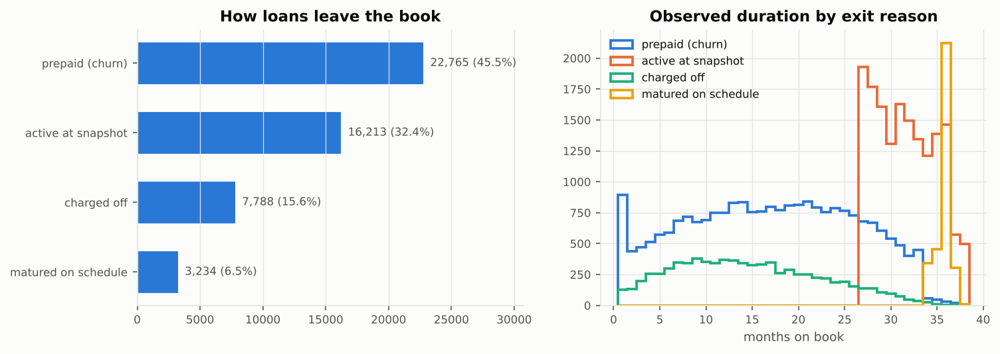

* **45.5%** of loans prepaid early (the event). The censoring rate is **54.5%**, which is high. That is exactly why a classifier that treats censored loans as "non-churners" would be badly biased.
* Prepaid loans exit after a median of **17 months**. Active loans are censored at 27–38 months (the vintage spans Jan–Dec 2016 and the snapshot is Mar 2019). Charge-offs exit after a median of **14 months**.
* Maturity exits cluster at months 34–38 by construction.

### 5.4 Survival curves and hazard

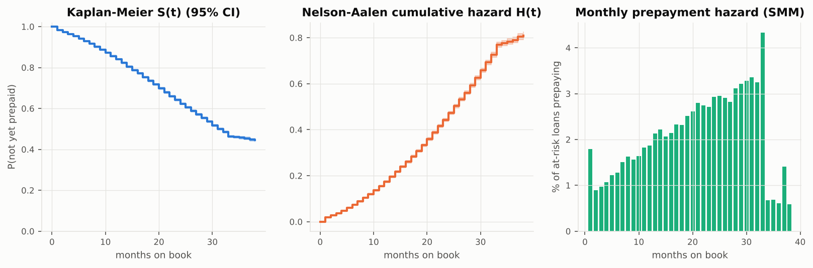

| Month | 6 | 12 | 18 | 24 | 30 | 36 |
|---|---|---|---|---|---|---|
| KM S(t) = P(not yet prepaid) | 0.930 | 0.840 | 0.735 | 0.623 | 0.518 | 0.454 |

* **Median time to prepayment ≈ 32 months.** About one customer in six has prepaid by the end of year 1, and more than half by month 36.
* **The hazard is increasing (seasoning).** Monthly prepayment (SMM) rises from ≈1% in months 2–4 to ≈3.3% by month 30. The average SMM over months 1–36 is **2.17%**, i.e. a CPR ≈ 23% per year. An increasing hazard is the classic "seasoning ramp" in prepayment modelling: borrowers' credit improves after on-time payments and refinancing becomes possible. The Nelson–Aalen H(t) is correspondingly convex.
* **Month-1 spike (1.8%).** Some loans are repaid almost immediately (buyer's remorse, or the funds were a bridge).
* **Spike at month 33, then a cliff.** For 36-month loans, a payoff in month ≤ 33 is an event, but months 34–36 count as maturity (censored). Month 33 also collects customers who pay their last 3 instalments at once. This is an artefact of the event definition, and you should mention it before an interviewer spots it.

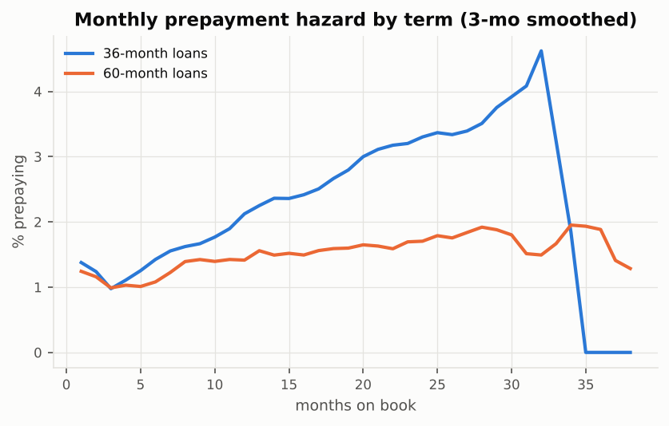

**The hazard of 36- and 60-month loans has a different shape over time, not just a different level.** That is an early warning that the proportional-hazards assumption is strained (confirmed by Schoenfeld tests in §8.2).

### 5.5 Segment analysis (Kaplan–Meier + log-rank)

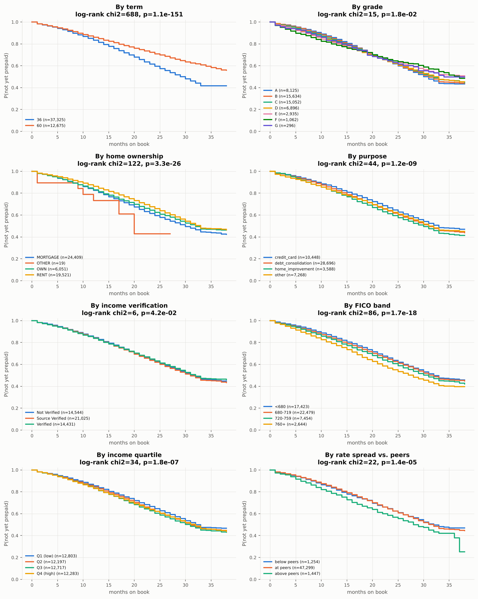

| Segment | log-rank χ² | dof | p | Reading |
|---|---:|---:|---:|---|
| Term (36 vs 60) | **688** | 1 | 1e-151 | 49% of 36-month loans prepay vs 34% of 60-month loans |
| Home ownership | 122 | 3 | 3e-26 | mortgage holders prepay most (48%), renters least (42%) |
| FICO band | 86 | 3 | 2e-18 | 760+: 55% prepay vs < 680: 43%. Better credit means better refinancing options |
| Purpose | 44 | 3 | 1e-09 | home-improvement loans prepay fastest |
| Income quartile | 34 | 3 | 2e-07 | higher income prepays somewhat more |
| Rate spread vs. peers | 22 | 2 | 1e-05 | borrowers priced above their peers prepay faster (49% vs 42%) |
| Grade | 15 | 6 | 0.018 | prepayment rate falls monotonically A 52% → G 31%, but timing differences are smaller than the rate differences |
| Income verification | 6 | 2 | 0.042 | weak |

Grade is a striking case. Its prepayment *rate* falls steeply from A to G, yet its log-rank statistic is small. This is because low grades also **default** more and earlier, and those loans are censored. Grade's effect on prepayment is partly hidden behind the competing risk.

### 5.6 Feature distributions, missingness, skew and multicollinearity

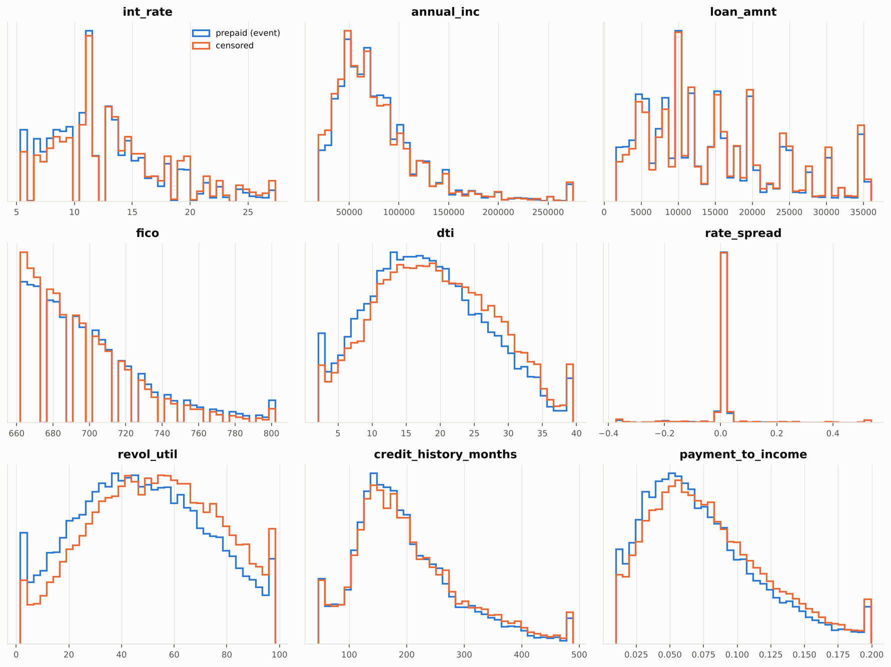

* **Missingness is low.** `emp_years` 6.7% (`n/a` employment length), `bc_util` 1.1%, `percent_bc_gt_75` 1.1%, everything else < 0.1%. Missing values are imputed with the **training-set median**. With these low rates, median imputation is adequate. An alternative would be a missing-indicator flag.
* **Heavy right skew.** `annual_inc` has skew 37.6 (max $7M, with zero-income rows), and `revol_bal`, `tot_cur_bal` and the ratio features are also very skewed. Treatment: `log1p` transform, then winsorise at the 0.5th/99.5th percentiles (bounds learned on train). Zero income produces infinite ratios, which are guarded with `nullif` in SQL and then capped by winsorising.
* **`rate_spread` is nearly degenerate.** Its standard deviation is 0.21 percentage points and its median is exactly 0. In 2016 LendingClub priced almost purely by sub-grade, so there is little within-grade variation to exploit. That honest finding explains its small model importance.

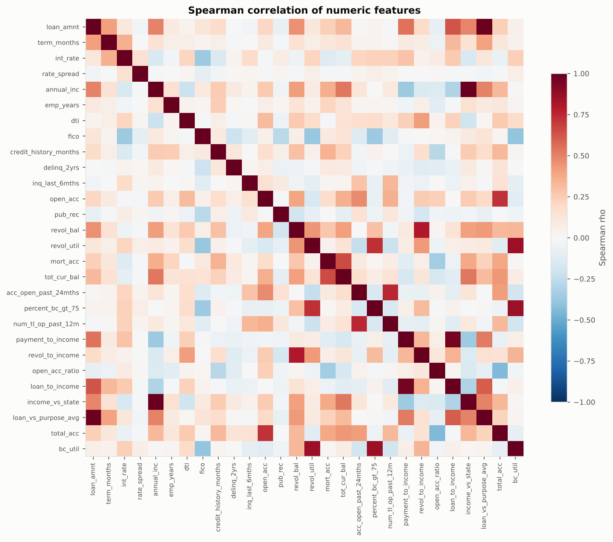

**Variance inflation factors** (VIFᵢ = 1/(1 − Rᵢ²), the diagonal of the inverse correlation matrix):

| Feature | VIF (all engineered) | VIF (final set) |
|---|---:|---:|
| loan_to_income | 79.7 | dropped |
| payment_to_income | 66.7 | 8.9 |
| annual_inc | 27.6 | 7.8 |
| income_vs_state | 19.0 | dropped |
| loan_amnt | 12.6 | ≈ 9.3 on train (10.2 on the full sample, borderline) |
| total_acc | 9.1 | dropped (open_acc + open_acc_ratio kept) |
| loan_vs_purpose_avg / bc_util | 6.8 / 6.3 | dropped (redundant with loan_amnt / revol_util) |

The rule used is VIF < 10. Interpretable raw variables (income, loan amount) were kept in preference to their near-duplicate engineered ratios. Multicollinearity does not hurt *prediction*, but it makes CoxPH coefficients unstable and hazard ratios uninterpretable.

### 5.7 Univariate Cox screen

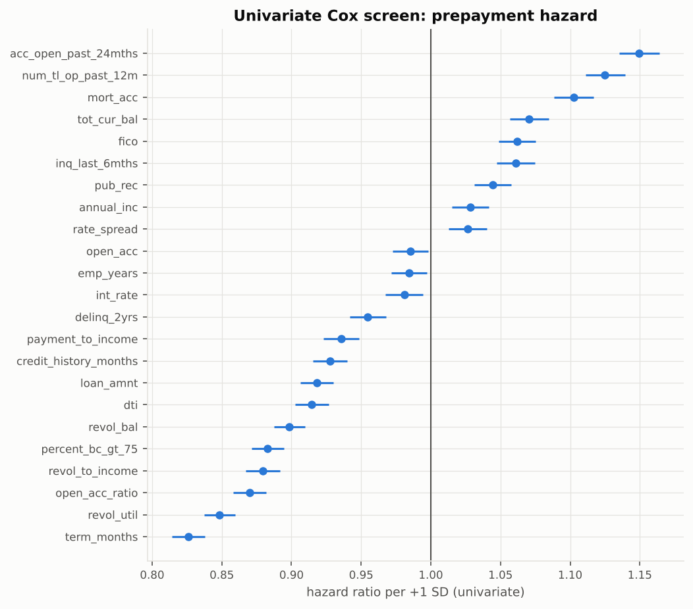

The strongest single predictors by univariate C-index are revolving utilisation (0.551), accounts opened in the past 24 months (0.548), open-account ratio (0.545), revolving-to-income (0.541) and recent trades (0.540). **No single feature reaches 0.56.** Prepayment is a weak-signal, behaviour-driven event, which sets realistic expectations for the multivariable C-index.

**Confounding example to quote.** The univariate HR of `int_rate` is **0.98** (higher rate → slightly *slower* prepayment). In the multivariable model it is **1.17**: holding term and credit quality fixed, a higher rate *speeds up* prepayment. High-rate loans tend to be 60-month loans to weaker borrowers who *cannot* refinance. Once those are controlled for, the pure *refinancing incentive* of an expensive loan appears. That is why the multivariable analysis matters.

### 5.8 Vintage curves

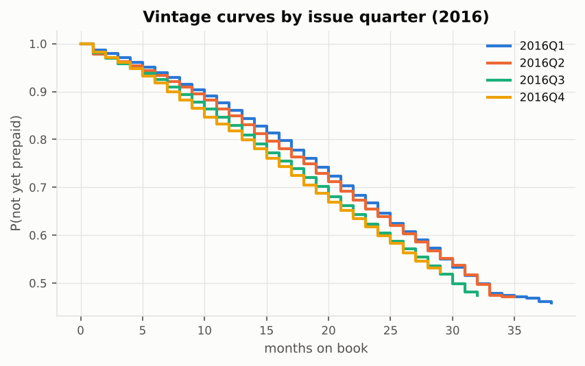

Quarterly sub-vintages of 2016 follow nearly identical curves over their common follow-up. The cohort is homogeneous, so one model for the whole vintage is reasonable.

## 6. Methodology

### 6.1 Split and preprocessing

* **Split.** 60/20/20 train/validation/test (30,000 / 10,000 / 10,000), **stratified on the event flag**, seed 42. The test set is touched only once, for the final benchmark.
* **Preprocessing (`data.Preprocessor`), fit on train only.** Median imputation → `log1p` for 12 skewed variables → winsorise at the 0.5/99.5 percentiles → z-score → drop-first one-hot for `home_ownership`, `purpose` and `verification_status` → binary flags unchanged. This gives **34 inputs** (23 numeric, 3 binary, 8 dummies).
* **Why z-scores matter for the KAN.** B-spline grids live on a fixed interval. Our KAN layer uses a uniform grid on [−3, 3] and clamps inputs to that range (flat extrapolation), which covers more than 99% of standardised values. Hazard ratios from CoxPH are then **per +1 SD**, so they are comparable across features.

### 6.2 Models

| Model | Log-risk r(x) | Parameters | Training |
|---|---|---:|---|
| CoxPH | βᵀx | 34 | lifelines `CoxPHFitter`, Efron ties, L2 penaliser 0.01, Newton–Raphson |
| DeepSurv | MLP 34→128→64→1, BatchNorm, SELU, dropout 0.3 | ≈ 13k | Adam lr 3e-3, weight decay 1e-4, full batch |
| CoxKAN additive | KAN `[34, 1]`, cubic B-splines, G = 8 | 34 × (8 + 3 + 2) = 442 | Adam lr 1e-2, L1 edge penalty 1e-3, coef penalty 1e-4 |
| CoxKAN `[34, 4, 1]` | KAN `[34, 4, 1]`, cubic B-splines, G = 5 | (136 + 4) × 10 = 1,400 | Adam lr 1e-2, same penalties |

All neural models minimise the **negative Cox partial log-likelihood** implemented in `models.CoxLoss`. Durations are sorted in descending order, the risk-set denominators are computed with `logcumsumexp`, and tied event times are mapped to the end of their tie block so that the risk set is {j : tⱼ ≥ tᵢ} (Breslow). Training is full-batch (the partial likelihood is a *global* ranking loss; mini-batches would only see partial risk sets). The validation C-index is checked every 5 epochs, with **early stopping** (patience 60 epochs) and restoration of the best weights.

### 6.3 Hyper-parameter search (validation set only)

A grid of 30 configurations (`scripts/02_tune.py`, results in `results/tuning.csv`). Validation C-index range:

* CoxKAN `[d,1]`: grid G ∈ {3, 5, 8} × lr ∈ {0.01, 0.03} × λ_L1 ∈ {0, 1e-3} → 0.6136 – **0.6144** (G = 8, lr 0.01, λ 1e-3)
* CoxKAN `[d,4,1]`: G ∈ {3, 5} × lr ∈ {3e-3, 1e-2} × λ_L1 ∈ {0, 1e-3} → 0.6126 – **0.6143**
* DeepSurv: hidden ∈ {[32], [64,32], [128,64]} × dropout ∈ {0.1, 0.3} × lr ∈ {1e-3, 3e-3} → 0.6124 – **0.6154**

**The landscape is flat.** All settings fall within ±0.002, so the conclusions do not hinge on tuning. Sparsity regularisation (λ_L1 = 1e-3) helped the KANs slightly.

## 7. Results

### 7.1 Benchmark on the held-out test set (n = 10,000)

| Model | Harrell C | 95% bootstrap CI | Mean ± SD over 3 seeds | Uno C | Brier @12m | Brier @24m | IBS (3–36m) | Train C |
|---|---:|---|---|---:|---:|---:|---:|---:|
| Kaplan–Meier (no covariates) | 0.500 | – | – | 0.500 | 0.1326 | 0.2330 | 0.1804 | – |
| CoxPH | 0.6140 | 0.606 – 0.623 | 0.6140 (deterministic) | 0.6128 | 0.1283 | 0.2191 | 0.1698 | 0.6144 |
| **CoxKAN [d,1] additive** | **0.6153** | 0.606 – 0.625 | 0.6153 ± 0.0001 | 0.6139 | 0.1282 | 0.2187 | 0.1692 | 0.6219 |
| CoxKAN [d,4,1] | 0.6172 | 0.609 – 0.626 | 0.6166 ± 0.0006 | 0.6158 | 0.1279 | 0.2185 | 0.1689 | 0.6226 |
| DeepSurv | **0.6195** | 0.611 – 0.628 | 0.6191 ± 0.0005 | 0.6183 | 0.1279 | 0.2176 | 0.1685 | 0.6314 |

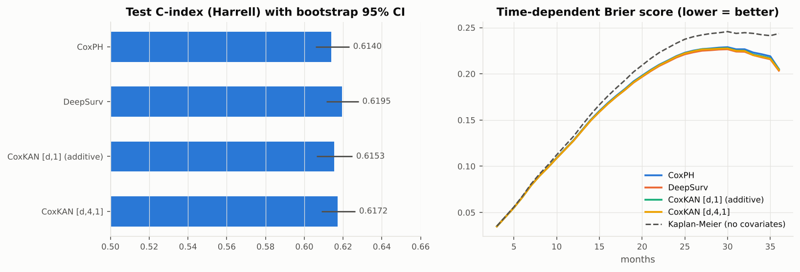

**Paired bootstrap of C-index differences** (same 300 resamples of the test set for both models):

| Comparison | ΔC | 95% CI | one-sided p |
|---|---:|---|---:|
| CoxKAN additive − CoxPH | +0.0014 | −0.0020 … +0.0043 | 0.23 |
| CoxKAN [d,4,1] − CoxPH | +0.0032 | −0.0001 … +0.0061 | 0.027 |
| DeepSurv − CoxPH | +0.0055 | +0.0032 … +0.0076 | < 0.003 |
| DeepSurv − CoxKAN additive | +0.0041 | +0.0012 … +0.0072 | 0.003 |
| DeepSurv − CoxKAN [d,4,1] | +0.0023 | −0.0004 … +0.0051 | 0.05 |

**How to read this honestly:**

1. **All models discriminate meaningfully but modestly (C ≈ 0.61–0.62).** That is normal for prepayment, which depends on future events not in the data: rate moves, windfalls, home sales. All of them beat the covariate-free reference on every Brier horizon, cutting IBS by about 6%.
2. **Non-linearity adds a small, real gain.** The ranking DeepSurv > CoxKAN-deep > CoxKAN-additive ≥ CoxPH mirrors model flexibility. DeepSurv's lead over CoxPH is statistically significant, but it is +0.0055 in C.
3. **CoxKAN additive is statistically tied with CoxPH on accuracy, but it is far more informative**: it shows the *shape* of every effect (§8.3) and stays fully transparent. CoxKAN `[d,4,1]` closes most of the gap to DeepSurv (the difference is not significant at 5%) while staying inspectable edge by edge.
4. **Overfitting gap.** DeepSurv has the largest train–test gap (0.631 → 0.620). CoxPH has none (0.614 → 0.614). The KANs sit in between (0.622 → 0.615). That fits their capacity and is an argument for KANs as a middle ground.
5. **Seed stability.** The seed SD is ≤ 0.0006, much smaller than the differences between model families.

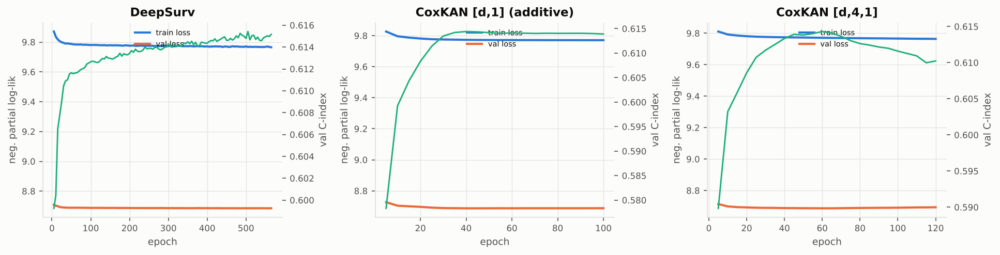

### 7.2 Does the risk score separate customers? (test set)

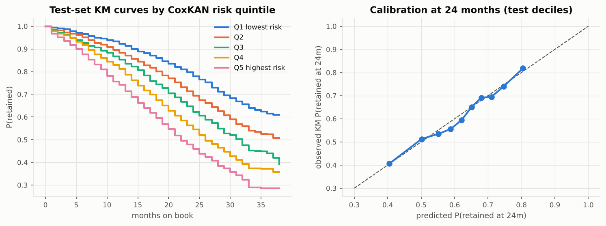

| CoxKAN risk quintile | n | Observed prepay rate | KM retained @24m | KM retained @36m |
|---|---:|---:|---:|---:|
| Q1 (lowest risk) | 2,000 | 31.1% | **0.779** | 0.615 |
| Q2 | 2,000 | 39.2% | 0.693 | 0.523 |
| Q3 | 2,000 | 45.4% | 0.623 | 0.440 |
| Q4 | 2,000 | 52.3% | 0.545 | 0.372 |
| Q5 (highest risk) | 2,000 | 59.7% | **0.460** | 0.286 |

* Monotone separation across all quintiles. The highest-risk fifth loses customers about **2.4× as fast** as the lowest-risk fifth by month 24 (54% lost vs 22%).
* **Calibration at 24 months.** Predicted vs observed (KM) retention by decile lies on the diagonal, with errors ≤ 0.03. The Breslow baseline + CoxKAN risk therefore gives usable *probabilities*, not just a ranking.

## 8. Interpretation: who churns, and why

### 8.1 Hazard ratios (CoxPH, multivariable)

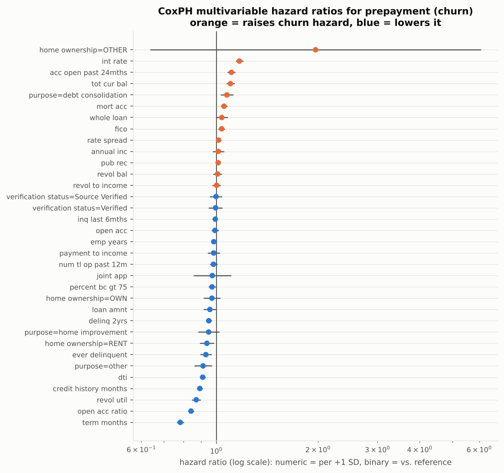

**Top 5 attrition (prepayment) drivers**, ranked by |log HR| per SD among effects significant at p < 0.05:

| Rank | Feature | HR (per +1 SD) | 95% CI | Direction and business meaning |
|---|---|---:|---|---|
| 1 | **term_months** (60 vs 36) | **0.78** | 0.76–0.80 | Long-term loans prepay more slowly. A 60-month loan has a lower monthly payment and less urgency to refinance. Equivalent to HR ≈ 0.57 for 60 vs 36 months |
| 2 | **open_acc_ratio** | **0.84** | 0.82–0.86 | Customers whose credit file is mostly still-open accounts are credit-dependent and refinance/pay off less. Dormant-file customers have slack |
| 3 | **int_rate** | **1.17** | 1.14–1.20 | Holding credit quality fixed, an expensive loan is a strong **refinancing incentive** (the classic driver of prepayment) |
| 4 | **revol_util** | **0.87** | 0.85–0.90 | Customers maxed out on revolving credit cannot easily get a cheaper loan elsewhere, so they stay |
| 5 | **credit_history_months** | **0.89** | 0.88–0.91 | Long, established credit files prepay a bit more slowly (more stable, less "credit shopping") |
| (6) | acc_open_past_24mths | 1.11 | 1.08–1.14 | Credit-active customers who recently opened many accounts are the most likely to switch |

Other significant effects: higher total current balance (1.10) and more mortgage accounts (1.05) increase prepayment (wealthier borrowers with assets). Higher DTI (0.91), past delinquency (0.93) and renting (0.94) decrease it (constrained borrowers). Debt-consolidation purpose increases it (1.07).

**Rare-category trap.** `home_ownership=OTHER` has the largest |log HR| (HR 1.97) but n = 19, a 95% CI of 0.64–6.08 and p = 0.24. It is noise. This is why the ranking filters on significance, and why the P90/P10 CoxKAN ranking (which has no CIs) briefly lists it in 4th place. Always check cell sizes.

### 8.2 Is proportional hazards satisfied? (Schoenfeld residual test)

| Feature | test statistic | p |
|---|---:|---:|
| int_rate | **139.6** | < 1e-30 |
| fico | 32.2 | < 1e-7 |
| open_acc_ratio | 21.2 | < 1e-5 |
| dti | 16.0 | 1e-4 |
| revol_util | 13.8 | 2e-4 |
| term_months | 6.2 | 0.013 |

The **PH assumption is violated** for several key variables, most strongly for the interest rate. The refinancing effect of a high rate strengthens over time, as borrowers' credit seasons and a cheaper refinance becomes available. With n = 30,000 the test detects even small deviations, so it should be read together with the hazard plot in §5.4. Consequences and remedies (good interview material):

* The CoxPH HR is a **time-averaged** effect. Rankings (C-index) remain useful, but HRs should be described as averages.
* Remedies: **stratify** by term (`strata=['term_months']`, which gives a separate baseline hazard per term), add **time interactions** x·log(t), fit piecewise models by loan age, or use models that do not assume PH (random survival forests, DeepHit, or a time-dependent CoxKAN with t as an input).
* Note that CoxKAN and DeepSurv **also assume PH** (the risk score does not depend on t). Their flexibility is in x, not in t. This is a common misconception to avoid.

### 8.3 CoxKAN shape functions: where linearity breaks

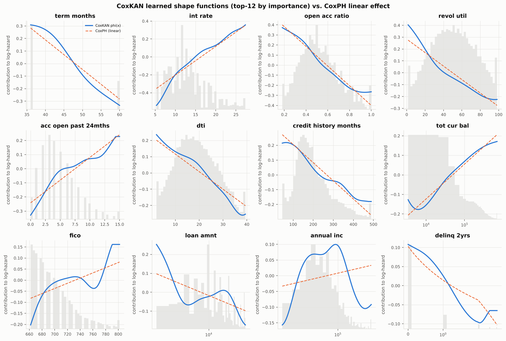

Each panel shows φᵢ(xᵢ), the learned contribution of one feature to the log-hazard, in original units (blue). The CoxPH straight line is dashed orange and the data distribution is in grey. Because the model is additive, **exp(φᵢ(a) − φᵢ(b)) is exactly the hazard ratio between values a and b of feature i, with everything else fixed.**

| Feature | What CoxKAN learned | What CoxPH misses |
|---|---|---|
| term, interest rate, open-acc ratio, credit history | almost linear (symbolic fits: linear, near-linear quadratic, tanh) | little; CoxPH is adequate here |
| **revol_util** | steep decline from 0% to ~40% utilisation, then a much gentler slope | the effect is concentrated at *low* utilisation (customers with lots of unused credit prepay most) |
| **acc_open_past_24mths** | rises fast from 0 to 5 new accounts, then plateaus (log shape) | diminishing returns |
| **FICO** | rises from 660 to 700, plateau, then jumps above ~780 | super-prime borrowers (780+) prepay disproportionately: they get the best refinance offers |
| **annual income** | **inverted U**: low income → slow prepayment, middle/upper-middle → fastest, very high income → slower again | CoxPH sees an almost-zero linear effect (HR 1.01, p = 0.50) and would conclude income does not matter; CoxKAN shows it does, non-monotonically |
| **loan amount** | small loans prepay fastest (easy to pay off from savings), with a dip around $5k and a bump around $15–20k | |
| **tot_cur_bal** | S-shaped (sigmoid): increases then saturates | |

**Effective hazard ratios (90th vs 10th percentile customer)** compare CoxKAN and CoxPH on the same contrast:

| Feature | Contrast | HR CoxKAN | HR CoxPH |
|---|---|---:|---:|
| term_months | 60 vs 36 months | 0.53 | 0.57 |
| int_rate | 19.99% vs 7.39% | **1.69** | 1.50 |
| open_acc_ratio | 0.77 vs 0.31 | 0.61 | 0.64 |
| revol_util | 83.8% vs 18% | 0.65 | 0.69 |
| acc_open_past_24mths | 9 vs 1 | 1.38 | 1.29 |
| fico | 742 vs 667 | **1.18** | 1.09 |
| revol_bal | $33.8k vs $3.1k | 1.14 | 1.02 |

### 8.4 From splines to a formula (symbolic regression)

Each learned φᵢ was fitted against {x, x², x³, exp, log, tanh, sin, sigmoid} as a·f(b·z + c) + d (z = standardised feature), and the simplest primitive with R² ≥ 0.98 was kept. The leading terms of the resulting closed-form hazard model are:

```
log h(t|x) =
      log h0(t)
    + -0.324*z_term_months
    + -0.039*(z_int_rate - 3.0)^2
    + 0.362*tanh(-0.639*z_open_acc_ratio)
    + 0.034*(z_revol_util - 2.25)^2
    + 0.248*log|-0.469*z_acc_open_past_24mths - 1.0|
    + -0.018*(z_dti + 3.0)^2
    + 0.468*tanh(-0.253*z_credit_history_months - 0.25)
    + -0.354*sigmoid(-1.616*z_tot_cur_bal - 0.75)
    + ... (remaining terms in symbolic_formulas.csv)
```

| Feature | Chosen primitive | R² of fit |
|---|---|---:|
| term_months | linear | 0.986 |
| int_rate | quadratic (≈ linear over the data range) | 0.986 |
| open_acc_ratio | tanh | 0.998 |
| revol_util | quadratic (convex, flattening) | 0.995 |
| acc_open_past_24mths | log | 0.969 |
| dti | quadratic | 0.993 |
| credit_history_months | tanh | 0.986 |
| tot_cur_bal | sigmoid | 0.989 |
| fico / loan_amnt / annual_inc | cubic / cubic / sine (best available, R² 0.91 / 0.89 / 0.93) | |

**Replacing every spline with its formula costs almost nothing:** test C **0.6147** (formula) vs **0.6153** (splines). The final model is a short algebraic expression that a model-risk reviewer can audit line by line. That is the core promise of CoxKAN. One caveat to state: primitives such as sin are curve-fits within the data range, not causal laws. Keep the formula to the data range (we clip to the 1st–99th percentiles).

### 8.5 Agreement across models (permutation importance)

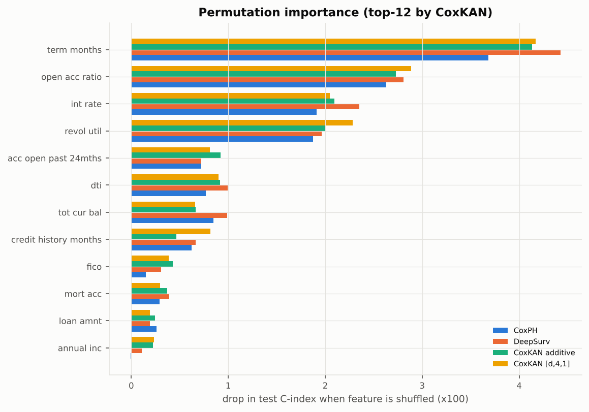

Permutation importance is the drop in test C-index when one feature is randomly shuffled. It is model-agnostic, so it can rank DeepSurv's inputs too.

| Rank | CoxPH (HR) | CoxKAN (contribution SD) | Permutation – CoxKAN | Permutation – DeepSurv |
|---|---|---|---|---|
| 1 | term_months | term_months | term_months | term_months |
| 2 | open_acc_ratio | int_rate | open_acc_ratio | open_acc_ratio |
| 3 | int_rate | open_acc_ratio | int_rate | int_rate |
| 4 | revol_util | revol_util | revol_util | revol_util |
| 5 | credit_history_months | acc_open_past_24mths | acc_open_past_24mths | dti |

**The top 4 are identical under every method and every model.** The 5th place rotates among credit history, recent account openings and DTI, which have similar, smaller effects. This robustness is the strongest evidence for the "top-5 drivers" claim.

### 8.6 Hidden-layer CoxKAN and individual explanations

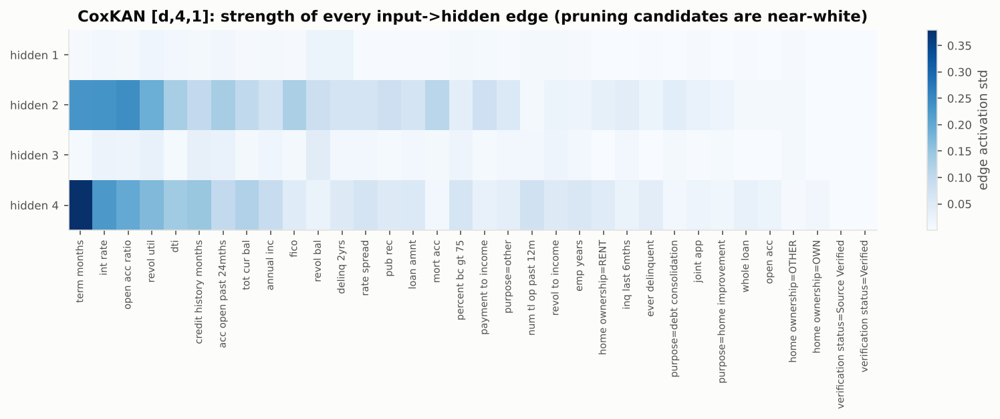

In the `[34, 4, 1]` model each input→hidden edge is its own learned function. The heat map shows each edge's activation SD. A handful of inputs carry almost all the signal, and many edges are near zero. These are the **pruning** candidates that would turn the network back into a small, readable graph (as in the CoxKAN paper).

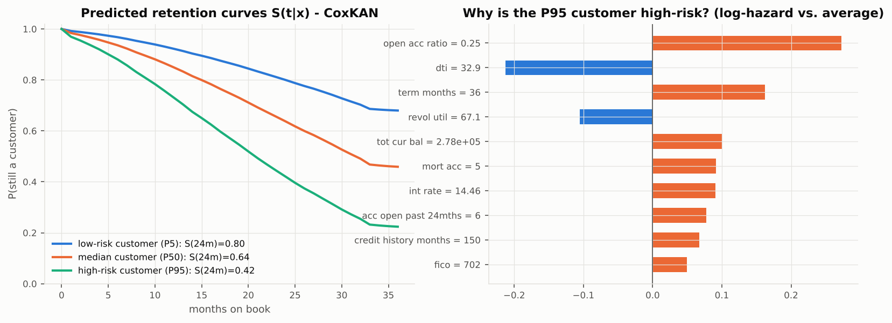

**Left:** predicted retention curves for a low-risk (5th percentile), median, and high-risk (95th percentile) test customer. At 24 months they retain 80%, 64% and 42% respectively. **Right:** additivity gives an *exact* local explanation (no SHAP approximation needed). The high-risk customer's log-hazard is driven up by a low open-account ratio (0.25), a 36-month term, a large total balance and 5 mortgage accounts. It is partly offset by a high DTI (32.9) and high revolving utilisation (67%), which make refinancing harder.

## 9. From model to retention strategy

1. **Time the intervention by hazard, not by a fixed window.** Prepayment hazard rises steadily with loan age, from ~1% per month in the first months to over 3% by month 30. Retention offers should start **before** the seasoning ramp, around months 9–15, for high-risk customers.
2. **Target the refinancers.** The highest-risk profile is a creditworthy, credit-active borrower (high FICO, low utilisation, many recent accounts, sizeable assets) on a relatively **expensive, short-term** loan. These customers will find a cheaper loan elsewhere. Pre-emptive **rate-reduction or top-up offers** are the natural lever, and the int_rate shape function quantifies the expected hazard reduction of, say, a 2-point rate cut. That rate effect is associational, though: estimating the true uplift of an offer needs an A/B test (see §10).
3. **Prioritise with expected value, not just risk.** Expected interest lost ≈ Σₜ S(t∣x) × monthly interest. Rank customers by (risk × remaining interest income × offer uplift).
4. **Monitor the drivers.** The top-4 drivers are stable across model families, which makes them a robust basis for segment KPIs and early-warning dashboards.
5. **Governance.** An additive CoxKAN with symbolic terms meets "explainability by design" expectations (e.g. adverse-action reasoning, model-risk review). Every prediction decomposes exactly into per-feature contributions.

## 10. Limitations and extensions

| Limitation | Why it matters | Next step |
|---|---|---|
| Competing risk of default treated as censoring | 1 − KM overstates cumulative prepayment; low grades look "loyal" partly because they default first | Aalen–Johansen cumulative incidence; Fine–Gray model; cause-specific CoxKAN for default as a second head |
| PH violated (int_rate, FICO, term) | HRs are time-averaged | stratify by term; time-varying coefficients; DeepHit / random survival forest; add loan age to the KAN input |
| Origination-only features | Prepayment is driven by *changes* (market rates, credit improvement) | time-varying covariates (monthly panel: current FICO, market rate spread) in a counting-process (start, stop] Cox model |
| Single vintage, single lender, 2016 rates environment | external validity | out-of-time validation on 2015 / 2017 vintages |
| Integer-month durations → many ties | Breslow is approximate | Efron in the torch loss, or a discrete-time hazard model |
| Associational, not causal | "lower the rate → less churn" is not proven | uplift modelling / randomised retention-offer test |
| Modest C-index (≈ 0.62) | limited individual-level precision | better used for segment-level targeting and portfolio forecasting |


## 11. Interview preparation: likely questions and model answers

### Framing and data

**Q: Why survival analysis and not a churn classifier?**
Churn has a *when*. A classifier with a fixed window throws away timing and mislabels customers who simply haven't been observed long enough. 54.5% of my loans are censored. Treating them as "non-churners" biases the model, and dropping them biases the sample toward old loans. The Cox partial likelihood uses censored customers correctly (they appear in risk sets), and the output is a full retention curve S(t∣x), not one probability.

**Q: How did you define churn in a lending dataset?**
Voluntary early exit: prepayment at least 3 months before maturity. Default is involuntary and a different business problem, so I treated it as a competing risk (censored, cause-specific hazard). Loans repaid on schedule completed their contract and are censored at exit. Active loans are censored at the March 2019 snapshot.

**Q: What is censoring and what assumption do you need?**
We only know T > observed time. The assumption is non-informative censoring: given the features, being censored tells you nothing about the churn hazard. Administrative censoring at the snapshot satisfies it. Censoring by default is the weak spot, which is why I discuss Fine–Gray / cumulative incidence.

**Q: How did you avoid leakage?**
Only origination-time fields are used as features. Outcome fields (total paid, recoveries, last FICO) are excluded. All preprocessing (medians, winsor bounds, scaling, category levels) is fitted on the training split only. The test set was used once.

**Q: What did you do in SQL?**
Three DuckDB scripts. (1) Cohort extraction with a deterministic hash-based sample. (2) The survival table: date parsing, `datediff` for months on book, `CASE` logic for the event and the censoring reason. (3) Feature engineering: ratio features with `nullif` guards, regex parsing of employment length, and window functions, e.g. rate spread = `int_rate − AVG(int_rate) OVER (PARTITION BY sub_grade, issue_month)`, and income relative to the state median.

**Q: Tell me about the data.**
50,000 loans from 2016, observed up to 38 months. 45.5% prepaid, 32% still active, 16% charged off, 6.5% matured. The median time to prepayment is about 32 months. The monthly prepayment hazard rises from ~1% to ~3.3% (a seasoning ramp; average CPR ≈ 23%). Income and balances are extremely skewed (income skew 37), so I used log1p plus winsorising. Missingness is low (emp_length 6.7%). I dropped 5 engineered features with VIF > 10.

### Theory

**Q: Write down the Cox model and the partial likelihood.**
h(t∣x) = h₀(t)·exp(βᵀx). L(β) = ∏_{events} exp(βᵀxᵢ) / Σ_{j: tⱼ ≥ tᵢ} exp(βᵀxⱼ). The baseline hazard cancels, which is why the model is semi-parametric. Only the order of event times matters.

**Q: What is a hazard ratio? Interpret 1.17 for interest rate.**
exp(β). Each +1 SD in interest rate (≈ 4.9 points) multiplies the instantaneous prepayment rate by 1.17 at every point in time, holding all other features fixed. That is a 17% higher hazard. It is *not* "17% more likely to churn" in absolute terms.

**Q: How do you get survival probabilities from a Cox model / DeepSurv / CoxKAN?**
Estimate the baseline cumulative hazard with Breslow: Ĥ₀(t) = Σ_{tᵢ ≤ t} dᵢ / Σ_{j ∈ R(tᵢ)} exp(r̂ⱼ). Then S(t∣x) = exp(−Ĥ₀(t)·exp(r̂(x))). I used the same procedure for all models.

**Q: How do you handle ties?**
Integer months produce many ties. lifelines uses Efron. My PyTorch loss uses Breslow: every subject with tⱼ ≥ tᵢ is in the risk set, implemented by sorting descending, taking `logcumsumexp`, and indexing at the end of each tie block.

**Q: What is the PH assumption, and did it hold?**
Hazard ratios are constant over time. I tested it with Schoenfeld residuals: interest rate, FICO, open-account ratio, DTI and utilisation violate it, and the refinancing effect of a high rate grows with loan age. So the CoxPH HRs are time-averaged effects. Fixes: stratify by term, add x·log(t) interactions, or use non-PH models. Note that DeepSurv and CoxKAN also assume PH in t; they are flexible only in x.

**Q: What is a KAN? How is it different from an MLP?**
It is based on the Kolmogorov–Arnold theorem: any continuous multivariate function is a sum of compositions of univariate functions. An MLP learns weights and applies fixed activations at the nodes. A KAN puts a *learnable univariate function on every edge* and nodes just sum. Each edge function is φ(x) = w_b·silu(x) + w_s·Σ c_i B_i(x), a cubic B-spline plus a SiLU residual.

**Q: Why B-splines?**
Local support (each coefficient changes the curve only locally, so training is stable), smoothness (C² for cubic), partition of unity, cheap evaluation via the Cox–de Boor recursion, and the grid size G directly controls flexibility. G + k basis functions per edge.

**Q: What makes CoxKAN interpretable?**
With width [d, 1] the log-hazard is Σ φᵢ(xᵢ), an additive model. Each φᵢ can be plotted, exp(φᵢ(a) − φᵢ(b)) is an exact hazard ratio, every prediction decomposes exactly into feature contributions, and φᵢ can be replaced by a symbolic formula. If all φᵢ are linear it *is* CoxPH, so it strictly generalises CoxPH and shows where linearity fails. For deeper KANs, L1/entropy regularisation plus pruning keeps the graph small.

**Q: What is the C-index? Why use it? What is a good value?**
The fraction of comparable pairs (the earlier time is an observed event) that the model ranks correctly. 0.5 is random and 1.0 is perfect. It suits Cox models because the partial likelihood only cares about ordering. It measures discrimination, not calibration, so I also report the Brier score/IBS and a calibration plot. For prepayment from origination-only data, 0.60–0.65 is realistic. Above 0.8 I would suspect leakage.

**Q: Harrell vs Uno C-index?**
Harrell's depends on the censoring distribution. Uno's re-weights pairs by inverse probability of censoring (KM of the censoring times) and truncates at τ, which makes it consistent under censoring. My results agree (0.6128–0.6183 Uno vs 0.6140–0.6195 Harrell).

**Q: Explain the Brier score with censoring.**
Squared error between Ŝ(s∣x) and the true status at s, with IPCW weights 1/Ĝ. Subjects censored before s contribute only through the weights. The IBS integrates it over time. All models: IBS ≈ 0.169 vs 0.180 for KM, about 6% better.

### Results and judgment

**Q: CoxKAN didn't beat DeepSurv. Why use it?**
The accuracy differences are small: DeepSurv leads the additive CoxKAN by 0.004 C, and CoxKAN-deep by 0.002, which is not significant. CoxKAN gives *exact*, global and local explanations, shape functions, and a closed-form formula that keeps essentially all its accuracy (0.6147 vs 0.6153). In banking, explainability and model governance usually outweigh +0.004 C. The right deployment is probably the additive CoxKAN, with DeepSurv kept as a challenger model.

**Q: CoxKAN additive vs CoxPH are statistically tied. What did you gain?**
Insight. CoxPH said income does not matter (HR 1.01, p = 0.50). CoxKAN shows an inverted-U: middle-income customers prepay most. It also shows threshold effects in FICO (780+) and utilisation, where CoxPH's straight lines miss the shape. And the effective HRs for interest rate and FICO are larger than CoxPH implies.

**Q: How did you choose the top-5 predictors? Are they robust?**
Ranked by |log HR| per SD among significant CoxPH coefficients, then cross-checked with CoxKAN contribution SDs, CoxKAN P90/P10 effective HRs, and permutation importance for CoxKAN and DeepSurv. The top 4 (term, open-account ratio, interest rate, revolving utilisation) are identical across all five rankings. I also excluded `home_ownership=OTHER`: its HR is 1.97 but n = 19 and p = 0.24.

**Q: How do you know you didn't overfit?**
Separate validation set for early stopping and tuning; the test set was used once; 3 seeds (SD ≤ 0.0006); bootstrap CIs; calibration on test. The train–test gap is 0 for CoxPH, 0.007 for CoxKAN and 0.012 for DeepSurv.

**Q: Why not use mini-batches?**
The partial likelihood compares each event with its whole risk set. A mini-batch only approximates the risk set. With 30k rows full-batch fits in memory and is exact. For millions of rows I would use large batches with stratified sampling, or sample risk sets (nested case-control).

**Q: What would you do next?**
Model default as a competing risk (Fine–Gray / cumulative incidence). Add time-varying covariates such as market rates and current FICO in a counting-process Cox model. Stratify by term. Validate out-of-time on the 2015/2017 vintages. Run a randomised retention offer to measure causal uplift.

**Q: How would this be used in production?**
Score the book monthly. Get S(t∣x) and the expected lost interest. Target the top-risk × high-value customers with refinance or rate-match offers ahead of the seasoning ramp. Monitor drift in the top drivers. Re-estimate the baseline hazard quarterly.

### Quick numbers to memorise

| | |
|---|---|
| Sample / split | 50,000 loans (2016) → 30k / 10k / 10k, 34 features |
| Event rate / censoring | 45.5% / 54.5% |
| KM retention 12 / 24 / 36 m | 0.84 / 0.62 / 0.45; median ≈ 32 months |
| Monthly hazard | ~1% early → ~3.3% at month 30; avg SMM 2.2% (CPR ≈ 23%) |
| Test C-index | CoxPH 0.614 · CoxKAN-add 0.615 · CoxKAN-deep 0.617 · DeepSurv 0.620 |
| IBS | KM 0.180 → models 0.169–0.170 |
| Symbolic CoxKAN | C 0.6147 (vs 0.6153 splines) |
| Top drivers (HR / SD) | term 0.78 · open-acc ratio 0.84 · int-rate 1.17 · revol-util 0.87 · credit history 0.89 |
| Risk quintiles | retained at 24m: Q1 78% vs Q5 46% |

## 12. One-day preparation plan

| Time | Block | Goal |
|---|---|---|
| 0:00–0:45 | Read §1–2, skim the figures in §5 | Explain the project in 2 minutes without notes |
| 0:45–2:30 | §3 theory: hazard, censoring, KM, log-rank, Cox, partial likelihood, Breslow, PH/Schoenfeld | Derive the partial likelihood on paper; explain a hazard ratio |
| 2:30–3:30 | §3.6–3.7: DeepSurv, KAN, B-splines, CoxKAN | Draw a KAN layer; explain why [d,1] is additive and generalises CoxPH |
| 3:30–4:15 | §4 metrics | Compute a C-index by hand on 4 customers; explain IPCW |
| 4:15–5:30 | Code walk-through: `sql/*.sql`, `kan.py`, `models.py` (CoxLoss), `metrics.py` | Be able to point to each line that implements a formula |
| 5:30–6:30 | §5 data analysis + §7 results | Memorise the "quick numbers" table |
| 6:30–7:30 | §8 interpretation + §9 strategy | Tell the top-5 driver story, the int-rate confounding, the income inverted-U |
| 7:30–8:30 | §10 limitations + §11 Q&A out loud | Answer every question in under 60 seconds |
| 8:30–9:00 | Run `./run_pipeline.sh` once (or at least `scripts/04_train_evaluate.py`) | Say "I ran it end to end" truthfully |

## 13. Mapping to the CV bullets

The bullets below are reworded to match exactly what this project does. The original third bullet mentioned multi-million-row datasets. This project works on a 50,000-loan sample, so that claim was removed.

* *Developed an interpretable survival analysis model using Kolmogorov–Arnold Networks (KAN) with B-spline activation functions (CoxKAN) to predict time-to-attrition (loan prepayment) for retail lending customers, moving beyond static binary classification to estimate continuous attrition hazard rates and customer-level retention curves.* → §3.7, §6.2, `kan.py`, `models.py`, Fig. 16
* *Benchmarked CoxKAN against Cox Proportional Hazards (CoxPH) and DeepSurv using the concordance index (C-index), identifying the top 5 attrition predictors via hazard-ratio analysis.* → §7.1 (C-index table, bootstrap tests), §8.1 (HRs), §8.5 (robustness)
* *Queried and aggregated LendingClub loan data using SQL (DuckDB; CTEs, window functions) to engineer churn-relevant features for the modelling pipeline, guiding data-driven retention strategy.* → §5.2, `sql/`, §9

If asked "how big was the data?", answer: **"a 50,000-loan sample from the 2016 vintage of LendingClub's public file."** The SQL pipeline would run unchanged on the full file, but this project did not do that.

## 14. Code map

| Formula / concept | Where |
|---|---|
| Survival target, censoring logic | `sql/02_build_survival_table.sql` |
| Window-function features | `sql/03_feature_engineering.sql` |
| Fit-on-train preprocessing, VIF-pruned feature list | `src/coxkan_churn/data.py`, `config.py` |
| B-spline basis (Cox–de Boor), φ = w_b·silu + w_s·spline, L1/entropy regulariser | `src/coxkan_churn/kan.py` |
| Cox partial likelihood with Breslow ties | `src/coxkan_churn/models.py` → `CoxLoss` |
| CoxPH / DeepSurv / CoxKAN, early stopping | `src/coxkan_churn/models.py` |
| Harrell/Uno C, Breslow baseline, IPCW Brier, IBS | `src/coxkan_churn/metrics.py` |
| Symbolic regression | `src/coxkan_churn/symbolic.py` |
| KM, Nelson–Aalen, log-rank, life table, VIF, univariate Cox | `src/coxkan_churn/eda.py` |
| Benchmark, risk tiers, calibration | `scripts/04_train_evaluate.py` |
| HRs, Schoenfeld test, shape functions, permutation importance, explanations | `scripts/05_interpret.py` |

## References

* Cox, D. R. (1972). Regression models and life-tables. *JRSS-B* 34(2).
* Kaplan, E. L. & Meier, P. (1958). Nonparametric estimation from incomplete observations. *JASA* 53.
* Breslow, N. (1974). Covariance analysis of censored survival data. *Biometrics* 30.
* Grambsch, P. & Therneau, T. (1994). Proportional hazards tests and diagnostics based on weighted residuals. *Biometrika* 81.
* Harrell, F. et al. (1982). Evaluating the yield of medical tests. *JAMA* 247. · Uno, H. et al. (2011). On the C-statistics for evaluating overall adequacy of risk prediction procedures with censored survival data. *Stat. Med.* 30.
* Graf, E. et al. (1999). Assessment and comparison of prognostic classification schemes for survival data. *Stat. Med.* 18.
* Fine, J. & Gray, R. (1999). A proportional hazards model for the subdistribution of a competing risk. *JASA* 94.
* Katzman, J. et al. (2018). DeepSurv: personalized treatment recommender system using a Cox proportional hazards deep neural network. *BMC Med. Res. Methodol.* 18.
* Kolmogorov, A. N. (1957). On the representation of continuous functions of several variables by superposition of continuous functions of one variable and addition.
* Liu, Z. et al. (2024). KAN: Kolmogorov–Arnold Networks. *arXiv:2404.19756*.
* Knottenbelt, W., Zeng, Z., Liò, P. et al. (2024). CoxKAN: Kolmogorov–Arnold Networks for interpretable, high-performance survival analysis. *arXiv:2409.04290*.
* de Boor, C. (1978). *A Practical Guide to Splines*. Springer.
