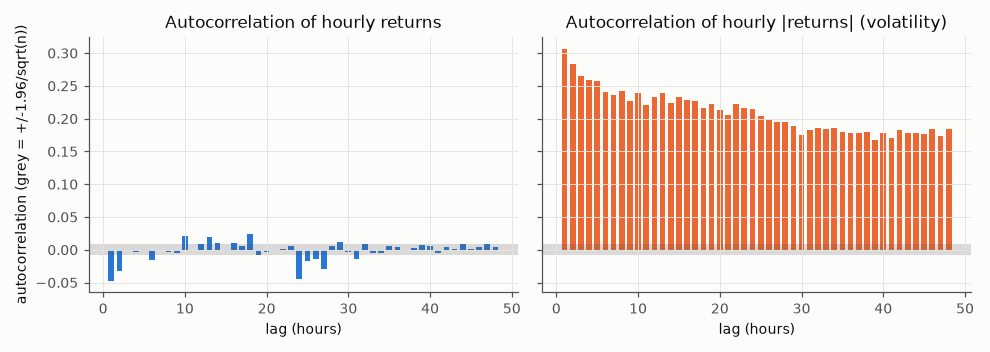
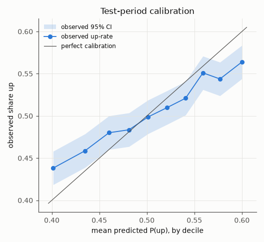

# FROM RAW DATA TO FINAL VERDICT — COMPLETE PROJECT WALKTHROUGH

**Credit Risk Modelling & Quantitative Market Signal Research**

A teaching and interview-defence guide, reverse-engineered from the repository

Kudrati Khoda · Repository `KK`, branch `claude/gifted-franklin-fgah4a`, state at commit `5a96774` · Written 6 October 2026

---

## How to read this document

This document was written by reading the actual code, configuration, saved tables and git history. It was **not** written from the final report alone. Nothing was re-trained, re-optimised or re-tested. Where I re-checked a number, I used read-only scripts on files that were already saved (for example the saved backtest file). I never refitted a model and I never touched the test period again.

Every number carries one of these labels when it matters:

| Label | Meaning |
|---|---|
| **VERIFIED** | I found the code that produced it **and** the saved output that contains it. |
| **RE-DERIVED** | It is not stored in any saved table, but I recomputed it from saved files (read-only) and it matches the report. |
| **INFERRED** | Hand calculation from saved numbers (the arithmetic is shown). |
| **NOT VERIFIED FROM THE REPOSITORY** | Nothing in the repository can confirm it. |
| **REPORTED BUT NOT CURRENTLY REPRODUCIBLE FROM THE REPOSITORY** | It appears in a report, but the code or output that would reproduce it is missing. |
| **HYPOTHETICAL EXAMPLE** | A made-up number used only to teach. Never quote it as a result. |

**What I inspected:** `README.md`; `src/` (13 modules: `config`, `data`, `quality`, `eda`, `features`, `validation`, `models`, `backtest`, `risk`, `stress_test`, `stats`, `pipeline`, `plots`); `scripts/run_pipeline.py`; `reports/selection.json`; `reports/results.json`; all 64 CSV files in `reports/tables/`; the 10 figures; the pre-registration and its deviation log; `data/raw/.../manifest.csv`; the interim and processed parquet files; the credit notebook `01_credit_risk.ipynb`; `credit_module/Credit_Risk_Project_Report.pdf`; and the git log. I also ran the test suite: **25 of 25 tests passed** (26 of 26 after one test was added on 7 Oct 2026).

**Most important teaching rule used throughout.** For every major step you will see six labels: **WHAT** (what we did), **WHY** (why we did it), **HOW** (exactly how), **RESULT** (what we got), **INTERPRETATION** (what it means) and **INTERVIEW** (how to say it).

---

# PART 1 — Executive Summary

## The project in three sentences

1. The original project built a **credit-risk** workflow on LendingClub loans: predict who defaults (PD), turn that into expected loss, and simulate how bad portfolio losses can get.
2. The extension applied the same discipline to **Binance BTCUSDT 1-minute market data**: can information available now predict whether Bitcoin goes up over the next hour, and can that prediction make money after trading costs?
3. The answer: **yes, the direction is slightly predictable (test AUC 0.545), but no, it cannot be traded profitably** — the edge is about 0.19 basis points per trade side against about 7 basis points of cost. The pre-registered verdict is **WEAK / INCONCLUSIVE**.

## The single most important lesson

> **Prediction ≠ trading profit.** A model can be right more often than a coin flip, pass every statistical test, and still lose money, because each correct prediction is worth less than the cost of acting on it.

## THE ENTIRE PROJECT IN 15 STEPS (the actual steps, in order)

| # | Step | Where in the code | Key output |
|---|---|---|---|
| 1 | Wrote and committed the research design **before** any data existed | `reports/research_design_preregistration.md`, `src/config.py`, commit `b312d58` | Frozen rules |
| 2 | Downloaded 110 monthly BTCUSDT 1-minute zip files from Binance Vision and checked each SHA-256 checksum | `src/data.py` → `download_klines`, `download_verified` | 110/110 verified, 235 MB, `manifest.csv` |
| 3 | Parsed every file, detected the timestamp unit (ms or µs) **per file**, combined without cleaning | `src/data.py` → `read_kline_zip`, `detect_time_unit`, `build_interim` | 4,789,279 rows → `data/interim/BTCUSDT_1m_raw.parquet` |
| 4 | Ran 18 data-health checks | `src/quality.py` → `audit` | `BTCUSDT_audit_dq_table.csv` |
| 5 | Placed the data on a perfect 1-minute grid; missing minutes stay empty (never filled) | `src/quality.py` → `build_processed` | 4,797,840 grid minutes, 30,163 empty |
| 6 | Explored the data (distributions, autocorrelation, volume, time of day, regimes) using development data only for anything predictive | `src/eda.py` | `eda_*.csv`, 4 figures |
| 7 | Built 16 features on the minute grid, shifted them so only closed candles are used, sampled one decision per hour, built the target | `src/features.py` → `minute_features`, `build_dataset` | 79,964 hourly rows, 78,522 usable |
| 8 | Proved there is no look-ahead leakage (timing table + perturbation test on real data) | `src/features.py` → `perturbation_leakage_check`, `timing_table` | 0 of 16 features changed |
| 9 | Tested the pre-registered hypotheses H1–H3 on development data | `src/pipeline.py` → `univariate_tests`, `ic_by_block`, `regime_ic_ci` | 14 of 16 features significant after Holm |
| 10 | Trained base rate, 3 logistic regressions, 2 LightGBMs with purged expanding walk-forward over 10 half-years (2019–2023) | `src/validation.py`, `src/models.py`, `src/pipeline.py` → `validation_stage` | LightGBM chosen at the threshold (7 of 10 folds) |
| 11 | Chose the trading threshold on validation only; froze the whole selection | `validation_stage` → `reports/selection.json`, commit `231634d` | k = 1.5, long/flat |
| 12 | Ran the frozen design **once** on the untouched test period 2024-01 → 2026-09 (refit every 6 months), with costs and real funding | `test_stage`, `src/backtest.py` | AUC 0.545; net Sharpe −5.84 |
| 13 | Measured risk: VaR/ES, Kupiec backtest, block-bootstrap Monte Carlo | `src/risk.py` | VaR99 3.53%; P(loss in a year) 100% |
| 14 | Stress tests, 23 robustness "kill tests", label permutation, ETHUSDT replication | `src/stress_test.py`, `robustness_stage`, `permutation_test`, `stage_second_asset` | 23/23 negative after costs; ETH AUC 0.546 |
| 15 | Applied the pre-registered classification rule | pre-registration §10 | **WEAK / INCONCLUSIVE** |

---

# PART 2 — Complete Project Architecture

## 2.1 One-page architecture

```
MODULE A: CREDIT RISK (original, unchanged)            MODULE B: MARKET SIGNAL (extension)
LendingClub loans 2007-2018                            Binance BTCUSDT 1-minute candles 2017-2026
   |                                                      |
PD model (logistic regression)                         P(up next hour) model (LR / LightGBM)
   |                                                      |
Out-of-time validation (2017, 2018)                    Purged walk-forward 2019-2023 + untouched test 2024-26
   |                                                      |
Calibration by decile, vintage AUC, PSI                Calibration by decile, AUC by half-year, PSI drift
   |                                                      |
ECL = PD x LGD x EAD                                   Net P&L = position x return - turnover x cost + funding
   |                                                      |
Monte Carlo (one-factor Gaussian)                      Monte Carlo (block bootstrap of real returns)
   |                                                      |
VaR / ES, stress (PD odds x1.5, LGD +5pp)              VaR / ES, Kupiec, stress (costs, volatility, gaps)
   |                                                      |
"Tail risk depends on correlation assumption"          "Signal is real, but too small to pay for costs"
```

## 2.2 The data flow through the actual code (Module B)

```
Binance Vision zip files (110)                          data/raw/spot/BTCUSDT/1m/*.zip + manifest.csv
   |  src/data.py: download_verified()  -> SHA-256 check
   |  src/data.py: read_kline_zip()     -> parse, type, detect ms/us per file
   |  src/data.py: build_interim()      -> combine + sort, NO cleaning
   v
data/interim/BTCUSDT_1m_raw.parquet   (4,789,279 rows x 16 columns)
   |  src/quality.py: audit()           -> 18 checks -> reports/tables/BTCUSDT_audit_*.csv
   |  src/quality.py: build_processed() -> regular 1-min grid, gaps = NaN
   v
data/processed/BTCUSDT_1m_grid.parquet (4,797,840 rows)
   |  src/eda.py                        -> reports/tables/eda_*.csv, figures/eda_*.png
   |  src/features.py: minute_features()-> 16 features per minute
   |  src/features.py: build_dataset()  -> shift(1), hourly decisions, entry/exit, target y
   v
data/processed/BTCUSDT_dataset_h60_lag1_off0.parquet (79,964 hourly rows)
   |  src/pipeline.py: validation_stage()  (dev data < 2024 only)
   |        src/validation.py: walk_forward_folds()   -> 10 purged folds
   |        src/models.py: walk_forward_predict()     -> P(up) per fold
   |        src/backtest.py: positions_from_probs(), run_backtest()
   v
reports/selection.json  (FROZEN: lgbm config 1, k = 1.5, long_flat)
   |  src/pipeline.py: test_stage()  (run once, 2024-01 -> 2026-09)
   v
data/processed/BTCUSDT_test_backtest.parquet + reports/results.json["test"] + reports/tables/test_*.csv
   |  src/risk.py         -> risk_*.csv           (VaR/ES, Kupiec, Monte Carlo)
   |  src/stress_test.py  -> stress_*.csv
   |  src/pipeline.py: robustness_stage(), permutation_test() -> robustness_variants.csv
   |  scripts/run_pipeline.py: stage_second_asset() -> ETHUSDT outputs
   v
reports/final_report.md  ->  verdict: WEAK / INCONCLUSIVE
```

## 2.3 How the stages are run

Every stage is a function in `scripts/run_pipeline.py`: `stage_audit`, `stage_eda`, `stage_features`, `stage_validation`, `stage_test`, `stage_risk`, `stage_stress`, `stage_robustness`, `stage_second_asset`. The command is `python scripts/run_pipeline.py --stage all`.

Two safety rules are built into the runner:

1. `stage_validation` writes `reports/selection.json` and starts a fresh experiment log.
2. `stage_test` **refuses to run** if `selection.json` does not exist (`_selection()` raises `SystemExit`). So the test can only use a selection made earlier.

The experiment log `reports/tables/experiment_log.csv` has **44 rows**: 6 validation-model rows, 10 validation-signal rows, 3 validation-baseline rows, **1 TEST row**, 23 robustness rows and 1 second-asset row. **VERIFIED.** The single TEST row is the evidence that the test was run once.

## 2.4 The git timeline (evidence of order)

| Commit | What it contains | Why it matters |
|---|---|---|
| `b312d58` | Pre-registered design + data-acquisition code, **no data** | Proves the rules came before the data |
| `9f5aa93` | Pipeline runner and notebooks; this is the `code_commit` recorded inside `selection.json` | The exact code used for selection |
| `231634d` | Real-data audit, EDA, hypothesis tests, **frozen validation selection** | Selection frozen before the test |
| `bd2963f` | The single test run, robustness, ETH | Results came after the freeze |
| `c36eaee`, `78dcb73`, `5a96774` | Final report, interview prep, walkthrough | Documentation only |

---

# PART 3 — The Original Credit-Risk Module

**Important status note.** The credit module is the user's original project and was kept unchanged. Its notebook `notebooks/01_credit_risk.ipynb` contains the code but **has no saved outputs**, and the 1.3M-row LendingClub file is not in the repository. So every credit number below comes from the original PDF report `credit_module/Credit_Risk_Project_Report.pdf`. Labels:

* Logistic-regression numbers: the code exists in the notebook, but the outputs are not saved → **REPORTED (original PDF); code present; not re-run in this repository.**
* LightGBM credit numbers: → **REPORTED BUT NOT CURRENTLY REPRODUCIBLE FROM THE REPOSITORY** (there is no LightGBM code in the notebook).
* Nuance: the notebook's own text says the headline results come from "the original full-sample run", while its first model cell fits on a 300,000-loan stratified sample. Even with the data, the exact headline numbers may not be reproduced to the last digit from this notebook. See `reports/teaching/Final_Interview_Readiness_Audit.md`.

## 3.1 Dataset

**What was LendingClub?** A US peer-to-peer lending platform. People borrowed money; investors funded the loans. Its public file `accepted_2007_to_2018Q4.csv.gz` lists every accepted loan with the borrower's application details and what later happened to the loan.

**Size.** About **1.345 million resolved loans**: about 1.077 million repaid and 268.6 thousand defaulted (original PDF; NOT VERIFIED FROM THE REPOSITORY, because the data file and notebook outputs are not here).

**Observation.** One row = one loan, described at the moment it was issued.

**Target.** `default = 1` if `loan_status` is "Charged Off" or "Default"; `default = 0` if "Fully Paid". Loans still running ("Current") were removed, because we do not yet know their outcome. **VERIFIED in the notebook code (cell 2).**

**What is PD?** Probability of Default: PD = P(default = 1 | borrower features). It is a number between 0 and 1 for each loan.

## 3.2 Data preparation actually performed (notebook cells 2, 4, 6)

| Step | Code | Why |
|---|---|---|
| Keep only resolved loans | `loan_status.isin(["Fully Paid","Charged Off","Default"])` | Only these have a known outcome |
| Parse issue date → `year` | `pd.to_datetime(issue_d, format="%b-%Y")` | Needed for the time-based split |
| Convert `term` "36 months" → 36 | regex | Make text numeric |
| Convert `emp_length` "10+ years" → 10, "< 1 year" → 0.5 | regex + replace | Make text numeric |
| `fico_mid` = average of FICO low and high | arithmetic | One credit-score number |
| 16 numeric + 5 categorical features | `num`, `cat` lists | Only information known **at origination** |
| Exclude repayment, recovery, settlement, hardship fields | not in `USECOLS` for the model | These happen **after** the loan starts → leakage |
| Numeric: median imputation + standard scaling | `SimpleImputer(median)` + `StandardScaler` | Fill gaps; put features on one scale |
| Categorical: most-frequent imputation + one-hot | `OneHotEncoder(handle_unknown="ignore")` | Turn categories into 0/1 columns |
| Split by time | train ≤ 2016, validation 2017, test 2018 | Judge the model on **future** loans |
| Development sample | 300,000 loans sampled from the ≤ 2016 training period | Speed; it samples the **training** period only, so it is not a random train/test split |

## 3.3 The PD models

**Logistic regression** (in the notebook). It models log-odds of default as a straight-line combination of features: log(PD / (1 − PD)) = β₀ + β₁x₁ + … + βₚxₚ. Why: interpretable, standard in credit scoring, each coefficient has a meaning (exp(β) = multiplicative change in default odds).

**LightGBM** (challenger). The PDF reports it (AUC 0.708). **REPORTED BUT NOT CURRENTLY REPRODUCIBLE FROM THE REPOSITORY** — no LightGBM code exists in the notebook. In an interview, say "the logistic model is the reproducible one; the LightGBM challenger code needs to be restored."

What they predict: a PD for every loan.

## 3.4 Model evaluation metrics

For each metric: what it is, why used, how calculated, what our result meant.

**AUC (area under the ROC curve).**
* *What:* the probability that a randomly chosen defaulter gets a higher PD than a randomly chosen non-defaulter. 0.5 = coin flip; 1.0 = perfect ranking.
* *Why:* measures ranking ability, which is what a lender uses to approve or price loans.
* *How:* `roc_auc_score(y, p)` in the notebook.
* *Result:* **2017 out-of-time AUC 0.6999** (logistic, original PDF). Means: the model ranks borrowers usefully but far from perfectly — normal for consumer credit.

**KS (Kolmogorov–Smirnov statistic).**
* *What:* the largest vertical gap between the cumulative score distributions of defaulters and non-defaulters.
* *Why:* a classic credit-scoring measure of separation.
* *How:* the notebook's `ks_stat()` sorts by PD and takes max |cumulative share of defaulters − cumulative share of non-defaulters|.
* *Result:* **KS 0.2907** (2017). At the best cut-off, the model separates about 29 percentage points of defaulters from non-defaulters.

**Gini.**
* *What:* Gini = 2 × AUC − 1. Same information as AUC on a 0–1 scale where 0 = random.
* *Result:* **0.3997**.

**Brier score.**
* *What:* the mean of (p − y)². Lower is better. It checks the probability values themselves, not only the ranking.
* *Result:* **0.1638** (2017).

**Calibration.**
* *What:* if a group of loans gets average PD 20%, about 20% of them should default.
* *How:* sort loans into 10 deciles of PD; compare mean PD with the observed default rate in each decile (notebook cells 8 and 21).
* *Result:* **observed default rate above predicted PD in all 10 deciles** — the model **under-predicted** risk in 2017. Mean PD 19.91% vs observed 23.13%. Aggregate: expected 33,719 defaults vs actual 39,169 (standardised gap z ≈ 34.8, treated as educational).
* *Meaning:* good ranking, biased levels. A model can rank well and still be mis-calibrated out of time. This lesson is repeated in the market module.

**Out-of-time validation.**
* *What:* fit on old loans (≤ 2016), test on later loans (2017, 2018).
* *Why:* the model will be used on future borrowers; the economy and lending policy change over time.

## 3.5 Why temporal validation mattered

A random split mixes 2018 loans into training and 2012 loans into testing. That would let the model learn from the future and hide drift. The time split answers the real question: "If I had built this in 2016, how would it have done on 2017 loans?"

## 3.6 Stability

| Tool | What it tells us | Result (original PDF) |
|---|---|---|
| Risk-decile analysis | Whether each risk band's predicted PD matches reality | Under-prediction in every decile |
| Vintage analysis (AUC by issue year) | Whether ranking power holds as loans get newer | 0.731 (2015), 0.708 (2016), 0.699 (2017), 0.694 (2018): slow decline |
| PSI of score vs 2016 | Whether the score distribution shifted | 0.0077 (2015), 0 (2016), 0.0019 (2017), 0.0266 (2018): all < 0.1 = stable |

PSI formula used in both modules: PSI = Σ (current% − reference%) × ln(current% / reference%) over 10 bins. Rule of thumb: < 0.1 stable, 0.1–0.25 moderate shift, > 0.25 large shift.

## 3.7 From PD to portfolio risk

```
PD + LGD + EAD  ->  ECL  ->  Monte Carlo portfolio losses  ->  VaR / ES  ->  stress testing
```

| Step | What | Why | How (notebook) | Result (original PDF) |
|---|---|---|---|---|
| LGD | Share of the loan lost if it defaults | Default alone is not a loss amount | (funded − recoveries) / funded, clipped to [0, 1], 2017 defaults | Mean LGD **93.29%** |
| EAD | Amount exposed at default | Needed to turn % into dollars | **Proxy:** funded amount (an assumption) | — |
| ECL | Expected credit loss = Σ PDᵢ × LGD × EADᵢ | The average loss to provision for | Sum over 2017 loans | **≈ $494.68M** |
| Monte Carlo | Simulate correlated defaults | Average loss hides the tail | One-factor Gaussian: Zᵢ = √ρ F + √(1−ρ) εᵢ; default if Zᵢ < Φ⁻¹(PDᵢ); 10,000 loans × 2,000 scenarios | Loss distribution |
| VaR / ES | Tail threshold / average tail loss | Capital planning | Quantiles of simulated losses | ρ = 0.15: **VaR99 $68.54M, ES99 $74.61M** |
| Stress | PD **odds** × 1.5 and LGD + 5 pp | Adverse environment | Re-simulate | VaR99 $83.01M, ES99 $90.33M |
| Dependence sensitivity | Change ρ | ρ is not observed | ρ ∈ {0, 0.1, 0.15, 0.3, 0.5} | VaR99 **$30.46M → $108.36M** as ρ goes 0 → 0.5 |

**Lesson carried into Module B:** the assumption you are least sure about (here, default correlation ρ) dominates the tail answer, so state it and stress it. In Module B that assumption turns out to be **trading costs**.

---

# PART 4 — Why We Extended It (Why Market Data?)

**WHAT.** We added a second module that studies the Binance BTCUSDT market.

**WHY.**
1. The credit module showed a model can rank well but be mis-calibrated, and that tail risk depends on assumptions. A fast market is a harder test of the same discipline: labels arrive every hour, noise is huge, and the main danger is a backtest that looks good only because of leakage, overfitting or ignored costs.
2. Gravia's role is about markets, signals, backtests and risk in crypto and prediction markets.

## 4.1 Why Binance Vision?

From `reports/phase1_dataset_selection.md` (the dataset-selection report written before any download):
* **Official and free.** Binance publishes complete monthly archives at `data.binance.vision`.
* **Verifiable.** Every file has a `.CHECKSUM` (SHA-256), so we can prove the file was not corrupted.
* **Rich fields.** Besides price and volume, it has number of trades and **taker-buy volume** (who was aggressive), which most free sources lack.
* **Legal and reachable from India.** Binance is registered with FIU-IND (stated in the Phase 1 report; I did not re-check this).
* **Relevant.** Polymarket's hourly "Bitcoin Up or Down" markets settle on the Binance BTC/USDT 1-hour candle (Phase 1 report, sourced from Polymarket market pages via search; NOT VERIFIED FROM THE REPOSITORY).

## 4.2 Why BTCUSDT?

It is the most liquid crypto pair, with the longest Binance history (from 2017-08-17). Liquidity matters because thin markets have unreliable prices and bigger hidden costs. A long history covers many regimes: the 2017 bubble, the 2018 bear market, the March 2020 crash, the 2021 bull market, the 2022 LUNA and FTX collapses, and 2024–26.

## 4.3 Why 1-minute data?

The model decides **hourly**, so why download minutes?
1. **Exact timing control.** With minutes we can say precisely: features use candles closed by *t*, the trade happens at the open of *t* + 1 minute. With hourly bars this one-minute lag is impossible to model.
2. **Features at many scales.** 1, 5, 15, 30, 60-minute returns, realised volatility from 1-minute returns, last-hour high/low.
3. **Robustness tests** need it: execution lag 0 or 5 minutes, decisions at :15/:30/:45, horizons of 15 and 30 minutes.

## 4.4 Why not Yahoo Finance?

From the Phase 1 report: Yahoo's API is unofficial and can break without notice, its terms are personal-use oriented, it has no checksums, it lacks taker-buy (order-flow) fields, and it has no link to Gravia's prediction-market setting.

## 4.5 Why not Polymarket immediately?

Phase 1 found these limitations (all from that report; external facts **NOT VERIFIED FROM THE REPOSITORY**):
1. **Access:** India's MeitY ordered an ISP-level block of Polymarket on 21 May 2026. A project that needs a VPN is not reproducible and is a legal risk. The user rule was: no VPN.
2. **History:** price history at fine granularity is kept only for days to months; only coarse history is permanent.
3. **Short and changing:** hourly BTC markets are recent; the fee regime changed during 2025–26 (a structural break).
4. **Thin liquidity** in many markets.

**What we claim and do not claim.** We did **not** build a Polymarket system, download Polymarket prices or trade there. The only Polymarket link is that one helper label `pm_up` (does the 1-hour Binance candle close ≥ its open?) is built in `src/features.py`, and an **exploratory** table reports how often the model's top-decile calls matched it (Part 34).

## 4.6 What Binance data lets us study

Short-horizon price dynamics (momentum/reversal), volatility clustering, volume and order-flow effects, regime changes, realistic trade timing, and the cost of trading — i.e. whether a *predictive* signal becomes an *economic* one.

**INTERVIEW.** "I chose Binance Vision because it is official, free, checksum-verified, has order-flow fields, is legal to access from India, and is the settlement source for Polymarket's hourly BTC markets. I deliberately did not use Polymarket data because it is blocked in India and its fine-grained history is not kept. I want to be clear that I did not build anything on Polymarket."

---

# PART 5 — Raw Binance Data

## 5.1 What is the raw file?

One raw file = one month of 1-minute candles for one symbol, as a zip archive. Name pattern (from `src/data.py`, `kline_url`):

```
https://data.binance.vision/data/spot/monthly/klines/BTCUSDT/1m/BTCUSDT-1m-YYYY-MM.zip
```

Inside each zip is **exactly one CSV file with no header and 12 columns** (`read_kline_zip` refuses any file with a different column count, and detects a header row if one ever appears). There are 110 files, 2017-08 to 2026-09, 235.0 MB in total (**VERIFIED**: sum of `bytes` in `manifest.csv` = 234.95 MB).

## 5.2 What does one row represent?

One row = one **candle** = a summary of all trades on Binance spot BTC/USDT during one minute. For example, the candle with open time 14:00:00 covers 14:00:00.000 to 14:00:59.999.

## 5.3 Every raw column, explained physically

The column names are fixed in `src/config.py` → `KLINE_COLUMNS`. Example values are from the **first real row** of the dataset (2017-08-17 04:00 UTC, the first minute Binance ever traded BTCUSDT). **VERIFIED** from `data/interim/BTCUSDT_1m_raw.parquet`.

| # | Column | What it physically means | First real row |
|---|---|---|---|
| 1 | `open_time` | When the minute started (epoch time in ms before 2025, µs from 2025) | 1502942400000 → 2017-08-17 04:00:00 UTC |
| 2 | `open` | Price of the **first** trade in that minute (USDT per BTC) | 4261.48 |
| 3 | `high` | Highest trade price in the minute | 4261.48 |
| 4 | `low` | Lowest trade price in the minute | 4261.48 |
| 5 | `close` | Price of the **last** trade in the minute | 4261.48 |
| 6 | `volume` | How many **BTC** changed hands | 1.775183 BTC |
| 7 | `close_time` | When the minute ended (open + 59.999 s) | 04:00:59.999 |
| 8 | `quote_volume` | How many **USDT** changed hands (= Σ price × quantity) | 7,564.91 USDT |
| 9 | `n_trades` | Number of separate trades | 3 |
| 10 | `taker_buy_base` | BTC bought by **aggressive buyers** (market orders that hit the ask) | 0.075183 BTC |
| 11 | `taker_buy_quote` | Same, in USDT | 320.39 USDT |
| 12 | `ignore` | Unused field documented by Binance as "ignore" | dropped |

**Taker vs maker (important for the order-flow feature).** A *maker* places a resting limit order in the book. A *taker* sends an order that trades immediately against it. If most volume is taker-*buy*, buyers are in a hurry; if most is taker-*sell* (volume − taker_buy), sellers are in a hurry. This is "order flow".

**Implied average price (VWAP)** = quote_volume / volume = 7,564.91 / 1.775183 = 4,261.48 USDT. The audit checks that VWAP lies between low and high.

## 5.4 The typed interim table (16 columns)

`read_kline_zip` keeps 11 data columns (drops `ignore`) and adds 5 helper columns for the audit: `raw_open_time` (the original integer, to audit units), `ts_unit` ("ms" or "us"), `row_in_file` (original order), `source_file`, `has_header`. That is why the audit says **4,789,279 rows, 16 columns**. **VERIFIED** (`results.json` → `BTCUSDT_audit.schema`).

**INTERVIEW.** "Each row is a one-minute candle: open, high, low, close, volume in BTC and USDT, number of trades, and taker-buy volume, which tells me how much of the volume came from aggressive buyers."

---

# PART 6 — Data Acquisition

**WHAT.** Download 110 monthly zip files and turn them into one typed table, without cleaning anything.

**WHY.** A result is only as trustworthy as its data. We need proof the files are the official, uncorrupted ones, and we must keep raw data separate from cleaning decisions so every change can be audited.

**HOW (code trace).**

```
FILE:       src/data.py
FUNCTION:   download_klines(symbol, start, end) -> download_verified(url, ...)
INPUT:      URL of each monthly zip + its .CHECKSUM file
TRANSFORM:  HTTP GET with exponential back-off (2 s, 4 s, 8 s, 16 s);
            SHA-256 of the downloaded bytes compared with Binance's checksum;
            a failing file is saved as *.zip.bad and never used;
            if a monthly file is missing (404), fall back to daily files.
OUTPUT:     data/raw/spot/BTCUSDT/1m/BTCUSDT-1m-YYYY-MM.zip
SAVED:      manifest.csv (file, url, bytes, sha256, expected_sha256, checksum_ok, downloaded_utc)

FUNCTION:   read_kline_zip(path)  ->  detect_time_unit(values)
TRANSFORM:  exactly one CSV per zip; detect header; require 12 columns;
            detect ms vs us from the size of the numbers; convert to UTC datetimes;
            numbers to float64; n_trades to Int64; keep raw_open_time, row_in_file, source_file
OUTPUT:     typed DataFrame, NO rows removed

FUNCTION:   build_interim(symbol)
TRANSFORM:  concatenate all files; sort by open_time (stable); NOT de-duplicated
SAVED:      data/interim/BTCUSDT_1m_raw.parquet (355.9 MB; 517 MB in memory)
```

**RESULT.** 110 / 110 files verified (`files_checksum_ok = 110`, **VERIFIED**). Also downloaded: 81 USD-M funding-rate files (2020-01 → 2026-09) and 110 ETHUSDT files, all verified.

**INTERPRETATION.** The data is exactly what Binance published. Nothing has been changed yet.

**INTERVIEW.** "I verified every file's SHA-256 against Binance's checksum and logged it in a manifest, so anyone can rebuild the exact dataset. Loading only parses and types; cleaning is a separate, documented step."

### Critical code: the download check

```python
actual = hashlib.sha256(body).hexdigest()
expected = checksum.decode().split()[0] if checksum else ""
ok = bool(expected) and actual == expected
target = dest if ok else dest.with_suffix(".zip.bad")
```

* **What it does:** computes the file's fingerprint and compares it with Binance's.
* **Why needed:** a truncated or corrupted download can look like valid data.
* **If removed:** a broken file could silently enter the dataset.
* **Mistake prevented:** analysing corrupted data without knowing it.

---

# PART 7 — Data Health Audit

All checks live in `src/quality.py` → `audit(df)`. The summary is saved in `reports/tables/BTCUSDT_audit_dq_table.csv` and `results.json["BTCUSDT_audit"]`. The rules for what to do with each problem were written **before** seeing the data (docstring of `quality.py`):

1. Exact duplicate rows → keep one copy.
2. Conflicting duplicate timestamps → set the minute to missing (we cannot know which is right).
3. Impossible candles → set the minute to missing.
4. Missing minutes → stay missing. Never forward-filled.
5. Extreme but internally consistent candles → **kept** and flagged.

## 7.1 Why the dataset has 4,789,279 rows but a 4,797,840-minute grid

* From 2017-08-17 04:00 to 2026-09-30 23:59 there are **4,797,840 minutes**. That is the perfect grid.
* **4,767,677** of those minutes have a candle exactly on the minute.
* **21,602** extra rows exist but sit **off** the minute grid (Part 7.3).
* 4,767,677 + 21,602 = **4,789,279** rows. **VERIFIED** (arithmetic and `results.json`).
* 4,797,840 − 4,767,677 = **30,163 missing grid minutes** (0.629%) in **33 gaps**.

## 7.2 Each check

### CHECK: Schema
* **What:** are all expected columns present, and no unexpected ones?
* **Why:** a changed file format would silently shift columns (e.g. volume read as price).
* **How:** `audit()` compares column sets; `read_kline_zip` also refuses a file without 12 columns.
* **Found:** missing columns: none; unexpected: none.
* **Problem?** No. **Action:** none. **Why:** nothing to fix.

### CHECK: Data types
* **What:** are prices float, trade counts integer, times datetime?
* **Why:** text-typed numbers break arithmetic or sort wrongly.
* **How:** explicit conversion in `read_kline_zip` (`pd.to_numeric(..., errors="coerce")`), then a missing-cell count (coerced failures would become NaN).
* **Found:** 0 missing cells. **Problem?** No.

### CHECK: Timestamp units (milliseconds vs microseconds)
* **What:** does each file use ms or µs for time?
* **Why:** Binance switched spot files to microseconds from 2025-01-01. Reading µs as ms puts dates tens of thousands of years in the future.
* **How:** `detect_time_unit` looks at the size of the median value (Part 7.3).
* **Found:** **89 files in ms, 21 files in µs** (2025-01 → 2026-09); unexpected unit in 0 files. **VERIFIED.**
* **Action:** convert each file with its own unit.

### CHECK: Timestamp alignment (phase-shifted candles)
* **What:** does every candle start exactly on a minute (seconds = 0)?
* **Found:** **21,602 rows are off the grid.** **RE-DERIVED:** 20,401 rows start at **:20.799 s** past the minute (2017-12-04 06:00:20.799 → 2017-12-18 10:00:20.799) and 1,201 rows start at **:14.789 s** (2018-02-09 09:59:14.789 → 2018-02-10 05:59:14.789). The same windows appear in ETHUSDT (also 21,602 misaligned rows), so it was an exchange-wide event, not a BTC problem.
* **Action:** treated as **missing** (deep dive in 7.3).

### CHECK: Close time
* **What:** is close_time = open_time + 59.999 s?
* **Why:** a shorter candle means the minute was cut (restart, halt).
* **How:** compared as time differences, resolution-safe (an early version assumed nanoseconds and flagged every row — a bug caught and fixed; see `tests/test_data_quality.py::test_close_time_check_is_resolution_safe`).
* **Found:** **18 truncated candles** (**RE-DERIVED**), mostly at the edge of outages. Examples: 2023-03-24 12:39 (closed after 41.6 s — the day Binance halted spot trading); 2020-12-21 14:09 **closes before it opens** (close time 13:47:20).
* **Action:** kept and reported. **Why:** 18 rows out of 4.8 million cannot move any result; deleting them would itself be a post-hoc rule.

### CHECK: Rows outside their file's month
* **Found:** 0. A row stamped in March inside the February file would suggest a corrupt file.

### CHECK: Chronological order inside each file
* **How:** `file_summary` checks `open_time` is increasing in original row order.
* **Found:** 0 files out of order. **Action:** data is sorted by `open_time` anyway.

### CHECK: Duplicate rows (exact) and duplicate timestamps
* **What:** the same minute twice, either identical (exact duplicate) or with different numbers (conflicting duplicate).
* **Why:** duplicates double-count a minute; conflicts mean we do not know the true price.
* **How:** `duplicate_checks`: `df.duplicated(subset=["open_time"] + DATA_COLS)` for exact; then repeated timestamps among the remaining rows for conflicts.
* **Found:** 0 exact duplicates; 0 duplicate timestamps; **0 conflicting duplicates**. **Action:** none needed.

### CHECK: Missing minutes and gaps
* **Found:** 30,163 missing minutes (0.629%) in 33 gaps; 28 gaps longer than 60 minutes; the longest is 20,413 minutes (the Dec 2017 phase-shifted stretch). Detail in 7.4.

### CHECK: OHLC validity (impossible candles)
* **What:** high ≥ low; high ≥ open and close; low ≤ open and close; all prices > 0; VWAP inside [low, high].
* **Why:** violations are physically impossible and mean corrupted data.
* **How:** `ohlc_checks` builds 5 boolean flags.
* **Found:** **0** in every category. **Action:** none (the rule would have set them to missing).

### CHECK: Volume validity
* **Found:** 0 negative volume; 0 rows with taker-buy > volume; 0 rows with volume but no trades; 0 with trades but no volume.

### CHECK: Zero-volume minutes (thin market)
* **Found:** **24,003** minutes with zero volume, all with zero trades, mostly in thin 2017–18.
* **Problem?** No. A minute with no trades is real; the price simply did not trade. **Action:** kept, flagged (`zero_volume` column).

### CHECK: Abnormal volume
* **Found:** 5,516 minutes with volume > 50× the trailing daily median. **Action:** kept (big volume is real information).

### CHECK: Stale prices
* **Found:** longest run of unchanged closes = 81 minutes; 32 runs ≥ 30 minutes (early years). **Action:** reported.

### CHECK: Extreme returns and outliers
* **Found:** 408 large moves, 23,906 locally extreme minutes, 6,517 suspect thin-market minutes — **all in 2017**. Deep dive in 7.5.

## 7.3 Deep dive: the timestamp issue (key interview topic)

**What is a timestamp?** A number that says when something happened. Binance uses *Unix epoch time*: how much time has passed since 1970-01-01 00:00 UTC.

**Milliseconds vs microseconds.** 1 second = 1,000 milliseconds (ms) = 1,000,000 microseconds (µs). The same instant can be written two ways:

| Instant | In milliseconds (13 digits) | In microseconds (16 digits) |
|---|---|---|
| 2017-08-17 04:00 UTC | 1,502,942,400,000 | 1,502,942,400,000,000 |
| 2025-01-01 00:00 UTC | 1,735,689,600,000 | **1,735,689,600,000,000** ← what the real 2025 file contains |

**Why the change matters.** If you read the 2025 µs number as milliseconds, you get a date about 55,000 years in the future (pandas would fail or produce nonsense). If you read 2017 ms numbers as µs, every 2017 candle lands in January 1970. Either way, 2025–2026 would vanish from the analysis or be mixed with the wrong dates, and the whole **test period** (2024–2026) would be destroyed.

**How the code handles it.**

```python
def detect_time_unit(values):
    v = np.nanmedian(values.astype("float64"))
    if 1e12 <= v < 1e13: return "ms"
    if 1e15 <= v < 1e16: return "us"
    raise ValueError(f"Unrecognised epoch magnitude {v:.3e}")
```

* **What it does:** looks at how big the numbers in a file are. 13-digit numbers are milliseconds; 16-digit numbers are microseconds.
* **Why per file:** the switch happens between files (2024-12 is ms, 2025-01 is µs). A single global setting would be wrong for one side.
* **Why it raises an error otherwise:** it refuses to guess. A wrong guess is worse than a crash.
* **If removed:** 21 files (2025-01 → 2026-09) would be mis-dated.
* **Tested:** `tests/test_data_quality.py::test_microsecond_file_converts_to_correct_date` checks that 1735689600000000 becomes 2025-01-01 00:00 UTC.

**The phase-shifted candles.** In Dec 2017 and Feb 2018, Binance's own archive has candles that start 20.799 s or 14.789 s after the minute. For example, a candle runs from 06:00:20.799 to 06:01:20.798.

**Why we did NOT snap them to the nearest minute.** Our timing rule says: at decision time *t*, use only candles that have **closed** by *t*.

```
Real candle:       |06:00:20.8 ------------------------- 06:01:20.8|
Snapped to 06:00:  |06:00:00 ------------- 06:01:00|   <- pretends it closed at 06:01:00
Decision at 06:01:00 would then use a close price that really happened at 06:01:20.8
  -> 20.8 seconds of FUTURE information inside a "past" feature = look-ahead leakage
```

* Snapping **down** (flooring) leaks up to 20.8 seconds of the future.
* Snapping **up** (ceiling) would avoid leakage but is a **new rule invented after seeing the data**, which the pre-registration forbids.
* So the pre-registered rule applied: the grid uses `open_time`; off-grid rows are not on the grid, so those minutes are **missing**.
* **Cost:** about 2.3 weeks of 2017–18 **training** data. Validation (2019+) and test (2024+) are unaffected.
* This is logged in the deviation log as "data issue, no rule change".

**INTERVIEW.** "Binance switched timestamps from milliseconds to microseconds in 2025, so I detect the unit per file from the number of digits and refuse to guess. I also found 21,602 candles in 2017–18 that start 20.8 or 14.8 seconds after the minute. Snapping them to the minute would have put up to 20 seconds of future data into my features, so I followed the pre-registered rule and treated them as missing."

## 7.4 Missing data

**Missing by year (VERIFIED, `BTCUSDT_audit_missing_by_year.csv`):**

| Year | Missing minutes | % |
|---|---|---|
| 2017 (from Aug 17) | 20,897 | 10.61% |
| 2018 | 5,177 | 0.985% |
| 2019 | 1,764 | 0.336% |
| 2020 | 1,252 | 0.238% |
| 2021 | 993 | 0.189% |
| 2022 | 0 | 0% |
| 2023 | 80 | 0.015% |
| 2024 | 0 | 0% |
| 2025 | 0 | 0% |
| 2026 (to Sep) | 0 | 0% |

**Gap types (`gap_analysis`).** Each gap is classified by how many off-grid rows sit inside it: 1 phase-shifted stretch (Dec 2017, 20,413 minutes, 20,400 off-grid rows inside), 1 mixed outage + phase shift (Feb 2018, 3,226 minutes), and 31 real outages or archive gaps (e.g. 600 minutes on 2018-06-26 and 2019-05-15; 80 minutes on 2023-03-24).

**Why not forward-fill prices?** Forward-filling copies the last price into missing minutes. It invents a perfectly flat market: zero returns, zero volatility, fake "stale" prices. Volatility features would be biased down, and a return computed across a gap would wrongly look like a one-minute move.

**Why not interpolate?** Interpolation draws a straight line between the price before and **after** the gap. Using the price after the gap to fill a minute inside it **uses future information**. At a decision time inside or just after the gap, features would contain information that did not exist yet.

**What we did instead (`src/features.py`, `_roll`).** A rolling feature is calculated only if at least **90%** of the minutes in its window are present (`MIN_WINDOW_COVERAGE = 0.90`); otherwise it is NaN and that decision hour is dropped. Result: **1,442 of 79,964 decision hours (1.8%) were dropped**, almost all in early years.

**Why the test period is more trustworthy.** 2024, 2025 and 2026 have **zero** missing minutes, so no test decision was dropped for missing data except the very last hour (which has no exit price yet): 24,096 test decisions, 24,095 usable. **RE-DERIVED.**

## 7.5 Outliers: genuine crashes or bad data?

**How the code finds them (`outlier_scan`):**

```
r        = 1-minute log return
scale    = max(1.4826 x rolling 1-day median |r|, 1 bp)     <- robust "normal size" of a move
z        = r / scale
flag if  |z| > 15   OR   |r| > 3%   OR   ln(high/low) > 3%
```

* The 1 bp floor was added after a bug: in illiquid 2017, the median 1-minute move was **zero**, so z was infinite. (Deviation log.)
* A centred window is used here, which looks forward — acceptable because this is a **data-quality diagnostic**, never a model feature.

**Evidence collected for each flagged minute:** does the price level persist over the next 10 minutes, and was there real trading (number of trades, volume vs daily median)? A minute is **"suspect"** only if it is thin (fewer than 10 trades or volume < half the daily median) **and** fully reverses (> 80% of the move undone within 10 minutes, opposite sign).

**Results (RE-DERIVED by year):**

| | Total | 2017 | 2018–2026 |
|---|---|---|---|
| Large (> 3% move or range) | **408** | 123 | 285 (104 of them in 2020) |
| Locally extreme only (\|z\| > 15) | 23,906 | 22,322 | 1,584 |
| Suspect (thin + full reversal) | 6,517 | **6,517** | **0** |

Note the precise definition: the 408 are minutes where the **close-to-close move or the high–low range** exceeded 3%, not only the close-to-close move.

**The large moves match known market events (RE-DERIVED dates):** 2020-03-12 (37 minutes) and 2020-03-13 (40) — the COVID crash; 2021-05-19 (31) — the May 2021 crash; 2022-11-08 and 2022-11-10 — the FTX collapse; 2024-08-05 — the global sell-off; 2025-10-10 — a liquidation cascade.

**Why keep them?** They are real risk. Deleting crashes would make any strategy look safer than it is. The suspect 2017 minutes are real trades in a thin market (a few trades bouncing between bid and ask); they are kept and only affect training data.

**How to tell a crash from bad data:** a crash has heavy volume, many trades, the move persists, and it appears at the same time across assets and in the news; bad data is usually one print, tiny volume, and an immediate full reversal.

**INTERVIEW.** "I flagged 408 minutes with moves or ranges above 3%. They line up with the COVID crash, May 2021, FTX and August 2024, with heavy volume and persistent prices, so I kept them. The only suspicious minutes were thin-market bounces in 2017, which sit in training data only."

---

# PART 8 — Data Cleaning

**WHAT.** Apply only the pre-written treatments and put the data on a perfect 1-minute grid.

**WHY.** Every later step (features, timing, returns) needs one row per minute, so that "60 rows back" always means "60 minutes back".

**HOW (code trace).**

```
FILE:       src/quality.py
FUNCTION:   build_processed(df, outliers)
INPUT:      interim table (4,789,279 rows)
TRANSFORM:  1. drop exact duplicates                 -> 0 removed
            2. conflicting timestamps -> missing     -> 0
            3. impossible / incomplete candles       -> 0
            4. reindex onto pd.date_range(..., freq="1min")
               (off-grid rows are not on the grid, so they drop out; missing minutes become NaN)
            5. add flags: present, zero_volume, outlier_flag
OUTPUT:     regular grid, 4,797,840 rows x 12 columns
SAVED:      data/processed/BTCUSDT_1m_grid.parquet
            reports/tables/BTCUSDT_audit_treatments.csv
```

**RESULT (VERIFIED, `BTCUSDT_audit_treatments.csv`):** exact duplicates removed 0; conflicts 0; impossible candles 0; **minutes missing on the grid, left as NaN: 30,163**.

**INTERPRETATION.** No cleaning was needed beyond the grid. Zero rows were "fixed" by hand. This is unusually clean data, and it means no result depends on a cleaning choice.

### Critical code: the reindex

```python
grid = pd.date_range(d.index.min(), d.index.max(), freq="1min", name="open_time")
g = d.reindex(grid)                       # missing minutes become NaN, NOT filled
```

* **What:** creates the perfect list of minutes and places each candle on its minute.
* **Why:** makes "k rows back" equal "k minutes back".
* **If removed:** `shift(60)` would sometimes jump across a gap and compare prices hours apart.
* **Mistake prevented:** silently computing a "1-hour return" over a 10-hour outage.

**INTERVIEW.** "The only cleaning was putting the candles on a regular minute grid. Missing minutes stay missing; I never forward-fill or interpolate, because both either invent data or use the future."

---

# PART 9 — Exploratory Data Analysis (EDA)

**Rule used (`src/eda.py` docstring and pre-registration §3):** anything that relates the past to **future** returns uses **development data only** (before 2024-01-01). Descriptive views (distributions, price/volatility charts) may use the full period.

The hourly and daily bars are built by `resample_bars`, which makes a bar **missing if any minute inside it is missing** — so no bar is computed from partial data.

### EDA 1: Return distribution (`return_distribution_table` → `eda_return_distribution.csv`, full period)

| Horizon | n | Std dev | Excess kurtosis | Min | Max | Share beyond 4σ |
|---|---|---|---|---|---|---|
| 1 min | 4,767,643 | 0.110% | 124.9 | −7.51% | +7.23% | 0.91% |
| 15 min | 317,802 | 0.389% | 74.8 | −14.1% | +20.4% | 0.88% |
| 1 hour | 79,414 | 0.757% | 38.0 | −20.1% | +16.0% | 0.92% |
| 1 day | 3,254 | 3.48% | 16.9 | −50.3% | +17.8% | 0.55% |

(A normal distribution would put only 0.006% beyond 4σ; all Jarque–Bera p-values ≈ 0.)

1. **Calculated:** log returns at four horizons and their shape.
2. **Why:** many tools (normal VaR, least squares) assume bell-shaped returns.
3. **Observed:** extremely **fat tails**: 4σ moves happen about 150 times more often than a normal curve predicts. Worst hour: −20.1% (2020-03-12 10:00 UTC, **VERIFIED** in `eda_extreme_hours.csv`).
4. **Implied:** least-squares regression on returns would be dominated by a few crash hours; normal VaR would understate risk.
5. **Next decision:** predict **direction** (classification), not size; use rank (Spearman) correlations; compare historical vs normal VaR.

### EDA 2: Autocorrelation and volatility clustering (`dependence_tests` → `eda_dependence_dev.csv`, dev only)

| Series | Lag 1 | Lag 2 | Lag 24 | Ljung–Box p (24 lags) |
|---|---|---|---|---|
| Hourly return | **−0.047** | −0.033 | −0.045 | ≈ 10⁻⁷¹ |
| \|Hourly return\| | **0.307** | 0.283 | 0.215 | ≈ 0 |
| Hourly return² | 0.178 | 0.188 | 0.061 | ≈ 0 |

1. **Calculated:** autocorrelation (correlation of a series with its own past) of returns and absolute returns.
2. **Why:** if returns are autocorrelated, the past predicts the future.
3. **Observed:** returns have a **small negative** autocorrelation (a rise tends to be followed by a slightly weaker hour = **reversal**). Absolute returns are strongly positively autocorrelated (big moves follow big moves = **volatility clustering**).
4. **Implied:** there may be a weak directional signal (reversal), while volatility (size) is much more predictable than direction.
5. **Next decision:** include multi-horizon past-return features (H1); include volatility features; use block bootstrap and HAC statistics because observations are not independent.

### EDA 3: Volume vs returns (`volume_return_relation` → `eda_volume_return_dev.csv`, dev, n = 54,940 hours)

| Question | Spearman |
|---|---|
| Same-hour volume vs \|return\| | 0.406 |
| Volume now vs **next** hour's \|return\| | 0.176 |
| Volume now vs **next** hour's return (direction) | **0.012** |
| Return now vs next hour's return | −0.079 |

**Lesson:** volume predicts **how big** the next move is, not **which way**. This shaped H2 (expect volume to help only a little for direction) and the later conclusion that the model predicts direction but not size.

### EDA 4: Time of day (`intraday_profile` → `eda_intraday_dev.csv`)

Volatility and relative volume peak at 13–16 UTC (US open; relative volume about 1.40–1.44× average at 14–16 UTC) and bottom out at 03–05 UTC (about 0.86×). **Lesson:** the market is not the same all day; this is why the robustness tests shift decisions to :15, :30 and :45.

### EDA 5: Regimes (`regime_labels` → `eda_regimes_by_year.csv`)

Mean hourly volatility: 1.28% (2017) → 0.84% (2018) → 0.58% (2019) → 0.39% (2023) → 0.51% (2024) → 0.42% (2025) → 0.41% (2026). **The test period is calmer:** mean absolute 60-minute label return is **32.4 bp in test vs 49.0 bp in development** (**RE-DERIVED**). **Lesson:** a fixed cost of 14 bp per round trip is a much bigger share of a typical move in the test period. Also explains feature drift (Part 32).

### EDA 6: Candle structure and taker-buy pressure

These were explored through the univariate hypothesis tests (Part 13.4) rather than separate EDA tables: closing near the top of the last hour's range (`clv_60m`, Spearman −0.077) and heavy taker buying (`taker_imb_60m`, −0.036) both predict a slightly **weaker** next hour on development data — the same reversal pattern.

**Figures:** `figures/eda_price_volatility.png`, `eda_hourly_return_qq.png`, `eda_acf_dev.png`, `eda_intraday_dev.png`.



**INTERVIEW.** "EDA told me three things that drove the design: returns have very fat tails, so I classify direction instead of regressing size; there is a small negative autocorrelation, so a reversal signal might exist; and volume predicts the size of the next move but not its direction."

---

# PART 10 — Research Question

**The exact question (pre-registration §1):**

> Can information available at time *t* predict the direction of the BTCUSDT return over the next 60 minutes well enough to be (a) statistically distinguishable from no skill out of sample, and (b) profitable after realistic trading costs?

The pre-registration explicitly says "No robust signal" is a valid and expected answer, because BTCUSDT is one of the most watched markets in the world.

**Why direction (up or down)?**
* One-hour returns have excess kurtosis 38 (Part 9). A model that predicts the *size* by least squares would be driven by a few crash hours.
* A probability of "up" maps directly to a decision: buy, or do nothing.
* Both logistic regression and LightGBM produce probabilities naturally.
* Size is **not ignored**: the P&L uses the actual return, and we report the average return in each predicted-probability decile.

**Why 60 minutes?** (pre-registration §2)
1. **Costs:** a typical move grows roughly with √(horizon). A 60-minute move is about twice a 15-minute move, so a fixed 14 bp round-trip cost eats a smaller share.
2. **Clean statistics:** one decision per hour with a one-hour hold means labels never overlap, so every row is a separate event.
3. **Sample size:** about 80,000 hourly decisions in total and about 24,000 in the untouched test.
4. **Relevance:** Polymarket's hourly BTC markets settle on this same 1-hour Binance candle.

**Why not 1 minute?** The typical 1-minute move is about 11 bp (std 0.110%), smaller than the 14 bp round-trip cost, and 1-minute prices are dominated by bid-ask bounce (noise that looks like reversal but cannot be captured).

**Why not 1 day?** Only about 3,250 daily observations exist in total and about 1,000 in the test period — too few to detect a small edge — and it moves away from the hourly prediction-market link. A daily design was **not tested**; it is listed as a next step (lower turnover).

**Why economic value as well as accuracy?** Because the user of a model is a trader, and a trader pays costs. A model that is statistically right but whose correct calls are worth less than the cost of acting is useless for trading. This project's main finding is exactly that gap.

**INTERVIEW.** "I asked a two-part question on purpose: is there predictive skill out of sample, and does it survive costs? Most backtests only answer the first."

---

# PART 11 — Pre-registration

**WHAT.** Before downloading any data, the full research design was written down (`reports/research_design_preregistration.md`) and every tunable number was put in `src/config.py`, then committed to git (`b312d58`).

**WHY.** The biggest danger in backtesting is not a bug; it is *data snooping*: trying many variants and reporting the one that worked. If you test 50 strategies, a few will look good by luck. Freezing the design first keeps the number of hidden trials at zero.

**HOW — what was frozen:**

| Item | Frozen value (in `src/config.py`) |
|---|---|
| Decision timing | Decisions at HH:00 UTC (`DECISION_OFFSET_MIN = 0`) |
| Execution | Open of the candle at *t* + 1 min (`EXECUTION_LAG_MIN = 1`) |
| Target | Y = 1 if ln(Open(*t*+61) / Open(*t*+1)) > 0; horizon 60 (`PRIMARY_HORIZON_MIN`) |
| Alternatives allowed later | Horizons 15, 30 only; lags 0, 5 only; offsets 15, 30, 45 only |
| Features | The 16 listed in pre-registration §4; ≥ 90% window coverage; no forward fill |
| Models | Base rate; LR with C ∈ {0.01, 0.1, 1}; two LightGBM configs (`LGBM_CONFIGS`) |
| Model-selection rule | LightGBM only if mean AUC gain > 0.005 **and** lower log-loss than LR in ≥ 70% of folds |
| Validation | Expanding walk-forward, 6-month blocks from 2019-01-01, purged |
| Test | 2024-01-01 → end of data, refit every 6 months, run **once** |
| Signal | k ∈ {0, 0.25, 0.5, 1, 1.5} × {long_short, long_flat}; pick best mean validation net Sharpe with ≥ 100 position changes/year |
| Costs | 5 bp fee + 1 bp half-spread + 1 bp slippage = 7 bp per side; stresses ×2, ×3, +2 bp, +5 bp |
| Statistics | Block bootstrap (1-week blocks), HAC, Holm, 200-permutation test, Deflated Sharpe, Kupiec |
| Verdict rule | 4 classes defined in advance (Part 34) |

**Deviation log (pre-registration §12).** Six entries: two clarifications before data; one data issue (phase-shifted candles, no rule change); two audit-diagnostic bug fixes (no effect on treatments); implementing the H1/H3 criteria as written; the selection freeze. None changed the model, features, signal or test.

**Small inconsistency to know about.** The pre-registration text says the AUC gain must be "≥ 0.005"; the code (`src/pipeline.py`) uses "> 0.005". The actual gain was +0.0064, so the difference did not matter. Both wordings were written before any data was downloaded, and the clarification is now recorded in the deviation log (entry dated 2026-10-07) without editing the original §5 sentence.

**One pre-registered check that was run late.** Pre-registration §8 lists a "spot alternative: 0.10% fee per side, long/flat only" as a robustness check. It was not part of the original pipeline (`FEE_SPOT_TAKER` was defined but unused). It was executed on 2026-10-07, after the test, by `scripts/run_spot_fee_check.py`: the frozen test positions are re-priced at 10 bp fee + 1 bp half-spread + 1 bp slippage = 12 bp per side, with no funding (spot). No model was refitted and nothing was re-selected. Result: net Sharpe **−9.86** (95% CI −10.97 to −8.79), cumulative −98.7% (`reports/tables/robustness_spot_fee_check.csv`). It does not change the selection, the test result or the verdict; it only confirms that higher spot fees make the loss worse.

**INTERPRETATION.** The git history proves the rules came before the data, and the selection came before the test.

**INTERVIEW.** "I pre-registered everything — target, timing, features, model grid, the rule for choosing LightGBM over logistic regression, the threshold grid, costs and even the verdict categories — and committed it before downloading any data. That's my protection against data snooping."

---

# PART 12 — Target Construction

## 12.1 The exact definition (VERIFIED in `src/features.py` → `build_dataset`)

```
entry price  = Open of the 1-minute candle starting at  t + 1 min
exit price   = Open of the 1-minute candle starting at  t + 61 min

fwd_logret   r = ln( exit price / entry price )
fwd_ret        = exit / entry - 1          (simple return, used for P&L)

y = 1   if r > 0
y = 0   if r <= 0   (ties count as 0; there are 33 exact ties)
```

**Difference from the formula in your request.** You wrote r = log(P(t+60) / P(t)). The actual code uses **ln(Open(t+61) / Open(t+1))** — the return from the moment we can actually trade (one minute after the decision) to one hour later. Always quote the code's version.

## 12.2 Why log return?

* Log returns add up over time: ln(P₃/P₁) = ln(P₂/P₁) + ln(P₃/P₂).
* They are symmetric for up and down moves of similar size and roughly scale-free (a 1% move means the same at $4,000 or $100,000).
* For P&L, the code uses the **simple** return, because money compounds with simple returns.

## 12.3 A real worked example (VERIFIED from the saved dataset)

Decision time **2024-03-05 14:00 UTC**:

| Item | Value |
|---|---|
| Latest information | The candle that opened at 13:59 and **closed at 14:00** |
| Entry | Open of the 14:01 candle = **67,684.40** |
| Exit | Open of the 15:01 candle = **68,755.26** |
| r | ln(68,755.26 / 67,684.40) = **0.015698** (+1.57%) |
| y | **1** (up) |

## 12.4 What is known at *t*, and what is not

| Known at *t* | NOT known at *t* |
|---|---|
| Every candle with open time ≤ *t* − 1 min (all closed by *t*) | The candle opening at *t* (it is still running) |
| Past volumes, trades, taker-buy volume | The entry price (open of *t* + 1) |
| | The exit price and the label |

## 12.5 Dataset size before modelling (VERIFIED, `results.json["features"]`)

| | Decisions | Usable (all 16 features + label) |
|---|---|---|
| All | 79,964 | 78,522 (1,442 dropped, 1.8%) |
| Development (< 2024) | 55,868 | 54,427 |
| Test (2024-01 → 2026-09) | 24,096 | 24,095 |

Up-rate: 50.78% in development, 50.49% in test — almost a coin flip.

---

# PART 13 — Execution Timing and Feature Engineering

## 13.1 The exact timing

```
... candle 13:59 closes at 14:00:00 --> last information
14:00:00  decision time t: compute features, predict P(up), decide position
14:01:00  trade at the OPEN of the 14:01 candle       (t + 1 min)
          hold 60 minutes
15:01:00  exit at the OPEN of the 15:01 candle        (t + 61 min)
15:00:00  next decision is made (using candles closed by 15:00) -> next trade at 15:01
```

**Why not trade at the price used to make the signal?** The last close is the last trade *before* we decided. In reality we need time to compute and send the order. Also, the last trade price bounces between the bid and the ask; a strategy that "buys at the last close" can earn fake profits from that bounce (it looks like reversal but cannot be captured).

**What goes wrong if prediction and execution use the same close?** The feature `ret_1m` uses that close; if we also "buy" at it, any bid-ask bounce in that close is both in the signal and in the profit. Robustness check: with execution lag 0 the gross Sharpe was 1.41 vs 0.35 at lag 5 — part of the edge disappears within minutes, which is exactly why a realistic lag matters.

**Why hourly decisions avoid overlapping labels.** Each label covers [t+1, t+61]. The next decision's label covers [t+61, t+121]. They touch but never overlap, so each row is a separate event and standard errors are not inflated by shared returns.

## 13.2 How the code enforces "closed candles only" (critical code)

```python
mfeat = minute_features(grid)      # row tau uses candles with open_time <= tau
known_at = mfeat.shift(1)          # at decision t, use the row of the candle that CLOSED at t
t = decision_times(grid.index, horizon, offset)   # every 60 minutes
entry = grid["open"].shift(-lag)            # open of candle t + 1
exit_ = grid["open"].shift(-(lag + horizon))  # open of candle t + 61
```

* **What:** features are computed per minute with backward-looking windows, then **shifted by one row**, so the features attached to decision *t* come from the candle that opened at *t* − 1 and closed at *t*.
* **If `shift(1)` were removed:** every feature would include the candle that is still running at *t* — one minute of future data.
* **Mistake prevented:** look-ahead bias, the most common way backtests lie.
* **Tested by:** `tests/test_features_leakage.py` (`test_feature_alignment_uses_only_closed_candles`, `test_target_uses_execution_lag`, `test_rolling_windows_are_backward_looking`, `test_perturbing_the_future_never_changes_features`, `test_missing_minutes_are_not_filled`).

## 13.3 All 16 features (VERIFIED in `src/features.py` → `minute_features`)

Notation: C, H, L, V = close, high, low, volume of 1-minute candles; r₁ = 1-minute log return; all windows end at the candle that closes at *t*. Every feature is "known at *t*": **yes** for all 16 (proved in Part 14).

| Feature | Formula (as coded) | Meaning | Why useful | Window |
|---|---|---|---|---|
| **Returns** | | | | |
| `ret_1m` | ln C(now) − ln C(1 min ago) | Last minute's move | Very short reversal / noise | 1 min |
| `ret_5m` | ln C − ln C(5 min ago) | Last 5 minutes | Short-term reversal | 5 |
| `ret_15m` | same, 15 min | Last 15 minutes | Short-term reversal | 15 |
| `ret_30m` | same, 30 min | Last 30 minutes | Short-term reversal | 30 |
| `ret_60m` | same, 60 min | Last hour | Short-term reversal | 60 |
| **Momentum** | | | | |
| `ret_4h` | same, 240 min | Last 4 hours | Intraday trend or overreaction | 240 |
| `ret_24h` | same, 1,440 min | Last day | Daily trend | 1,440 |
| `ma_dist_24h` | ln C − ln(mean of C over 1,440 min) | How far price is stretched from its 24 h average | Mean reversion | 1,440 |
| **Volatility** | | | | |
| `log_rv_60m` | ln √(60 × mean of r₁² over 60 min) | Realised volatility of the last hour | Risk level; big moves follow big moves | 60 |
| `log_rv_24h` | ln √(60 × mean of r₁² over 1,440 min) (hourly units) | Typical hourly volatility over the last day | Slower volatility level | 1,440 |
| `vol_ratio` | `log_rv_60m − log_rv_24h` | Is the last hour unusually volatile? | Volatility shock | 1,440 |
| `range_rel_60m` | ln(max H / min L over 60 min) / rv₂₄ₕ | Last hour's high-low range vs normal | Unusual range | 1,440 |
| **Volume / order flow** | | | | |
| `rel_volume_60m` | ln(last-hour volume / average hourly volume over 7 days) | Is activity unusually high? | Attention / news | 10,080 |
| `volume_chg_60m` | ln(last-hour volume / previous hour's volume) | Is activity accelerating? | Activity shock | 120 |
| `taker_imb_60m` | (2 × taker-buy volume − volume) / volume, last 60 min | Net aggressive buying (+1 all buys, −1 all sells) | Order-flow pressure | 60 |
| **Candle position** | | | | |
| `clv_60m` | (C − min L) / (max H − min L) over 60 min; 0.5 if range is 0 | Where the price closed in the last hour's range (0 = low, 1 = high) | Exhaustion / reversal | 60 |

Two implementation details worth knowing:
* **Realised volatility uses the mean, not the sum**, multiplied by 60: √(60 × mean r₁²). With no missing minutes this equals √(Σ r₁²); with a few missing minutes it does not get biased downwards.
* **Every rolling window needs ≥ 90% of its minutes present** (`_roll` with `min_periods = ceil(0.9 × window)`), otherwise NaN.

## 13.4 What market behaviour each group tries to capture

* **Returns and momentum:** do recent moves continue (momentum) or reverse (overreaction, liquidity provision)? EDA suggested reversal.
* **Volatility:** markets behave differently when calm or wild; volatility predicts the size of the next move.
* **Volume:** abnormal activity often means news; EDA showed it predicts size more than direction.
* **Taker-buy pressure:** if aggressive buyers dominated the last hour, did they push the price too far?
* **Candle position:** closing near the hour's high after a rally may signal exhaustion.

**Hypothesis results on development data (VERIFIED, `h1_h2_univariate_dev.csv`):** Spearman correlation of each feature with the next-hour return, block-bootstrap p-value, Holm correction across 16 features.

| Feature | Spearman | Holm-significant? |
|---|---|---|
| ret_5m / 15m / 30m / 60m | −0.046 / −0.067 / −0.074 / −0.073 | Yes |
| ret_4h / ret_24h | −0.067 / −0.022 | Yes |
| ma_dist_24h | −0.038 | Yes |
| clv_60m | −0.077 | Yes |
| taker_imb_60m | −0.036 | Yes |
| log_rv_60m, log_rv_24h, vol_ratio, range_rel_60m | +0.018, +0.010, +0.019, +0.014 | Yes |
| rel_volume_60m | +0.012 | Yes |
| ret_1m | −0.008 | **No** |
| volume_chg_60m | +0.0005 | **No** |

**14 of 16 significant.** The sign is the key: almost every past-return feature is **negative** = reversal. Stability (`h1_ic_by_block_dev.csv`, 13 half-years 2017H2–2023H2): `ret_5m`, `ret_15m`, `ret_30m`, `ret_4h`, `ma_dist_24h`, `clv_60m` were negative in **13 of 13** half-years; `ret_60m` and `taker_imb_60m` in 12 of 13. **RE-DERIVED.**

H1 (past returns predict) → **supported: reversal.** H2 (volume/order flow) → **partly** (order flow yes, volume barely). H3 (regime dependence) → **not supported**: only 2 of 32 regime comparisons had non-overlapping confidence intervals (about 1.6 expected by chance), both for volatility features in trending vs range markets (`h3_regime_comparison_dev.csv`).

**Important caution:** with 55,000 observations, a correlation of 0.02 is "significant". Statistical significance was easy here; economic significance is the hard part.

## 13.5 Toy examples (HYPOTHETICAL EXAMPLES — simple numbers to learn the formulas)

**Lagged return (`ret_5m`).** Close 5 minutes ago = 100; close now = 101.
ret_5m = ln(101 / 100) = 0.00995 ≈ **+1.0%**.

**Rolling return / distance from average (`ma_dist_24h`).** Current close 101; average close over the last 24 hours 100.
ma_dist_24h = ln(101) − ln(100) = **+0.00995** (price is 1% above its daily average).

**Volatility (`log_rv_60m`).** Suppose each of the last 60 one-minute returns is ±0.1% (r₁² = 0.000001).
Mean r₁² = 0.000001 → rv = √(60 × 0.000001) = 0.00775 = **0.775% per hour** → log_rv_60m = ln(0.00775) = **−4.86**.
If the 24-hour hourly volatility were 0.5%: log_rv_24h = ln(0.005) = −5.30, and vol_ratio = −4.86 − (−5.30) = **+0.44** (the last hour was about e^0.44 ≈ 1.55× more volatile than usual).

**Relative volume (`rel_volume_60m`).** Last hour's volume = 600 BTC; average hourly volume over 7 days = 400 BTC.
rel_volume_60m = ln(600 / 400) = **+0.405** (50% more active than normal). Volume change: previous hour 300 BTC → volume_chg_60m = ln(600/300) = **+0.693**.

**Taker imbalance (`taker_imb_60m`).** Volume 600 BTC, of which taker-buy 390 BTC.
(2 × 390 − 600) / 600 = **+0.30** (buyers were 65% of volume; sellers 35%).

**Candle position (`clv_60m`).** Last hour: high 102, low 98, close 101.
clv = (101 − 98) / (102 − 98) = **0.75** (closed in the top quarter of the range).

**Relative range (`range_rel_60m`).** High 100.6, low 100.0 → ln(100.6/100) = 0.006; hourly volatility 0.5% → 0.006 / 0.005 = **1.2** (a normal-sized hour; the real median is 1.20).

## 13.6 The real feature values at 2024-03-05 14:00 (VERIFIED)

| Feature | Value | Plain meaning |
|---|---|---|
| ret_60m | +0.0066 | Up 0.66% in the last hour |
| ret_4h | +0.0203 | Up 2.0% in 4 hours |
| ret_24h | +0.0400 | Up 4.0% in a day |
| ma_dist_24h | +0.0095 | 0.95% above the 24 h average |
| log_rv_60m / log_rv_24h | −4.89 / −4.67 | Last hour ≈ 0.75% vol; day ≈ 0.94% per hour |
| taker_imb_60m | +0.188 | Aggressive buyers dominated |
| clv_60m | 0.641 | Closed in the upper part of the hour's range |
| rel_volume_60m | +0.270 | About 31% more volume than the weekly norm |

A reversal model would read this as "strong recent rise + buying pressure → slightly lower chance of another up hour". The actual next hour went **up 1.57%** — a reminder that the signal is weak and individual predictions are often wrong.

## 13.7 Feature statistics on all 79,964 rows (VERIFIED, `feature_summary.csv`)

All return features have mean ≈ 0 and median ≈ 0; `ret_60m` std 0.76%, min −20.1%, max +16.0%; `clv_60m` mean 0.516; `taker_imb_60m` mean −0.010, std 0.138; `log_rv_60m` mean −5.35 (≈ 0.48% hourly volatility).

**INTERVIEW.** "I used 16 scale-free features in five groups — returns, momentum, volatility, volume/order flow and candle position — all computed only from candles closed by the decision time, with no forward-filling. The development data showed a consistent reversal pattern: 14 of 16 features were significant after Holm correction, and the 30-minute and 4-hour return correlations were negative in all 13 half-years."

---

# PART 14 — Leakage Audit

**What is data leakage?** When the model, during training or testing, uses information it would not have had at the moment of the decision. It makes backtests look far better than reality.

**What is look-ahead bias?** The time version of leakage: a feature at time *t* secretly contains data from after *t* (e.g. today's close used to decide a trade at today's open).

**Why it is dangerous in financial ML.** Market signals are tiny (AUC 0.545 here). Even one minute of future data can produce a fake AUC of 0.6–0.7 and a spectacular backtest that fails instantly in live trading.

**WHAT we did — three layers.**
1. **Timing table** (`timing_table()` → `feature_timing_table.csv`): for every feature, the window, the latest information (the candle closing exactly at *t*), the prediction time, the execution time (*t* + 1) and the target window.
2. **Perturbation test on the real data** (`perturbation_leakage_check()` → `leakage_perturbation_real_data.csv`).
3. **Training-only fitting:** scaling lives inside the sklearn `Pipeline`, so it is fitted on each training window only; training labels that overlap the evaluation block are purged.

**HOW the perturbation test works (code trace).**

```
FILE:       src/features.py
FUNCTION:   perturbation_leakage_check(grid, check_times)       called by stage_features
INPUT:      the real 1-minute grid; 24 decision times drawn at random (seed 42)
            from all hours with complete features (they fell between 2018-07 and 2026-07)
TRANSFORM:  for each t:
              take a local window [t - 9 days, t + 2 days]   (9 days > longest feature window of 7 days)
              compute the dataset normally            -> features at t ("base")
              for every minute at or after t:
                  multiply open/high/low/close by random factors in [0.5, 2.0]
                  replace volume and taker-buy volume with random numbers in [0, 10,000]
              compute the dataset again               -> features at t ("perturbed")
              compare all 16 features (np.isclose, NaN = NaN)
              also check whether the TARGET changed (it must, since the future changed)
OUTPUT:     one row per t: features_changed, changed_list, target_changed
SAVED:      reports/tables/leakage_perturbation_real_data.csv
```

**RESULT (VERIFIED).** **0 of 16 features changed at all 24 decision times. The target changed at all 24.** The same result holds for ETHUSDT.

**Why this is evidence.** If any feature used data from *t* onward, scrambling that data would change it. None changed. The target check proves the perturbation really hit the future (otherwise "nothing changed" could mean the test did nothing).

**What it does NOT prove.**
* It checks the **feature code**, not every possible leak. It does not catch selection leakage (tuning on the test set) — that is prevented by the process: frozen selection, one test run.
* It does not catch label overlap between train and evaluation — that is prevented by **purging**.
* 24 times is a sample, but the features are computed by the same vectorised code at every row, so a leak would appear at every time.
* It does not prove the features are *useful* or *correct*, only that they do not look ahead.

**Supporting evidence — synthetic controls** (`reports/pipeline_validation.md`, `pipeline_controls.csv`, tests only, **never presented as BTC data**): on 40 pure random walks the whole pipeline gave mean AUC 0.498 and the AUC confidence interval excluded 0.5 in only 2 of 40 runs (5.0%, exactly the expected false-positive rate); on 20 random walks with an injected momentum signal, 20 of 20 were detected (AUC 0.60–0.64). This shows the pipeline neither invents signals nor misses real ones.

**INTERVIEW.** "I tested leakage directly: at 24 random real decision times I replaced everything at or after the decision with random garbage and recomputed. Not one of 16 features changed, while the target always changed, which proves the test touched the future. On top of that, scaling is fitted inside each training window, labels are purged at fold boundaries, and on pure random walks the pipeline finds nothing."

---

# PART 15 — Baselines

**Why a baseline?** A baseline answers: "Is the complicated model better than something trivial?" A model with AUC 0.545 means nothing until you know that a constant prediction gets 0.50 and a simple rule gets 0.45.

**The baselines actually used (`src/models.py` → `BaseRate`; `src/pipeline.py` baselines; `src/backtest.py` → `positions_from_score`, `buy_and_hold`):**

| Baseline | Prediction | Trading rule |
|---|---|---|
| Base rate (majority class, probabilistic version) | Constant p = training up-rate (about 0.508) | Always long = **buy-and-hold** |
| Momentum 1 h | Score = `ret_60m` | Long if last hour was up, short if down |
| Momentum 24 h | Score = `ret_24h` | Long if last day was up, short if down |

**Results (VERIFIED, `validation_baselines.csv`, `test_benchmarks.csv`):**

| | Validation AUC | Validation net Sharpe (pooled) | Test net Sharpe |
|---|---|---|---|
| Buy-and-hold / base rate | 0.50 | **+1.01** | **+0.76** |
| Momentum 1 h sign | **0.453** | −10.12 | −14.48 |
| Momentum 24 h sign | **0.475** | −1.95 | not run on test |
| Logistic regression | 0.557 | — | — |
| LightGBM (selected) | 0.565 | −3.88 (signal k=1.5, long/flat) | −5.84 |

**Interpretation.** The momentum rules have AUC **below** 0.5 — that is the reversal effect seen from the other side (betting on continuation is systematically wrong). The models beat every baseline on **prediction**, but **buy-and-hold beat every model on money** — in validation and in test. The pre-registered usefulness test ("beat the best baseline on net economic performance in validation") **already failed in validation**.

The pre-registration also lists a "zero return" baseline (never trade). It is trivial (zero return, zero risk) and is not reported as a separate row.

**INTERVIEW.** "Baselines told me two things: the momentum rules have AUC below 0.5, which confirms the reversal, and buy-and-hold beat every model variant after costs."

---

# PART 16 — Logistic Regression

**Simple meaning.** A formula that turns a weighted sum of features into a probability between 0 and 1.

**Technical meaning.**

```
z = b0 + b1*x1 + b2*x2 + ... + b16*x16
P(Y = 1 | x) = 1 / (1 + e^(-z))          <- the sigmoid
equivalently:  ln( p / (1 - p) ) = z     <- log-odds are linear in the features
```

* **Probability:** a number between 0 and 1. P(up) = 0.55 means "in situations like this, the next hour goes up 55% of the time".
* **Sigmoid:** squashes any z (from −∞ to +∞) into (0, 1). z = 0 → 0.5; z = 0.2 → 0.55; z = −0.2 → 0.45.
* **Coefficients:** with standardised features, bⱼ is the change in log-odds for a one-standard-deviation increase in xⱼ; e^(bⱼ) is the multiplicative change in odds. A negative coefficient on `ret_60m` would mean "a bigger last-hour rise lowers the odds of another up hour" = reversal.

**Why appropriate here.** Binary target; outputs probabilities; few parameters (17) so it is hard to overfit with 12,000–51,000 training rows; interpretable; it is the same model family as the credit PD model.

**How it was trained (VERIFIED, `src/models.py` → `make_lr`):**

```python
Pipeline([("scale", StandardScaler()),
          ("lr", LogisticRegression(C=C, max_iter=2000))])
```

* **Preprocessing:** `StandardScaler` (subtract mean, divide by standard deviation), fitted **inside** each training window only.
* **Regularisation:** scikit-learn's default L2 penalty (ridge) with the default lbfgs solver. C is the inverse strength: small C = strong shrinkage of coefficients towards zero. Grid C ∈ {0.01, 0.1, 1.0}.
* **Training data:** each walk-forward fold's training rows (all usable rows before the block, purged).
* **Predictions:** `predict_proba(...)[:, 1]` = P(up) for each evaluation hour.

**Result (VERIFIED, `validation_models.csv`):** pooled validation AUC **0.557 for all three C values**; mean fold AUC 0.5598 (C = 0.01), 0.5596 (C = 0.1, 1.0); log-loss better than the base rate in 9 of 10 folds; log-loss gain p ≈ 0. The best LR by pooled log-loss was C = 0.01 (VERIFIED from `validation_models.csv`: pooled log-loss 0.688283 vs 0.688298 and 0.688302; the exact gain is 0.566154 − 0.559772 = +0.006383).

**Interpretation.** Regularisation strength made almost no difference → the signal is simple and the model is not overfitting.

**Coefficients:** the fitted LR coefficients were **not saved** anywhere (`test_importance.csv` holds only the final LightGBM's gain importance). Their signs are **NOT VERIFIED FROM THE REPOSITORY**; the univariate correlations (Part 13.4) are the saved evidence for direction.

**INTERVIEW.** "Logistic regression is my interpretable baseline: standardised features inside a pipeline, L2 regularisation, three strengths. All three gave AUC 0.557, which told me the signal is simple and robust to regularisation."

---

# PART 17 — LightGBM

**Decision tree (simple).** A flowchart of yes/no questions: "Is ret_60m > 0.3%? If yes, is clv_60m > 0.8? …" Each final leaf holds a prediction.

**Boosting.** Build many small trees one after another; each new tree focuses on correcting the mistakes of the trees so far. The final prediction is the sum of all trees.

**Gradient boosting.** "Mistakes" are measured by the gradient of the loss (here log-loss). Each tree is fitted to those gradients, and its contribution is shrunk by the learning rate.

**LightGBM.** A fast gradient-boosting library: it bins feature values into histograms and grows trees leaf-by-leaf (always splitting the leaf that reduces loss the most).

**Why it can capture more.** Trees can learn non-linear shapes (e.g. reversal only after very large moves) and interactions (e.g. reversal stronger when volatility is high) without us specifying them.

**Why it may overfit.** It can memorise noise, especially in markets where the true signal is tiny. That is why the configurations were deliberately small and heavily regularised, and why it had to *earn* its place over LR.

**The actual configurations (VERIFIED, `src/config.py` → `LGBM_CONFIGS`; `make_lgbm`):**

| Parameter | Config 1 (selected) | Config 2 | Meaning |
|---|---|---|---|
| n_estimators | 200 | 400 | Number of trees |
| learning_rate | 0.03 | 0.02 | Shrinkage per tree |
| num_leaves | 7 | 15 | Max leaves per tree (small = simple trees) |
| min_child_samples | 500 | 1000 | Each leaf needs ≥ this many rows (strong anti-overfit) |
| subsample / subsample_freq | 0.8 / 1 | 0.8 / 1 | Each tree sees a random 80% of rows |
| colsample_bytree | 0.8 | 0.8 | Each tree sees a random 80% of features |
| reg_lambda | 1.0 | 1.0 | L2 penalty on leaf values |
| Fixed for both | random_state 42, deterministic, force_row_wise, n_jobs 4 | | Reproducibility |

No early stopping and no scaling (trees do not need scaling).

**Result (VERIFIED):** Config 1 pooled validation AUC **0.565** (mean fold 0.5662); Config 2 0.563 (mean fold 0.5635).

**Why we did not automatically prefer it.** A more complex model must beat the simple one by a clear margin, otherwise its extra flexibility is more likely to be fitting noise, it is harder to explain, and it tends to be less stable (Part 19).

**What the final model used (VERIFIED, `test_importance.csv`, gain share of the model trained for the last test block):** `ret_4h` 19.7%, `ret_60m` 15.9%, `clv_60m` 12.0%, `ret_15m` 10.5%, `ret_30m` 7.4%, `ma_dist_24h` 6.3%; the rest below 5% each; the lowest `log_rv_24h` 1.4%. The reversal features dominate.

**INTERVIEW.** "LightGBM is a gradient-boosted tree model that can learn non-linearities and interactions. I kept it deliberately small — 7 leaves, at least 500 rows per leaf, row and feature subsampling — because in a market the true signal is tiny and boosting can easily fit noise."

---

# PART 18 — Walk-Forward Validation

**Why not random K-fold?** Random K-fold shuffles hours into folds. Then (1) the model trains on 2023 and is judged on 2021 — it **learns from the future**; and (2) neighbouring hours share volatility regimes and overlapping information, so the "test" hours look like training hours. Skill is overstated.

**Expanding-window walk-forward.** Train on everything up to a date, test on the next block, then add that block to training and move forward.

**The actual folds (VERIFIED, `validation_folds.csv`; `src/validation.py` → `walk_forward_folds`):**

| Fold | Train | Validate | Training rows | Eval rows |
|---|---|---|---|---|
| 2019H1 | 2017-08-17 → 2018-12-31 | 2019-01-01 → 06-30 | 12,043 | 4,344 |
| 2019H2 | → 2019-06-30 | 2019-07 → 12 | 16,387 | 4,416 |
| 2020H1 | → 2019-12-31 | 2020-01 → 06 | 20,803 | 4,368 |
| 2020H2 | → 2020-06-30 | 2020-07 → 12 | 25,171 | 4,416 |
| 2021H1 | → 2020-12-31 | 2021-01 → 06 | 29,587 | 4,344 |
| 2021H2 | → 2021-06-30 | 2021-07 → 12 | 33,931 | 4,416 |
| 2022H1 | → 2021-12-31 | 2022-01 → 06 | 38,347 | 4,344 |
| 2022H2 | → 2022-06-30 | 2022-07 → 12 | 42,691 | 4,416 |
| 2023H1 | → 2022-12-31 | 2023-01 → 06 | 47,107 | 4,344 |
| 2023H2 | → 2023-06-30 | 2023-07 → 12 | 51,451 | 4,416 |

(Row counts include hours later dropped for missing features.)

```
2017-08 ======== train ========|2019H1|
2017-08 =========== train ============|2019H2|
2017-08 ============== train ===============|2020H1|
   ...
2017-08 ============================ train ===========================|2023H2|
                                                         DEVELOPMENT ends 2023-12-31
2024-01 |2024H1| refit |2024H2| refit |2025H1| ... |2026H2 (Jul-Sep)|   UNTOUCHED TEST
```

**Purged labels — what and why.** A label at decision *t* covers *t* + 1 to *t* + 61 minutes. The last training decision before a block starting at midnight would be 23:00, whose label ends at 00:01 — **inside** the validation block. Training on it would let information from the validation period leak into training.

```python
train = (idx < start) & (data["exit_time"] <= start)   # purge overlapping labels
```

**RE-DERIVED example:** for the 2019H1 fold, the last training decision kept is **2018-12-31 22:00** (exit 23:01). The 23:00 decision (exit 2019-01-01 00:01) was purged. Only one hour is lost per fold, but the rule guarantees no overlap.

**Test-period folds (same rule, RE-DERIVED counts):** 2024H1 trains on 54,426 usable rows, then each block adds about 4,400: 58,794 → 63,210 → 67,554 → 71,970 → 76,314 for 2026H2 (which has only 2,207 evaluation hours, Jul–Sep).

**Hard guard:** `validation_stage` asserts that no validation fold ends on or after 2024-01-01.

**INTERVIEW.** "I used expanding walk-forward validation with ten six-month blocks from 2019 to 2023, purging the one training label that would overlap each block. Random K-fold would let the model train on the future and would overstate skill because neighbouring hours are so similar."

---

# PART 19 — Model Selection

## 19.1 The rule (VERIFIED, `src/pipeline.py` → `validation_stage`)

1. Pick the best LR (by pooled validation log-loss) and the best LightGBM (same).
2. Compute `auc_gain` = LightGBM mean-fold AUC − LR mean-fold AUC.
3. Compute the share of the 10 folds in which **LightGBM's log-loss is lower than LR's**.
4. Use LightGBM only if `auc_gain > 0.005` **and** that share ≥ 70%. Otherwise keep LR.

Note: the 70% condition is about **log-loss against LR**, fold by fold — not "AUC better in 70% of folds".

**Why have this rule?** Choosing the model with the highest number is itself a form of overfitting to validation noise. With 10 folds of about 4,400 hours, an AUC difference of 0.002 can be pure luck. The rule says the complex model must win by a meaningful margin **and** consistently.

**What problem does it reduce?** Selection bias (the winner's curse) and unnecessary complexity.

## 19.2 What actually happened (VERIFIED, `selection.json` → `reason`)

> "LightGBM AUC gain **+0.0064** (needs > 0.005), log-loss better in **70%** of folds (needs ≥ 70%) → LightGBM"

* 0.5662 (LightGBM config 1, mean fold AUC) − 0.5598 (LR C = 0.01) = +0.0064 → passes, but only 0.0014 above the bar.
* 7 of 10 folds → **exactly at the threshold**. If one fold had gone the other way (6 of 10), LR would have been kept.

**How to explain "passed exactly at the threshold":** "The rule was fixed in advance, and I followed it even though the pass was marginal. I did not move the threshold in either direction after seeing the result. In hindsight, the test showed LR actually lost less money (net Sharpe −4.35 vs −5.81), so if I designed a new study I would also require the challenger to win on the economic validation metric. I record that as a lesson, not as a retroactive change."

## 19.3 Signal selection on validation (VERIFIED, `validation_signal_grid.csv`)

The selected model's validation predictions were turned into positions for all 10 (k, mode) combinations at base costs:

| k | Mode | Mean fold net Sharpe | Pooled net Sharpe | Pooled gross Sharpe | Position changes / yr |
|---|---|---|---|---|---|
| 0 | long_short | −7.97 | −7.00 | 0.96 | 3,925 |
| 0 | long_flat | −4.56 | −3.92 | 1.30 | 3,920 |
| 0.25 | long_short | −8.23 | −7.18 | 1.20 | 4,939 |
| 0.25 | long_flat | −4.75 | −4.05 | 1.52 | 3,945 |
| 0.5 | long_short | −8.07 | −7.07 | 1.34 | 5,364 |
| 0.5 | long_flat | −4.79 | −4.12 | 1.58 | 3,826 |
| 1.0 | long_short | −7.36 | −6.55 | 1.31 | 4,638 |
| 1.0 | long_flat | −4.79 | −4.11 | 1.56 | 2,980 |
| 1.5 | long_short | −5.82 | −5.40 | 0.58 | 2,378 |
| **1.5** | **long_flat** | **−4.26** | **−3.88** | 0.70 | 1,511 |

* **All 10 lost money after costs; 0% of folds were positive for any configuration; all had positive gross Sharpe.**
* All met the ≥ 100 position-changes-per-year eligibility rule.
* The rule picked the **least bad**: k = 1.5, long/flat (highest mean fold net Sharpe, −4.26).
* The selection was written to `reports/selection.json` (frozen 2026-10-05 21:23 UTC, `code_commit 9f5aa93`) and committed in `231634d` before the test.

**INTERPRETATION.** The economic answer was already "no" in validation. The test was still run, as pre-registered, to get an unbiased estimate and a final classification — not in the hope of rescue.

**INTERVIEW.** "The model choice and the trading threshold were both chosen on validation only. Every one of the ten threshold settings already lost money after costs in validation, so the rule selected the least-bad one, froze it, and I ran the test once."

---

# PART 20 — Final Test

## 20.1 Why a final test, and why it must stay untouched

* **Why needed:** validation was used to *choose* things (model, C, threshold, mode). Every choice fits a little to validation noise, so validation results are optimistic. The final test has never influenced any choice, so it gives an unbiased estimate.
* **Why validation cannot be the final result:** 13 configurations were compared on it; the best of 13 is biased upward (the winner's curse).
* **Why touching the test is dangerous:** if you look at test results and then change anything (a threshold, a feature) and re-run, the test becomes another validation set and loses its value. There is no way to "un-see" it.
* **Why 2024-01 → 2026-09:** the most recent 2.75 years at project time; long enough for about 24,000 hourly decisions and six half-year blocks; and it contains no missing minutes.

**HOW (code trace).**

```
FILE:       src/pipeline.py
FUNCTION:   test_stage(data, sel, log, trial_sharpes, funding)       called once by stage_test
INPUT:      the full hourly dataset; the frozen Selection from reports/selection.json;
            the 13 validation trial Sharpes; USD-M funding history
TRANSFORM:  test_folds(): 6 blocks from 2024-01-01, expanding training window, purged
            walk_forward_predict(): refit LightGBM config 1 on each block's training data, predict P(up)
            positions_from_probs(k = 1.5, long_flat) -> run_backtest(cost 7 bp, funding)
            metrics, bootstrap CIs, HAC test, PSR/DSR, calibration, PSI drift, importance
OUTPUT:     predictions, positions, backtest, benchmarks, per-block table
SAVED:      data/processed/BTCUSDT_test_backtest.parquet, BTCUSDT_test_buyhold.parquet
            reports/results.json["test"]; reports/tables/test_*.csv; experiment_log TEST row;
            figures/test_equity.png, test_calibration.png, test_decile_returns.png
```

## 20.2 Predictive results on the test (VERIFIED, `results.json["test"]["classification"]`)

| Metric | Value | Plain meaning |
|---|---|---|
| Test hours | 24,095 | |
| Up-rate (base rate) | 50.49% | Coin-flip market |
| **AUC** | **0.5448** | Picks the up-hour over the down-hour 54.5% of the time |
| AUC 95% CI (block bootstrap) | **[0.5383, 0.5516]** | Whole interval above 0.5 |
| Log-loss | 0.69108 (base rate ≈ 0.6931) | Slightly better probabilities than "always 50.5%" |
| Brier | 0.2490 (0.25 = no skill) | Tiny improvement |
| **Accuracy** | **53.46%** | vs 50.49% from always guessing "up" |
| Precision / Recall / F1 | 0.535 / 0.590 / 0.562 | |
| Rank correlation (score vs return) | 0.065 | |

**Confusion matrix (VERIFIED, `test_confusion.csv`):**

| | Predicted down | Predicted up |
|---|---|---|
| Actual down | 5,698 | 6,232 |
| Actual up | 4,982 | 7,183 |

**What AUC 0.545 means.** AUC (area under the ROC curve) = the probability that a randomly chosen "up" hour receives a higher P(up) than a randomly chosen "down" hour. 0.5 = no skill, 1.0 = perfect. Mathematically, AUC = P(score of a positive > score of a negative), which equals the Mann–Whitney U statistic divided by (n₊ × n₋).

**What the 95% CI 0.538–0.552 means.** If we could re-draw test periods with the same dependence structure, AUC would land in this range about 95% of the time. It is computed with a **stationary block bootstrap** (blocks of on average 168 hours = 1 week, 2,000 resamples, `auc_bootstrap_ci`), which keeps the clustering of volatile hours together. Because the lower end (0.538) is above 0.5, the skill is unlikely to be luck.

**Why 0.545 is not "excellent" but still interesting.** In credit scoring, 0.70 is ordinary. In a liquid market where thousands of professionals compete, any reliable out-of-sample AUC above 0.5 is notable — but small. The question is whether "small" is big enough to pay costs.

## 20.3 By half-year (VERIFIED `test_per_block.csv`; gross Sharpe RE-DERIVED from the saved backtest)

| Block | AUC | Net Sharpe | Gross Sharpe | Strategy net return | Buy-and-hold | Time in market |
|---|---|---|---|---|---|---|
| 2024H1 | 0.558 | −5.76 | 0.34 | −35.0% | +48.3% | 8.7% |
| 2024H2 | **0.567** | −3.38 | 2.52 | −27.3% | +49.1% | 10.5% |
| 2025H1 | 0.536 | −6.65 | −0.55 | −46.0% | +14.4% | 11.7% |
| 2025H2 | 0.535 | −8.27 | −1.77 | −44.3% | −18.2% | 8.6% |
| 2026H1 | 0.534 | −6.23 | −0.62 | −38.0% | −33.0% | 8.1% |
| 2026H2 (Jul–Sep) | **0.532** | −6.19 | 1.66 | −11.2% | +42.5% | 5.3% |

AUC above 0.53 in every block; net Sharpe negative in 6 of 6; even **gross** Sharpe positive in only 3 of 6. (The report shows 2.53 for 2024H2; the recomputed value is 2.52 — a rounding difference.)

## 20.4 What the model actually learned: short-term reversal

**Simple meaning.** If Bitcoin has just gone up strongly, the next hour is *slightly* more likely to be weaker, and vice versa.

**Simple example (HYPOTHETICAL).** Price rose 2% in the last 4 hours and closed near the top of the last hour's range with heavy aggressive buying. The model lowers P(up) for the next hour from ≈ 50.5% to, say, 47%. It does **not** say the price will fall — it says a fall is a little more likely than usual.

**Evidence from the actual project:**
* **Univariate (development):** every past-return feature from 5 minutes to 24 hours has a **negative** Spearman correlation with the next-hour return; `clv_60m` −0.077, `taker_imb_60m` −0.036 (Part 13.4).
* **Stability:** negative in 13 of 13 development half-years for 30-minute and 4-hour returns.
* **Baselines:** betting on continuation has AUC 0.453 (below 0.5).
* **Model importance (VERIFIED):** `ret_4h` 19.7%, `ret_60m` 15.9%, `clv_60m` 12.0%, `ret_15m` 10.5% of LightGBM gain. Gain importance shows *how much* a feature is used, not its direction; the direction comes from the univariate correlations.
* **Likely explanations (interpretation, not tested):** liquidity providers being paid for absorbing one-sided flow; overshooting after bursts of aggressive orders.

## 20.5 Calibration

**What is calibration?** Whether predicted probabilities match reality: of all hours where the model says 60% up, about 60% should actually go up.

**Why it matters for trading.** A position decision compares a probability with a cost-implied threshold. If probabilities are overconfident, the strategy trades when the true edge is smaller than it thinks.

**Result (VERIFIED, `test_calibration.csv`, deciles of P(up)):**

| Decile | Mean predicted P(up) | Observed up-rate (95% Wilson CI) | Mean next-hour return |
|---|---|---|---|
| 1 (lowest) | 0.401 | 0.438 (0.419–0.458) | +0.06 bp |
| 2 | 0.435 | 0.459 | −1.34 bp |
| 3 | 0.460 | 0.480 | −1.33 bp |
| 5 | 0.501 | 0.499 | +0.40 bp |
| 8 | 0.559 | 0.551 | **+1.89 bp** |
| 9 | 0.577 | 0.544 | +0.76 bp |
| 10 (highest) | **0.600** | **0.564** (0.544–0.584) | +0.81 bp |

**Interpretation.**
* The **ranking is right**: the observed up-rate rises from 43.8% to 56.4% across deciles.
* The model is **overconfident**: top decile says 60.0%, reality 56.4%; bottom decile says 40.1%, reality 43.8%. Probabilities are spread too far from 50%. (Same tool as the credit module; the opposite error — credit under-predicted.)
* **Economically, returns are tiny:** the mean next-hour return ranges only −1.34 to +1.89 bp across deciles, against a 14 bp round trip. Even the best decile does not pay for one round trip.
* Why overconfident? Probably because the relationship weakened in the calmer test period (Part 32): a model trained mostly on a more volatile past expects a stronger effect than now exists.



**INTERVIEW.** "On the untouched test the AUC was 0.545 with a block-bootstrap CI of 0.538 to 0.552, so the skill is real, but the calibration shows the model is overconfident and the average return even in the best decile is under 2 basis points."

---

# PART 21 — Statistical Significance

## 21.1 HAC test of log-loss improvement

* **What:** for every test hour, compute the log-loss of the base-rate model minus the log-loss of our model. If our model is better, the average difference is positive. Test whether that average is > 0.
* **Why HAC?** Hourly observations are **not independent**: volatile hours cluster, so errors are correlated over time. A normal t-test would pretend we have 24,095 independent pieces of evidence and give a too-small p-value. Newey–West **HAC** (heteroskedasticity- and autocorrelation-consistent) standard errors widen the standard error to account for this.
* **How (`logloss_improvement_test` → `stats.hac_mean_test`):** regress the differences on a constant with `statsmodels` OLS, `cov_type="HAC"`, maxlags = floor(4 × (n/100)^(2/9)) = **13** for n = 24,095.
* **Result (VERIFIED):** mean gain 0.00204 per hour, standard error 0.00077, **t = 2.65**, two-sided p = 0.008, **one-sided p = 0.004**.

## 21.2 Label-permutation test

* **What:** shuffle the training labels (destroying any real link between features and outcomes), refit, predict the test, record AUC. Repeat 200 times. This builds the distribution of AUCs a skill-less model gets *with this exact pipeline*.
* **Why useful:** it does not rely on any formula or distribution assumption; it directly asks "could this pipeline produce this AUC by chance?"
* **How (`src/pipeline.py` → `permutation_test`):** 200 permutations, seed 42, test folds, **logistic regression** (C = 0.1) for speed.
* **Result (VERIFIED, `results.json["robustness"]["permutation"]`):** real AUC **0.5404**; null mean 0.5007; null 95th percentile 0.5234; **p = 0.005**.

**Two details you must know:**
1. The permutation test was run with **logistic regression, not the frozen LightGBM** (the code says so; the report says so). So "p = 0.005" is evidence that *a real-label model on these features* beats chance — not a test of the LightGBM model itself.
2. p = (number of null AUCs ≥ real + 1) / (200 + 1) = 1/201 = **0.005 is the smallest p-value possible with 200 permutations.** None of the 200 shuffles reached the real AUC.

## 21.3 Probabilistic and Deflated Sharpe

* **PSR** (probability that the true Sharpe > 0, adjusting for skew and fat tails): ≈ 7 × 10⁻²⁷ → essentially 0.
* **DSR** (PSR against the Sharpe the *best of N skill-less trials* would reach): N = **13** trials (10 signal configurations + 3 baselines in `trial_sharpes.npy`); DSR ≈ 0.
* Note: the experiment log has 44 rows, but the DSR uses the 13 trading-rule trials from validation. Using more trials would only make the DSR smaller.

## 21.4 Why use both HAC and permutation?

They attack the question differently: HAC is an analytic test of the **probability quality** (log-loss) that corrects for time dependence; permutation is a simulation test of **ranking skill** (AUC) that makes no distribution assumptions. Agreement between two different methods is stronger evidence than either alone.

## 21.5 What statistical significance does NOT mean

> **Statistical significance ≠ a profitable trading strategy.**

* It means: "this effect is unlikely to be exactly zero." With 24,095 observations, even a tiny effect is detectable.
* It does **not** mean: the effect is large, stable, tradable, or worth its cost.
* In this project: p = 0.004 **and** net Sharpe −5.84. Both are true at the same time.

**INTERVIEW.** "The log-loss improvement is significant with Newey–West errors, p = 0.004, and none of 200 label shuffles reached the real AUC. But significance only tells me the effect isn't zero — not that it's big enough to trade. Here it isn't."

---

# PART 22 — Signal Construction

**WHAT.** Turn P(up) into a position: +1 (long), 0 (flat) or −1 (short).

**HOW (VERIFIED, `src/backtest.py` → `positions_from_probs`):**

```python
up   = p > 0.5 + k * scale
down = p < 0.5 - k * scale
pos  = +1 if up;  -1 if down and mode == "long_short";  else 0
```

* `scale` = **s**, the standard deviation of the model's predictions on **its own training window** (`train_pred_sd`, computed in `walk_forward_predict`, one value per fold). Past information only.
* **Why scale by s?** Regularised models squeeze probabilities into a narrow band (e.g. 0.48–0.53). A fixed threshold like 0.55 might never trigger in one fold and always trigger in another. k × s means "k standard deviations of the model's own typical output".
* **No-trade region:** between 0.5 − k·s and 0.5 + k·s the position is flat.
* **Frozen setting:** **k = 1.5, long_flat** → long when p > 0.5 + 1.5·s, otherwise flat; **never short**.
* **Position size:** constant 1× notional, no leverage. **Decision frequency:** every hour.

**Numerical example (HYPOTHETICAL s).** Suppose s = 0.04 in the current fold. Threshold = 0.5 + 1.5 × 0.04 = **0.56**.
* P(up) = 0.58 → **long** for one hour (buy at the 14:01 open, sell at 15:01 open — unless the next decision is also long, in which case the position is simply kept).
* P(up) = 0.53 → flat (inside the no-trade region).
* P(up) = 0.40 → flat (long_flat mode never shorts).

The actual s values per test fold were **not saved** (they live only in memory during the run) → **NOT VERIFIED FROM THE REPOSITORY**. What *is* saved is the effect: the strategy was long **9.12%** of test hours (2,198 of 24,095), roughly the most confident ~9% of predictions.

**Resulting activity (VERIFIED):** 3,668 position changes = **1,334 per year**; turnover 3,668 units = **667 round trips per year**. (INFERRED: 2,198 long hours over about 1,834 entries → the average trade lasts about 1.2 hours.)

**INTERVIEW.** "The rule is long if P(up) exceeds 0.5 plus 1.5 times the standard deviation of the model's own training predictions, otherwise flat. That threshold was chosen on validation. It put the strategy in the market about 9% of the time."

---

# PART 23 — Backtesting

```
Market information (candles closed by t)
      -> Feature calculation (16 features)
      -> Prediction  P(up)
      -> Signal (k = 1.5, long/flat)
      -> Execution at open of t + 1 min
      -> Position held 60 minutes
      -> 60-minute return (simple return, open t+1 -> open t+61)
      -> Trading costs on every change of position (+ funding if held over a funding time)
      -> Net P&L
```

**Code trace (VERIFIED, `src/backtest.py` → `run_backtest`):**

```python
contiguous_prev = e["entry_time"].eq(e["exit_time"].shift(1))   # previous trade ends when this starts?
contiguous_next = e["exit_time"].eq(e["entry_time"].shift(-1))
prev = pos.shift(1).where(contiguous_prev, 0.0).fillna(0.0)
open_turn  = (pos - prev).abs()                       # cost to change position now
close_turn = pos.abs().where(~contiguous_next, 0.0)   # forced close if the next hour is missing
e["turnover"]   = open_turn + close_turn
e["cost"]       = e["turnover"] * (cost_per_side + extra_slippage)
e["gross_ret"]  = pos * e["fwd_ret"]
e["funding_ret"] = -pos * funding_between(entry_time, exit_time, funding)
e["net_ret"]    = e["gross_ret"] - e["cost"] + e["funding_ret"]
```

* **Gross return:** position × simple return of the hour, before any cost.
* **Net return:** gross − costs + funding.
* **Turnover:** how much the position changes. 0 → 1 = 1 unit; 1 → 0 = 1 unit; +1 → −1 (a flip) = 2 units.
* **Round trip:** opening and later closing a position = 2 units of turnover = 2 × 7 bp = **14 bp**.
* **How costs are applied:** only when the position changes. Holding a long from one hour into the next costs nothing extra.
* **Why the contiguity check:** if an hour is missing, a position cannot silently be carried across the gap; it is closed (and pays) at its own exit. Tested in `tests/test_backtest.py` (`test_gap_forces_close_and_reopen`, `test_flip_long_to_short_is_two_units_of_turnover`, `test_constant_long_pays_costs_only_at_entry_and_exit`, `test_threshold_creates_no_trade_region`).

**A real trade from the saved backtest (VERIFIED, `BTCUSDT_test_backtest.parquet`):**

| Decision | Entry (open) | Exit (open) | Return | Position | Turnover | Cost | Net |
|---|---|---|---|---|---|---|---|
| 2024-01-01 06:00 | 06:01 @ 42,220.13 | 07:01 @ 42,423.61 | +0.482% | 1 (long) | 1 | 7 bp | +0.412% |
| 2024-01-01 07:00 | 07:01 @ 42,423.61 | 08:01 @ 42,494.98 | +0.168% | 0 (flat) | 1 (closing) | 7 bp | −0.070% |

The one-hour trade earned +48.2 bp gross and paid 14 bp in total (7 bp to open, 7 bp to close, the closing cost is booked on the next row) → +34.2 bp net. This was a good trade; the average one was not.

**Benchmarks run on exactly the same hours:** buy-and-hold (one entry, one exit) and the 1-hour momentum sign rule.


---

# PART 24 — Transaction Costs

**Basis points.** 1 bp = 0.01% = 0.0001. So 7 bp = 0.07% = 0.0007; 14 bp = 0.14%.

**The cost model (VERIFIED, `src/config.py`):**

| Component | Per side | Status | Code |
|---|---|---|---|
| Taker fee (Binance USD-M perpetual, regular tier, 2026 schedule) | 5 bp | Sourced (from Phase 1 research; NOT VERIFIED FROM THE REPOSITORY against Binance's website) | `FEE_PERP_TAKER = 0.0005` |
| Half-spread | 1 bp | **Assumption** (no historical order book) | `HALF_SPREAD = 0.0001` |
| Slippage | 1 bp | **Assumption** (small market order) | `SLIPPAGE = 0.0001` |
| **Base total** | **7 bp per side = 14 bp per round trip** | | `BASE_COST_PER_SIDE` |
| Funding | from actual history | **Observed** (81 verified files) | `funding_between()` |

**Why the perpetual fee?** Shorting needs a derivative; the design assumes trading the BTCUSDT perpetual while measuring returns on spot prices (a stated limitation: the spot–perp basis is not modelled).

**Funding.** Perpetual futures exchange a funding payment every 8 hours. `funding_between` sums all funding rates with a timestamp inside (entry, exit]; longs pay positive funding. Example (VERIFIED): the long trade decided at 2024-01-05 15:00 held through the 16:00 funding time and paid **1 bp** (−0.0001). Total funding over the test: **−1.54%** of notional.

**Effect on a trade.** A round trip costs 14 bp. If a trade's expected gross return is +1 bp, it loses 13 bp on average. The mean gross return per in-market hour in the test was **+0.32 bp** (INFERRED from the saved backtest).

**Capacity (VERIFIED, `results.json["test"]["capacity"]`):** a $100,000 order would be **12%** of the median USDT volume traded in the execution minute (79% at the 95th percentile). So 1 bp slippage is, if anything, optimistic at that size.

---

# PART 25 — P&L and Why the Strategy Failed Economically

## 25.1 Adding it all up (VERIFIED, `results.json["test"]["performance"]`)

| Item | Sum over the test (fraction of notional) |
|---|---|
| Gross returns | **+7.00%** |
| Costs (3,668 sides × 7 bp) | **−256.76%** |
| Funding | −1.54% |
| **Net (simple sum)** | **−251.30%** |
| Net, compounded hour by hour | **−92.2%** |

(The simple sum can be below −100% because it ignores compounding; the compounded equity curve shows a 92.2% loss.)

## 25.2 Break-even cost

* **What:** the cost per side at which the strategy would exactly break even.
* **How:** break-even = total gross return / total turnover = 0.06998 / 3,668 = 0.0000191 = **0.19 bp per side** (INFERRED; the report's number is reproduced exactly from saved values; the code does not compute it directly). Including funding it is 0.15 bp.
* **Why it is such a strong argument:** the assumed cost is 7 bp — about **37 times** larger. The exchange fee alone (5 bp) is 26 times larger. Even a market maker paying zero fees would still face spread and adverse selection. No realistic taker cost is below 0.19 bp.

## 25.3 The intuition, mathematically

For a long position held one hour, with probability p of an up move of size E|r|:

```
expected gross return ≈ p*E|r| - (1-p)*E|r| = (2p - 1) * E|r|
trade is worth it only if   (2p - 1) * E|r|  >  round-trip cost c = 14 bp
```

With the test-period E|r| = 32.4 bp: 2p − 1 > 14 / 32.4 = 0.432 → **p > 0.716**. The model's most confident decile averaged p = 0.600, and its *real* up-rate was only 0.564: (2 × 0.564 − 1) × 32.4 ≈ **4.1 bp** of expected edge versus 14 bp of cost. (Simplified formula: it assumes up and down moves have the same average size.)

## 25.4 Simple numerical example (HYPOTHETICAL)

A coin that lands heads 54% of the time pays +$1 on heads and −$1 on tails: expected value +$0.08 per flip. Now every flip costs $0.30 in fees. You win the prediction game and lose the money game: −$0.22 per flip. That is this strategy: right more often than not, but each win is worth less than the fee.

**INTERVIEW.** "Gross, the strategy earned 7% over 2.75 years; costs were 257%. The break-even cost is 0.19 basis points per side against 7 assumed. To beat a 14 bp round trip with a 32 bp typical move, the model would need to be right about 72% of the time on the trades it takes; its most confident decile was right 56%."

---

# PART 26 — Risk Metrics

All formulas below are the ones in `src/risk.py` → `performance`, applied to the **hourly** net returns (one row per decision, including flat hours as 0), annualised with 8,766 hours per year (365.25 × 24).

| Metric | Definition / formula (as coded) | Why used | Strategy (test) | Buy-and-hold | Interpretation |
|---|---|---|---|---|---|
| Annualised volatility | sd(hourly net) × √8766 | Size of fluctuations | 15.7% | 47.0% | Low only because the strategy is flat 91% of the time |
| **Sharpe ratio** | mean / sd × √8766 (risk-free rate = 0) | Return per unit of risk | **−5.84** (95% CI −6.94 to −4.77) | **0.76** | Strongly negative; CI far from 0 |
| Gross Sharpe | same on gross returns | Skill before costs | 0.16 | 0.76 | Barely positive before costs |
| **Sortino** | mean / √(mean(min(r,0)²)) × √8766 | Penalises only downside | −7.06 | 1.08 | Losses dominate |
| **Max drawdown** | min over time of equity / running peak − 1 | Worst peak-to-trough loss | **−92.3%** (peak 2024-01-02 21:00 → trough 2026-09-28, never recovered) | −53.7% | A slow bleed |
| Calmar | annual return / \|max drawdown\| | Return vs worst pain | −0.65 | 0.52 | |
| Annualised return | (1 + cumulative)^(1/years) − 1 | | −60.4% | +28.1% | |
| Cumulative return | product of (1 + net) − 1 | | **−92.2%** | **+97.6%** | |
| Win rate (hours in market) | share of in-market hours with net > 0 | | 49.3% | 50.5% | Costs turn a ~53% directional edge into < 50% |
| Average win / loss | | | +0.32% / −0.42% | +0.32% / −0.32% | Losses bigger because costs add to them |
| **Profit factor** | sum of wins / \|sum of losses\| | > 1 = profitable | **0.74** | 1.03 | Lose $1.36 for every $1 won |
| Time in market | share of hours with a position | | **9.1%** | 100% | |
| Round trips / year | turnover / 2 / years | | **667** | ≈ 0 | High activity = high cost |

**Sharpe formula note.** The textbook Sharpe subtracts a risk-free rate: (E[R] − R_f) / σ(R). The code uses R_f = 0 (common for short-horizon trading; it would make the strategy look *worse*, not better, if subtracted). The confidence interval comes from a block bootstrap of hourly returns (`sharpe_ci`, 1-week blocks, 2,000 resamples).

**Maximum drawdown, mathematically.** Equity Eₜ = Π(1 + rᵢ). Running peak Mₜ = max(E₁..Eₜ). Drawdown Dₜ = Eₜ / Mₜ − 1. Max drawdown = minₜ Dₜ.

---

# PART 27 — VaR and Expected Shortfall

**Data used.** Hourly net returns are compounded into **daily** (UTC) returns by `daily_returns()`; days with no trades count as 0. 1,004 test days.

## 27.1 Definitions (as coded in `var_es`)

```
Historical VaR_a = - quantile_(1-a)(daily returns)            e.g. a = 99% -> the 1% worst day threshold
Historical ES_a  = - mean(daily returns that are <= -VaR_a)   average loss on days beyond VaR
Normal VaR_a     = -( mu + sigma * PHI^-1(1-a) )
Normal ES_a      = -( mu - sigma * phi(PHI^-1(1-a)) / (1-a) )
Student-t        = fitted by maximum likelihood; reported only if degrees of freedom > 2
```

**What VaR means.** "On 99% of days, the loss should not exceed this number." **What 99% means:** we look at the worst 1% of days. **ES** answers the next question: "when it is worse than VaR, how bad on average?"

## 27.2 Results (VERIFIED, `risk_var_es_daily.csv`)

| Series | Method | VaR 95% | ES 95% | VaR 99% | ES 99% |
|---|---|---|---|---|---|
| Strategy | **Historical** | 1.72% | 2.81% | **3.53%** | **4.54%** |
| Strategy | Normal | 1.62% | 1.96% | **2.18%** | 2.47% |
| Strategy | Student-t | n/a: fit degenerate (df = 1.2) because most days have little exposure | | | |
| Buy-and-hold | Historical | 3.65% | 5.11% | 6.14% | 7.59% |
| Buy-and-hold | Normal | 3.94% | 4.96% | 5.61% | 6.44% |
| Buy-and-hold | Student-t (df = 3.6) | 3.78% | 5.87% | 6.88% | 9.93% |

**What 3.5% means.** On about 1 day in 100, the strategy loses more than 3.53% of capital in a day; on those days it loses 4.54% on average.

**Why is historical VaR larger than normal VaR?** The normal curve assumes thin tails. Real crypto returns have **fat tails** (excess kurtosis 17 for daily BTC returns, Part 9): extreme days happen far more often than the bell curve allows. The normal model understates the strategy's 99% VaR by about **38%** (2.18% vs 3.53%).

**A subtle point (buy-and-hold).** At 95%, the normal VaR (3.94%) is *higher* than historical (3.65%), but at 99% it is *lower* (5.61% vs 6.14%). Fat-tailed distributions have more mass both in the centre and in the far tails; the normal model overstates moderate losses and understates extreme ones.

**Why this matters for crypto:** 24/7 trading, leverage-driven liquidation cascades and thin weekend books make crashes larger and more frequent than in a normal world.

**Why Student-t failed for the strategy:** the strategy is flat most days, so its daily returns are a spike of near-zeros plus occasional large values. The t-fit gave 1.2 degrees of freedom — infinite variance — so the code reports "n/a" instead of a meaningless number (a guard added after this was found).

## 27.3 Kupiec VaR backtest (VERIFIED, `risk_kupiec.csv`)

* **Exception:** a day whose loss exceeds that day's VaR forecast.
* **How the forecast is made:** for each day, VaR = the historical quantile of the **previous 250 days only** (`kupiec_pof(window=250)`, `.shift(1)` — no look-ahead). The first 250 test days are used to start, leaving **754** days to evaluate.
* **The Kupiec test (proportion of failures):** a likelihood-ratio test.
  * Null hypothesis H₀: the true exception rate equals 1 − level (5% or 1%).
  * LR = −2 [ ln L(p₀) − ln L(p̂) ], where p̂ = exceptions / days; compared with a χ² distribution with 1 degree of freedom.

| Level | Days | Exceptions | Expected | LR statistic | p-value |
|---|---|---|---|---|---|
| 95% | 754 | 33 | 37.7 | 0.64 | **0.42** |
| 99% | 754 | 9 | 7.5 | 0.27 | **0.60** |

* **What p = 0.42 means:** if the VaR model were exactly right, a deviation at least as large as 33 vs 37.7 would happen 42% of the time. No evidence against the model.
* **What it tells us:** the rolling historical VaR is **not rejected** at either level — the *risk measurement* is adequate, even though the *strategy* is bad. Same idea as the credit module's expected-vs-actual default backtest.
* **Limitation:** Kupiec checks only the *number* of exceptions, not whether they cluster.

---

# PART 28 — Monte Carlo (Block Bootstrap)

**WHAT.** Simulate many possible one-year futures for the strategy to see how uncertain the outcome is.

**WHY block bootstrap instead of normal simulation?** A normal simulation assumes thin tails and independent days — both false here. The credit module used a Gaussian one-factor model because loan defaults are rare and their dependence is not observed. Strategy returns **are** observed, so we resample them directly.

**What a block preserves.** Consecutive days are copied together, so volatile periods stay volatile (volatility clustering) and real fat-tailed days keep their real sizes.

**HOW (VERIFIED, `src/risk.py` → `bootstrap_paths`, `src/stats.py` → `stationary_bootstrap_indices`):**

```
input:   1,004 real daily net returns of the strategy (test period)
repeat 5,000 times (seed 42):
   build a 365-day path: start at a random day; each next day, with probability 1/10
   jump to a new random day (new block), otherwise take the following day (blocks average 10 days;
   the series wraps around at the end)
   equity = cumulative product of (1 + daily return); record final return and max drawdown
```

This is the *stationary bootstrap* of Politis & Romano (1994): block lengths are random (geometric), which keeps the resampled series stationary.

**RESULT (VERIFIED, `risk_bootstrap_mc.csv`):**

| | Value |
|---|---|
| Paths | 5,000 one-year paths |
| Median one-year return | **−60.0%** |
| P(loss over one year) | **100%** (5,000 of 5,000 paths lost money) |
| One-year VaR 95% / ES 95% | 70.2% / 72.3% |
| Median max drawdown | −60.4% (5th percentile −70.3%) |


**What it means.** Given the way this strategy actually behaved in 2024–2026, there is essentially no plausible year in which it makes money.

**What it does NOT mean.** It is not a forecast of the future market. "100%" does not mean loss is literally certain; it means none of 5,000 resampled years drawn from the strategy's own history was profitable. The bootstrap can only replay regimes that occurred in the sample; it cannot invent a new crisis (that is what stress tests are for).

---

# PART 29 — Stress Testing

**Stress vs robustness.** Robustness asks "is the result real?" Stress asks "what happens to P&L and risk if conditions get worse?" (`src/stress_test.py` docstring.)

All stress scenarios re-use the **frozen positions** from the test (`stage_stress`). Note: the cost and volatility stresses run **without funding**, so their "base" net Sharpe is −5.81, not −5.84.

| Scenario | What was changed | Why | Result (VERIFIED, `stress_*.csv`) | Lesson |
|---|---|---|---|---|
| Costs × 0 (gross) | No costs | Isolate skill | Net Sharpe **+0.16**, +3.8% total, max DD −25.9% | The only profitable case; the edge is ≈ 0 |
| Base costs (7 bp) | — | Reference | −5.81; −92.0%; daily VaR99 3.5% | Fails |
| Costs × 2 (14 bp) | Double costs | Worse fee tier / wider spreads | −11.40; −99.4% | Fails worse |
| Costs × 3 (21 bp) | Triple | e.g. spot fee + spread | −16.33; −99.95% | Fails worse |
| +2 bp / +5 bp slippage | Extra per side | Fast markets | −7.46 / −9.86 | Fails |
| Volatility × 2 | Every gross return × 2, same signals, same costs | A wilder market | Net Sharpe **−2.85**; −92.3%; VaR99 **6.5%**; worst day −13.8% | Bigger moves dilute fixed costs, but tail risk doubles. Simplification: assumes the signal keeps working in a wilder market |
| Signal degradation | Flip the direction of 10% / 25% / 50% of non-zero positions, 200 simulations each | How much skill is there to lose? | Mean −6.02 / −6.31 / −6.58; **0 of 200** simulations positive at any level | Even a signal with **no** information (50% flipped) is only 0.7 Sharpe worse: costs, not skill, dominate |
| Volatility regimes | Split test hours by trailing-volatility tercile | Does any regime rescue it? | High −4.78, mid −5.48, **low −7.75** | Worst in calm markets (smaller moves vs fixed costs) |
| Trend regimes | Trending vs range-bound | | Trending −4.89, range −6.44 | No regime works |
| Historical worst BTC days | Strategy vs buy-and-hold on the 10 worst BTC days of the test | Real crashes | 2024-08-05: BTC −6.9%, strategy **−7.2%** (it was long); 2026-02-05: BTC −11.9%, strategy −0.5% | A reversal (dip-buying) strategy can "catch a falling knife" |
| Instant gap −10 / −20 / −30% | Loss if long when a gap hits | Exchange outage / flash crash; VaR misses it | Long 9.1% of the time; expected loss 0.9% / 1.8% / 2.7%; a −10% gap = **2.8× daily VaR99** | VaR understates gap risk |


**INTERVIEW.** "Stress tests showed costs dominate everything: at zero cost the strategy is barely positive, every cost scenario fails, and even randomly flipping half the signals barely changes the result. Separately, a −10% gap while long would be 2.8 times the daily 99% VaR, which is why I don't trust VaR alone."

---

# PART 30 — Robustness / Kill Tests

**WHY deliberately try to kill the result?** One backtest is one path through history. A real effect should survive reasonable changes; a lucky or leaky one collapses. The pre-registration (§11) required this checklist to be run and reported *whatever the outcome*. These runs happened **after** the test result was recorded and were **never used to change the selection**.

**HOW (code trace).**

```
FILE:       src/pipeline.py
FUNCTION:   robustness_stage(grid, data, sel, log, mfeat)   and   _variant(...)
INPUT:      frozen Selection; for lag/offset/horizon variants a rebuilt dataset (build_dataset)
TRANSFORM:  re-run the frozen pipeline on the TEST period with exactly ONE change; base costs; no funding
OUTPUT:     one row per variant (AUC, IC, net/gross Sharpe, return, drawdown, exposure, trades/yr)
SAVED:      reports/tables/robustness_variants.csv, figures/robustness_variants.png,
            23 'robustness' rows in experiment_log.csv
```

**RESULT (VERIFIED, `robustness_variants.csv`) — all 23 variants:**

| Category | Variants | AUC | Net Sharpe | Gross Sharpe |
|---|---|---|---|---|
| Thresholds (10) | k ∈ {0, 0.25, 0.5, 1, 1.5} × {long_short, long_flat}; same predictions | 0.545 (all) | −5.28 to −10.14; frozen k = 1.5 long/flat −5.81 | 0.16 to **2.05** (k = 0 long/short, always in market) |
| Feature-group removal (5) | without returns / momentum / volatility / volume / candle | 0.544 / 0.537 / 0.545 / 0.544 / 0.545 | −5.46 / −6.02 / −4.85 / −4.84 / −5.53 | 0.38 / 0.61 / 0.66 / 0.30 / 0.48 |
| Model swap (1) | logistic regression (C = 0.1) | 0.540 | **−4.35** | 1.41 |
| Execution lag (2) | 0 min / 5 min | 0.548 / 0.539 | −4.57 / −6.31 | 1.41 / 0.35 |
| Decision offset (3) | decisions at :15 / :30 / :45 | 0.534 / 0.539 / 0.534 | −4.43 / −4.50 / −4.99 | 1.22 / 0.56 / 1.06 |
| Horizon (2) | 15 min / 30 min | 0.538 / 0.536 | **−17.27** / −10.10 | 2.47 / 1.26 |

**What happened to AUC?** It stayed between **0.534 and 0.548** in every variant — the *statistical* signal is robust.

**What happened to gross Sharpe?** Positive in all 23 (0.16 to 2.47). There is a real, tiny gross edge.

**What happened after costs?** **23 of 23 negative.** The more a variant trades, the worse it does (the 15-minute horizon trades 5,385 times a year and has net Sharpe −17.27).

**Notable details.**
* Momentum features matter most for prediction (removing them drops AUC to 0.537).
* Execution lag 5 minutes cuts gross Sharpe from 1.41 (lag 0) to 0.35: part of the edge decays within minutes, so a real system with latency would capture even less.
* The k = 0 long/short variant has a gross Sharpe of 2.05 — tempting — but net −8.82. This is the "best backtest" trap: reporting only gross results or only the best variant would be misleading.
* Some variants (e.g. without volatility features, −4.85) did a bit better than the frozen one. Choosing them now would be selection on the test set, so they are reported, not adopted.

**Label permutation** (Part 21.2): real AUC 0.540 vs null 95th percentile 0.523 → p = 0.005.

**Why this matters.** It cleanly separates two questions people often mix up: *Is the signal real?* (yes, in every variant) and *Is it tradable?* (no, in every variant).


**INTERVIEW.** "I ran 23 post-hoc kill tests — thresholds, feature removal, model swap, execution lag, shifted hour boundaries and other horizons. AUC stayed between 0.534 and 0.548 every time, so the predictive signal is robust. But all 23 lost money after costs, so the economic conclusion is robust too — robustly negative."

---

# PART 31 — ETH Replication

**WHAT.** The identical frozen BTC pipeline — same features, same LightGBM config, same k = 1.5, long/flat, same dates — run on ETHUSDT. Nothing was re-tuned (`stage_second_asset` uses the BTC `selection.json`).

**WHY.** If the reversal is a genuine market mechanism, it should appear in a similar, separate market. If it was a BTC-specific accident or overfitting, it should vanish.

**Why no re-tuning?** Re-tuning on ETH would give a second chance to fit noise and would turn the replication into a new search. Using the frozen design makes ETH a genuine out-of-sample check.

**RESULT (VERIFIED, `results.json["second_asset_ETHUSDT"]`):**

| | ETHUSDT | BTCUSDT |
|---|---|---|
| Data | 4,789,278 rows, 110/110 verified, 30,164 missing minutes, same 21,602 phase-shifted candles | |
| Leakage test | 0 of 16 features changed | 0 of 16 |
| Test AUC (95% CI) | **0.5456** (0.5381–0.5538) | 0.5448 (0.5383–0.5516) |
| Log-loss gain HAC | t = 4.21, one-sided p ≈ 0.00001 | t = 2.65, p = 0.004 |
| Net Sharpe (95% CI) | **−3.70** (−4.74 to −2.71) | −5.84 |
| Gross Sharpe | **−0.52** | +0.16 |
| Cumulative net | −93.4% | −92.2% |
| Buy-and-hold | +17.7% (Sharpe 0.42) | +97.6% (0.76) |
| AUC by half-year | 0.560, 0.572, 0.534, 0.541, 0.528, 0.535 | 0.558 … 0.532 |

Funding was **not** applied to ETH (the ETH funding history was not loaded; `funding_sum = 0`).

**What replication tells us.** The same reversal exists in a second major market with almost the same AUC, and the same decay pattern over time. That makes "BTC luck" or "BTC-specific overfitting" much less likely.

**What it does NOT prove.** BTC and ETH are highly correlated and trade on the same venue with the same participants, so this is not a fully independent sample. It does not prove the effect exists on other venues, other assets or in the future, and it says nothing in favour of profitability — ETH lost even *before* costs.

---

# PART 32 — Market Regime and Drift

**The finding (VERIFIED):** test AUC fell from **0.567 in 2024H2** to **0.532 in 2026H2**, and feature drift rose sharply.

**What is PSI?** The Population Stability Index measures how much a variable's distribution has shifted between a reference period and a current period.

```
1. Cut the reference (development) values into 10 bins at their deciles (10% each).
2. Count the share of current values in each bin.
3. PSI = sum over bins of (current% - reference%) * ln(current% / reference%)
Rule of thumb: < 0.1 stable;  0.1-0.25 moderate;  > 0.25 large shift
```

Code: `src/models.py` → `psi`, `feature_psi_by_block`; saved in `test_drift.csv`. Same formula as the credit module's vintage PSI.

**Why we used it.** To explain *why* performance changed, using the same tool as Module A. It was added to the design before any data (deviation log) and does not affect selection or the verdict.

**Selected PSI values vs development (VERIFIED, `test_drift.csv`):**

| Block | log_rv_24h | log_rv_60m | taker_imb_60m | ret_24h | Model-score PSI vs 2024H1 |
|---|---|---|---|---|---|
| 2024H1 | 0.39 | 0.23 | 0.04 | 0.04 | 0 |
| 2024H2 | 0.61 | 0.27 | 0.12 | 0.06 | 0.006 |
| 2025H1 | 0.72 | 0.38 | 0.29 | 0.11 | 0.010 |
| 2025H2 | 1.39 | 0.84 | 0.37 | 0.31 | 0.020 |
| 2026H1 | 0.67 | 0.37 | 0.30 | 0.14 | 0.041 |
| 2026H2 | **3.51** | 1.18 | 0.32 | 0.60 | 0.108 |

**What PSI = 3.5 indicates.** An extreme shift. Concretely (RE-DERIVED): in 2026H2, **37.5%** of hours had a 24-hour volatility below the *10th percentile* of the development period, and 64% were below its 20th percentile; median hourly volatility was 0.35% vs 0.61% in development. The market became calmer than almost any period the model was trained on.

**What feature drift means.** The inputs the model sees today come from a different distribution than the one it learned from. Raw volatility features (not normalised) drift the most.

**Why the predictive relationship may weaken.**
* The model learned "how much reversal to expect" mostly from a more volatile past.
* In a calm market, moves are smaller, the same feature values mean something different, and the reversal effect itself may be weaker or arbitraged away as markets mature.
* Calmer markets also hurt economically: smaller moves versus fixed costs (low-volatility regime net Sharpe −7.75).

**Next-step idea (not tested):** volatility-normalised features to reduce drift.

---

# PART 33 — Why the Strategy Failed (Prediction ≠ Trading Profit)

```
Predictive signal          AUC 0.545, CI 0.538-0.552                    PASS
      |
Statistical significance   HAC p = 0.004; permutation p = 0.005          PASS
      |
Economic magnitude         decile mean returns -1.3 to +1.9 bp           FAIL  <- the break
      |
Trading frequency          667 round trips a year                         makes it worse
      |
Transaction costs          14 bp per round trip; 257% of notional        swamps the edge
      |
Slippage                   +2 / +5 bp -> Sharpe -7.5 / -9.9               worse still
      |
Net P&L                    gross +7.0%  ->  net -92.2% compounded
      |
Risk-adjusted return       net Sharpe -5.84 (CI -6.94 to -4.77) vs buy-and-hold +0.76
```

**Why a model can pass the first two stages and fail the rest.**
1. **Significance measures certainty, not size.** With 24,000 observations you can be very sure an effect is not zero while it is still tiny.
2. **AUC measures ranking, not money.** AUC rewards getting the order right; profit depends on the *size* of the moves you get right versus wrong. EDA showed volume and volatility predict size, but direction is what the model predicts — and direction alone is worth about (2p − 1) × E|r|.
3. **Costs are paid on every trade, the edge only on average.** At 0.19 bp of edge per side and 7 bp of cost, each trade is a guaranteed cost for a tiny expected gain.
4. **Frequency multiplies costs.** The hourly design creates hundreds of round trips a year.
5. **Regime drift shrinks the edge** while costs stay fixed (calmer test market: 32 bp typical move vs 49 bp before).

**Why this is still a valuable result.** It is the correct answer to the question, found with an honest method. It stops capital from being lost on a signal that looks great gross (k = 0 long/short gross Sharpe 2.05). It also points to where the signal *could* matter: settings where you are paid for being right about direction rather than size, or where costs are much lower (maker execution) — both untested.

**INTERVIEW.** "The signal survived every statistical test, but each correct call is worth about 1–2 basis points while a round trip costs 14. Predictive skill and economic value are different things, and this project measures the gap between them."

---

# PART 34 — Final Verdict

**The pre-registered classification rule (§10), applied to the test (VERIFIED):**

| Class | Criteria | Met? |
|---|---|---|
| STRONG EVIDENCE | AUC CI lower bound > 0.5 ✓; HAC p < 0.05 ✓; **net Sharpe CI lower bound > 0** ✗ (−6.94); net Sharpe > 0 at 2× costs ✗; positive in ≥ 2/3 of half-years ✗ (0/6); DSR > 0.95 ✗ | **No** |
| MODERATE EVIDENCE | Statistical criteria ✓ **and** net Sharpe point estimate > 0 ✗ (−5.84) | **No** |
| **WEAK / INCONCLUSIVE** | "Statistical evidence on test **without positive net performance**" ✓ | **YES** |
| NO ROBUST SIGNAL | No significant predictive ability on test ✗ (there is) | No |

**Statistical conclusion.** There is evidence of a short-term reversal signal (14/16 features significant in development; test HAC p = 0.004; permutation p = 0.005).

**Predictive conclusion.** The model is slightly better than random: AUC 0.545, accuracy 53.5% vs 50.5%.

**Economic conclusion.** The signal does not survive realistic trading costs: break-even 0.19 bp vs 7 bp per side; net Sharpe −5.84; −92% vs +98% for buy-and-hold.

**Robustness conclusion.** The statistical signal persists (AUC 0.534–0.548 in 23 variants, every half-year, and on ETH); the economic performance is negative in 23 of 23 variants and on ETH.

**Practical conclusion.** The frozen strategy should **not** be deployed.

**Exploratory note (not part of the verdict).** `src/features.py` builds `pm_up` = "did the 1-hour Binance candle starting at *t* close ≥ its open?" (the Polymarket hourly settlement rule, per the Phase 1 research). The report says the model's top-decile "up" calls matched it **56.6%** of the time (CI 54.6–58.5%) and bottom-decile "down" calls 55.9%, versus a hypothetical break-even of 51.75% for a 0.50 contract under Polymarket's published crypto fee (0.5 + 0.07 × 0.5 × 0.5). Status: the table `exploratory_polymarket_event_deciles.csv` exists, but **the code that produced it is not in the repository → REPORTED BUT NOT CURRENTLY REPRODUCIBLE FROM THE REPOSITORY.** No Polymarket prices were ever observed; Polymarket fees and rules are **NOT VERIFIED FROM THE REPOSITORY**. Treat it only as a hypothesis for a future forward test.

---

# PART 35 — Connection to Credit Risk

Both modules answer the same three questions: **Can I predict it? Does it hold up out of time? What happens in the tail when I am wrong?**

| Step | Module A: credit (LendingClub) | Module B: market (BTCUSDT) | What changed and why |
|---|---|---|---|
| Event | Default over the loan's life | Next-hour return > 0 | Market labels arrive every hour; far more noise per label |
| Probability model | PD = P(default \| X), logistic regression, 2017 AUC 0.70 | P(up \| X), test AUC 0.545 | Same family. 0.545 is statistically strong but economically too small |
| Challenger | LightGBM (reported 0.708; code missing) | LightGBM passed the simplicity rule exactly at the threshold; lost more money than LR on test (−5.81 vs −4.35) | Small AUC gains do not justify complexity |
| Out-of-time check | Train ≤ 2016; test 2017, 2018 | Walk-forward 2019–2023; untouched 2024–2026 | Markets drift faster → refit every 6 months, purge |
| Leakage control | Exclude post-origination fields | Closed candles only; +1 min execution; perturbation test | Same principle |
| Calibration | Under-predicted in all deciles | Over-confident (top decile 60.0% vs 56.4%) | Same tool, opposite error |
| Aggregate backtest | Expected vs actual defaults | Kupiec test of VaR exceptions | Predicted frequency vs reality |
| Stability | Vintage AUC 0.731 → 0.694; PSI ≤ 0.027 | AUC 0.567 → 0.532; volatility PSI up to 3.5 | Credit: stable population; market: strong drift |
| Probability → money | ECL = PD × LGD × EAD | Net P&L = position × return − turnover × cost + funding | Accounting identity vs trading rule with costs |
| Monte Carlo | One-factor Gaussian copula (ρ assumed) | Block bootstrap of observed returns | Default dependence is unobserved; returns are observed |
| Tail risk | VaR/ES of credit loss | 1-day VaR/ES (historical, normal, t) | |
| Stress | PD odds × 1.5, LGD + 5 pp, ρ sensitivity | Costs × 2/× 3, slippage, volatility, flips, gaps, regimes | |
| Model-risk lesson | VaR99 $30M → $108M as ρ goes 0 → 0.5 | Gross Sharpe +0.16 → net −5.8 at 7 bp | The least-certain assumption dominates |

**One sentence.** The credit module went from *who will default* to *how much the portfolio could lose under stress*; the market module went from *can we predict the next hour* to *does that prediction survive costs, regimes and an honest count of how many things we tried*.

---

# PART 36 — Connection to Gravia

Only skills the repository actually demonstrates are claimed.

| Gravia requirement | Evidence from our project |
|---|---|
| Statistical intuition | Block bootstrap, Newey–West HAC, Holm correction, 200-run permutation, Deflated Sharpe; recognising that p = 0.004 with 24,000 observations says nothing about size |
| Signal discovery | 5 pre-registered hypotheses; found a reversal (supported), order flow (partly), regime dependence (not supported), economic value (rejected) |
| Skepticism about backtests | Design committed before data; selection frozen before test; one TEST row in the log; 23 kill tests; gross-vs-net and best-variant traps called out |
| ML | Logistic regression and LightGBM with a pre-registered simplicity rule; calibration; feature importance; drift |
| Python | 13 modules, a staged runner, 26 passing tests |
| Pandas | 4.79M-row time series: resampling, rolling windows with coverage rules, reindexing, vectorised backtest |
| Messy data | ms → µs switch, 21,602 phase-shifted candles, 33 gaps, 18 truncated candles, thin 2017 market — each with a written rule |
| Feature engineering | 16 scale-free features, timing table, perturbation leakage test |
| Time-series validation | Purged expanding walk-forward, 10 folds; 6-monthly refits on test |
| Backtesting | Event-level, explicit timing, turnover-based costs, contiguity handling, benchmarks |
| Trading costs | Fee + spread + slippage + real funding; break-even analysis; capacity check |
| Risk analysis | VaR/ES (3 methods), Kupiec, block-bootstrap Monte Carlo, drawdowns, stress tests; plus Module A's credit portfolio risk |
| Crypto data | Binance spot BTC/ETH klines and USD-M funding. **Not demonstrated:** on-chain data, wallets, Polymarket data or trading |
| Robustness testing | Sub-periods, regimes, thresholds, lags, offsets, horizons, feature removal, model swap, second asset |
| End-to-end ML | Raw download with checksums → … → decision ("don't trade") |

**Do not claim:** Polars/SQL/ClickHouse use, live or paper trading, on-chain or Polymarket analysis, or "alpha".

---

# PART 37 — Important Numbers (the 20+ numbers you must know)

| # | Number | Value |
|---|---|---|
| 1 | Raw files (all SHA-256 verified) | **110** monthly zips, 235 MB |
| 2 | Raw 1-minute candles | **4,789,279** |
| 3 | Minutes on the full grid | **4,797,840** (2017-08-17 04:00 → 2026-09-30 23:59 UTC) |
| 4 | Missing minutes | **30,163 = 0.629%**, in 33 gaps; **0** in 2022, 2024–2026 |
| 5 | Phase-shifted candles | **21,602** (20.799 s / 14.789 s off the minute) |
| 6 | Large 1-minute moves/ranges > 3% | **408** (kept) |
| 7 | Features | **16** in 5 groups |
| 8 | Hourly decisions / usable | **79,964 / 78,522** (dev 54,427; test 24,095) |
| 9 | Leakage test | **0 of 16** features changed at **24** times |
| 10 | Validation | 10 half-year folds, **2019H1–2023H2** |
| 11 | Validation AUC | LightGBM **0.565**, LR **0.557** (gain +0.0064; 7/10 folds) |
| 12 | Test period | **2024-01-01 → 2026-09-30**, run once, refit every 6 months |
| 13 | Test AUC | **0.545**, 95% CI **0.538–0.552** |
| 14 | p-values | HAC **0.004**; permutation **0.005** (LR, 200 shuffles) |
| 15 | Accuracy | **53.5%** vs base rate 50.5% |
| 16 | Signal | **k = 1.5, long/flat**; in market **9.1%** of hours; **667** round trips/yr |
| 17 | Cost | **7 bp per side** (5 fee + 1 spread + 1 slippage) = 14 bp round trip |
| 18 | Break-even cost | **0.19 bp per side** |
| 19 | Net Sharpe | **−5.84** (CI −6.94 to −4.77); gross **0.16**; buy-and-hold **0.76** |
| 20 | Return / drawdown | **−92.2%** (buy-and-hold +97.6%); max drawdown **−92.3%** |
| 21 | Daily VaR 99% | historical **3.53%** vs normal **2.18%**; ES99 4.54% |
| 22 | Kupiec | p = **0.42** (95%), **0.60** (99%) |
| 23 | Monte Carlo | **5,000** one-year paths; P(loss) **100%**; median **−60%** |
| 24 | Robustness | **23** variants; AUC **0.534–0.548**; **23/23** negative net |
| 25 | ETH | AUC **0.546**; net Sharpe **−3.70** |
| 26 | Drift | AUC **0.567 → 0.532**; log_rv_24h PSI **3.51** |
| 27 | Verdict | **WEAK / INCONCLUSIVE** |

---

# PART 38 — 30 Concepts You Must Be Able to Explain

Format: **Simple** → **In this project** → **Example** → **Likely interview question**.

1. **OHLCV.** *Simple:* open, high, low, close, volume of a time bar. *Project:* 1-minute Binance candles, plus trades and taker-buy volume. *Example:* first candle 4261.48 / 1.78 BTC. *Q:* "What does one row of your data represent?"
2. **Log return.** *Simple:* ln(P₁/P₀), ≈ % change for small moves. *Project:* every return feature and the target. *Example:* 100 → 101 = 0.00995. *Q:* "Why log returns instead of simple returns?"
3. **Volatility.** *Simple:* how much prices move. *Project:* realised vol = √(60 × mean of 1-min r²). *Example:* ±0.1% per minute → 0.775% per hour. *Q:* "How did you measure volatility?"
4. **Autocorrelation.** *Simple:* correlation of a series with its own past. *Project:* hourly lag-1 −0.047. *Example:* up hours slightly followed by weaker hours. *Q:* "Are crypto returns autocorrelated?"
5. **Volatility clustering.** *Simple:* calm follows calm, wild follows wild. *Project:* \|r\| autocorrelation 0.31 at lag 1. *Example:* March 2020 days. *Q:* "Why use block bootstrap?"
6. **Leakage.** *Simple:* using information you would not have had. *Project:* prevented by closed-candle features, pipeline scaling, purging. *Q:* "How do you know there's no leakage?"
7. **Look-ahead bias.** *Simple:* a feature at *t* containing data after *t*. *Project:* perturbation test: 0/16 changed. *Example:* snapping a 06:00:20.8 candle to 06:00. *Q:* "Give an example of look-ahead bias you avoided."
8. **Walk-forward validation.** *Simple:* train on the past, test on the next period, roll forward. *Project:* 10 half-year folds, expanding. *Q:* "Why not K-fold?"
9. **Purged labels.** *Simple:* drop training rows whose label overlaps the test window. *Project:* exit_time ≤ block start; the 23:00 decision before each block is dropped. *Q:* "What is purging and why is it needed?"
10. **Logistic regression.** *Simple:* weighted sum → sigmoid → probability. *Project:* scaled, L2, C ∈ {0.01, 0.1, 1}; AUC 0.557. *Q:* "Interpret a coefficient."
11. **LightGBM.** *Simple:* many small decision trees added up, each fixing previous errors. *Project:* 200 trees, 7 leaves, ≥ 500 rows per leaf. *Q:* "Why might boosting overfit market data?"
12. **AUC.** *Simple:* chance the model ranks a random up-hour above a random down-hour. *Project:* 0.545 test. *Q:* "Is 0.545 useful?"
13. **Calibration.** *Simple:* do 60% predictions come true 60% of the time? *Project:* top decile 60.0% vs 56.4% → overconfident. *Q:* "Why does calibration matter for trading?"
14. **HAC (Newey–West).** *Simple:* standard errors that allow for correlated, uneven-variance errors. *Project:* log-loss gain t = 2.65, p = 0.004, 13 lags. *Q:* "Why not a plain t-test?"
15. **Permutation test.** *Simple:* shuffle labels to see what chance looks like. *Project:* 200 shuffles, null 95th pct 0.523 vs real 0.540. *Q:* "What's the smallest p you can get with 200 permutations?" (1/201 ≈ 0.005)
16. **Reversal.** *Simple:* recent moves tend to partly undo. *Project:* 14 negative-sign significant features; momentum rules AUC < 0.5. *Q:* "What did the model learn?"
17. **Signal.** *Simple:* a number that suggests a trade. *Project:* P(up) from LightGBM. *Q:* "How did you turn predictions into trades?"
18. **Position.** *Simple:* what you hold: +1 long, 0 flat, −1 short. *Project:* long/flat only, 1× notional. *Q:* "Why long/flat and not long/short?" (chosen by the validation rule: every long/short setting traded more and had a worse validation net Sharpe)
19. **Turnover.** *Simple:* how much the position changes. *Project:* 3,668 units in test. *Example:* 0 → 1 → 0 = 2 units. *Q:* "How do you charge costs?"
20. **Basis point.** *Simple:* 0.01%. *Project:* cost 7 bp per side; edge 0.19 bp. *Q:* "What's 14 bp on $100,000?" ($140)
21. **Slippage.** *Simple:* getting a worse price than expected when you trade. *Project:* assumed 1 bp; stressed +2 and +5 bp. *Q:* "How did you estimate slippage?"
22. **Sharpe ratio.** *Simple:* average return ÷ volatility, annualised. *Project:* hourly, × √8766, R_f = 0; −5.84. *Q:* "Why is the strategy's volatility so low but Sharpe so bad?"
23. **Sortino ratio.** *Simple:* like Sharpe but only penalises downside. *Project:* −7.06. *Q:* "When would you prefer Sortino?"
24. **Drawdown.** *Simple:* fall from the highest point. *Project:* −92.3%, never recovered. *Q:* "How is max drawdown calculated?"
25. **VaR.** *Simple:* a loss you should exceed only on X% of days. *Project:* daily 99% historical 3.53%. *Q:* "What are VaR's weaknesses?"
26. **Expected Shortfall.** *Simple:* the average loss on days worse than VaR. *Project:* ES99 4.54%. *Q:* "Why is ES better than VaR?"
27. **Monte Carlo.** *Simple:* simulate many possible futures. *Project:* 5,000 one-year paths. *Q:* "What does P(loss) = 100% mean?"
28. **Block bootstrap.** *Simple:* resample chunks of real history, keeping neighbouring days together. *Project:* stationary bootstrap, mean block 10 days (daily) / 168 hours (hourly CIs). *Q:* "Why not simulate from a normal distribution?"
29. **Stress testing.** *Simple:* "what if things get worse?" *Project:* costs × 2/× 3, slippage, volatility × 2, flips, regimes, worst days, gaps. *Q:* "Which stress mattered most?" (costs)
30. **PSI / regime drift.** *Simple:* has the data's distribution shifted? *Project:* log_rv_24h PSI 3.51 in 2026H2. *Q:* "Why did performance decay?"

---

# PART 39 — 2-Minute Interview Explanation

> "My original project was a credit-risk model on LendingClub loans. I built a probability-of-default model, validated it on later years, found it ranked borrowers reasonably well — AUC about 0.70 — but under-predicted default rates, and then turned PD into expected loss and simulated portfolio losses to get VaR and Expected Shortfall under stress.
>
> For this role I extended the same thinking to markets. I downloaded about 4.8 million one-minute Bitcoin candles from Binance's official archive, verified every file's checksum, and audited the data — for example I found Binance switched timestamps from milliseconds to microseconds in 2025, and a stretch in 2017 where candles were 20 seconds off the minute, which I treated as missing so I wouldn't leak future data.
>
> The question was: can information available now predict whether Bitcoin goes up over the next hour, and can that make money after costs? I wrote down the whole design before downloading the data. I used 16 simple features, logistic regression and LightGBM, purged walk-forward validation from 2019 to 2023, and then ran the frozen model once on 2024 to 2026.
>
> The result was a real but tiny short-term reversal: AUC 0.545 out of sample, statistically significant, and the same on Ethereum. But the economic answer was no. The edge was about 0.19 basis points per trade side, against about 7 basis points of costs, so the strategy lost about 92% while buy-and-hold made 98%, and all 23 robustness variants lost money.
>
> The lesson I took is that prediction is not profit: a model can be statistically right and still be worthless to trade, and the honest thing is to show that rather than tune until a backtest looks good."

---

# PART 40 — 5-Minute Technical Explanation

> **Context.** "Module A was a PD model on LendingClub: logistic regression with an out-of-time 2017 AUC of 0.70, decile calibration showing under-prediction, vintage PSI, then ECL = PD × LGD × EAD and a one-factor Gaussian Monte Carlo — VaR99 went from \$30M to \$108M as default correlation went from 0 to 0.5. The lesson: tail risk is driven by the assumption you're least sure of.
>
> **Data.** Module B uses Binance Vision BTCUSDT 1-minute klines, August 2017 to September 2026: 110 files, all SHA-256 verified, 4,789,279 rows on a 4,797,840-minute grid. The audit found 0 duplicates and 0 impossible candles, 0.63% missing minutes with none after 2021 except 80 minutes in 2023, a millisecond-to-microsecond switch in 2025 handled by detecting the unit per file, and 21,602 candles phase-shifted by 20.8 or 14.8 seconds. Snapping those would leak up to 20 seconds of the future, so under the pre-registered rule they're missing. I never forward-fill; rolling features need 90% window coverage.
>
> **Design.** Everything was pre-registered and committed before the data. Decision at t on the hour, using only candles closed by t; entry at the open of t+1 minute; exit at the open of t+61. The label is 1 if ln(exit/entry) > 0. Hourly decisions mean labels don't overlap. Sixteen scale-free features: returns over 1 to 60 minutes, 4-hour and 24-hour momentum, distance from the 24-hour mean, realised volatility over 60 minutes and 24 hours and their ratio, relative range, relative volume, volume change, taker-buy imbalance and close location in the last hour's range. A perturbation test — randomising everything at or after t at 24 real times — changed 0 of 16 features.
>
> **Models and validation.** Base rate, logistic regression with C in {0.01, 0.1, 1} inside a scaling pipeline, and two small LightGBMs. Purged expanding walk-forward over ten half-years, 2019 to 2023. LightGBM had to beat LR by more than 0.005 mean AUC and win on log-loss in at least 70% of folds; it got +0.0064 and exactly 7 of 10, so it was selected at the threshold. The signal is long if p > 0.5 + k·s, where s is the standard deviation of training predictions; on validation all ten (k, mode) combinations lost money after costs, and the rule picked the least bad, k = 1.5 long-flat. I froze that in git.
>
> **Test.** One run on 2024-01 to 2026-09 with six-monthly refits. AUC 0.545, block-bootstrap CI 0.538–0.552; the per-hour log-loss gain over the base rate has a Newey–West t of 2.65, p = 0.004; a 200-permutation test with LR gave p = 0.005. The model is overconfident — top decile 60% predicted vs 56% observed — and the decile mean returns span only −1.3 to +1.9 bp.
>
> **Economics.** Costs are 5 bp taker fee plus 1 bp half-spread plus 1 bp slippage per side, and real funding. The strategy was in the market 9% of the time with 667 round trips a year: gross +7%, costs 257%, net −92% versus +98% buy-and-hold; net Sharpe −5.84 with CI −6.94 to −4.77; break-even cost 0.19 bp per side. To beat 14 bp with a typical 32 bp move you'd need p above 0.72.
>
> **Risk.** Daily historical VaR99 is 3.5% versus 2.2% under normality — fat tails. A rolling 250-day historical VaR passes Kupiec at 95% and 99% (p = 0.42, 0.60). A stationary block bootstrap of daily returns, 5,000 one-year paths, gives a 100% chance of loss and a −60% median. Stress: gross is the only profitable case; ×2 costs, extra slippage, regimes all fail; a −10% gap while long is 2.8× daily VaR99.
>
> **Robustness.** Twenty-three kill tests — thresholds, feature removal, model swap, lag 0 and 5, :15/:30/:45 offsets, 15 and 30-minute horizons — all have AUC between 0.534 and 0.548 and all have negative net Sharpe. ETH with the frozen design: AUC 0.546, net Sharpe −3.7. AUC decays from 0.567 to 0.532 as volatility-feature PSI reaches 3.5.
>
> **Verdict.** By the pre-registered rule: WEAK / INCONCLUSIVE — statistical evidence without positive net performance. Don't deploy. If I continued, I'd test volatility-normalised features, lower-turnover designs, maker execution, and — only as a forward test with real prices — direction-paying binary contracts."

---

# PART 41 — 60+ Interview Questions (with attacks and responses)

★ = one of the attacks you asked to prepare especially. Each question has: **Simple answer**, **Technical answer**, **Likely follow-up attack**, **Best response**.

## A. Data

**Q1. What does one row of your raw data represent?**
* *Simple:* one minute of Bitcoin trading on Binance: first, highest, lowest and last price, volume, number of trades and aggressive-buyer volume.
* *Technical:* a Binance spot kline: open_time, OHLC, base and quote volume, n_trades, taker-buy base and quote volume, close_time; 12 columns, headerless CSV, one file per month.
* *Attack:* "Candles hide what happens inside the minute."
* *Response:* "True — I can't see the order book or individual trades, which is why spread and slippage are assumptions and I report a break-even cost. But the break-even is 0.19 bp, below the fee alone, so better microstructure data couldn't rescue it."

**Q2 ★. Why BTCUSDT?**
* *Simple:* the most liquid crypto pair with the longest Binance history.
* *Technical:* liquidity means reliable prices and the smallest realistic costs; history from 2017-08 covers bubble, bear, COVID crash, 2021 bull, LUNA/FTX, and 2024–26; it is also the settlement source for Polymarket's hourly BTC markets.
* *Attack:* "The most efficient market is the hardest place to find an edge."
* *Response:* "Exactly — that makes it the honest test. If a cost-surviving edge existed there I'd be suspicious first. And I replicated on ETH."

**Q3 ★. Why 1-minute data if you trade hourly?**
* *Simple:* to control timing precisely and build features at many scales.
* *Technical:* features use candles closed by t, execution at t + 1 minute, exit at t + 61; realised volatility from 1-minute returns; and robustness tests (lag 0/5, offsets :15/:30/:45, 15/30-minute horizons) all need minutes.
* *Attack:* "More data, more noise."
* *Response:* "The model never sees raw minutes; it sees 16 hourly-sampled summaries. Minutes are only used to compute them correctly."

**Q4. How did you verify the data?**
* *Simple:* checked every file against Binance's fingerprint and ran 18 quality checks.
* *Technical:* SHA-256 vs `.CHECKSUM` for 110/110 files with a manifest; schema, types, units, alignment, close times, ordering, duplicates/conflicts, gaps, OHLC and volume validity, zero volume, abnormal volume, extreme moves, stale prices.
* *Attack:* "Checksums only prove you got Binance's file, not that Binance is right."
* *Response:* "Correct, which is why I audited the content too — that's how I found the phase-shifted candles in Binance's own archive."

**Q5. Explain the timestamp problem.**
* *Simple:* Binance changed from milliseconds to microseconds in 2025; reading one as the other ruins the dates.
* *Technical:* 13-digit vs 16-digit epoch values; `detect_time_unit` classifies by magnitude per file and raises an error otherwise; tested on a 2025 fixture.
* *Attack:* "Why not just hard-code the switch date?"
* *Response:* "Detection from the data itself also catches a file that doesn't follow the documented change; hard-coding would silently mis-date it. The audit also cross-checks units against the documented date: 0 mismatches."

**Q6. Why not forward-fill or interpolate missing minutes?**
* *Simple:* forward-filling invents a flat market; interpolating uses the future.
* *Technical:* NaN on a regular grid; rolling features require 90% coverage; 1,442 of 79,964 hours dropped, none in the test except the final hour.
* *Attack:* "You threw away data."
* *Response:* "1.8%, almost all in 2017–18 training data. The alternative was biased features or leakage."

## B. Statistics

**Q7 ★. Why is AUC only 0.545?**
* *Simple:* hourly Bitcoin direction is close to a coin flip; any edge is small.
* *Technical:* the up-rate is 50.5%, the features' rank correlations with the next return are 0.02–0.08, and thousands of professionals arbitrage simple patterns. The model's score has a rank correlation of only 0.065 with the actual next-hour return.
* *Attack:* "So it's basically random."
* *Response:* "Not random — the CI is 0.538 to 0.552, HAC p = 0.004, permutation p = 0.005, same on ETH and in every half-year. It's real but small, and 'small' is exactly what made it untradable."

**Q8 ★. Is 0.545 actually useful?**
* *Simple:* useful as knowledge, not as a taker trading strategy.
* *Technical:* it gives conditional mean returns of −1.3 to +1.9 bp by decile against a 14 bp round trip; break-even 0.19 bp per side.
* *Attack:* "Then why not throw it away?"
* *Response:* "Because usefulness depends on the payoff. Where you're paid for direction rather than size, or costs are near zero, it might matter. That's a hypothesis to test forward, not a claim."

**Q9. What does the AUC confidence interval mean and how did you compute it?**
* *Simple:* the range where the true AUC probably lies.
* *Technical:* stationary block bootstrap of (y, p) pairs, mean block 168 hours, 2,000 resamples, 2.5–97.5 percentiles.
* *Attack:* "Why not the DeLong formula?"
* *Response:* "DeLong assumes independent observations; hourly data clusters. The block bootstrap keeps that dependence."

**Q10. Why HAC standard errors?**
* *Simple:* hours aren't independent, so ordinary errors are too small.
* *Technical:* Newey–West with 13 lags on the per-hour log-loss difference; t = 2.65.
* *Attack:* "How did you choose 13 lags?"
* *Response:* "The standard Newey–West rule floor(4(n/100)^(2/9)) — fixed in code before the test, not tuned."

**Q11. What does your permutation test actually show?**
* *Simple:* a model trained on shuffled labels never did as well as the real one.
* *Technical:* 200 shuffles of training labels with logistic regression; null mean 0.501, null 95th percentile 0.523, real 0.540; p = 1/201.
* *Attack:* "That was LR, not your LightGBM."
* *Response:* "Correct, and I state it. It tests whether these features carry real information with this pipeline; LightGBM's own evidence is its bootstrap CI and HAC test. With 200 permutations, 0.005 is also the minimum possible p."

**Q12. You tested 16 features — isn't that multiple testing?**
* *Simple:* yes, so I corrected for it.
* *Technical:* Holm step-down correction across 16 block-bootstrap p-values; 14 survive. The Deflated Sharpe uses the number of trading-rule trials.
* *Attack:* "Holm doesn't fix everything."
* *Response:* "Agreed — the real protection is the frozen design, an experiment log with every trial, and one test run."

**Q13. What does statistical significance NOT tell you?**
* *Simple:* that the effect is big or profitable.
* *Technical:* with 24,000 observations, an effect of 0.002 nats per hour is significant; significance measures certainty that the effect isn't zero.
* *Attack:* "So p-values are useless?"
* *Response:* "They're necessary, not sufficient: significance, then size, then cost, then robustness."

## C. Machine learning

**Q14 ★. Why logistic regression?**
* *Simple:* simple, interpretable, outputs probabilities.
* *Technical:* 17 parameters, convex, L2-regularised, scaling inside a pipeline; AUC 0.557 for every C → the signal is roughly linear and not overfit.
* *Attack:* "Too simple for markets."
* *Response:* "On the test, LR lost *less* money than LightGBM (−4.35 vs −5.81). Simple was not the bottleneck."

**Q15 ★. Why LightGBM?**
* *Simple:* to check whether non-linear patterns add anything.
* *Technical:* small, regularised configs (7 or 15 leaves, ≥ 500 rows/leaf, subsampling); can capture interactions such as volatility-dependent reversal.
* *Attack:* "You picked it because it scored higher."
* *Response:* "I picked it because it passed a rule written before the data. Had it been 6 of 10 folds, LR would have been kept."

**Q16 ★. Why did LightGBM only barely beat LR?**
* *Simple:* there isn't much non-linear structure to find.
* *Technical:* the signal is a monotone reversal across return horizons — something a linear model captures; H3 showed no real regime dependence (2/32 comparisons), so few useful interactions.
* *Attack:* "Then the simplicity rule was badly designed."
* *Response:* "It did its job — it required both a margin and consistency. In hindsight I'd add an economic criterion; that's recorded as a lesson, not applied retroactively."

**Q17 ★. Why didn't you use deep learning?**
* *Simple:* not enough signal to justify it, and much higher overfitting risk.
* *Technical:* ~55,000 development labels with tiny signal-to-noise; a tree model with 7 leaves barely beat a linear one; the pre-registration fixed a small model grid to limit hidden trials.
* *Attack:* "An LSTM could learn patterns from raw sequences."
* *Response:* "It could also learn noise. Even if it raised AUC, the binding constraint is economic: edge per trade vs 14 bp cost. A better ranker of 1–2 bp moves doesn't fix that."

**Q18. How did you prevent overfitting in model training?**
* *Simple:* small models, few choices, chosen on walk-forward folds only.
* *Technical:* 6 model configs, 10 signal configs, purged expanding folds, simplicity rule, frozen selection, one test run; regularisation (L2; min_child_samples 500).
* *Attack:* "13 configurations is still selection."
* *Response:* "Yes, which is why the test is separate and the Deflated Sharpe counts 13 trials. And the test AUC (0.545) is close to validation (0.565), which is the expected mild decay, not a collapse."

**Q19 ★. How do you know you didn't overfit?**
* *Simple:* the result held on data never used for any choice, and on another asset.
* *Technical:* untouched test AUC 0.545 [0.538, 0.552]; ETH 0.546; 23 variants 0.534–0.548; permutation null 0.501; synthetic random walks give 0.498 with a 5% false-positive rate.
* *Attack:* "Maybe you overfit the *design* (features chosen with hindsight)."
* *Response:* "The features were written in the pre-registration before any data was downloaded; git proves the order."

**Q20. What is calibration and what did yours show?**
* *Simple:* whether 60% predictions happen 60% of the time.
* *Technical:* decile reliability with Wilson intervals: overconfident (60.0% vs 56.4% top; 40.1% vs 43.8% bottom).
* *Attack:* "Why not recalibrate with Platt or isotonic?"
* *Response:* "Recalibration would fix the probability levels, not the size of the moves. Even taking the top decile's *observed* 56.4% at face value, the expected edge is about (2 × 0.564 − 1) × 32 bp ≈ 4 bp against a 14 bp round trip. It would be a reasonable improvement, but it can't change the verdict."

**Q21. Which features mattered?**
* *Simple:* recent returns and where the price closed in the last hour's range.
* *Technical:* LightGBM gain: ret_4h 19.7%, ret_60m 15.9%, clv_60m 12.0%, ret_15m 10.5%; removing momentum features drops AUC to 0.537.
* *Attack:* "Gain importance is biased."
* *Response:* "Yes, so I also use the univariate signs and the feature-group removal tests, which agree."

## D. Time series

**Q22 ★. Why not random cross-validation?**
* *Simple:* it would let the model learn from the future.
* *Technical:* random folds put later hours in training and earlier hours in testing, and neighbouring hours (shared volatility regime) on both sides, inflating skill.
* *Attack:* "Purged K-fold with an embargo fixes that."
* *Response:* "It fixes overlap but still trains on the future relative to the test fold; for a strategy that will run forward, expanding walk-forward answers the right question."

**Q23. Explain your walk-forward design.**
* *Simple:* train on everything up to a half-year, test on that half-year, move forward.
* *Technical:* 10 expanding folds 2019H1–2023H2; training 12,043 → 51,451 rows; purge exit_time ≤ block start; the test repeats this every 6 months from 2024.
* *Attack:* "Why six months?"
* *Response:* "Pre-registered: long enough for ~4,400 evaluation hours per fold, short enough to refit as markets drift. Other choices are reasonable; I didn't try them, to avoid selection."

**Q24. What is purging?**
* *Simple:* removing training rows whose outcome overlaps the test period.
* *Technical:* the 23:00 decision before a midnight block has a label ending at 00:01, inside the block — it is dropped.
* *Attack:* "One hour can't matter."
* *Response:* "Here it's small because labels are 1 hour; with longer horizons it matters a lot. The rule makes it correct by construction."

**Q25 ★. Why does the signal decay?**
* *Simple:* the market got calmer and different from what the model learned.
* *Technical:* AUC 0.567 (2024H2) → 0.532 (2026H2); log_rv_24h PSI 0.39 → 3.51; 37.5% of 2026H2 hours below the development 10th percentile of volatility; also typical moves shrank (32 vs 49 bp).
* *Attack:* "Or the edge was arbitraged away."
* *Response:* "Possibly both — I can't separate them with this data. The drift evidence is measured; the arbitrage story is a hypothesis."

**Q26 ★. What does PSI = 3.5 mean?**
* *Simple:* the feature's distribution has moved very far from what the model was trained on.
* *Technical:* Σ(cur% − ref%) ln(cur%/ref%) over development deciles; > 0.25 is already a large shift; 3.5 means most mass sits in a few extreme bins (64% of hours below the old 20th percentile).
* *Attack:* "The 2026H2 block is only three months."
* *Response:* "True — 2,207 hours — but 2025H2 already shows 1.39, so the trend isn't a small-sample artefact."

## E. Backtesting

**Q27 ★. What is look-ahead bias?**
* *Simple:* using information at decision time that you couldn't have had.
* *Technical:* e.g. features from the candle still forming at t, scaling fitted on all data, or snapping a candle that closes 20.8 s after t to t.
* *Attack:* "Give an example from your project."
* *Response:* "The phase-shifted 2017 candles: flooring them to the minute would have leaked 20.8 seconds."

**Q28 ★. How did you prevent leakage?**
* *Simple:* only closed candles, a one-minute delay before trading, and a test that scrambles the future.
* *Technical:* `minute_features(...).shift(1)`; entry at open of t+1; pipeline scaling; purging; perturbation test 0/16; frozen selection; one test run; unit tests.
* *Attack:* "Your perturbation test only checked 24 times."
* *Response:* "The features are vectorised — the same code computes every row — so a leak would show at every time; the unit tests also check alignment on synthetic data."

**Q29 ★. Why trade at t+1 instead of t?**
* *Simple:* you can't trade at the price you used to decide.
* *Technical:* the last close is the last print before the decision and contains bid-ask bounce; trading at it would capture fake reversal. Lag 0 gross Sharpe 1.41 vs lag 5 0.35 shows part of the edge disappears within minutes.
* *Attack:* "One minute is arbitrary."
* *Response:* "It's conservative and pre-registered, and I report 0 and 5 minutes as robustness: all three lose net."

**Q30. How are costs charged in your backtest?**
* *Simple:* every time the position changes, 7 bp of the amount traded.
* *Technical:* turnover = |position − previous position| (+ forced close if the next hour is missing); cost = turnover × 7 bp; funding = −position × sum of funding rates in (entry, exit].
* *Attack:* "You charge costs on every hour."
* *Response:* "No — holding a position from one hour to the next costs nothing; the tests check that a constant long pays only at entry and exit."

**Q31. Why is the strategy's gross Sharpe so low (0.16) when k = 0 has 2.05?**
* *Simple:* the high threshold keeps only a few trades, which turned out less informative in the test.
* *Technical:* k = 1.5 long/flat was chosen on validation net Sharpe (least-bad); being in the market 9% of the time and long only, it uses a small slice of the signal.
* *Attack:* "So you picked the wrong threshold."
* *Response:* "On the test, k = 0 long/short still has net Sharpe −8.82. Every threshold loses after costs; changing it now would be test-set tuning."

**Q32 ★. Why not optimise the model until it becomes profitable?**
* *Simple:* because then the backtest would measure my searching, not the market.
* *Technical:* with enough variants something always looks profitable by chance (data snooping); the Deflated Sharpe exists for this reason. My design fixed the search space before the data, and the test was used once.
* *Attack:* "A real quant would iterate."
* *Response:* "A real quant iterates on *new* data and counts the trials. I'd iterate on fresh data from after September 2026 with a new pre-registration, not on the test I already used."

## F. Trading

**Q33 ★. Why are transaction costs so important here?**
* *Simple:* each trade's expected gain is smaller than its cost.
* *Technical:* gross +7% vs costs 257% over the test; break-even 0.19 bp per side vs 7 bp; costs × 0 gives Sharpe +0.16, ×1 gives −5.81.
* *Attack:* "You could get lower fees."
* *Response:* "VIP and maker tiers are lower, but nothing realistic is below 0.19 bp per side once spread and adverse selection are included."

**Q34 ★. How did you estimate slippage?**
* *Simple:* I assumed it — 1 bp per side — and stress-tested it.
* *Technical:* no historical order book in the dataset; 1 bp half-spread + 1 bp slippage are labelled assumptions; stresses +2 and +5 bp; a capacity check shows a $100k order is 12% of median execution-minute volume (79% at the 95th percentile), so 1 bp is if anything optimistic.
* *Attack:* "So your cost model is made up."
* *Response:* "Two of the seven basis points are assumptions; the five-basis-point fee is sourced. The conclusion holds even with zero spread and slippage, because break-even is 0.19 bp."

**Q35 ★. What would make the strategy tradable?**
* *Simple:* much lower costs, or a payoff that rewards being right about direction.
* *Technical:* maker execution (needs order-book data to model fill risk), lower turnover (trade only extreme deciles, longer horizons), or binary contracts where the payoff is direction and the cost is a fee on price — all untested.
* *Attack:* "Then the project failed."
* *Response:* "It answered its question. It also tells me what would need to be true for this signal to pay, which is exactly how I'd choose the next experiment."

**Q36 ★. Can this strategy actually be deployed?**
* *Simple:* no.
* *Technical:* net Sharpe −5.84 (CI entirely negative), −92% vs +98% buy-and-hold, 23/23 variants negative, P(one-year loss) 100% in the bootstrap.
* *Attack:* "Maybe with leverage?"
* *Response:* "Leverage multiplies a negative expected return; it makes it worse."

**Q37. Why long/flat and not long/short?**
* *Simple:* the validation rule chose it.
* *Technical:* every long/short setting had more turnover and a worse validation net Sharpe; long/flat k = 1.5 had the best mean fold net Sharpe (−4.26).
* *Attack:* "Long-only just rides the bull market."
* *Response:* "If so, it failed: buy-and-hold made +98% while the strategy lost 92% — it was only in the market 9% of the time."

**Q38 ★. Why does the model predict direction but not return magnitude?**
* *Simple:* the target is up/down, and direction is the part that is (slightly) predictable.
* *Technical:* classification was chosen because hourly returns have excess kurtosis 38; EDA showed volume predicts |return| (0.18) but not direction (0.012). The P&L, however, depends on magnitude, and decile mean returns are only 1–2 bp.
* *Attack:* "So you optimised the wrong objective."
* *Response:* "For a trading decision, direction × magnitude is what pays. I measure magnitude through P&L and decile returns — that's how the gap was found. A magnitude model is a valid next step."

## G. Risk

**Q39 ★. Why use VaR?**
* *Simple:* it's the standard "how bad can a normal bad day be" number.
* *Technical:* 1-day 95/99% VaR on daily strategy returns: historical 3.53% (99%), normal 2.18%; backtested with Kupiec (p = 0.42 / 0.60).
* *Attack:* "VaR says nothing about losses beyond it."
* *Response:* "That's why I report ES alongside it, and gap stress tests — a −10% gap is 2.8× the 99% VaR."

**Q40 ★. Why Expected Shortfall?**
* *Simple:* it tells you the average size of the bad days, not just where they start.
* *Technical:* ES99 = 4.54% vs VaR99 3.53%; ES is coherent (sub-additive), unlike VaR; regulators (FRTB) moved to ES.
* *Attack:* "ES is harder to backtest."
* *Response:* "True; I backtested VaR with Kupiec and use ES as the severity measure."

**Q41. Why is historical VaR bigger than normal VaR?**
* *Simple:* real crypto crashes are bigger than the bell curve allows.
* *Technical:* fat tails (daily excess kurtosis 17); normal understates the strategy's 99% VaR by 38%.
* *Attack:* "Then why does the normal VaR exceed historical at 95% for buy-and-hold?"
* *Response:* "Fat-tailed distributions are also more peaked: the normal overstates moderate losses and understates extreme ones."

**Q42 ★. Why block bootstrap for Monte Carlo?**
* *Simple:* to replay real history in chunks so calm and wild periods stay together.
* *Technical:* stationary bootstrap (random block lengths, mean 10 days) of the 1,004 real daily returns; keeps fat tails and volatility clustering without assuming a distribution.
* *Attack:* "It can't produce anything worse than history."
* *Response:* "Correct — that's its stated limitation, and why stress tests exist separately."

**Q43 ★. Why not a normal Monte Carlo?**
* *Simple:* the normal distribution doesn't look like these returns.
* *Technical:* independent normal draws would remove fat tails and clustering, understating drawdowns; the credit module used a Gaussian factor model only because default dependence is unobserved.
* *Attack:* "A GARCH-t model would be more principled."
* *Response:* "It's a reasonable alternative, but it adds model assumptions; the bootstrap uses the observed returns directly. Either way the strategy's mean is negative, so the conclusion wouldn't change."

**Q44. What does "P(loss over a year) = 100%" mean?**
* *Simple:* none of 5,000 simulated years made money.
* *Technical:* 5,000 stationary-bootstrap paths of 365 days; median −60%; one-year VaR95 70%.
* *Attack:* "Nothing is 100% certain."
* *Response:* "Agreed — it means that, given this strategy's own history, a profitable year is not a plausible outcome; it's not a forecast of the market."

**Q45. What did the Kupiec test show?**
* *Simple:* the VaR model predicted the number of bad days about right.
* *Technical:* rolling 250-day historical VaR, 754 days: 33 vs 37.7 exceptions (95%), 9 vs 7.5 (99%); p = 0.42 and 0.60 → not rejected.
* *Attack:* "Kupiec ignores clustering of exceptions."
* *Response:* "Yes; a Christoffersen independence test would be the next addition."

## H. Code

**Q46. How is your pipeline organised?**
* *Simple:* one module per step, run in stages.
* *Technical:* `src/` (config, data, quality, eda, features, validation, models, backtest, risk, stress_test, stats, pipeline, plots); `scripts/run_pipeline.py --stage …`; outputs to `reports/tables`, `figures`, `results.json`.
* *Attack:* "How do I know the test was run once?"
* *Response:* "The experiment log has exactly one TEST row; `selection.json` was committed before the test results; the test stage refuses to run without it."

**Q47. How did you test your code?**
* *Simple:* 25 automated tests, including fake data with known answers.
* *Technical:* unit tests for unit detection, close-time check, gap handling, timing/leakage, purging, turnover, VaR/ES, Kupiec, DSR, PSI; synthetic negative (random walk) and positive (injected momentum) pipeline controls.
* *Attack:* "Tests on synthetic data prove nothing about BTC."
* *Response:* "They prove the method: it finds nothing in noise and finds a real signal when one exists. The BTC results come only from BTC data."

**Q48. Show me how features avoid the future in code.**
* *Simple:* compute per minute, then shift by one minute.
* *Technical:* `known_at = minute_features(grid).shift(1)`; pandas rolling windows end at the current row; `shift(k>0)` only looks back.
* *Attack:* "`shift(-lag)` looks forward."
* *Response:* "Only for the entry and exit prices of the target — which are supposed to be in the future."

**Q49. What bugs did you find?**
* *Simple:* several, each caught by a test or by checking claims against tables.
* *Technical:* close-time check assumed nanoseconds; outlier z divided by a zero median in 2017; gap denominator counted off-grid rows; a runner bug that would have overwritten BTC with ETH; notebooks that would re-run the test; a degenerate Student-t VaR.
* *Attack:* "So the code is unreliable."
* *Response:* "It's verified: 26 tests pass, and none of the fixes changed a treatment or the selection — they're in the deviation log."

**Q50. How reproducible is it?**
* *Simple:* one command rebuilds everything from the public data.
* *Technical:* `src/data.py download/build`, `run_pipeline.py --stage all`; fixed seeds (42), deterministic LightGBM; manifest with hashes.
* *Attack:* "Binance can revise files."
* *Response:* "The manifest records the exact hashes, so a revision would be detected."

## I. Research methodology

**Q51. What is pre-registration and why did you do it?**
* *Simple:* writing the rules before seeing the data.
* *Technical:* design and `config.py` committed in `b312d58` before download; deviation log for every later change; verdict classes fixed in advance.
* *Attack:* "Nobody can verify you didn't look at the data first."
* *Response:* "Git timestamps show the design commit precedes the data stage; the phase-2 report documents that the data host was blocked at that time."

**Q52. What would you do differently?**
* *Simple:* add an economic test to the model-selection rule and use volatility-normalised features.
* *Technical:* LR lost less money than the selected LightGBM; raw volatility features drifted (PSI 3.5).
* *Attack:* "Why not change it now?"
* *Response:* "Changing it after seeing the test would make the test meaningless; it goes into the next study's pre-registration."

**Q53 ★. What would you do next?**
* *Simple:* test a lower-turnover or direction-paying version on new data.
* *Technical:* (1) volatility-normalised features; (2) daily horizon or extreme-decile-only trading; (3) maker execution with order-book data; (4) a forward test of binary direction contracts with real prices — all pre-registered first.
* *Attack:* "That's just more searching."
* *Response:* "Each is a new pre-registered hypothesis on data after September 2026, with trials counted."

**Q54. How many experiments did you run?**
* *Simple:* 44 logged.
* *Technical:* 6 model, 10 signal, 3 baseline (validation); 1 TEST; 23 robustness; 1 ETH. The Deflated Sharpe uses the 13 validation trading-rule trials.
* *Attack:* "What about experiments you didn't log?"
* *Response:* "The log starts with validation. Before that, the only analyses on real data were the audit, EDA and the pre-registered univariate hypothesis tests on development data; the design itself was fixed before download."

## J. Project-specific

**Q55 ★. Why should I care about a model that loses money?**
* *Simple:* because finding out *why* it loses, honestly, is the job.
* *Technical:* the project separates predictive from economic value, quantifies the gap (0.19 vs 7 bp), and shows the reasoning tools Gravia needs: leakage control, walk-forward, costs, robustness, risk.
* *Attack:* "We pay for profitable signals."
* *Response:* "And the fastest way to lose money is to deploy a backtest that looks good gross. I'd rather show you I can kill a bad idea quickly and correctly."

**Q56 ★. What is short-term reversal?**
* *Simple:* after a rise, the next hour is slightly more likely to fall back, and vice versa.
* *Technical:* negative rank correlations of past 5-minute to 24-hour returns, closing near the top of the range, and taker-buy imbalance with the next-hour return; momentum rules have AUC < 0.5.
* *Attack:* "Isn't that just bid-ask bounce?"
* *Response:* "Bounce is a one-trade effect; I trade one minute after the decision, and the effect is strongest at 15-minute to 4-hour lookbacks (Spearman about −0.07) and almost zero at 1 minute (−0.008) — the opposite of what bounce would produce."

**Q57 ★. Why 60 minutes?**
* *Simple:* long enough for moves to be bigger than costs, short enough for many observations.
* *Technical:* volatility scales with √h; non-overlapping hourly labels; ~24,000 test observations; matches Polymarket's hourly settlement candle. 15 and 30 minutes were tested as robustness and were worse (−17.3, −10.1).
* *Attack:* "Why not optimise the horizon?"
* *Response:* "Only two alternatives were pre-registered, to avoid a horizon search."

**Q58 ★. Why test ETH?**
* *Simple:* to see if the same pattern exists in a second market.
* *Technical:* identical frozen pipeline, no re-tuning: AUC 0.546, CI 0.538–0.554; net Sharpe −3.70.
* *Attack:* "BTC and ETH are 80–90% correlated; it's not independent."
* *Response:* "Agreed (I don't have the correlation computed in the repo), so it's a replication on a related market, not an independent proof."

**Q59 ★. Why didn't you use Polymarket data?**
* *Simple:* it's blocked in India and its detailed history isn't kept.
* *Technical:* ISP-level block since 21 May 2026 (Phase 1 research); fine-grained price history retained only short-term; no VPN by design. Binance is the settlement source of the hourly BTC markets, so it's the closest legal proxy for the underlying.
* *Attack:* "So you can't say anything about prediction markets."
* *Response:* "Correct — I make no Polymarket claim. The only link is an exploratory hit-rate on the settlement event, which I label as a hypothesis."

**Q60. What's the most interesting thing you found in the data?**
* *Simple:* two weeks of Binance's 2017 candles start 20.8 seconds after the minute.
* *Technical:* 20,401 BTC candles at :20.799 s, 1,201 at :14.789 s, mirrored in ETH; flooring them would leak 20 seconds.
* *Attack:* "Why does 20 seconds matter for an hourly model?"
* *Response:* "Because the features include the 1-minute return; 20 seconds of the future is a third of that feature. Small leaks create big fake AUCs."

**Q61. What does the experiment log prove?**
* *Simple:* everything I tried is recorded, including failures.
* *Technical:* 44 rows, one TEST row; trial Sharpes feed the Deflated Sharpe.
* *Attack:* "A log can be edited."
* *Response:* "It's version-controlled; the commit history shows selection (`231634d`) before results (`bd2963f`)."

**Q62. Summarise your result in one sentence.**
* "Bitcoin's next-hour direction is slightly but robustly predictable out of sample — AUC 0.545 — but the edge is 0.19 basis points per trade side against 7 basis points of cost, so it is not tradable."

---

# PART 42 — Final One-Page Cheat Sheet

```
DATA        What: 110 Binance Vision BTCUSDT 1-min files, 2017-08 -> 2026-09, SHA-256 verified
            Why : official, free, verifiable, order-flow fields, legal from India
            Got : 4,789,279 candles; 4,797,840-min grid; 30,163 missing (0.63%); 0 dup/conflict/invalid;
                  ms->us switch 2025 handled; 21,602 phase-shifted candles -> missing; 408 big moves kept
  |
QUESTION    Can info at t predict next-60-min direction, and does it survive costs?
  |
TARGET      y = 1 if ln(Open(t+61)/Open(t+1)) > 0 ; hourly, non-overlapping ; up-rate 50.8% / 50.5%
  |
FEATURES    16 scale-free: returns, momentum, volatility, volume/flow, candle position; closed candles only;
            >=90% window coverage; leakage test 0/16 changed ; 14/16 significant (Holm) -> REVERSAL
  |
MODELS      Base rate | LR (C 0.01/0.1/1, scaled) | LightGBM (2 small configs)
            Rule: LGBM only if AUC gain > 0.005 AND log-loss better than LR in >= 70% of folds
            Got : +0.0064 and 7/10 -> LightGBM (exactly at threshold)
  |
VALIDATION  Purged expanding walk-forward, 10 half-years 2019-2023 ; AUC LGBM 0.565 / LR 0.557
  |
TEST        2024-01 -> 2026-09, once, refit every 6 months ; AUC 0.545 [0.538, 0.552] ;
            HAC p 0.004 ; permutation p 0.005 (LR) ; accuracy 53.5% ; overconfident calibration
  |
SIGNAL      Long if p > 0.5 + 1.5*s (s = sd of training predictions), else flat ; in market 9.1%
  |
COST        5 bp fee + 1 bp spread + 1 bp slippage = 7 bp/side (14 bp round trip) + real funding
  |
BACKTEST    Event-level, +1 min execution ; gross +7% vs costs 257% ; net -92.2% vs B&H +97.6% ;
            net Sharpe -5.84 [-6.94, -4.77] ; gross 0.16 ; break-even 0.19 bp/side ; 667 round trips/yr
  |
RISK        Daily VaR99 3.53% hist vs 2.18% normal ; ES99 4.54% ; Kupiec p 0.42 / 0.60 ;
            MC 5,000 paths: P(loss) 100%, median -60% ; max DD -92.3%
  |
ROBUSTNESS  23 variants: AUC 0.534-0.548, all net negative ; stress: only zero-cost is positive ;
            ETH AUC 0.546, net -3.70 ; drift: AUC 0.567 -> 0.532, PSI up to 3.5
  |
VERDICT     WEAK / INCONCLUSIVE : real statistical signal, no tradable edge. Do not deploy.
            Lesson: PREDICTION != TRADING PROFIT
```

---

# APPENDIX A — Critical Code Walkthrough (remaining key blocks)

### A.1 Rolling windows with a coverage rule (`src/features.py`)

```python
def _min_periods(window):  return int(math.ceil(config.MIN_WINDOW_COVERAGE * window))
def _roll(s, window):      return s.rolling(window, min_periods=_min_periods(window))
```
* **What:** every rolling statistic needs ≥ 90% of its minutes present.
* **Why:** a 24-hour volatility computed from 3 surviving minutes would be garbage.
* **If removed:** features near gaps would be computed from a handful of points; or, with default `min_periods = window`, a single missing minute would kill a 7-day feature.
* **Prevents:** silently unreliable features near outages.

### A.2 Walk-forward fitting and prediction (`src/models.py` → `walk_forward_predict`)

```python
usable = data[features + ["y"]].notna().all(axis=1)
for f in folds:
    tr, ev = f.train_mask & usable, f.eval_mask & usable
    m = model_factory(name, params)
    m.fit(X[tr], y[tr])
    p_tr = m.predict_proba(X[tr])[:, 1]
    p_ev = m.predict_proba(X[ev])[:, 1]
    store p_ev, fold name, train_pred_sd = std(p_tr), train_base_rate = mean(y[tr])
```
* **What:** a fresh model per fold, trained only on that fold's purged past.
* **Why:** each prediction must use only information available before its block.
* **If removed (one global fit):** the model would have seen the evaluation period.
* **Prevents:** training-on-test leakage; also supplies the past-only scale `s` for the threshold.

### A.3 Stationary bootstrap indices (`src/stats.py`)

```python
new_block = rng.random((n_boot, n)) < 1/mean_block   # start a new block with prob 1/L
new_block[:, 0] = True
starts = rng.integers(0, n, (n_boot, n))              # random start for each potential block
block_begin = np.maximum.accumulate(np.where(new_block, pos, 0), axis=1)
idx = (starts[rows, block_begin] + (pos - block_begin)) % n   # continue the block, wrap around
```
* **What:** builds resampled index paths made of random-length blocks of consecutive observations.
* **Why:** keeps short-range dependence (volatility clustering) in confidence intervals and Monte Carlo.
* **If replaced by an i.i.d. bootstrap:** confidence intervals would be too narrow and simulated drawdowns too mild.

### A.4 Kupiec test without look-ahead (`src/risk.py`)

```python
var_fc = -x.rolling(window).quantile(1 - level).shift(1)   # forecast for day d uses days before d
exc = x[m] < -var_fc[m]
lr = -2 * (ll0 - ll1);  p_value = chi2.sf(lr, 1)
```
* **Why `.shift(1)`:** without it, each day's VaR would include that day's own return — a look-ahead in the risk backtest.

### A.5 Stress scenarios reuse frozen positions (`src/stress_test.py`)

```python
for m in config.COST_MULTIPLIERS:            # 0, 1, 2, 3
    bt = run_backtest(events, position, m * config.BASE_COST_PER_SIDE)
```
* **What:** the same positions are re-priced under different costs.
* **Why:** a stress test should change the environment, not the strategy.
* **Note:** these runs omit funding (hence base −5.81 vs −5.84).

---

# REPRODUCIBILITY / CONSISTENCY CHECK

## Fully reproducible (code + saved output found, numbers match)

* Data acquisition and manifest (110/110 verified), interim build, all audit counts (rows, gaps, missing by year, duplicates, OHLC/volume checks, zero volume, 408 large moves).
* Processed grid, feature dataset (79,964 / 78,522), timing table, perturbation leakage test (0/16), H1–H3 tables.
* Validation folds, model table, simplicity-rule outcome (+0.0064, 70%), signal grid, baselines, `selection.json`.
* Test metrics (AUC, CI, HAC, accuracy, confusion, calibration, per-block AUC and net Sharpe, importance, PSI), backtest, benchmarks, capacity.
* VaR/ES, Kupiec, Monte Carlo, all stress tables, 23 robustness variants, permutation test, ETH replication.
* 26 of 26 unit/integration tests pass (25 when this walkthrough was first written; one phase-shift test added on 7 Oct 2026).

## Re-derived (not in a saved table, but recomputed read-only from saved files and matching the report)

* Phase-shift details (20,401 at :20.799 s; 1,201 at :14.789 s); 18 truncated candles incl. the 2020-12-21 close-before-open candle.
* Outlier breakdown by year (22,322 of 23,906 local extremes in 2017; all 6,517 suspects in 2017) and event dates.
* Mean |60-min return| 32.4 bp (test) vs 49.0 bp (development).
* Per-half-year gross Sharpe (2024H2 recomputes to 2.52 vs 2.53 in the report — rounding).
* Break-even cost 0.19 bp per side (= gross sum / turnover; the code does not compute it directly).
* Purging example; test-fold training sizes; 2026H2 volatility shares.

## Reported but code missing (REPORTED BUT NOT CURRENTLY REPRODUCIBLE FROM THE REPOSITORY)

* **Credit LightGBM challenger** (AUC 0.708, KS 0.301, Gini 0.416, Brier 0.1615): no code in the notebook.
* **All credit-module numbers** come from the original PDF; the notebook code exists for the logistic model but has **no saved outputs** and the LendingClub file is not in the repository.
* **Exploratory Polymarket decile table** (`exploratory_polymarket_event_deciles.csv`, 56.6% / 55.9%): the table exists, but the code that produced it is not committed.
* **Pre-registered, run late (2026-10-07):** the spot-fee (10 bp, long/flat) robustness scenario, by re-pricing the frozen positions (net Sharpe −9.86; `robustness_spot_fee_check.csv`). The "zero-return" baseline (never trade) is trivial and is not reported as a row.
* **Not saved:** the per-fold threshold scales `s` (`train_pred_sd`), LR coefficients, and test-period predictions (only positions and returns are saved).

## Assumptions

* Costs: 5 bp fee (sourced, 2026 schedule), 1 bp half-spread and 1 bp slippage (**assumed**); constant 1× notional; no leverage.
* Shorting via the USD-M perpetual with **spot prices** as the price proxy; perp–spot basis not modelled; funding from actual history (BTC only; ETH run without funding).
* Risk-free rate = 0 in Sharpe/Sortino.
* Annualisation with 8,766 hours per year; daily returns in UTC days.
* Stationary-bootstrap block lengths: 168 hours (hourly statistics), 10 days (daily Monte Carlo).
* Credit module: funded amount as EAD; one mean LGD; Gaussian one-factor dependence with assumed ρ.

## Limitations

* No historical order book → spread and slippage cannot be measured (break-even 0.19 bp makes this non-decisive).
* One venue, two highly correlated assets; one main horizon family (15/30/60 minutes).
* Raw (not volatility-normalised) features drift strongly (PSI up to 3.5).
* 2017–18 training data includes thin-market microstructure and ~2.3 weeks treated as missing.
* The 6-month block structure and threshold grid were fixed choices; other reasonable choices exist.
* Kupiec tests only the exception count, not clustering.
* Monte Carlo can only replay observed regimes.
* Small wording inconsistency: pre-registration says AUC gain "≥ 0.005", code uses "> 0.005" (no effect: gain was 0.0064); clarified in the deviation log on 2026-10-07.

## Things you must NOT claim in an interview

* ✗ "I found alpha" or "a profitable strategy" — the strategy lost 92% net.
* ✗ "I built / traded / analysed Polymarket" — no Polymarket data was ever downloaded; the 56.6% figure is exploratory and its code is not in the repository.
* ✗ "I used on-chain data, wallets, SQL, Polars or ClickHouse" — not in this project.
* ✗ "The permutation test validated the LightGBM model" — it used logistic regression.
* ✗ "The credit LightGBM got 0.708 AUC" as a reproducible result — its code is missing.
* ✗ "The slippage/spread costs were measured" — they were assumed.
* ✗ "VaR proves the strategy is safe" — Kupiec only shows the VaR *measurement* is adequate.
* ✗ "100% probability of loss" as a market forecast — it is a bootstrap of the strategy's own history.
* ✗ "LightGBM was clearly better" — it passed the rule exactly at the threshold and lost more money than LR on the test.
* ✗ Any number marked HYPOTHETICAL in this document.
